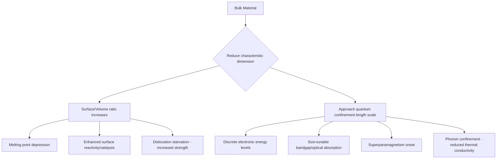

## Size Effects at the Nanoscale

### Introduction

At the nanoscale (typically 1–100 nm), materials exhibit properties that deviate substantially from their bulk counterparts. These deviations, collectively termed "size effects," arise because characteristic physical length scales (electron mean free path, exciton Bohr radius, domain wall thickness, dislocation spacing) become comparable to or larger than the physical dimensions of the material itself. Size effects are broadly classified into **extrinsic (structural) size effects**, driven by the increasing surface-to-volume ratio, and **intrinsic (quantum) size effects**, driven by the spatial confinement of electrons, phonons, and other quasiparticles.

### Classification of Size Effects

#### Extrinsic (Structural) Size Effects

These originate from the disproportionate increase in surface atoms relative to bulk atoms as particle size decreases.

- Surface-to-volume ratio scales as $3/r$ for a sphere of radius $r$
- Surface atoms have lower coordination number, higher energy, and greater mobility
- Manifests in melting point depression, altered mechanical strength, and enhanced reactivity/catalysis

#### Intrinsic (Quantum) Size Effects

These arise when a physical dimension of the material approaches a fundamental length scale associated with a physical phenomenon.

- Electronic confinement (comparable to de Broglie wavelength or exciton Bohr radius) → quantum confinement effects
- Phonon confinement (comparable to phonon mean free path) → altered thermal conductivity
- Magnetic domain size confinement → superparamagnetism
- Dislocation source spacing confinement → altered mechanical strength ("smaller is stronger")

### Surface-to-Volume Ratio: The Foundational Relationship

For a spherical nanoparticle of radius $r$:

$$\frac{S}{V} = \frac{4\pi r^2}{\frac{4}{3}\pi r^3} = \frac{3}{r}$$

The fraction of atoms residing on the surface, $f_s$, can be approximated for a spherical crystallite as:

$$f_s \approx \frac{4 n^2 - 6n + 4}{n^3} \times \text{(shape-dependent constant)}$$

where $n$ is the number of atoms along a characteristic radius. A practical rule of thumb: for a metallic nanoparticle of diameter 10 nm, roughly 10–20% of atoms are surface atoms; at 1–2 nm, this figure exceeds 50–90%.

**Key Points**

- Surface energy scales inversely with particle size, driving thermodynamic instability at small sizes
- Surface atoms are under-coordinated, creating dangling bonds and localized strain
- Sintering and Ostwald ripening are direct kinetic consequences of this excess surface energy

### Melting Point Depression

Nanoparticle melting temperature depression is one of the most well-documented structural size effects, described by the **Gibbs–Thomson equation** (also called the Kelvin-analogue for melting):

$$T_m(r) = T_{m,\text{bulk}} \left(1 - \frac{4\sigma_{sl}}{\Delta H_f \, \rho_s \, r}\right)$$

Where:

- $T_m(r)$ = melting point of a particle of radius $r$
- $T_{m,\text{bulk}}$ = bulk melting temperature
- $\sigma_{sl}$ = solid-liquid interfacial energy
- $\Delta H_f$ = bulk latent heat of fusion
- $\rho_s$ = density of the solid

**Example**

Gold nanoparticles illustrate this dramatically: bulk gold melts at 1064°C, but 2 nm gold nanoparticles melt at approximately 300–400°C, a depression of over 600°C. This effect is widely exploited in nanoparticle sintering for printed electronics, where gold or silver nanoparticle inks fuse at temperatures compatible with polymer substrates (well below bulk melting points).

[Inference] The exact magnitude of depression depends strongly on particle shape, surface passivation/ligand chemistry, and substrate interactions, so quantitative predictions from the idealized equation should be treated as first-order approximations.

### Mechanical Size Effects: "Smaller is Stronger"

Mechanical strength at the nanoscale frequently increases as dimensions shrink, contradicting classical Hall-Petch expectations at very small grain sizes. Two dominant mechanisms explain this:

1. **Dislocation starvation**: In nanoscale pillars or whiskers, the volume becomes too small to contain a steady-state population of dislocations. Once existing dislocations exit through the free surface, further deformation requires nucleation of new dislocations, which requires much higher stress.
2. **Limited dislocation source spacing**: The Frank-Read source mechanism requires a minimum length to operate efficiently; below a critical size, sources are suppressed, raising the yield stress.

The classical Hall-Petch relationship:

$$\sigma_y = \sigma_0 + \frac{k_y}{\sqrt{d}}$$

holds down to grain sizes of roughly 10–15 nm, below which an **inverse Hall-Petch effect** is often observed — strength decreases with further grain refinement due to grain-boundary sliding and diffusional mechanisms (Coble creep-like behavior) dominating over dislocation-mediated plasticity.

### Quantum Confinement Effects

When a semiconductor crystallite's dimension approaches or falls below the **exciton Bohr radius** ($a_B$), charge carriers become spatially confined, and their energy levels transition from continuous bands to discrete, quantized states — analogous to a particle-in-a-box system.

The exciton Bohr radius is given by:

$$a_B = \frac{4\pi\varepsilon_0 \varepsilon_r \hbar^2}{\mu e^2}$$

Where $\varepsilon_r$ is the relative permittivity of the semiconductor and $\mu$ is the reduced effective mass of the electron-hole pair.

Using the effective mass approximation (particle-in-a-sphere model), the bandgap of a quantum-confined nanocrystal (quantum dot) is approximated as:

$$E_g(r) = E_{g,\text{bulk}} + \frac{\hbar^2 \pi^2}{2r^2}\left(\frac{1}{m_e^*} + \frac{1}{m_h^*}\right) - \frac{1.8e^2}{4\pi\varepsilon_0\varepsilon_r r}$$

The three terms represent, respectively: the bulk bandgap, the quantum confinement energy (scaling as $1/r^2$), and a Coulombic electron-hole attraction correction term (scaling as $1/r$).

**Example**

CdSe quantum dots exhibit a strongly size-tunable bandgap: particles of ~2 nm diameter fluoresce blue-green, while ~7 nm particles fluoresce red, due purely to quantum confinement — the chemical composition is identical. This principle underlies QLED display technology and biological fluorescent labeling.

**Confinement regimes**, classified by particle radius $r$ relative to $a_B$:

| Regime | Condition | Behavior |
| --- | --- | --- |
| Weak confinement | $r > a_B$ | Exciton translational motion quantized; internal structure largely bulk-like |
| Intermediate confinement | $r \approx a_B$ | Electron and hole confined with differing degrees, depending on individual masses |
| Strong confinement | $r < a_B$ | Electron and hole independently confined; discrete, atom-like energy levels |

### Optical Size Effects: Localized Surface Plasmon Resonance

In metallic nanoparticles (notably Au, Ag), conduction electrons oscillate collectively when excited by incident light, a phenomenon called **localized surface plasmon resonance (LSPR)**. The resonance condition and peak wavelength are strongly size- and shape-dependent, described qualitatively by Mie theory for spherical particles.

- Small Au nanoparticles (~10–20 nm): LSPR peak near 520 nm, giving a characteristic ruby-red colloidal color
- Larger Au nanoparticles (~50–100 nm) or anisotropic shapes (rods): LSPR red-shifts toward 600–800 nm
- This size/shape tunability underlies applications in biosensing (colorimetric assays), photothermal therapy, and surface-enhanced Raman spectroscopy (SERS)

### Magnetic Size Effects: Superparamagnetism

Ferromagnetic materials, when reduced below a critical size (typically 10–20 nm depending on the material), transition to a **single-domain state**, below which further size reduction leads to **superparamagnetism**. In this regime, thermal energy $k_BT$ is sufficient to randomly flip the net magnetic moment direction over observable timescales, and the particle exhibits zero net remanent magnetization and zero coercivity in the absence of an applied field, despite each particle being internally ferromagnetically ordered.

The **Néel relaxation time** governs the transition:

$$\tau = \tau_0 \exp\left(\frac{K_u V}{k_B T}\right)$$

Where $K_u$ is the magnetic anisotropy energy density, $V$ is particle volume, and $\tau_0 \approx 10^{-9}$–$10^{-10}$ s.

**Key Points**

- Superparamagnetic iron oxide nanoparticles (SPIONs) are widely used as MRI contrast agents precisely because of this size-dependent magnetic switching behavior
- The blocking temperature $T_B$ (below which the particle behaves as stable ferromagnet on experimental timescales) depends on both particle volume and measurement time

### Thermal Size Effects

Phonon transport becomes size-limited when nanostructure dimensions approach the phonon mean free path (tens to hundreds of nanometers in many crystalline solids). This produces a marked reduction in thermal conductivity relative to bulk values, since boundary scattering supplements or dominates over intrinsic phonon-phonon (Umklapp) scattering.

$$\frac{1}{\Lambda_{\text{eff}}} = \frac{1}{\Lambda_{\text{bulk}}} + \frac{1}{d}$$

Where $\Lambda_{\text{eff}}$ is the effective phonon mean free path, $\Lambda_{\text{bulk}}$ the bulk value, and $d$ a characteristic nanostructure dimension (this is a simplified Matthiessen's-rule-type approximation).

This effect is deliberately exploited in **thermoelectric materials engineering**, where nanostructuring (nanowires, superlattices, nanocomposites) suppresses thermal conductivity while comparatively preserving electrical conductivity, improving the thermoelectric figure of merit $ZT = \frac{S^2\sigma T}{\kappa}$.

### Illustrative Diagram: Property Divergence with Decreasing Size

### SVG: Surface Atom Fraction vs. Particle Size (svg_diagram)

<svg xmlns="http://www.w3.org/2000/svg" viewBox="0 0 640 400">
<text x="320" y="25" font-size="16" text-anchor="middle" font-family="sans-serif" font-weight="bold">Surface Atom Fraction vs. Particle Diameter (svg_diagram)</text>
<line x1="70" y1="340" x2="600" y2="340" stroke="black" stroke-width="2" />
<line x1="70" y1="340" x2="70" y2="50" stroke="black" stroke-width="2" />
<text x="335" y="375" font-size="13" text-anchor="middle" font-family="sans-serif">Particle Diameter (nm)</text>
<text x="25" y="195" font-size="13" text-anchor="middle" font-family="sans-serif" transform="rotate(-90 25 195)">Surface Atom Fraction (%)</text>
<text x="70" y="358" font-size="11" text-anchor="middle" font-family="sans-serif">1</text>
<text x="200" y="358" font-size="11" text-anchor="middle" font-family="sans-serif">5</text>
<text x="335" y="358" font-size="11" text-anchor="middle" font-family="sans-serif">10</text>
<text x="465" y="358" font-size="11" text-anchor="middle" font-family="sans-serif">20</text>
<text x="600" y="358" font-size="11" text-anchor="middle" font-family="sans-serif">50</text>
<text x="55" y="345" font-size="11" text-anchor="end" font-family="sans-serif">0</text>
<text x="55" y="270" font-size="11" text-anchor="end" font-family="sans-serif">25</text>
<text x="55" y="195" font-size="11" text-anchor="end" font-family="sans-serif">50</text>
<text x="55" y="120" font-size="11" text-anchor="end" font-family="sans-serif">75</text>
<text x="55" y="55" font-size="11" text-anchor="end" font-family="sans-serif">100</text>
<path d="M 70 60 C 120 150, 180 260, 200 290 C 260 320, 335 330, 465 336 C 530 338, 570 339, 600 340" stroke="#c0392b" stroke-width="3" fill="none" />
<circle cx="70" cy="60" r="4" fill="#c0392b" />
<circle cx="200" cy="290" r="4" fill="#c0392b" />
<circle cx="335" cy="325" r="4" fill="#c0392b" />
<circle cx="465" cy="336" r="4" fill="#c0392b" />
<circle cx="600" cy="340" r="4" fill="#c0392b" />
<text x="90" y="55" font-size="10" font-family="sans-serif">~90%</text>
<text x="205" y="285" font-size="10" font-family="sans-serif">~20%</text>
<text x="340" y="315" font-size="10" font-family="sans-serif">~10%</text>
<text x="470" y="326" font-size="10" font-family="sans-serif">~5%</text>
</svg>

### Characterization Techniques for Size-Dependent Properties

| Property Investigated | Primary Technique(s) |
| --- | --- |
| Particle size/morphology | TEM, SEM, DLS, AFM |
| Crystallite size | XRD (Scherrer equation), SAXS |
| Optical bandgap/LSPR | UV-Vis absorption spectroscopy, photoluminescence spectroscopy |
| Melting behavior | Differential scanning calorimetry (DSC), in-situ TEM heating |
| Magnetic behavior | Vibrating sample magnetometry (VSM), SQUID magnetometry |
| Mechanical properties | Nanoindentation, in-situ TEM/SEM micropillar compression |
| Thermal conductivity | 3-omega method, time-domain thermoreflectance (TDTR) |

### Conclusion

Size effects at the nanoscale are not a single phenomenon but a family of related consequences of shrinking a material's characteristic dimensions toward, and below, fundamental physical length scales. Structural (surface-driven) effects govern thermodynamic stability, reactivity, and certain mechanical behaviors, while quantum confinement effects govern electronic, optical, and magnetic properties. Understanding which regime dominates for a given material system and application is essential for rational nanomaterial design, since the same base composition can exhibit dramatically different, and often technologically valuable, properties purely as a function of size and shape.

**Related Topics**

- Quantum Dots: Synthesis and Bandgap Engineering
- Surface Plasmon Resonance and Plasmonic Nanostructures
- Superparamagnetic Nanoparticles and Biomedical Applications
- Nanocrystalline Metals and the Hall-Petch/Inverse Hall-Petch Transition
- Thermoelectric Nanostructuring and Phonon Engineering
- Top-Down vs. Bottom-Up Nanomaterial Synthesis Methods
- Characterization Methods for Nanomaterials (TEM, XRD, DLS)