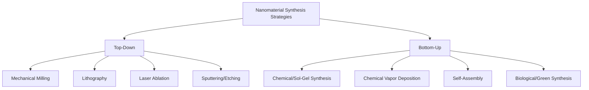
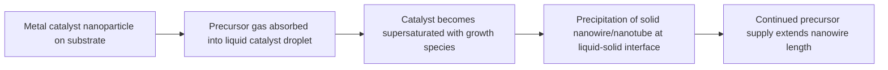
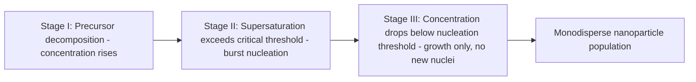

## Synthesis of Nanomaterials: Top Down and Bottom Up

### Introduction

Nanomaterial synthesis strategies are broadly classified into two philosophically opposed approaches: **top-down**, which begins with bulk material and progressively reduces it to nanoscale dimensions through physical or chemical subdivision, and **bottom-up**, which builds nanostructures atom-by-atom or molecule-by-molecule through controlled nucleation, growth, and self-assembly. The choice between them involves trade-offs in size control, defect density, scalability, cost, and achievable structural complexity.

### Top-Down Approaches

Top-down methods start from bulk material and use energy input (mechanical, thermal, electrical, or photonic) to break it down into nanoscale units.

#### Mechanical Milling / High-Energy Ball Milling

Bulk powders are subjected to repeated fracturing, cold welding, and re-fracturing within a milling vessel containing hardened steel or tungsten carbide balls.

**Key Points**

- Particle size reduction follows an approximately exponential decay with milling time, governed by the balance of fracture and cold-welding kinetics
- Final particle size is influenced by ball-to-powder mass ratio, milling speed, milling atmosphere (inert gas typically used to prevent oxidation), and process control agents (surfactants preventing excessive cold welding)
- Produces nanocrystalline powders (grain sizes 5–100 nm) but introduces significant lattice strain, contamination from milling media, and broad particle size distributions

[Inference] Achievable minimum grain size via ball milling is often cited around 10–20 nm for many metals due to a dynamic equilibrium between defect accumulation (which promotes further refinement) and recovery/recrystallization (which counteracts it); this limit is material-dependent and not universal.

#### Lithography-Based Methods

Lithographic techniques pattern nanostructures directly onto a substrate using masks or direct-write beams.

| Technique | Resolution | Mechanism | Throughput |
| --- | --- | --- | --- |
| Photolithography (deep UV) | ~10–20 nm (advanced nodes) | UV light through a photomask exposes photoresist | High (wafer-scale, parallel) |
| Electron-beam lithography (EBL) | ~5–10 nm | Focused electron beam directly writes pattern in resist | Low (serial, slow) |
| Nanoimprint lithography (NIL) | ~10 nm | Mechanical stamping of a mold pattern into a polymer resist | High (parallel, replicable) |
| Focused ion beam (FIB) milling | ~10–20 nm | Direct sputtering/milling of material using a focused ion beam | Low (serial) |

#### Laser Ablation

A high-energy pulsed laser (commonly Nd:YAG, ns or fs pulse durations) is focused onto a bulk target, typically submerged in a liquid medium, causing localized vaporization and plasma plume formation. Upon rapid cooling in the surrounding liquid, nanoparticles nucleate directly from the vapor/plasma.

- Advantageous for producing ligand-free, "naked" nanoparticles without residual chemical precursors or surfactants
- Particle size is tunable via laser fluence, pulse duration, wavelength, and ablation medium
- Widely used for noble metal nanoparticles (Au, Ag) and certain oxide nanoparticles

#### Sputtering and Etching

Physical vapor deposition-based sputtering, combined with reactive ion etching (RIE), can produce nanostructured thin films and patterned nanoscale features through selective material removal, often used in conjunction with a lithographically defined mask.

### Bottom-Up Approaches

Bottom-up methods assemble nanostructures from atomic, ionic, or molecular precursors through controlled chemical reactions, typically offering superior control over size, shape, and monodispersity.

#### Sol-Gel Synthesis

A wet-chemical technique in which a colloidal suspension (**sol**) of precursor molecules (commonly metal alkoxides) undergoes hydrolysis and polycondensation reactions to form a three-dimensional network (**gel**).

**General reaction sequence for a metal alkoxide $M(OR)_n$:**

Hydrolysis:

$$M(OR)_n + xH_2O \rightarrow M(OH)_x(OR)_{n-x} + xROH$$

Condensation:

$$M-OH + HO-M \rightarrow M-O-M + H_2O$$

**Key Points**

- Enables precise control of stoichiometry and homogeneity, particularly valuable for complex multi-component oxides
- Gelation is followed by drying (yielding a xerogel) or supercritical drying (yielding an aerogel) and subsequent calcination to remove organics and crystallize the desired phase
- Widely used for synthesizing $TiO_2$, $SiO_2$, and other metal oxide nanoparticles and thin films

#### Chemical Vapor Deposition (CVD)

Gaseous precursors react and/or decompose on a heated substrate surface, depositing solid nanomaterial. CVD variants include:

- **Thermal CVD**: Precursor decomposition driven purely by substrate/chamber temperature
- **Plasma-enhanced CVD (PECVD)**: Plasma-assisted decomposition, enabling lower substrate temperatures
- **Metal-organic CVD (MOCVD)**: Uses metal-organic precursors, widely used for compound semiconductor nanowires and quantum well structures

CVD is the dominant industrial method for synthesizing carbon nanotubes and graphene, typically employing a metal catalyst (Fe, Ni, Co) via a vapor-liquid-solid (VLS) growth mechanism for nanowires and nanotubes.

**VLS Growth Mechanism (simplified sequence):**

#### Nucleation and Growth Theory (Colloidal Synthesis)

Most solution-phase nanoparticle synthesis is governed by **LaMer nucleation theory**, which separates the process into distinct temporal stages to achieve monodisperse particles.

**LaMer Diagram Stages:**

The critical insight is the temporal separation of nucleation (Stage II) from growth (Stage III): a short, discrete nucleation burst followed by diffusion-limited growth on existing nuclei produces narrow size distributions, whereas continuous nucleation throughout the reaction produces broad, polydisperse populations.

**Example**

The classic synthesis of monodisperse gold nanoparticles via the **Turkevich method** reduces $HAuCl_4$ with sodium citrate in boiling water; citrate serves dually as reducing agent and capping/stabilizing ligand, producing spherical nanoparticles typically in the 10–20 nm range with citrate ions electrostatically stabilizing the colloid against aggregation.

#### Capping Agents and Colloidal Stability

Bottom-up colloidal synthesis relies on capping ligands (surfactants, polymers, or small molecules) bound to the nanoparticle surface to:

1. Arrest growth at a target size by limiting precursor access to the growing surface
2. Provide colloidal stability via either electrostatic (charge-based, described by DLVO theory) or steric (physical, polymer-brush-based) repulsion
3. Enable shape control by preferentially binding to specific crystallographic facets, directing anisotropic growth (e.g., cetyltrimethylammonium bromide, CTAB, preferentially binds Au{100} facets, promoting rod-like growth over spherical growth)

#### Self-Assembly

Bottom-up self-assembly exploits intermolecular and interparticle forces (van der Waals, hydrogen bonding, electrostatic, hydrophobic interactions) to spontaneously organize nanoscale building blocks into ordered superstructures without external templating.

- **Molecular self-assembly**: e.g., block copolymer microphase separation, forming periodic nanoscale domains (spheres, cylinders, lamellae) used as templates for nanolithography
- **Nanoparticle self-assembly**: Colloidal nanoparticles can organize into ordered 2D/3D superlattices ("colloidal crystals") driven by entropic and van der Waals interactions during solvent evaporation

#### Biological / Green Synthesis

An increasingly significant bottom-up route uses biological organisms (plant extracts, bacteria, fungi) as reducing and capping agents, exploiting naturally occurring phytochemicals (polyphenols, flavonoids, proteins) to reduce metal ions to nanoparticles.

- Environmentally benign, avoiding toxic reducing agents (e.g., hydrazine, sodium borohydride)
- Generally yields broader size distributions than tightly controlled chemical synthesis
- [Speculation] Scalability to industrial production volumes remains an active area of process development, as extract composition can vary with biological source and batch

### Comparative Analysis: Top-Down vs. Bottom-Up

| Criterion | Top-Down | Bottom-Up |
| --- | --- | --- |
| Size control | Moderate to good (lithography); poor (milling) | Excellent (colloidal synthesis) |
| Size distribution | Often broad (milling); narrow (lithography) | Narrow, especially with LaMer-controlled nucleation |
| Defect density | High (mechanical stress, lattice strain) | Low (thermodynamically controlled growth) |
| Scalability | High (industrial milling, wafer processing) | Variable; batch chemistry harder to scale than continuous flow |
| Cost | Low (milling); very high (EBL) | Low to moderate |
| Shape/morphology control | Limited (except lithography) | Excellent (via capping agents, templating) |
| Contamination risk | Milling media contamination common | Residual precursor/ligand contamination possible |

### Hybrid Approaches

Modern nanofabrication frequently combines both paradigms. For instance, **template-assisted synthesis** uses a top-down fabricated template (e.g., anodic aluminum oxide, AAO, with lithographically or electrochemically defined nanopores) combined with bottom-up electrodeposition or CVD filling of the pores to produce nanowire arrays with precisely controlled diameter and spacing, inherited from the top-down template geometry.

### Characterization Considerations Across Synthesis Routes

Regardless of route, synthesized nanomaterials require verification of:

- Size and size distribution (TEM, DLS)
- Crystallinity and phase purity (XRD, selected area electron diffraction)
- Surface chemistry/ligand identity (FTIR, XPS, TGA)
- Colloidal stability (zeta potential measurement)

[Unverified] Direct one-to-one comparison of "cost per gram" figures across synthesis routes is highly context-dependent (precursor cost, energy input, batch size, required purity) and specific published cost figures should not be treated as universally representative without consulting current process-specific techno-economic analyses.

### Conclusion

Top-down and bottom-up synthesis represent complementary rather than competing paradigms in nanomaterial fabrication. Top-down methods excel at scalable, substrate-integrated pattern definition but face fundamental resolution limits and defect accumulation at the smallest scales. Bottom-up methods offer superior control over size, shape, and surface chemistry through thermodynamically and kinetically controlled nucleation and growth, but often face greater challenges in large-scale, cost-effective production and precise spatial placement. Selection of an appropriate synthesis route depends on the target application's requirements for size precision, structural complexity, throughput, and integration with existing device architectures.

**Related Topics**

- LaMer Nucleation Theory and Monodisperse Nanoparticle Synthesis
- Physical Vapor Deposition and Chemical Vapor Deposition Techniques
- Electron-Beam and Nanoimprint Lithography
- Capping Agents, Ligand Exchange, and Colloidal Stability (DLVO Theory)
- Template-Assisted Nanofabrication (Anodic Aluminum Oxide Templates)
- Green/Biological Nanoparticle Synthesis
- Characterization of Nanomaterials: TEM, XRD, DLS, Zeta Potential