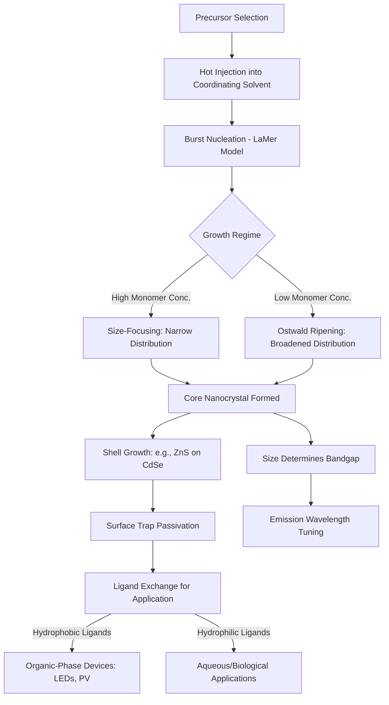

## Nanoparticles and Quantum Dots

### Overview

Nanoparticles are materials with at least one dimension in the 1–100 nm range, exhibiting properties fundamentally distinct from their bulk counterparts due to high surface-area-to-volume ratio and quantum confinement effects. Quantum dots (QDs) are a specialized subclass—semiconductor nanocrystals typically 2–10 nm in diameter—where charge carriers (electrons and holes) are confined in all three spatial dimensions, producing discrete, size-tunable electronic energy levels analogous to a "particle in a box" quantum system. This size-dependent behavior underlies their use in optoelectronics, bioimaging, catalysis, and energy applications.

### Fundamental Physics of Nanoscale Confinement

**Surface-to-Volume Scaling**

As particle diameter decreases, the fraction of atoms residing at the surface increases dramatically. For a spherical particle, surface atom fraction scales approximately as:

$$f_{surface} \approx \frac{4}{d/a}$$

where $d$ is particle diameter and $a$ is the atomic diameter. Below ~10 nm, a substantial fraction of atoms are surface atoms, altering melting point (Gibbs-Thomson effect), catalytic activity, and reactivity relative to bulk material.

**Quantum Confinement in Quantum Dots**

When a semiconductor crystal's physical dimension approaches or falls below the material's **exciton Bohr radius** (the natural separation distance of an electron-hole pair), charge carriers become spatially confined, and the continuous energy bands of the bulk solid collapse into discrete, atom-like energy levels. The bandgap energy increases as particle size decreases, following approximately (from the effective mass approximation):

$$E_g(d) \approx E_{g,bulk} + \frac{h^2}{8d^2}\left(\frac{1}{m_e^*} + \frac{1}{m_h^*}\right) - \frac{1.8e^2}{4\pi\varepsilon_0\varepsilon_r d}$$

where $E_{g,bulk}$ is the bulk bandgap, $d$ is the QD diameter, $m_e^*$ and $m_h^*$ are effective masses of electron and hole, and the final Coulombic term accounts for electron-hole attraction. **[Inference]** This effective mass approximation becomes progressively less accurate for very small dots (<2 nm) where atomistic and surface effects dominate; more rigorous tight-binding or pseudopotential models are typically used at that scale in research contexts.

This size-dependence is the defining feature of QDs: identical chemical composition (e.g., CdSe) can be tuned across the visible spectrum purely by controlling crystallite size during synthesis.

### Classification of Nanoparticles

**By Composition**

- **Metallic nanoparticles** (Au, Ag, Pt): exhibit localized surface plasmon resonance (LSPR)—collective oscillation of conduction electrons driven by incident light, producing strong, size/shape-tunable absorption and scattering.
- **Metal oxide nanoparticles** (TiO₂, Fe₃O₄, ZnO): used in catalysis, photocatalysis, and magnetic applications (superparamagnetism below the single-domain critical size).
- **Semiconductor nanocrystals (Quantum Dots)**: II-VI (CdSe, CdTe), III-V (InP, InAs), IV-VI (PbS, PbSe), and emerging lead-free/cadmium-free perovskite and carbon-based dots.
- **Carbon-based nanoparticles**: fullerenes, carbon dots, graphene quantum dots.
- **Polymeric and lipid nanoparticles**: drug delivery vehicles (e.g., PLGA nanoparticles, lipid nanoparticles for mRNA delivery).

**By Structure**

- Core-only, core-shell (e.g., CdSe/ZnS, improving quantum yield and photostability by passivating surface trap states), and core-shell-shell architectures.
- Alloyed and gradient-composition nanocrystals (e.g., CdSeS) for engineered bandgap profiles.

### Quantum Dot Synthesis Methods

**Hot-Injection Colloidal Synthesis**

The dominant method for high-quality QDs, pioneered by Murray, Norris, and Bawendi (1993) for CdSe. Precursors are rapidly injected into a hot coordinating solvent (e.g., trioctylphosphine oxide, TOPO), causing a burst of nucleation followed by controlled growth (LaMer mechanism). Separation of nucleation and growth phases produces narrow size distributions (typically <5% standard deviation).

**LaMer Nucleation-Growth Model**

1. Precursor concentration rises until supersaturation threshold is exceeded.
2. Burst nucleation rapidly depletes monomer concentration below the nucleation threshold.
3. Remaining growth proceeds without further nucleation, via monomer addition to existing nuclei ("size-focusing" under high monomer concentration, or Ostwald ripening/"defocusing" under low concentration and prolonged reaction).

**Alternative Synthesis Routes**

- **Aqueous synthesis**: thiol-capped QDs (e.g., CdTe with mercaptopropionic acid) synthesized in water, generally lower quantum yield but more biocompatible processing.
- **Continuous-flow microreactor synthesis**: improved reproducibility and scalability over batch hot-injection.
- **Cation exchange**: post-synthetic transformation of one QD composition into another (e.g., CdSe → PbSe) while preserving nanocrystal morphology.

### Surface Chemistry and Ligand Engineering

Surface ligands serve multiple roles: controlling growth kinetics during synthesis, passivating surface trap states (non-radiative recombination centers that reduce photoluminescence quantum yield), providing colloidal stability, and enabling downstream functionalization.

- **Native ligands** (oleic acid, TOPO, hexadecylamine): hydrophobic, used for organic-phase synthesis and processing.
- **Ligand exchange**: replacing native ligands with hydrophilic ones (mercaptoacetic acid, dihydrolipoic acid, polymer-coated silica shells) for aqueous/biological compatibility—critical for bioimaging applications.
- **Core-shell passivation**: epitaxial growth of a wider-bandgap shell (e.g., ZnS on CdSe) eliminates surface dangling bonds, substantially increasing photoluminescence quantum yield (often from <10% to >50-80%).

### Optical and Electronic Properties

**Photoluminescence**

QDs exhibit narrow, symmetric emission spectra (typical full-width-half-maximum 20–30 nm) with emission wavelength precisely tunable by size, in contrast to broader and often asymmetric organic fluorophore emission. Quantum yield and photostability (resistance to photobleaching) are generally superior to organic dyes, though **[Unverified]** exact comparative photostability figures vary significantly by QD composition, shell architecture, and measurement protocol across the literature.

**Blinking (Fluorescence Intermittency)**

Single QDs exhibit stochastic switching between "on" (emissive) and "off" (dark) states under continuous excitation, attributed to Auger-assisted non-radiative recombination when the QD is charged. This is a significant limitation for single-molecule tracking applications; engineered "giant" shell QDs (thick CdS shells) substantially suppress blinking.

**Multiple Exciton Generation (MEG)**

Under high-energy photon absorption, some QDs can generate more than one electron-hole pair per absorbed photon, a phenomenon of interest for exceeding the Shockley-Queisser efficiency limit in photovoltaics. **[Inference]** Practical device-level efficiency gains from MEG remain constrained by extraction efficiency losses and are still primarily a research-stage phenomenon rather than a commercialized advantage.

### Applications

**Display Technology**

QD-enhanced LCD displays (QLED, technically photoluminescent QD backlighting rather than true electroluminescent displays in most commercial products) use QDs as color-conversion layers, improving color gamut coverage toward Rec. 2020 standards. Electroluminescent QD-LED displays (direct current injection into QD emissive layers) represent the next generation, with commercial development ongoing.

**Biomedical Imaging**

QDs serve as fluorescent probes for cellular imaging, in vivo tracking, and multiplexed diagnostics, offering advantages of photostability and narrow emission bands enabling simultaneous multi-color imaging. Cadmium-based QD toxicity concerns have driven development of cadmium-free alternatives (InP/ZnS, carbon dots) for biomedical use, particularly given regulatory scrutiny under frameworks like those covered in ISO 10993 biocompatibility testing.

**Photovoltaics**

QD solar cells exploit size-tunable bandgap for spectrum matching and potential multiple exciton generation; PbS and perovskite QD architectures have achieved laboratory efficiencies competitive with some thin-film technologies, though commercial-scale deployment lags behind silicon and established thin-film PV.

**Catalysis (General Nanoparticles)**

High surface-area metal and metal oxide nanoparticles (Pt, Pd, Au on supports) provide enhanced catalytic activity for reactions including CO oxidation, hydrogenation, and photocatalytic water splitting (TiO₂ nanoparticles under UV excitation).

**Sensing**

Plasmonic nanoparticle sensors exploit LSPR shifts upon analyte binding for label-free biosensing; QD-based Förster resonance energy transfer (FRET) sensors enable detection of biomolecular interactions.

### Synthesis and Property Relationship Diagram

### Size-Dependent Bandgap and Emission Schematic (svg_diagram)

<svg xmlns="http://www.w3.org/2000/svg" viewBox="0 0 700 380" font-family="Arial, sans-serif">
<text x="350" y="25" text-anchor="middle" font-size="16" font-weight="bold">Quantum Dot Size vs. Emission (svg_diagram)</text>
<line x1="80" y1="330" x2="640" y2="330" stroke="black" stroke-width="1.5" />
<text x="360" y="360" text-anchor="middle" font-size="12">Particle Diameter (nm)</text>
<line x1="80" y1="330" x2="80" y2="60" stroke="black" stroke-width="1.5" />
<text x="40" y="200" text-anchor="middle" font-size="12" transform="rotate(-90 40,200)">Bandgap Energy (eV)</text>
<circle cx="150" cy="120" r="10" fill="#7d3cff" />
<text x="150" y="145" text-anchor="middle" font-size="10">~2 nm</text>
<text x="150" y="105" text-anchor="middle" font-size="10">Blue</text>
<circle cx="280" cy="170" r="16" fill="#2ecc71" />
<text x="280" y="200" text-anchor="middle" font-size="10">~3.5 nm</text>
<text x="280" y="150" text-anchor="middle" font-size="10">Green</text>
<circle cx="420" cy="220" r="22" fill="#f1c40f" />
<text x="420" y="255" text-anchor="middle" font-size="10">~5 nm</text>
<text x="420" y="195" text-anchor="middle" font-size="10">Yellow</text>
<circle cx="560" cy="270" r="28" fill="#e74c3c" />
<text x="560" y="310" text-anchor="middle" font-size="10">~7 nm</text>
<text x="560" y="240" text-anchor="middle" font-size="10">Red</text>
<path d="M80,330 Q200,150 640,80" stroke="#555" stroke-width="1.5" fill="none" stroke-dasharray="4,3" />
<text x="500" y="70" font-size="10" fill="#555">Bandgap decreases with increasing size</text>
</svg>

### Practical Example: Estimating Emission Shift from Core-Shell Growth

For a CdSe core QD with initial diameter 3.0 nm emitting near 520 nm (green), applying a 0.5 nm ZnS shell increases the effective confinement radius, typically red-shifting emission by 5–15 nm and simultaneously increasing quantum yield from roughly 20-30% (bare core) to 40-70%+ (core-shell), depending on shell uniformity and passivation quality. In practice, researchers characterize this via UV-Vis absorption (tracking first excitonic peak shift) and photoluminescence spectroscopy before and after shell growth, alongside TEM sizing to confirm shell thickness independent of optical measurements.

### Key Points

- Quantum confinement, not composition alone, determines a quantum dot's bandgap and emission color—size is the primary engineering lever.
- The LaMer nucleation-growth model explains how hot-injection synthesis achieves narrow size distributions through temporal separation of nucleation and growth.
- Core-shell architectures (e.g., CdSe/ZnS) are standard practice for maximizing photoluminescence quantum yield via surface trap passivation.
- Surface ligand chemistry governs both colloidal processability and application-specific compatibility (organic-phase devices vs. aqueous biological use).
- Toxicity concerns around cadmium- and lead-based QDs are driving active development of alternative material systems (InP, perovskite, carbon dots) for consumer and biomedical applications.

### Related Topics

- Localized Surface Plasmon Resonance in Metallic Nanoparticles
- Core-Shell Nanoparticle Design and Epitaxial Shell Growth
- Perovskite Quantum Dots and Lead-Free Alternatives
- Nanoparticle Toxicology and Environmental, Health, and Safety (EHS) Considerations
- Electroluminescent QD-LED Device Architecture
- Nanoparticle Characterization Techniques (TEM, DLS, XRD, UV-Vis)