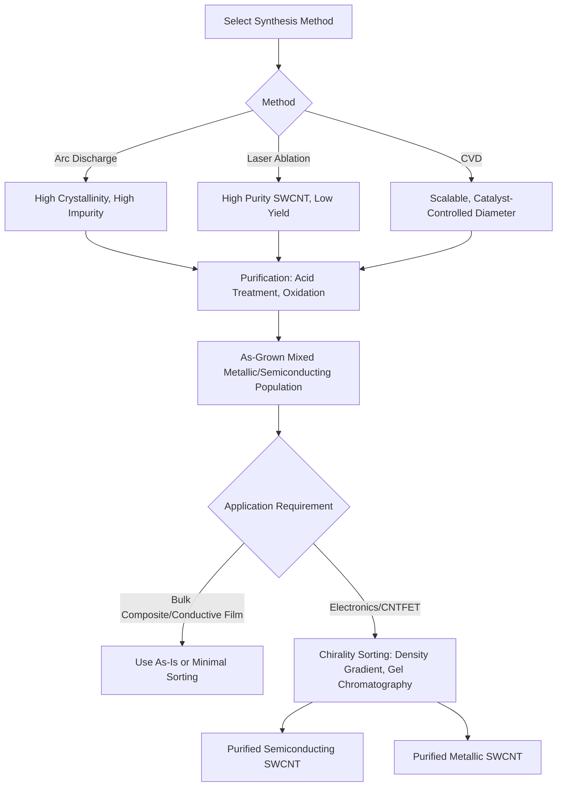

## Carbon Nanotubes and Fullerenes

### Overview

Carbon nanotubes (CNTs) and fullerenes are allotropes of carbon built from sp²-hybridized carbon networks arranged into closed or tubular nanostructures, distinct from diamond (sp³) and graphite (stacked sp² sheets). Fullerenes are discrete, cage-like molecules—most famously C₆₀ ("buckminsterfullerene")—while carbon nanotubes are cylindrical structures conceptually formed by rolling a single graphene sheet (single-walled, SWCNT) or multiple concentric sheets (multi-walled, MWCNT). Both exhibit exceptional and highly structure-dependent mechanical, electrical, and thermal properties driven by the strength of the sp² carbon-carbon bond and the specific topology of the carbon lattice.

### Fullerenes

**Structure and Discovery**

C₆₀ consists of 60 carbon atoms arranged in a truncated icosahedron—12 pentagonal and 20 hexagonal faces, geometrically identical to a soccer ball pattern. Discovered by Kroto, Smalley, and Curl in 1985 via laser vaporization of graphite (awarded the 1996 Nobel Prize in Chemistry), C₆₀ was the first fullerene identified and remains the most studied. Larger fullerenes (C₇₀, C₇₆, C₈₄, and higher) and endohedral fullerenes (atoms or clusters encapsulated inside the cage, e.g., La@C₈₂) extend the family.

**Bonding and Electronic Structure**

Each carbon atom in C₆₀ bonds to three neighbors via sp²-hybridized bonds, but the curvature introduces pyramidalization strain absent in flat graphene, giving fullerenes distinct reactivity—C₆₀ behaves chemically somewhat like an electron-deficient alkene, undergoing addition reactions (e.g., Diels-Alder, Bingel reactions) at the more strained 6:6 ring-fusion bonds.

**Synthesis Methods**

- **Arc discharge**: graphite electrodes vaporized in an inert atmosphere (helium), condensing into soot containing fullerenes, extracted via toluene or similar solvents.
- **Laser ablation**: pulsed laser vaporization of a graphite target, offering better control over product distribution.
- **Combustion synthesis**: fullerenes form in fuel-rich flame conditions, of interest for larger-scale production.

**Applications**

- **Organic photovoltaics**: fullerene derivatives (PCBM, [6,6]-phenyl-C₆₁-butyric acid methyl ester) historically served as dominant electron acceptors in bulk heterojunction solar cells, though non-fullerene acceptors have largely superseded them in state-of-the-art devices as of recent literature.
- **Drug delivery and biomedicine**: functionalized fullerenes explored as antioxidants (radical scavenging via multiple reactive double bonds) and drug/gene delivery vehicles.
- **Lubricants and additives**: fullerene's spherical geometry investigated for tribological applications.

### Carbon Nanotubes: Structure and Classification

**Chirality and the (n,m) Indexing System**

A CNT's structure is fully defined by a chiral vector $\vec{C_h} = n\vec{a_1} + m\vec{a_2}$, where $\vec{a_1}$ and $\vec{a_2}$ are graphene lattice unit vectors and $(n,m)$ are integers. This indexing determines three structural categories:

- **Armchair** ($n = m$): metallic conductivity regardless of diameter.
- **Zigzag** ($m = 0$): metallic if $n$ is divisible by 3, semiconducting otherwise.
- **Chiral** (general $n \neq m \neq 0$): typically semiconducting, with occasional metallic cases per the same divisibility rule.

**Electronic Property Rule of Thumb**: A CNT is metallic when $(n - m)$ is divisible by 3; otherwise semiconducting. Approximately one-third of randomly synthesized SWCNTs are metallic and two-thirds semiconducting, a major practical challenge for electronics applications requiring pure semiconducting populations.

**Diameter and Bandgap Relationship**

For semiconducting SWCNTs, bandgap is inversely proportional to diameter:

$$E_g \approx \frac{0.8 \text{ eV·nm}}{d}$$

where $d$ is the nanotube diameter in nanometers—smaller-diameter tubes have larger bandgaps.

**Single-Walled vs. Multi-Walled**

- **SWCNTs**: single graphene cylinder, typical diameter 0.7–2 nm, exhibit the full range of chirality-dependent electronic behavior.
- **MWCNTs**: concentric cylinders (interlayer spacing ~0.34 nm, close to graphite's interlayer spacing), typically metallic in aggregate behavior regardless of individual layer chirality due to inter-shell coupling and outer-shell dominance in conduction; generally easier and cheaper to produce at scale than high-purity SWCNTs.

### Carbon Nanotube Synthesis Methods

**Arc Discharge**

Similar setup to fullerene synthesis; graphite electrodes with metal catalyst (Fe, Co, Ni) in inert atmosphere produce high-crystallinity CNTs but with significant impurities (amorphous carbon, catalyst particles, fullerenes as byproducts) requiring extensive purification.

**Laser Ablation**

Catalyst-doped graphite target vaporized by pulsed laser; produces high-quality SWCNTs with relatively narrow diameter distribution, but at low yield and high cost, generally limited to research-scale production.

**Chemical Vapor Deposition (CVD)**

The dominant industrial method, offering the best combination of scalability, cost, and structural control:

1. Metal catalyst nanoparticles (Fe, Co, Ni, or bimetallic) deposited on a substrate.
2. Substrate heated (typically 600–1200°C) in a carbon-containing gas atmosphere (methane, ethylene, acetylene, or CO).
3. Carbon precursor decomposes catalytically at the metal nanoparticle surface, carbon dissolves into and precipitates from the catalyst particle, nucleating tube growth.
4. Growth proceeds either by "tip-growth" (catalyst particle lifts with growing tube) or "base-growth" (catalyst remains anchored to substrate), depending on catalyst-substrate adhesion strength.

**[Inference]** Catalyst nanoparticle diameter strongly correlates with resulting nanotube diameter in CVD growth, though the precise relationship depends on catalyst composition, support interaction, and growth temperature, making exact diameter prediction from catalyst size alone an approximation rather than a precise design rule.

**Post-Synthesis Purification and Sorting**

Raw CNT product typically requires purification (acid treatment to remove metal catalyst, oxidation to remove amorphous carbon) and, for electronics applications, **chirality/conductivity-type sorting**—via density-gradient ultracentrifugation, gel chromatography, or DNA-wrapping selective dispersion—to separate metallic from semiconducting populations, since as-grown material is a heterogeneous mixture.

### Mechanical, Electrical, and Thermal Properties

| Property | Typical Value (SWCNT) | Comparison |
| --- | --- | --- |
| Tensile strength | 50–100+ GPa (theoretical/measured on defect-free samples) | ~10-50x steel (by weight) |
| Young's modulus | ~1 TPa | Comparable to diamond |
| Current-carrying capacity | Up to ~10⁹ A/cm² | ~1000x copper |
| Thermal conductivity (axial) | Up to ~3000-3500 W/m·K (individual tube) | Exceeds copper (~400 W/m·K) |
| Density | ~1.3-1.4 g/cm³ | Much lower than metals |

**[Unverified]** Reported values, particularly tensile strength and thermal conductivity, vary substantially across the literature depending on measurement technique, defect density, tube length, and whether individual tubes or bulk assemblies (yarns, films) are tested—bulk material properties are typically well below single-tube theoretical maxima due to defects, tube-tube junctions, and alignment imperfections.

These exceptional individual-tube properties motivate CNT use as reinforcing fillers in composites, though achieving comparable performance at the macroscale requires overcoming dispersion, alignment, and interfacial load-transfer challenges.

### Applications

**Structural Composites**

CNTs incorporated into polymer, metal, or ceramic matrices for enhanced strength-to-weight ratio, electrical conductivity (anti-static or EMI shielding), and thermal management. Key challenges include achieving uniform dispersion (CNTs strongly bundle via van der Waals attraction) and strong interfacial bonding for effective load transfer.

**Electronics**

- **CNT field-effect transistors (CNTFETs)**: semiconducting SWCNTs as channel material, of research interest for post-silicon scaling given high carrier mobility; commercial adoption has been slowed by chirality-sorting yield and placement-precision challenges.
- **Transparent conductive films**: CNT networks as an alternative to indium tin oxide (ITO) for flexible displays and touchscreens.
- **Interconnects**: metallic CNTs and CNT bundles investigated as copper replacements in integrated circuits given superior current-carrying capacity and electromigration resistance.

**Energy Storage**

CNTs used as conductive additives in lithium-ion battery electrodes, as supercapacitor electrode material (high surface area enabling high double-layer capacitance), and as catalyst supports in fuel cells.

**Field Emission and Sensors**

Sharp CNT tips exhibit strong field-emission behavior (low turn-on voltage) for applications in flat-panel displays and electron sources; CNT conductivity's sensitivity to adsorbed gas molecules enables chemical and biological sensing applications.

### Health and Safety Considerations

CNTs, particularly certain MWCNT morphologies with high aspect ratio and biopersistence, have drawn comparison to asbestos fiber toxicity mechanisms in some inhalation studies, prompting occupational exposure guidance from bodies such as NIOSH. **[Inference]** Toxicological response appears highly dependent on tube length, rigidity, aspect ratio, and surface functionalization rather than being a uniform property of "carbon nanotubes" as a class, though this remains an active area of research rather than a fully settled characterization.

### CNT Synthesis and Sorting Workflow

### Nanotube Chirality and Rolling Vector Schematic (svg_diagram)

<svg xmlns="http://www.w3.org/2000/svg" viewBox="0 0 700 420" font-family="Arial, sans-serif">
<text x="350" y="25" text-anchor="middle" font-size="16" font-weight="bold">CNT Chirality: (n,m) Rolling Vector (svg_diagram)</text>
<g stroke="#888" stroke-width="1">
<line x1="60" y1="340" x2="640" y2="340" />
<line x1="60" y1="300" x2="640" y2="300" />
<line x1="60" y1="260" x2="640" y2="260" />
<line x1="60" y1="220" x2="640" y2="220" />
<line x1="60" y1="180" x2="640" y2="180" />
</g>
<g stroke="#888" stroke-width="1">
<line x1="80" y1="160" x2="80" y2="360" />
<line x1="140" y1="160" x2="140" y2="360" />
<line x1="200" y1="160" x2="200" y2="360" />
<line x1="260" y1="160" x2="260" y2="360" />
<line x1="320" y1="160" x2="320" y2="360" />
</g>
<circle cx="80" cy="340" r="4" fill="#2c5f8a" />
<text x="80" y="365" text-anchor="middle" font-size="11" font-weight="bold">(0,0)</text>
<line x1="80" y1="340" x2="260" y2="180" stroke="#e74c3c" stroke-width="2.5" marker-end="url(#arrow2)" />
<circle cx="260" cy="180" r="4" fill="#e74c3c" />
<text x="280" y="175" font-size="12" font-weight="bold" fill="#e74c3c">(n,m) chiral vector</text>

<text x="400" y="250" font-size="13">Armchair (n,n): metallic</text>

<text x="400" y="270" font-size="13">Zigzag (n,0): metallic if n÷3, else semiconducting</text>

<text x="400" y="290" font-size="13">Chiral: typically semiconducting</text>

</svg>

### Practical Example: Estimating Bandgap of a Semiconducting SWCNT

For a (10,2) SWCNT, diameter is calculated as:

$$d = \frac{a}{\pi}\sqrt{n^2 + nm + m^2}$$

where $a \approx 0.246$ nm (graphene lattice constant). Substituting $n=10$, $m=2$:

$$d = \frac{0.246}{\pi}\sqrt{100 + 20 + 4} \approx 0.0783 \times 11.14 \approx 0.87 \text{ nm}$$

Since $(n-m) = 8$, not divisible by 3, this tube is semiconducting. Applying the approximate bandgap relation:

$$E_g \approx \frac{0.8}{0.87} \approx 0.92 \text{ eV}$$

This places the tube's bandgap in the near-infrared absorption range, relevant for photodetector and near-IR emitter applications—illustrating how a single geometric parameter set predicts both electronic character and approximate operating spectral range.

### Key Points

- Fullerenes are discrete closed-cage molecules; CNTs are extended cylindrical structures—both are sp² carbon allotropes but differ fundamentally in dimensionality and resulting property space.
- CNT electronic character (metallic vs. semiconducting) is fully determined by the $(n,m)$ chiral indices, following the $(n-m) \mod 3$ rule.
- CVD is the dominant industrial CNT synthesis method due to scalability, though as-grown material remains a mixed-chirality population requiring sorting for electronics-grade applications.
- Individual-tube mechanical and electrical properties are exceptional but are difficult to fully translate to bulk/macroscale materials due to dispersion, alignment, and interfacial transfer challenges.
- Toxicological concerns, particularly for high-aspect-ratio MWCNTs, warrant careful handling protocols distinct from bulk carbon materials.

### Related Topics

- Graphene: Synthesis, Properties, and Relationship to CNTs and Fullerenes
- CNT-Reinforced Polymer and Metal Matrix Composites
- Chirality-Selective CNT Growth and Post-Synthesis Sorting Techniques
- Endohedral and Functionalized Fullerene Chemistry
- Carbon Nanomaterial Toxicology and Occupational Exposure Standards
- Non-Fullerene Acceptors in Organic Photovoltaics