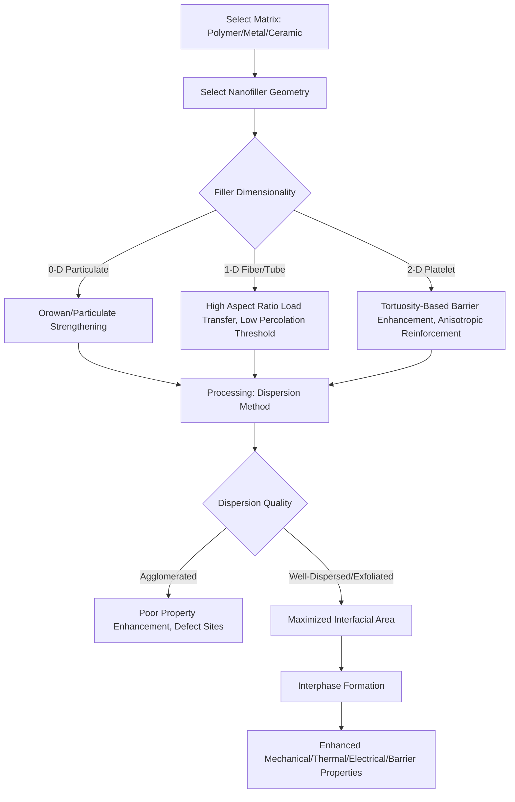

## Nanocomposites

### Overview

Nanocomposites are multiphase materials in which at least one constituent phase has a dimension below 100 nm, dispersed within a continuous matrix (polymer, metal, or ceramic). The defining characteristic distinguishing nanocomposites from conventional (micro-scale) composites is the disproportionately large interfacial area between filler and matrix at equivalent loading fractions—this interfacial region often governs bulk mechanical, thermal, electrical, and barrier properties well beyond what rule-of-mixtures predictions would suggest, enabling significant property enhancement at low filler content (often <5 wt%).

### Classification by Matrix Type

**Polymer Matrix Nanocomposites (PMNCs)**

The most widely studied and commercially significant category, combining thermoplastic or thermoset polymers with nanoscale reinforcement (clays, CNTs, graphene, nanoparticles). Processing routes include melt blending, in-situ polymerization, and solution mixing.

**Metal Matrix Nanocomposites (MMNCs)**

Metallic matrices (Al, Mg, Ti, Cu) reinforced with nanoscale ceramic or carbon particles (SiC, Al₂O₃, CNTs) for enhanced strength, stiffness, and wear resistance while managing density penalties. Processing is more challenging than polymer systems due to high processing temperatures and poor wettability between reinforcement and molten metal.

**Ceramic Matrix Nanocomposites (CMNCs)**

Nanoscale second-phase particles or fibers dispersed in ceramic matrices to improve fracture toughness—historically a major limitation of monolithic ceramics—by introducing crack-deflection and bridging mechanisms at the nanoscale.

### Classification by Reinforcement Geometry

**0-D (Particulate) Reinforcement**

Spherical or near-spherical nanoparticles (silica, alumina, metal oxides, carbon black at the nano end of its size distribution) dispersed within the matrix. Primary strengthening mechanisms include Orowan strengthening (dislocation bowing around particles in metals) and stress-transfer-based reinforcement in polymers.

**1-D (Fibrous/Tubular) Reinforcement**

Carbon nanotubes, nanofibers, and nanowires provide high aspect ratio reinforcement, enabling efficient load transfer along the fiber axis and percolation-based property enhancement (electrical/thermal conductivity) at very low loading due to easier network formation compared to spherical fillers.

**2-D (Platelet/Layered) Reinforcement**

Nanoclays (montmorillonite), graphene, and graphene oxide provide large in-plane surface area per unit mass, particularly effective for gas barrier enhancement (increased tortuosity for diffusing gas molecules) and anisotropic mechanical reinforcement.

### Polymer-Clay Nanocomposites: Structural Regimes

Layered silicate (nanoclay) nanocomposites exhibit three distinct morphological outcomes depending on the degree of polymer-clay interaction, characterizable by X-ray diffraction (interlayer spacing shift) and TEM:

1. **Conventional (Phase-Separated) Composite**: Clay remains as tactoids (stacked, unexfoliated layers); polymer does not penetrate interlayer galleries. Minimal property enhancement.
2. **Intercalated Nanocomposite**: Polymer chains penetrate between clay layers, expanding interlayer spacing while the layered, ordered structure is retained (detectable as a shifted XRD peak, following Bragg's law $n\lambda = 2d\sin\theta$).
3. **Exfoliated Nanocomposite**: Individual clay platelets are fully separated and uniformly dispersed throughout the polymer matrix, losing periodic registry (XRD peak disappears). This regime typically produces the greatest property enhancement due to maximized interfacial area.

Achieving exfoliation typically requires organic modification of the clay surface (replacing native inorganic cations with alkylammonium surfactants) to improve compatibility with the organic polymer matrix, a process central to nanoclay nanocomposite formulation.

### Interfacial Mechanisms and Property Enhancement

**Mechanical Reinforcement**

The Halpin-Tsai equations are commonly applied to estimate nanocomposite modulus as a function of filler aspect ratio, orientation, and volume fraction:

$$E_c = E_m \frac{1 + \zeta \eta V_f}{1 - \eta V_f}, \quad \eta = \frac{(E_f/E_m) - 1}{(E_f/E_m) + \zeta}$$

where $E_c$, $E_m$, $E_f$ are composite, matrix, and filler modulus respectively, $V_f$ is filler volume fraction, and $\zeta$ is a shape parameter dependent on filler geometry and loading direction. **[Inference]** While widely used, Halpin-Tsai and related micromechanics models generally assume perfect dispersion, ideal interfacial bonding, and uniform orientation—assumptions frequently violated in real nanocomposite processing, meaning predicted values often diverge from measured properties without empirical correction factors specific to the processing route used.

**Interphase Region**

A distinct "interphase" zone of polymer with altered chain mobility (typically reduced, due to nanoparticle surface interactions) forms around nanofillers, extending some nanometers into the matrix. Given the high surface area of nanoscale fillers, this interphase volume fraction can become significant even at low filler loading, contributing to property changes (elevated glass transition temperature, altered viscoelastic behavior) beyond simple filler-volume-fraction scaling.

**Percolation Theory for Electrical/Thermal Conductivity**

Conductive nanofillers (CNTs, graphene, metallic nanoparticles) transform an insulating polymer matrix into a conductive composite once filler content exceeds a critical **percolation threshold** $\phi_c$, at which a continuous conductive network first forms. Conductivity above threshold follows:

$$\sigma \propto (\phi - \phi_c)^t$$

where $\phi$ is filler volume fraction and $t$ is a critical exponent (theoretically ~1.6-2.0 for 3D systems, though experimentally variable). High-aspect-ratio fillers (CNTs, graphene) achieve percolation at substantially lower loading (often <1 wt%) than spherical particles (often >10 wt%) due to more efficient network formation per unit volume.

### Barrier and Thermal Properties

**Gas Barrier Enhancement**

Platelet-shaped nanofillers (clay, graphene) increase the tortuosity of the diffusion path for permeating gas molecules, described qualitatively by the Nielsen tortuosity model:

$$\frac{P_c}{P_m} = \frac{1}{1 + (L/2W)\phi}$$

where $P_c/P_m$ is the relative permeability of composite to matrix, $L/W$ is the platelet aspect ratio, and $\phi$ is filler volume fraction—higher aspect ratio platelets produce disproportionately large barrier improvement per unit loading, valuable in food packaging applications.

**Thermal Conductivity**

High-thermal-conductivity fillers (graphene, boron nitride nanosheets, CNTs) enhance polymer thermal management applications (electronics packaging, thermal interface materials), though achieving high bulk thermal conductivity requires establishing continuous thermally conductive pathways, similarly governed by percolation-like network formation, and is generally more difficult to achieve than electrical percolation due to phonon scattering at filler-filler and filler-matrix interfaces.

### Processing Challenges

**Dispersion**

Nanoparticles have strong tendency toward agglomeration due to high surface energy and van der Waals attraction; achieving uniform dispersion is often the primary processing challenge and the main source of batch-to-batch property variability. Techniques include high-shear mixing, ultrasonication, surfactant/surface functionalization, and in-situ synthesis of filler within the matrix.

**Interfacial Bonding**

Effective load transfer (mechanical reinforcement) and property translation require strong filler-matrix interfacial adhesion; surface functionalization (silane coupling agents for oxide fillers, covalent functionalization of CNTs/graphene) is commonly employed to improve compatibility and bonding strength.

**Viscosity and Processability**

High-aspect-ratio nanofillers dramatically increase melt viscosity at relatively low loading, constraining achievable filler content in melt-processing routes (injection molding, extrusion) and requiring process parameter adjustment (temperature, shear rate, residence time).

### Applications by Sector

- **Automotive/Aerospace**: nanoclay-reinforced polymers for lightweight structural and under-hood components; CNT/graphene composites for lightweight, high-strength structural parts and EMI shielding.
- **Packaging**: nanoclay-polymer composites for enhanced gas barrier in food and beverage packaging, extending shelf life.
- **Electronics**: nanocomposite thermal interface materials, EMI shielding composites, flexible conductive films.
- **Coatings**: nanoparticle-reinforced coatings for scratch resistance, UV protection (TiO₂, ZnO nanoparticles), and anti-corrosion barrier properties.
- **Biomedical**: nanocomposite scaffolds (hydroxyapatite nanoparticle-reinforced polymers) for bone tissue engineering, combining mechanical support with bioactivity—an application area governed by the biocompatibility and regulatory frameworks (ISO 10993) applicable to biomaterials generally.

### Nanocomposite Structure-Property Relationship

### Clay Exfoliation Morphology Schematic (svg_diagram)

<svg xmlns="http://www.w3.org/2000/svg" viewBox="0 0 760 320" font-family="Arial, sans-serif">
<text x="380" y="25" text-anchor="middle" font-size="16" font-weight="bold">Polymer-Clay Morphology Regimes (svg_diagram)</text>

<text x="130" y="55" text-anchor="middle" font-size="12" font-weight="bold">Phase-Separated</text>

<g stroke="`#2c5f8a`" stroke-width="3">

<line x1="70" y1="80" x2="190" y2="80" />

<line x1="70" y1="90" x2="190" y2="90" />

<line x1="70" y1="100" x2="190" y2="100" />

<line x1="70" y1="110" x2="190" y2="110" />

</g>

<rect x="60" y="130" width="140" height="130" fill="#eee" stroke="#999" stroke-dasharray="3,3" />

<text x="130" y="290" text-anchor="middle" font-size="10">Tactoids, no penetration</text>

<text x="380" y="55" text-anchor="middle" font-size="12" font-weight="bold">Intercalated</text>

<g stroke="`#2c5f8a`" stroke-width="3">

<line x1="320" y1="90" x2="440" y2="90" />

<line x1="320" y1="110" x2="440" y2="110" />

<line x1="320" y1="130" x2="440" y2="130" />

<line x1="320" y1="150" x2="440" y2="150" />

</g>

<rect x="310" y="160" width="140" height="100" fill="#eee" stroke="#999" stroke-dasharray="3,3" />

<text x="380" y="290" text-anchor="middle" font-size="10">Expanded gallery, ordered</text>

<text x="630" y="55" text-anchor="middle" font-size="12" font-weight="bold">Exfoliated</text>

<g stroke="`#2c5f8a`" stroke-width="3">

<line x1="570" y1="90" x2="690" y2="70" />

<line x1="560" y1="140" x2="700" y2="120" />

<line x1="580" y1="190" x2="660" y2="160" />

<line x1="575" y1="230" x2="695" y2="210" />

</g>

<rect x="560" y="60" width="140" height="200" fill="#eee" stroke="#999" stroke-dasharray="3,3" />

<text x="630" y="290" text-anchor="middle" font-size="10">Individual platelets, random</text>

</svg>

### Practical Example: Estimating Percolation Threshold for a CNT-Polymer Composite

Given a target electrical conductivity for an EMI shielding application, a formulator selects MWCNTs (aspect ratio ~200) in a polypropylene matrix. Using statistical percolation theory, the critical volume fraction for high-aspect-ratio fillers scales approximately as:

$$\phi_c \approx \frac{0.7}{A}$$

where $A$ is filler aspect ratio (a simplified excluded-volume approximation for randomly oriented rod-like fillers). For $A = 200$: $\phi_c \approx 0.0035$ (0.35 vol%). This illustrates why CNT composites can achieve conductive percolation at loadings an order of magnitude lower than spherical carbon black (aspect ratio ~1-2, requiring $\phi_c$ often >10-15 vol%)—directly informing material selection when minimizing filler loading (for cost, processability, or mechanical property retention) is a design priority.

### Key Points

- Nanocomposite property enhancement arises primarily from interfacial effects, not simple rule-of-mixtures scaling—making dispersion quality and interfacial bonding the dominant processing variables.
- Filler geometry (0-D, 1-D, 2-D) determines which property enhancement mechanisms dominate: particulate strengthening, percolation-based conductivity, or tortuosity-based barrier improvement.
- The intercalated-vs-exfoliated distinction in polymer-clay systems is a key processing/characterization concept, directly linked to achievable property enhancement.
- Percolation theory explains why high-aspect-ratio conductive fillers (CNTs, graphene) achieve target conductivity at dramatically lower loading than spherical fillers.
- Achieving predicted nanocomposite properties in practice is frequently limited by real-world dispersion and interfacial bonding imperfections relative to idealized micromechanical models.

### Related Topics

- Polymer-Clay Nanocomposite Processing and Organomodification Chemistry
- Percolation Theory and Network Formation in Conductive Composites
- Metal Matrix Nanocomposite Processing: Powder Metallurgy and Stir Casting Routes
- Interphase Characterization Techniques (DMA, AFM Nanomechanical Mapping)
- Graphene-Reinforced Polymer Nanocomposites
- Hydroxyapatite Nanocomposite Scaffolds for Bone Tissue Engineering