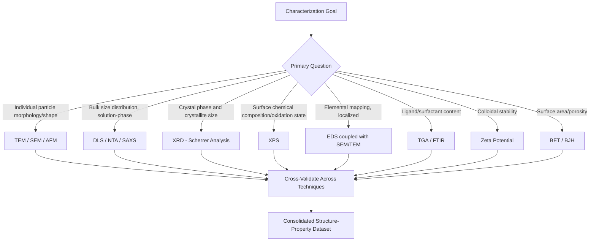

## Characterization of Nanomaterials

### Overview

Characterization of nanomaterials requires a multi-technique approach spanning morphological imaging, structural analysis, chemical composition, surface properties, and size-distribution statistics, because no single instrument fully captures the size-, shape-, and surface-dependent behavior that distinguishes nanoscale materials from bulk counterparts. Reliable characterization is foundational to correlating synthesis parameters with resulting properties, verifying batch-to-batch reproducibility, and satisfying regulatory or quality documentation requirements across nanomedicine, nanocomposites, and nanoelectronics applications.

### Morphological and Imaging Techniques

**Transmission Electron Microscopy (TEM)**

Electrons transmitted through an ultra-thin sample (typically <100 nm) form an image based on differential electron scattering, achieving sub-nanometer to atomic resolution. TEM is the primary technique for directly visualizing nanoparticle size, shape, crystallinity (via selected area electron diffraction, SAED), and internal structure (core-shell architectures, lattice defects). High-resolution TEM (HRTEM) resolves individual atomic lattice planes, enabling direct measurement of interplanar spacing for phase identification.

**[Inference]** TEM sample preparation (drop-casting onto a carbon-coated grid, drying) can introduce artifacts—particle aggregation during solvent evaporation, or preferential deposition of certain size fractions—meaning TEM-derived size distributions should generally be corroborated with a solution-phase technique like dynamic light scattering rather than treated as a complete statistical population on their own.

**Scanning Electron Microscopy (SEM)**

Surface topography imaging via secondary electron detection, offering somewhat lower resolution than TEM (typically 1-10 nm depending on instrument) but simpler sample preparation and larger field of view, useful for surveying particle morphology, aggregation state, and surface texture of nanostructured films or composites. Field-emission SEM (FE-SEM) improves resolution and reduces charging artifacts on non-conductive samples.

**Atomic Force Microscopy (AFM)**

A cantilever with a nanoscale tip rasters across the sample surface, measuring force interactions (contact, tapping, or non-contact mode) to reconstruct a 3-D topographic map with sub-nanometer vertical resolution. AFM is particularly valuable for measuring nanoparticle height (a more reliable dimension than lateral size, which is broadened by tip convolution effects), surface roughness, and for mapping mechanical properties (elastic modulus via force-distance curves) at the nanoscale. Operates in ambient or liquid environments, unlike electron microscopy's vacuum requirement.

**Scanning Tunneling Microscopy (STM)**

Measures quantum tunneling current between a conductive probe tip and a conductive sample surface, achieving true atomic resolution but restricted to electrically conductive or semiconducting samples, primarily used for surface science studies of metal and semiconductor nanostructures.

### Size and Size-Distribution Analysis

**Dynamic Light Scattering (DLS)**

Measures the time-dependent fluctuation in scattered laser light intensity caused by Brownian motion of particles in suspension, from which the hydrodynamic diameter is derived via the Stokes-Einstein relation:

$$D_h = \frac{k_BT}{3\pi\eta D}$$

where $k_B$ is Boltzmann's constant, $T$ is temperature, $\eta$ is solvent viscosity, and $D$ is the translational diffusion coefficient extracted from the autocorrelation function decay. DLS provides rapid, solution-phase size distribution (typically reported as intensity-weighted, volume-weighted, or number-weighted distributions, which can differ substantially for polydisperse samples since scattering intensity scales with $d^6$, heavily biasing intensity-weighted results toward larger particles). Also commonly used to obtain **polydispersity index (PDI)** as a measure of size distribution width.

**Nanoparticle Tracking Analysis (NTA)**

Individually tracks Brownian motion of particles visualized under laser illumination via a microscope-coupled camera, calculating size distribution particle-by-particle rather than as an ensemble-averaged autocorrelation function. NTA is less biased toward larger particles than DLS and can additionally provide particle concentration (particles/mL), a measurement DLS cannot directly provide.

**Small-Angle X-ray Scattering (SAXS)**

X-ray scattering at low angles (typically 0.1–10°) probes structural features in the 1–100 nm range, providing statistically robust size distribution, shape information, and internal structure (e.g., core-shell dimensions) averaged over a large ensemble of particles in solution or solid state, complementing the localized/individual-particle view from microscopy.

**Centrifugal and Field-Flow Fractionation Methods**

Analytical ultracentrifugation and field-flow fractionation separate particles by size/density prior to detection, useful for characterizing polydisperse or multi-component nanoparticle populations where DLS's ensemble averaging would obscure subpopulations.

### Structural and Crystallographic Characterization

**X-ray Diffraction (XRD)**

Identifies crystal phase and provides average crystallite size via the **Scherrer equation**:

$$D = \frac{K\lambda}{\beta\cos\theta}$$

where $D$ is mean crystallite size, $K$ is a shape factor (~0.9 for spherical particles), $\lambda$ is X-ray wavelength, $\beta$ is the peak's full-width-at-half-maximum (in radians, corrected for instrumental broadening), and $\theta$ is the Bragg angle. Peak broadening at the nanoscale (arising from finite crystal domain size, distinct from bulk material's sharp diffraction peaks) is the physical basis for this size determination.

**[Inference]** Scherrer-derived crystallite size reflects the coherently diffracting domain size, which may be smaller than the physical particle size if the particle contains internal grain boundaries, twin defects, or an amorphous surface layer—so Scherrer analysis and TEM-measured physical particle size do not always agree and should be interpreted as complementary rather than interchangeable measurements.

**Raman Spectroscopy**

Probes vibrational modes sensitive to bonding, crystallinity, strain, and (for materials like CNTs and graphene) structural parameters. For CNTs specifically, the Radial Breathing Mode (RBM) frequency directly correlates with tube diameter ($\omega_{RBM} \approx 248/d_t$ cm⁻¹, approximately, with empirical corrections for tube-substrate/bundle interactions), while the D-band to G-band intensity ratio (I_D/I_G) quantifies defect density.

**Selected Area Electron Diffraction (SAED)**

Performed within the TEM, providing crystal structure information from a localized region (individual particle or small particle group), useful for confirming phase identity at the single-particle level, complementing bulk-averaged XRD.

### Chemical Composition and Surface Analysis

**X-ray Photoelectron Spectroscopy (XPS)**

Measures binding energy of photoelectrons ejected from core electron shells under X-ray irradiation, providing elemental composition and oxidation state information from the top few nanometers of the sample surface—a critical technique given that nanomaterial surface chemistry (oxidation state, ligand binding, surface contamination) often differs from bulk composition and governs reactivity, catalytic activity, and biological interaction.

**Energy-Dispersive X-ray Spectroscopy (EDS/EDX)**

Typically coupled with SEM or TEM, provides elemental composition mapping at the spatial resolution of the host microscope, valuable for confirming core-shell composition, dopant distribution, or contamination in individual nanostructures.

**Fourier-Transform Infrared Spectroscopy (FTIR)**

Identifies surface functional groups and ligand chemistry (e.g., confirming ligand exchange success, capping agent identity) via characteristic vibrational absorption bands.

**Thermogravimetric Analysis (TGA)**

Measures mass loss as a function of temperature, commonly used to quantify organic ligand/surfactant content on nanoparticle surfaces (the mass fraction lost upon ligand decomposition/desorption at elevated temperature) and to assess thermal stability.

### Surface Charge and Colloidal Stability

**Zeta Potential Measurement**

Quantifies the electrostatic potential at the slipping plane of the electrical double layer surrounding a charged particle in suspension, typically measured via electrophoretic light scattering (particle velocity under an applied electric field, related to zeta potential via the Henry equation). Zeta potential magnitude serves as a practical indicator of colloidal stability—values more extreme than approximately +/-30 mV are generally associated with electrostatically stabilized, non-aggregating suspensions, though this threshold is an empirical rule of thumb rather than a universal physical law, and steric stabilization (from adsorbed polymers/ligands) can maintain stability outside this range.

### Surface Area and Porosity

**Brunauer-Emmett-Teller (BET) Analysis**

Determines specific surface area from gas (typically N₂) adsorption isotherms, fitting the BET equation to multilayer adsorption data. Essential for characterizing high-surface-area nanomaterials used in catalysis and adsorption applications, where surface area often correlates directly with functional performance. Complementary Barrett-Joyner-Halenda (BJH) analysis extracts pore size distribution for mesoporous nanomaterials.

### Technique Selection Logic

### Complementary Technique Coverage Map (svg_diagram)

<svg xmlns="http://www.w3.org/2000/svg" viewBox="0 0 740 360" font-family="Arial, sans-serif">
<text x="370" y="25" text-anchor="middle" font-size="16" font-weight="bold">Nanomaterial Characterization Coverage (svg_diagram)</text>
<circle cx="230" cy="190" r="130" fill="#dbe9f7" fill-opacity="0.6" stroke="#2c5f8a" />
<text x="150" y="120" font-size="12" font-weight="bold">Morphology</text>
<text x="130" y="140" font-size="10">TEM, SEM, AFM</text>
<circle cx="380" cy="130" r="130" fill="#f7e9db" fill-opacity="0.6" stroke="#8a5f2c" />
<text x="360" y="70" font-size="12" font-weight="bold">Structure</text>
<text x="345" y="90" font-size="10">XRD, SAED, Raman</text>
<circle cx="510" cy="220" r="130" fill="#dbf7db" fill-opacity="0.6" stroke="#2c8a2c" />
<text x="560" y="290" font-size="12" font-weight="bold">Chemistry</text>
<text x="545" y="310" font-size="10">XPS, EDS, FTIR</text>

<text x="330" y="200" text-anchor="middle" font-size="10" font-style="italic">Overlap Zone:</text>

<text x="330" y="215" text-anchor="middle" font-size="9">Phase ID + morphology</text>

<text x="330" y="228" text-anchor="middle" font-size="9">(e.g., HRTEM lattice fringes)</text>

<text x="230" y="340" text-anchor="middle" font-size="10">Size Distribution: DLS, NTA, SAXS (solution-phase, all-encompassing)</text>

</svg>

### Practical Example: Cross-Validating Nanoparticle Size Across Techniques

A batch of gold nanoparticles synthesized via citrate reduction is characterized using three complementary methods:

- **TEM**: measures core diameter directly on dried, individual particles — reports 14.2 nm ± 1.8 nm (based on measuring ~200 particles).
- **DLS**: measures hydrodynamic diameter in solution, including the citrate ligand shell and associated solvation layer — reports 19.5 nm (intensity-weighted Z-average).
- **UV-Vis spectroscopy**: the surface plasmon resonance peak position (~520 nm for ~15 nm AuNPs, red-shifting with increasing size) provides a rapid, non-destructive size estimate consistent with the TEM value.

The systematic ~5 nm difference between TEM and DLS is expected and physically meaningful—it reflects the ligand shell and hydration layer thickness rather than measurement error, illustrating why single-technique characterization risks misinterpretation, and why reporting the measurement technique alongside any stated nanoparticle size is standard practice in rigorous nanomaterial characterization.

### Key Points

- No single characterization technique fully describes a nanomaterial; morphology, structure, and chemistry require complementary methods with distinct physical bases and potential biases.
- TEM/SEM/AFM provide direct, localized morphological information, while DLS/NTA/SAXS provide statistically robust, solution-phase ensemble size distributions—their apparent "sizes" are not directly equivalent (dry core vs. hydrodynamic diameter).
- XRD Scherrer analysis measures coherent crystalline domain size, which may differ from physical particle size measured by microscopy when internal defects or amorphous layers are present.
- Surface-sensitive techniques (XPS, zeta potential, TGA) are essential because nanomaterial surface chemistry frequently governs functional behavior independent of bulk composition.
- Reporting the specific technique and measurement basis alongside any stated nanomaterial dimension is essential for meaningful data interpretation and comparison across studies.

### Related Topics

- Dynamic Light Scattering Theory and Autocorrelation Function Analysis
- X-ray Photoelectron Spectroscopy Peak Fitting and Oxidation State Determination
- Nanoparticle Tracking Analysis vs. DLS: Comparative Methodology
- BET Surface Area Analysis for Porous and Mesoporous Nanomaterials
- Raman Spectroscopy of Carbon Nanomaterials: RBM and D/G Band Analysis
- Standardization and Reference Materials in Nanomaterial Metrology (ISO/TC 229)