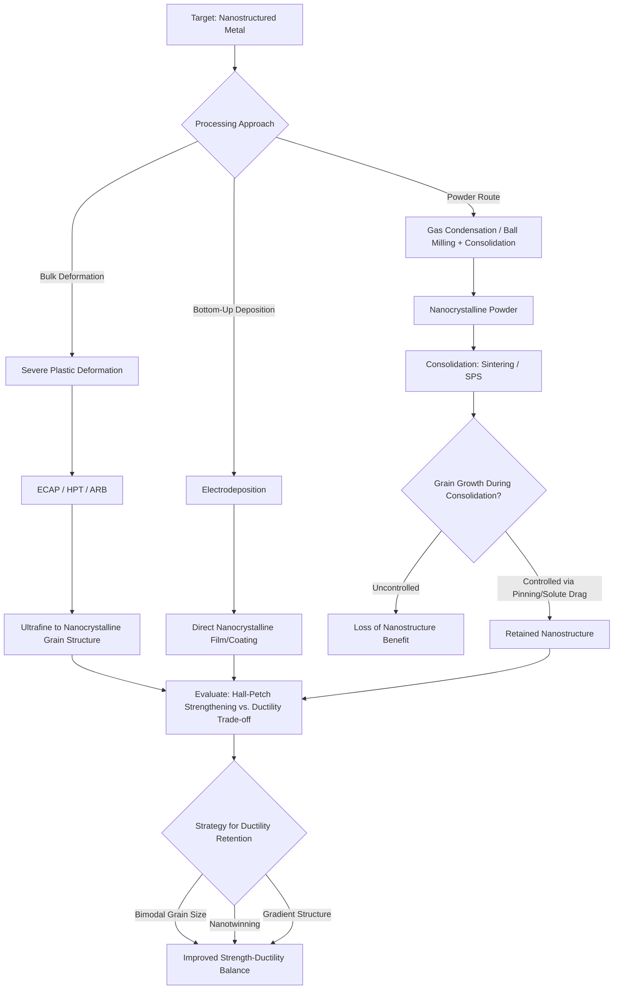

## Nanostructured Metals and Alloys

### Overview

Nanostructured metals and alloys are metallic materials engineered with grain sizes, precipitates, or phase domains at the nanoscale (conventionally <100 nm, with the "ultrafine-grained" regime spanning roughly 100–1000 nm often discussed alongside true nanocrystalline materials). Grain refinement to this scale fundamentally alters mechanical behavior relative to conventional coarse-grained metals—primarily through dramatic increases in strength via Hall-Petch strengthening—while introducing distinct trade-offs in ductility, thermal stability, and deformation mechanisms that do not simply extrapolate from microscale metallurgical behavior.

### Hall-Petch Strengthening and Its Breakdown

**Conventional Hall-Petch Relationship**

Yield strength increases with decreasing grain size according to:

$$\sigma_y = \sigma_0 + \frac{k_y}{\sqrt{d}}$$

where $\sigma_0$ is the friction stress (lattice resistance to dislocation motion), $k_y$ is the Hall-Petch coefficient (material-specific), and $d$ is grain diameter. This relationship, well-established across the micrometer-to-submicron grain size range, reflects dislocation pile-up at grain boundaries acting as barriers to further plastic deformation.

**Inverse Hall-Petch Effect**

Below a critical grain size—typically cited in the range of 10–15 nm depending on the metal system—strength has been observed to plateau or even decrease with further grain refinement, a phenomenon termed the "inverse Hall-Petch effect." The physical explanation generally invoked is a transition in dominant deformation mechanism: at these extremely small grain sizes, insufficient grain interior volume exists to support conventional dislocation pile-up, and grain-boundary-mediated processes (grain boundary sliding, grain rotation, Coble creep-like diffusional mechanisms) become dominant instead. **[Inference]** The exact critical grain size and the degree of softening observed vary considerably across different metal systems and are sensitive to processing-induced porosity and impurity content, meaning reported inverse Hall-Petch data in the literature should be interpreted with attention to specimen quality rather than treated as a single universal transition point.

### Processing Routes for Nanostructured Metals

**Severe Plastic Deformation (SPD)**

A family of techniques imposing very large plastic strains without significant change in overall specimen dimensions, producing ultrafine-grained/nanocrystalline microstructure through extensive dislocation generation and dynamic recrystallization:

- **Equal-Channel Angular Pressing (ECAP)**: material is pressed through two intersecting channels of equal cross-section, imposing simple shear strain; repeated passes (often with sample rotation between passes, "route Bc" being common) progressively refine grain structure.
- **High-Pressure Torsion (HPT)**: sample compressed between anvils while one anvil rotates, imposing severe shear strain, typically achieving the finest grain sizes among SPD methods but limited to small disc-shaped specimens.
- **Accumulative Roll Bonding (ARB)**: sheet material is stacked, roll-bonded, cut, and re-stacked repeatedly, combining severe deformation with the scalability of rolling processes.

**Electrodeposition**

Nanocrystalline metal films/coatings (particularly Ni, Cu, and their alloys) can be produced by controlling electrodeposition parameters (current density, bath additives/grain refiners, pulse plating) to favor high nucleation rates over grain growth, producing grain sizes down to the sub-20 nm range directly during deposition, without subsequent mechanical deformation.

**Inert Gas Condensation / Powder Consolidation**

Metal vapor is condensed in a controlled inert gas atmosphere to form nanoscale powder particles, which are subsequently consolidated (via compaction, sintering, or spark plasma sintering) into bulk nanostructured material. This route allows independent control over initial nanoparticle size but faces challenges achieving full densification without triggering grain growth during consolidation.

**Mechanical Alloying / Ball Milling**

High-energy ball milling repeatedly fractures and cold-welds powder particles, refining grain structure and, for alloy systems, achieving mechanical mixing at near-atomic scale even between immiscible elements; the resulting powder is subsequently consolidated into bulk form.

### Thermal Stability Challenges

Nanocrystalline metals possess a very high volume fraction of grain boundary material, representing significant excess free energy relative to coarse-grained material—this drives a strong thermodynamic tendency toward grain growth (coarsening) even at modest homologous temperatures, which can rapidly erode the strength benefits gained from grain refinement.

**Stabilization Strategies**

- **Solute segregation (Zener/kinetic pinning via solute drag)**: alloying elements that segregate to grain boundaries reduce boundary energy and/or reduce boundary mobility, thermodynamically or kinetically stabilizing the nanostructure against coarsening.
- **Second-phase (Zener) pinning**: fine, thermally stable precipitates or dispersoids pin grain boundaries, resisting migration via a pinning pressure that scales inversely with precipitate size and directly with precipitate volume fraction.
- **[Inference]** Achieving genuinely thermodynamically stable nanocrystalline structure (rather than merely kinetically metastable, slow-coarsening structure) requires careful alloy design targeting a true grain-boundary-energy minimum, a design approach that remains an active area of alloy development rather than a fully generalized, off-the-shelf methodology across arbitrary metal systems.

### Strengthening Mechanism Interplay

In nanostructured alloys, multiple strengthening mechanisms operate simultaneously, and their combined contribution is often approximated (with caveats regarding mechanism interaction) via linear or root-sum-square superposition:

$$\sigma_y \approx \sigma_0 + \sigma_{ss} + \sigma_{ppt} + \sigma_{HP}$$

where $\sigma_{ss}$ is solid-solution strengthening, $\sigma_{ppt}$ is precipitation/dispersoid strengthening, and $\sigma_{HP}$ is the Hall-Petch grain-boundary strengthening term. At the nanoscale, precipitation strengthening interacts more intricately with grain boundary strengthening than at coarser scales, since precipitate spacing may become comparable to grain size itself, altering the dominant obstacle-bypass mechanism (Orowan looping vs. particle shearing) that dislocations encounter.

### The Strength-Ductility Trade-off

Grain refinement to the nanoscale typically produces very high strength but at the cost of tensile ductility—nanocrystalline metals often exhibit limited uniform elongation and reduced strain hardening capacity, since dislocation storage capacity (the mechanism underlying strain hardening in conventional metals) is suppressed when grain interiors are too small to accommodate significant dislocation density buildup.

**Strategies for Simultaneous Strength-Ductility Enhancement**

- **Bimodal/multimodal grain size distributions**: combining nanocrystalline regions (providing strength) with a fraction of coarser micron-scale grains (providing strain-hardening capacity and ductility) has demonstrated improved combinations of strength and ductility relative to fully nanocrystalline structure.
- **Nanotwinned metals**: high-density growth or deformation twins (particularly demonstrated in nanotwinned copper) provide strengthening via twin-boundary dislocation interactions while retaining greater dislocation storage capacity than conventional high-angle grain boundaries, offering an alternative strengthening route with better ductility retention.
- **Gradient nanostructures**: a gradient from nanocrystalline surface layers to coarse-grained core (achievable via surface mechanical attrition treatment, SMAT) combines surface strengthening/wear resistance with bulk ductility.

### Applications

**Structural Lightweighting**

Nanostructured/ultrafine-grained aluminum and magnesium alloys, produced via SPD routes, are investigated for aerospace and automotive weight reduction where strength-to-weight ratio improvement can offset the ductility penalty in appropriately designed components.

**Wear and Fatigue Resistance**

Surface nanocrystallization (via SMAT, shot peening, or related surface treatments) improves wear resistance and fatigue life of components by introducing compressive residual stress and a hardened, fine-grained surface layer while preserving bulk toughness.

**Electrical and Electronic Applications**

Nanocrystalline copper and other conductive alloys are of interest for interconnects and applications requiring the combination of high strength (resisting electromigration-induced damage or mechanical fatigue in flexible electronics) with acceptable electrical conductivity, though grain boundary electron scattering in very fine-grained material can measurably reduce conductivity relative to coarse-grained metal.

**Amorphous and Nanocrystalline Soft Magnetic Alloys**

Fe-based nanocrystalline alloys (e.g., Finemet-type Fe-Si-B-Nb-Cu compositions), produced by partial crystallization of a melt-spun amorphous precursor into a nanocrystalline (~10-20 nm grain) structure embedded in residual amorphous matrix, achieve excellent soft magnetic properties (low coercivity, high permeability) valuable in transformer cores and inductive components.

### Processing Route Comparison and Structure Outcome

### Hall-Petch and Inverse Hall-Petch Regime Schematic (svg_diagram)

<svg xmlns="http://www.w3.org/2000/svg" viewBox="0 0 700 380" font-family="Arial, sans-serif">
<text x="350" y="25" text-anchor="middle" font-size="16" font-weight="bold">Strength vs. Grain Size Regimes (svg_diagram)</text>
<line x1="90" y1="320" x2="640" y2="320" stroke="black" stroke-width="1.5" />
<text x="365" y="350" text-anchor="middle" font-size="12">Grain Size (decreasing to the right, log scale)</text>
<line x1="90" y1="320" x2="90" y2="60" stroke="black" stroke-width="1.5" />
<text x="45" y="190" text-anchor="middle" font-size="12" transform="rotate(-90 45,190)">Yield Strength</text>
<path d="M100,300 Q300,180 480,90" stroke="#2c5f8a" stroke-width="2.5" fill="none" />
<text x="280" y="160" font-size="11" fill="#2c5f8a">Conventional Hall-Petch (σ ∝ 1/√d)</text>
<path d="M480,90 Q550,95 620,140" stroke="#e74c3c" stroke-width="2.5" fill="none" stroke-dasharray="5,4" />
<text x="500" y="180" font-size="11" fill="#e74c3c">Inverse Hall-Petch region</text>
<line x1="480" y1="60" x2="480" y2="320" stroke="#888" stroke-width="1" stroke-dasharray="3,3" />
<text x="480" y="45" text-anchor="middle" font-size="10">Critical grain size (~10-15 nm)</text>

<text x="150" y="295" font-size="10">Micro-grained</text>

<text x="560" y="295" font-size="10">Nanocrystalline</text>

</svg>

### Practical Example: Estimating Strength Gain from ECAP Processing

An aluminum alloy is processed from an initial grain size of 20 µm (conventional) to 200 nm (ultrafine-grained) via 8 passes of ECAP. Using representative Hall-Petch parameters for aluminum ($\sigma_0 \approx 10$ MPa, $k_y \approx 0.07$ MPa·m^0.5, illustrative values for this calculation):

Initial: $\sigma_y = 10 + \frac{0.07}{\sqrt{20\times10^{-6}}} \approx 10 + 15.7 \approx 25.7$ MPa

After ECAP: $\sigma_y = 10 + \frac{0.07}{\sqrt{200\times10^{-9}}} \approx 10 + 156.5 \approx 166.5$ MPa

This illustrates the substantial strength increase achievable through grain refinement alone—roughly a 6x increase in this example—while flagging that the same alloy would likely show a measurable ductility reduction (uniform elongation) that must be evaluated for the specific application, and that Hall-Petch coefficients used here are illustrative rather than a substitute for alloy-specific published data in an actual design calculation.

### Key Points

- The Hall-Petch relationship provides strong strengthening down to a critical grain size (typically ~10-15 nm), below which an inverse Hall-Petch effect can cause strength plateau or decline due to a shift toward grain-boundary-mediated deformation mechanisms.
- Severe plastic deformation (ECAP, HPT, ARB) is the dominant bulk processing route for ultrafine-grained/nanocrystalline metals, while electrodeposition and powder consolidation offer alternative bottom-up and powder-based routes.
- High grain boundary volume fraction creates strong thermodynamic driving force for grain growth, requiring solute segregation or second-phase pinning strategies for thermal stability.
- Strength gains from grain refinement generally come at a ductility cost; bimodal grain structures, nanotwinning, and gradient nanostructures are established strategies for improving the strength-ductility balance.
- Reported inverse Hall-Petch transition points and stability outcomes vary meaningfully by alloy system and processing quality, warranting caution against over-generalizing single-study results.

### Related Topics

- Severe Plastic Deformation Techniques: ECAP, HPT, and ARB Process Parameters
- Nanotwinned Copper: Deformation Mechanisms and Strengthening
- Grain Boundary Engineering and Solute Drag Stabilization
- Bimodal Grain Size Distribution Design for Strength-Ductility Optimization
- Fe-Based Nanocrystalline Soft Magnetic Alloys (Finemet-Type Compositions)
- Spark Plasma Sintering for Nanocrystalline Powder Consolidation