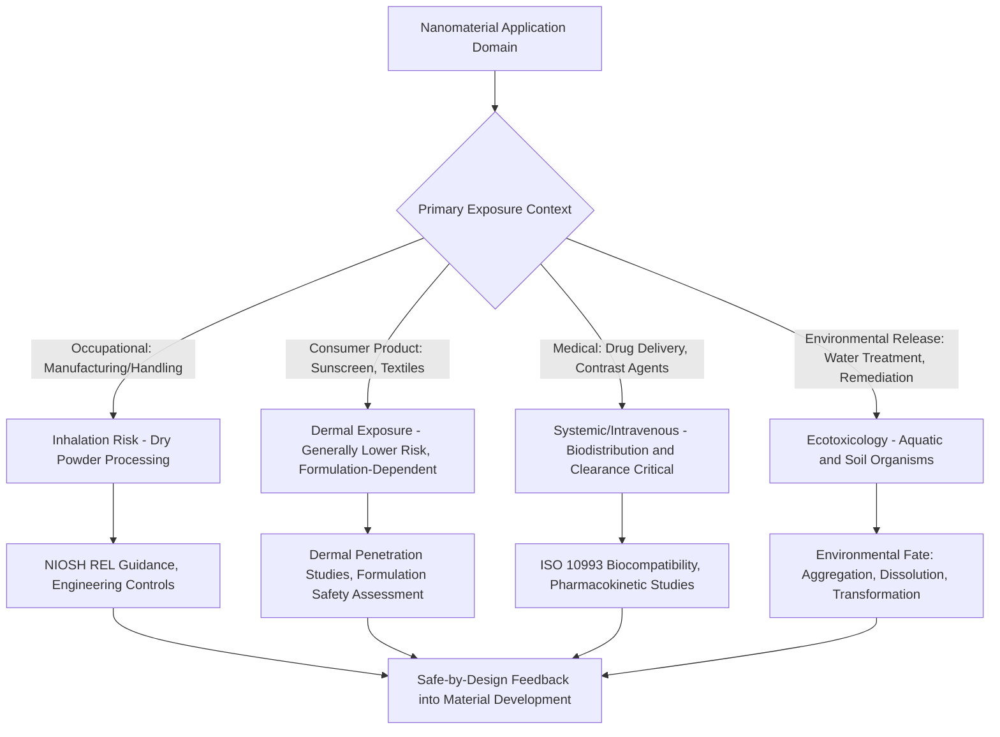

## Applications and Safety of Nanomaterials

### Overview

Nanomaterials have moved from laboratory curiosity to widespread commercial deployment across electronics, energy, medicine, consumer products, and construction, driven by property enhancements—increased strength, tunable optical behavior, enhanced catalytic activity, and high surface reactivity—unavailable in bulk-form equivalents. This same high surface reactivity and small size that enable beneficial applications also underlie the distinct toxicological and environmental behavior of nanomaterials, requiring safety frameworks that differ substantially from conventional chemical risk assessment, since nanoscale-specific properties (rather than bulk chemical identity alone) can govern biological interaction, environmental fate, and human health impact.

### Applications by Sector

**Electronics and Computing**

Nanoscale transistor gate structures (sub-10 nm FinFET and gate-all-around architectures) underpin continued semiconductor scaling; nanoscale magnetic materials enable high-density magnetic storage; quantum dots and nanostructured phosphors improve display color performance, as covered in the quantum dot and CNT/fullerene material classes discussed elsewhere in this chapter.

**Energy Storage and Conversion**

Nanostructured electrode materials (silicon nanowires, nanostructured carbon, nanoscale metal oxide coatings) improve lithium-ion battery capacity and cycle life by accommodating volumetric strain during charge/discharge and shortening ion diffusion pathways. Nanostructured catalysts (platinum nanoparticles on carbon supports) improve fuel cell efficiency by maximizing active catalytic surface area per unit precious-metal mass. Nanotextured surfaces and nanoparticle light-trapping structures improve photovoltaic light absorption efficiency.

**Medicine and Pharmaceuticals**

Nanoparticle drug delivery systems (lipid nanoparticles, polymeric nanoparticles, liposomes) enable targeted delivery, controlled release, and improved bioavailability of therapeutics—most prominently demonstrated at global scale through lipid nanoparticle-encapsulated mRNA vaccine platforms. Nanoparticle contrast agents enhance medical imaging (iron oxide nanoparticles for MRI contrast, gold nanoparticles for CT contrast). Nanostructured biomaterials and scaffolds support tissue engineering applications, subject to the biocompatibility and regulatory frameworks (ISO 10993, combination product pathways) covered elsewhere in this curriculum.

**Environmental and Water Treatment**

Nanostructured photocatalysts (TiO₂ nanoparticles) degrade organic pollutants under UV/visible light irradiation; functionalized nanoparticles and nanoscale zero-valent iron are used for groundwater remediation, including reduction of chlorinated solvent contaminants; nanoporous and nanostructured membranes improve water filtration selectivity and throughput.

**Consumer Products**

Nanoparticle UV filters (ZnO, TiO₂) in sunscreens provide broad-spectrum protection with improved cosmetic transparency compared to bulk-particle formulations; silver nanoparticles are incorporated into textiles and coatings for antimicrobial function; nanostructured coatings provide scratch resistance, anti-fogging, and self-cleaning (lotus-effect-inspired superhydrophobic) surface properties.

**Construction and Structural Materials**

Nanosilica and other nanoscale additives densify cement microstructure, improving compressive strength and durability; nanostructured coatings provide enhanced corrosion resistance and self-cleaning (photocatalytic) building surfaces.

### Nanotoxicology: Why Nanoscale Behavior Differs

**Dose Metrics Beyond Mass**

Conventional toxicology typically expresses dose as mass per unit body weight, but for nanomaterials, biological response frequently correlates more strongly with particle number, surface area, or surface reactivity than with mass alone—since a given mass of nanomaterial presents vastly more surface area and more individual particles than the same mass in bulk or micron-scale form. **[Inference]** This means toxicological comparisons or safety margins established using mass-based dosimetry from bulk-material toxicology data may not reliably predict nanomaterial-specific risk, a recognized limitation actively addressed in nanotoxicology methodology rather than a fully resolved, standardized practice across all regulatory contexts.

**Cellular Uptake and Biodistribution**

Nanoscale particles can cross biological barriers (cell membranes, and under certain conditions the blood-brain barrier or placental barrier) more readily than larger particles of identical chemical composition, via mechanisms including endocytosis, and can translocate to organs distant from the initial exposure site—behavior generally not observed for the same material in bulk form.

**Reactive Oxygen Species (ROS) Generation**

A commonly implicated mechanism of nanoparticle-induced cellular toxicity is oxidative stress from ROS generation at the particle surface, potentially exceeding cellular antioxidant capacity and leading to lipid peroxidation, protein damage, DNA damage, and downstream inflammatory signaling. ROS generation propensity varies substantially by material composition, surface coating, and crystal phase (e.g., anatase TiO₂ generally exhibits greater photocatalytic ROS generation than rutile phase under UV exposure).

**Fiber Toxicology and High-Aspect-Ratio Materials**

High-aspect-ratio, biopersistent nanomaterials (certain multi-walled carbon nanotube morphologies, discussed in the carbon nanomaterials section) have drawn regulatory and research attention due to mechanistic parallels with asbestos fiber pathogenicity, particularly the "fiber pathogenicity paradigm" relating toxicity to length, rigidity, and biopersistence (resistance to clearance or biodegradation) rather than chemical composition alone.

### Exposure Routes and Occupational Safety

**Primary Exposure Pathways**

- **Inhalation**: the primary concern in occupational settings (nanomaterial manufacturing, handling of dry powders), given the potential for nanoparticles to deposit deep in the respiratory tract (alveolar region) and, depending on particle characteristics, translocate beyond the lung.
- **Dermal**: generally considered lower risk for intact skin with most nanomaterial classes, though this remains an area of ongoing investigation, particularly for specific formulations and compromised skin barriers.
- **Ingestion**: relevant for nanomaterials in food contact materials, food additives, and oral pharmaceutical formulations.

**Occupational Exposure Guidance**

Regulatory and advisory bodies including NIOSH (US), have issued specific guidance for engineered nanomaterials distinct from conventional chemical exposure limits, including Recommended Exposure Limits (RELs) for specific nanomaterial classes (e.g., titanium dioxide nanoscale forms, carbon nanotubes/nanofibers) and engineering control recommendations (containment, local exhaust ventilation, and personal protective equipment appropriate for aerosolized nanoscale particulates).

### Environmental Fate and Ecotoxicology

**Environmental Transformation**

Nanomaterials released to the environment can undergo transformation processes—aggregation/agglomeration (reducing effective mobility but potentially concentrating local exposure), dissolution (particularly relevant for silver and zinc oxide nanoparticles, releasing bioavailable ions), sulfidation, and interaction with natural organic matter—that alter their toxicological and transport behavior relative to the pristine, as-manufactured material, meaning environmental risk assessment must account for the transformed rather than only the original nanomaterial form.

**Ecotoxicological Endpoints**

Standard ecotoxicology test organisms (algae, daphnia, fish embryo models) are used to assess aquatic nanomaterial toxicity, though standardized testing protocols have required modification from conventional chemical ecotoxicology methods to account for nanomaterial-specific behavior (aggregation state affecting bioavailability, interference with optical/fluorescence-based assay readouts).

### Regulatory and Standards Frameworks

**Nomenclature and Definition Standards**

ISO/TC 229 (Nanotechnologies) develops international standards for nanomaterial terminology, measurement methods, and characterization protocols, providing a common technical vocabulary referenced across regulatory frameworks.

**Regulatory Treatment**

Most major regulatory frameworks (EU REACH, US TSCA) have incorporated nanomaterial-specific provisions requiring particle-size-based reporting, characterization data, and in some cases nanomaterial-specific risk assessment separate from the conventional bulk-chemical registration of the same substance identity. The EU's regulatory approach under REACH includes specific nanomaterial information requirements in registration dossiers. **[Unverified]** The degree of regulatory harmonization and specific reporting thresholds vary by jurisdiction and have continued to evolve, so current, jurisdiction-specific regulatory text should be consulted directly for any compliance-relevant determination rather than relying on general summary description.

**Safe-by-Design Principles**

An emerging approach in nanomaterial development incorporates toxicological and environmental fate considerations during the material design phase itself (e.g., selecting surface coatings that promote biodegradability or reduce ROS generation) rather than only conducting risk assessment after a material's properties are fixed—conceptually analogous to green chemistry principles applied at the nanoscale.

### Application-to-Safety-Consideration Mapping

### Nanomaterial Risk Assessment Framework (svg_diagram)

<svg xmlns="http://www.w3.org/2000/svg" viewBox="0 0 740 340" font-family="Arial, sans-serif">
<text x="370" y="25" text-anchor="middle" font-size="16" font-weight="bold">Nanomaterial Risk Assessment Inputs (svg_diagram)</text>
<rect x="40" y="60" width="180" height="80" rx="8" fill="#dbe9f7" stroke="#2c5f8a" />
<text x="130" y="90" text-anchor="middle" font-size="12" font-weight="bold">Physicochemical</text>
<text x="130" y="108" text-anchor="middle" font-size="10">Size, shape, surface area,</text>
<text x="130" y="122" text-anchor="middle" font-size="10">coating, aspect ratio</text>
<rect x="280" y="60" width="180" height="80" rx="8" fill="#f7e9db" stroke="#8a5f2c" />
<text x="370" y="90" text-anchor="middle" font-size="12" font-weight="bold">Exposure</text>
<text x="370" y="108" text-anchor="middle" font-size="10">Route, dose metric,</text>
<text x="370" y="122" text-anchor="middle" font-size="10">duration, frequency</text>
<rect x="520" y="60" width="180" height="80" rx="8" fill="#dbf7db" stroke="#2c8a2c" />
<text x="610" y="90" text-anchor="middle" font-size="12" font-weight="bold">Biological/Environ.</text>
<text x="610" y="108" text-anchor="middle" font-size="10">Uptake, ROS, biopersistence,</text>
<text x="610" y="122" text-anchor="middle" font-size="10">transformation fate</text>
<line x1="130" y1="140" x2="370" y2="200" stroke="#555" stroke-width="1.5" />
<line x1="370" y1="140" x2="370" y2="200" stroke="#555" stroke-width="1.5" />
<line x1="610" y1="140" x2="370" y2="200" stroke="#555" stroke-width="1.5" />
<rect x="240" y="200" width="260" height="60" rx="8" fill="#fce8e8" stroke="#a83a3a" />
<text x="370" y="235" text-anchor="middle" font-size="12" font-weight="bold">Integrated Risk Assessment</text>
<line x1="370" y1="260" x2="370" y2="290" stroke="#555" stroke-width="1.5" marker-end="url(#arrow3)" />
<text x="370" y="310" text-anchor="middle" font-size="11">Safe-by-Design Feedback Loop</text>
</svg>

### Practical Example: Comparing Silver Nanoparticle Applications and Safety Considerations

Silver nanoparticles (AgNPs) illustrate the application-safety interplay well: their antimicrobial activity—exploited in wound dressings, textile coatings, and water filtration—arises substantially from surface dissolution releasing bioavailable Ag⁺ ions, the same mechanism implicated in aquatic ecotoxicity concerns when AgNP-containing wastewater reaches surface water. Design choices that reduce dissolution rate (thicker or more stable surface coatings) can reduce both efficacy (less Ag⁺ release, potentially reducing antimicrobial performance) and environmental persistence trade-offs simultaneously—directly illustrating why safety and performance optimization for nanomaterials are frequently coupled rather than independent design objectives, reinforcing the practical rationale behind safe-by-design approaches.

### Key Points

- Nanomaterial applications span nearly every industrial sector, with property enhancements (surface area, quantum confinement, tunable reactivity) driving adoption in electronics, energy, medicine, and consumer products.
- Nanoscale-specific toxicological behavior—driven by high surface area, enhanced cellular uptake, and ROS generation—means bulk-material toxicology data does not reliably predict nanomaterial risk.
- Dose metrics beyond mass (particle number, surface area) are frequently more relevant to biological response, a recognized departure from conventional toxicology practice.
- High-aspect-ratio, biopersistent nanomaterials warrant particular occupational safety attention given mechanistic parallels to established fiber toxicology paradigms.
- Environmental fate assessment must account for nanomaterial transformation (aggregation, dissolution, sulfidation) rather than only the as-manufactured particle form.
- Safe-by-design approaches, integrating toxicological and environmental fate considerations during material development, represent a growing methodology for addressing the application-safety trade-off proactively.

### Related Topics

- Nanotoxicology Testing Protocols and Standardized Assay Modification
- Environmental Fate and Transformation of Engineered Nanomaterials
- NIOSH Recommended Exposure Limits for Engineered Nanomaterials
- Safe-by-Design Principles in Nanomaterial Development
- Lipid Nanoparticle Drug Delivery Systems and mRNA Vaccine Platforms
- Regulatory Frameworks for Nanomaterials under REACH and TSCA