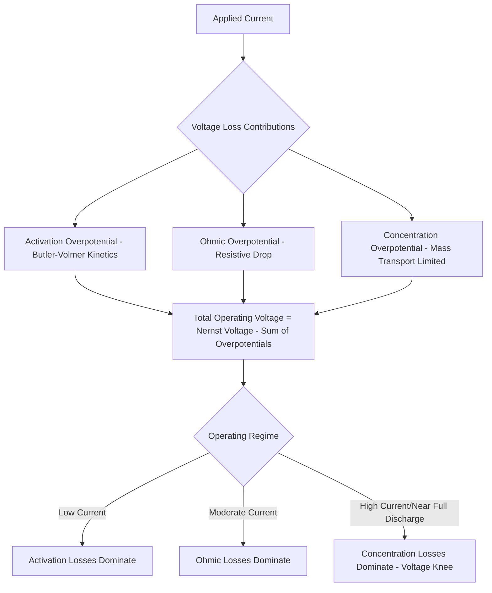

## Battery Fundamentals and Electrochemistry

### Overview

Batteries convert chemical energy into electrical energy through spontaneous reduction-oxidation (redox) reactions occurring at spatially separated electrodes, with ion transport through an electrolyte and electron transport through an external circuit completing the electrochemical cell. Understanding battery behavior—voltage, capacity, energy/power density, and degradation—requires grounding in the thermodynamics and kinetics governing these coupled electron- and ion-transfer processes, which together determine why different battery chemistries exhibit fundamentally different performance envelopes and failure modes.

### Basic Electrochemical Cell Architecture

**Core Components**

- **Anode (negative electrode)**: undergoes oxidation during discharge, releasing electrons to the external circuit. In common rechargeable systems, this is the electrode from which the working ion (e.g., Li⁺) is extracted during discharge.
- **Cathode (positive electrode)**: undergoes reduction during discharge, accepting electrons from the external circuit and incorporating the working ion.
- **Electrolyte**: ionically conductive but electronically insulating medium enabling ion transport between electrodes while forcing electrons through the external circuit.
- **Separator**: physically isolates anode and cathode to prevent internal short-circuiting while remaining permeable to ion transport (typically a porous polymer membrane in liquid-electrolyte systems).

**[Inference]** Common usage often labels the negative electrode "anode" and positive electrode "cathode" throughout both charge and discharge for simplicity, even though formal electrochemical convention defines anode/cathode by the direction of current oxidation/reduction is occurring—strictly, the electrode roles swap during charging versus discharging. This convention varies across textbooks and industry usage, so context should clarify which definition is in use.

### Thermodynamics: Cell Voltage and Gibbs Free Energy

**Standard Cell Potential**

The theoretical open-circuit voltage of a cell derives from the difference in standard reduction potentials of the cathode and anode half-reactions:

$$E^\circ_{cell} = E^\circ_{cathode} - E^\circ_{anode}$$

This relates directly to the Gibbs free energy change of the overall cell reaction:

$$\Delta G^\circ = -nFE^\circ_{cell}$$

where $n$ is the number of electrons transferred per formula unit of reaction, and $F$ is Faraday's constant (96,485 C/mol). A more negative $\Delta G^\circ$ (more spontaneous reaction) corresponds to higher cell voltage.

**Nernst Equation**

Actual cell voltage under non-standard conditions (concentration, temperature deviating from standard state) is given by:

$$E = E^\circ - \frac{RT}{nF}\ln Q$$

where $R$ is the gas constant, $T$ is absolute temperature, and $Q$ is the reaction quotient. This equation explains why measured open-circuit voltage varies with state of charge (as reactant/product concentrations at the electrodes change) rather than remaining perfectly constant across the discharge curve.

### Capacity, Energy, and Power Metrics

**Theoretical vs. Practical Capacity**

Theoretical specific capacity (mAh/g) is calculated from Faraday's law based on the molar mass and number of electrons transferred per formula unit of active material:

$$C_{theoretical} = \frac{nF}{3.6 \times M}$$

where $M$ is molar mass (g/mol) and the factor 3.6 converts coulombs/gram to mAh/g. Practical capacity is invariably lower than theoretical due to incomplete utilization of active material, side reactions, and kinetic limitations, typically expressed as a percentage of theoretical value achieved under specified test conditions (current rate, voltage cutoffs, temperature).

**Energy and Power Density**

- **Gravimetric energy density** (Wh/kg): total energy per unit mass, calculated as the integral of voltage over capacity delivered, critically important for weight-sensitive applications (portable electronics, electric vehicles, aerospace).
- **Volumetric energy density** (Wh/L): total energy per unit volume, often the limiting design constraint for space-constrained applications.
- **Power density** (W/kg or W/L): rate of energy delivery capability, governed primarily by internal resistance and reaction kinetics rather than total energy content—a battery can have high energy density but poor power density if ion/electron transport is kinetically limited.

**C-Rate**

A normalized measure of charge/discharge current relative to nominal capacity: a "1C" rate fully charges or discharges a cell in 1 hour, while "2C" does so in 30 minutes and "C/10" in 10 hours. Higher C-rates generally reduce achievable capacity (due to kinetic and resistive losses) and accelerate certain degradation mechanisms.

### Electrode Kinetics and Overpotential

**Sources of Voltage Loss (Overpotential)**

Actual operating voltage deviates from the thermodynamic (Nernst) voltage due to several loss mechanisms, becoming more significant at higher current:

- **Activation overpotential**: energy barrier for the charge-transfer reaction at the electrode-electrolyte interface, described by the Butler-Volmer equation relating current density to overpotential.
- **Ohmic overpotential**: resistive voltage drop through electrolyte, electrode, and current collector materials, scaling linearly with current (Ohm's law).
- **Concentration (mass-transport) overpotential**: arises when ion diffusion to/from the electrode surface cannot keep pace with reaction rate, becoming dominant at high current density and causing the characteristic voltage "knee" observed near full discharge.

**Butler-Volmer Equation**

Describes the relationship between net current density $j$ and activation overpotential $\eta$:

$$j = j_0\left[\exp\left(\frac{\alpha_a F \eta}{RT}\right) - \exp\left(\frac{-\alpha_c F \eta}{RT}\right)\right]$$

where $j_0$ is exchange current density (a measure of intrinsic reaction kinetics at equilibrium) and $\alpha_a$, $\alpha_c$ are anodic/cathodic charge-transfer coefficients. Higher exchange current density indicates faster intrinsic electrode kinetics and lower activation overpotential at a given current.

### Solid Electrolyte Interphase (SEI) and Interfacial Chemistry

In many practical battery systems (most notably lithium-ion), the electrolyte is thermodynamically unstable against the anode material at typical operating potentials. A passivating layer—the **solid electrolyte interphase (SEI)**—forms from electrolyte decomposition products on first charge, ideally becoming electronically insulating (preventing further electrolyte decomposition) while remaining ionically conductive (allowing continued Li⁺ transport). SEI formation consumes active lithium and electrolyte irreversibly, contributing to initial "formation cycle" capacity loss, and SEI stability/composition strongly influences long-term cycling performance, calendar life, and safety behavior.

**[Inference]** SEI composition and structure are highly sensitive to electrolyte formulation, additives, temperature, and cycling history, making SEI behavior difficult to fully predict from first principles alone—this is why electrolyte additive development remains substantially empirical/iterative in battery research and commercial cell development rather than purely computationally designed.

### Degradation Mechanisms

**Capacity Fade**

- **Loss of lithium inventory (LLI)**: irreversible consumption of cyclable lithium via continued SEI growth, lithium plating, or side reactions.
- **Loss of active material (LAM)**: physical/structural degradation of electrode material (particle cracking from repeated volume expansion/contraction, dissolution, phase transformation) reducing available capacity independent of lithium inventory.

**Power Fade**

Increase in internal resistance over cycling/calendar life, arising from SEI thickening, electrode-electrolyte interface degradation, or loss of electrical contact within the composite electrode (particle isolation from binder/conductive additive degradation).

**Lithium Plating**

Under certain conditions (low temperature, high charge rate, or over-charging), lithium metal can deposit on the anode surface rather than intercalating properly, representing both a capacity-loss mechanism and, more critically, a safety hazard, since plated lithium (especially dendritic morphology) can penetrate the separator and cause internal short-circuiting.

### Battery Reaction and Overpotential Relationship

### Discharge Curve and Overpotential Regions (svg_diagram)

<svg xmlns="http://www.w3.org/2000/svg" viewBox="0 0 700 380" font-family="Arial, sans-serif">
<text x="350" y="25" text-anchor="middle" font-size="16" font-weight="bold">Voltage vs. Capacity Discharge Curve (svg_diagram)</text>
<line x1="80" y1="320" x2="640" y2="320" stroke="black" stroke-width="1.5" />
<text x="360" y="350" text-anchor="middle" font-size="12">Capacity Delivered</text>
<line x1="80" y1="320" x2="80" y2="60" stroke="black" stroke-width="1.5" />
<text x="40" y="190" text-anchor="middle" font-size="12" transform="rotate(-90 40,190)">Voltage</text>
<line x1="80" y1="80" x2="640" y2="80" stroke="#aaa" stroke-width="1" stroke-dasharray="4,3" />
<text x="600" y="72" font-size="10" fill="#aaa">Thermodynamic (Nernst) Voltage</text>
<path d="M80,110 Q120,160 200,175 L480,180 Q560,190 620,280 L630,310" stroke="#2c5f8a" stroke-width="3" fill="none" />

<text x="120" y="145" font-size="10">Activation drop</text>

<line x1="90" y1="110" x2="90" y2="160" stroke="`#e74c3c`" stroke-width="2" />

<text x="330" y="165" font-size="10">Ohmic (linear) region</text>

<text x="570" y="250" font-size="10">Concentration</text>

<text x="570" y="263" font-size="10">polarization "knee"</text>

</svg>

### Practical Example: Calculating Theoretical Specific Capacity

For a cathode material with formula LiCoO₂ (molar mass ≈ 97.87 g/mol), assuming one electron transferred per formula unit (Li⁺ extraction):

$$C_{theoretical} = \frac{1 \times 96485}{3.6 \times 97.87} \approx \frac{96485}{352.3} \approx 274 \text{ mAh/g}$$

In practice, only about half of the lithium in LiCoO₂ can be reversibly extracted without destabilizing the layered oxide structure (corresponding to roughly $Li_{0.5}CoO_2$), giving a practical capacity closer to 140 mAh/g—illustrating why theoretical capacity values, while useful for comparing material classes, substantially overstate achievable practical performance and should not be used directly for cell-level energy density design calculations.

### Key Points

- Cell voltage originates from the Gibbs free energy difference of the electrode redox couples, with the Nernst equation explaining state-of-charge-dependent voltage variation.
- Practical capacity is consistently lower than Faraday's-law-derived theoretical capacity due to incomplete material utilization and structural stability limits.
- Overpotential (activation, ohmic, concentration) explains why real cell voltage under load deviates from thermodynamic voltage, with each mechanism dominating at different current regimes.
- SEI formation is central to lithium-ion battery function and degradation, consuming lithium irreversibly while enabling long-term interfacial stability when well-formed.
- Capacity fade and power fade arise from distinct underlying mechanisms (lithium inventory loss vs. active material loss vs. resistance growth), important for degradation diagnosis and mitigation strategy selection.

### Related Topics

- Lithium-Ion Battery Cathode Materials: Layered Oxides, Spinels, and Olivines
- Solid Electrolyte Interphase Formation and Electrolyte Additive Engineering
- Electrochemical Impedance Spectroscopy for Battery Characterization
- Fast-Charging Limitations and Lithium Plating Mitigation
- Solid-State Battery Electrolytes and Interfacial Challenges
- Battery Management Systems and State-of-Charge Estimation Algorithms