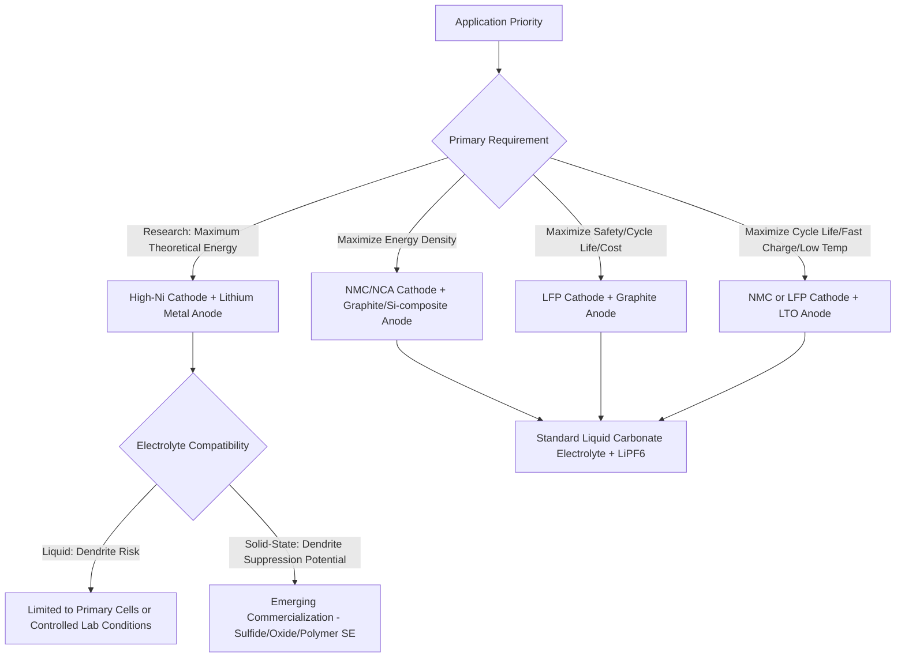

## Lithium Ion Battery Materials

### Overview

Lithium-ion battery performance—energy density, power capability, cycle life, safety, and cost—is fundamentally determined by the choice of cathode, anode, electrolyte, and supporting materials (separator, current collectors, binders). No single material system optimizes all performance metrics simultaneously, so commercial cell design represents an application-specific trade-off among these material classes, each with distinct crystal structures, lithium intercalation mechanisms, and degradation pathways.

### Cathode Materials

**Layered Oxides**

- **LiCoO₂ (LCO)**: the original commercialized Li-ion cathode (Sony, 1991), layered α-NaFeO₂-type structure (R-3m space group) with Li⁺ occupying interlayer sites between CoO₂ sheets. High volumetric energy density and good cycling stability at low rates, but limited practical capacity (~140 mAh/g, roughly half the theoretical value due to structural instability upon deep delithiation), cobalt cost/supply concerns, and thermal instability at high states of charge. Remains dominant in consumer electronics where volumetric energy density is prioritized over cost.
- **LiNiₓMnᵧCo_zO₂ (NMC)**: a solid-solution layered oxide family where Ni, Mn, and Co partially substitute for Co in the LCO structure, with composition tuned to balance capacity, stability, and cost. Common variants include NMC111 (equal Ni:Mn:Co), NMC622, and NMC811 (increasingly Ni-rich to boost capacity and reduce cobalt content). Higher nickel content increases capacity (Ni redox contributes more capacity than Co or Mn) but generally reduces thermal stability and cycle life, requiring more sophisticated surface coating and doping strategies to manage.
- **LiNiₓCoᵧAl_zO₂ (NCA)**: similar layered structure with aluminum substitution providing structural stabilization; historically used by Tesla/Panasonic for high energy density automotive applications.

**Spinel**

- **LiMn₂O₄ (LMO)**: cubic spinel structure (Fd-3m) with 3-D lithium diffusion pathways enabling good rate capability and inherently better thermal stability than layered oxides, but lower capacity (~100-120 mAh/g) and susceptibility to manganese dissolution (particularly at elevated temperature), which migrates to and degrades the anode SEI. Often blended with NMC in commercial cells to balance rate capability and energy density.

**Polyanion Compounds**

- **LiFePO₄ (LFP)**: olivine structure (Pnma space group) with strong P-O covalent bonding providing excellent thermal stability and safety (oxygen release resistance far superior to layered oxides), long cycle life, and low cost (no cobalt or nickel), at the expense of lower voltage (~3.4 V vs. Li/Li⁺, versus ~3.7-3.9 V for NMC/LCO) and lower volumetric energy density due to lower material density and inherently lower electronic conductivity (requiring carbon coating and nanoscale particle size to achieve practical rate performance). LFP has seen substantial commercial resurgence, particularly in electric vehicles and stationary storage, driven by cost, safety, and cycle-life advantages outweighing its lower energy density for many applications.
- **LiMnPO₄ / LiMnFePO₄ (LMFP)**: manganese-substituted olivine variants offering higher voltage than LFP while retaining much of its safety profile, an area of active commercial development.

### Anode Materials

**Graphite**

The dominant commercial anode material, a layered sp²-carbon structure that reversibly intercalates lithium between graphene layers, forming staged intercalation compounds (LiC₆ as the fully lithiated stage-1 compound, giving theoretical capacity ≈372 mAh/g). Graphite offers low and flat delithiation potential (~0.1-0.2 V vs. Li/Li⁺, maximizing full-cell voltage), good cycling stability, and low cost, but its relatively low theoretical capacity constrains cell-level energy density improvement, and its operating potential is close enough to lithium plating onset that fast charging and low-temperature charging require careful management.

**Silicon and Silicon-Composite Anodes**

Silicon offers dramatically higher theoretical capacity (~3579 mAh/g for Li₁₅Si₄, roughly 10x graphite) via an alloying mechanism (Si + xLi⁺ + xe⁻ → LiₓSi) rather than intercalation, but undergoes severe volumetric expansion (up to ~300%) during lithiation, causing particle pulverization, continuous SEI reformation, and rapid capacity fade in pure silicon anodes. Commercial implementation typically uses silicon-graphite composite anodes (silicon as a minority additive, often <10-15 wt%) or engineered silicon nanostructures (nanowires, porous silicon, silicon-carbon core-shell architectures) to manage volume expansion while capturing partial capacity benefit—an active area of materials engineering rather than a fully mature, uniformly implemented solution across the industry.

**Lithium Titanate (LTO, Li₄Ti₅O₁₂)**

A "zero-strain" spinel anode with negligible volume change during lithiation, providing exceptional cycle life and excellent fast-charge/low-temperature performance, at a significantly higher operating potential (~1.55 V vs. Li/Li⁺) than graphite, which sacrifices full-cell voltage and energy density. Used in applications prioritizing cycle life and safety over energy density (grid storage, some transit/heavy-duty applications).

**Lithium Metal**

The theoretical ultimate anode (3860 mAh/g, lowest possible potential), used directly in emerging lithium-metal battery architectures, but subject to dendritic growth during cycling in conventional liquid electrolytes, presenting significant safety challenges that have historically prevented widespread commercialization outside primary (non-rechargeable) cells; solid-state electrolyte development is substantially motivated by the prospect of safely enabling lithium metal anodes.

### Electrolyte Systems

**Liquid Electrolytes**

Conventional Li-ion cells use a lithium salt (most commonly LiPF₆, chosen for its favorable conductivity-stability balance despite moisture sensitivity and thermal decomposition concerns) dissolved in a mixture of cyclic and linear carbonate solvents (ethylene carbonate, EC, providing good SEI-forming properties; combined with lower-viscosity linear carbonates like dimethyl carbonate, DMC, or ethyl methyl carbonate, EMC, to improve ionic conductivity and low-temperature performance). Electrolyte additives (vinylene carbonate, fluoroethylene carbonate, and others) are used in small quantities to tailor SEI composition and improve cycling/safety performance—an area of substantial proprietary formulation development across cell manufacturers.

**Solid-State Electrolytes**

An active research and emerging-commercialization area, replacing liquid electrolyte with a solid ionic conductor to potentially enable lithium metal anodes and eliminate flammable liquid electrolyte-related safety risk:

- **Sulfide-based** (e.g., Li₆PS₅Cl argyrodite, Li₁₀GeP₂S₁₂): generally offer the highest room-temperature ionic conductivity among solid electrolyte classes (in some cases comparable to liquid electrolytes), but are chemically unstable in ambient air/moisture and require careful interface engineering against both lithium metal and oxide cathodes.
- **Oxide-based** (e.g., garnet-type Li₇La₃Zr₂O₁₂, LLZO): good chemical/electrochemical stability but generally lower ionic conductivity than sulfides and require high-temperature sintering for dense pellet fabrication, complicating manufacturing integration.
- **Polymer-based** (e.g., PEO-lithium salt complexes): mechanically flexible and easier to process into thin films, but typically exhibit low ionic conductivity at room temperature, generally requiring elevated operating temperature for practical performance.

**[Inference]** Solid-state electrolyte commercialization timelines and which chemistry class will achieve dominant market position remain genuinely uncertain and subject to rapid change as of any given point in time, given the significant manufacturing scale-up and interfacial engineering challenges that remain only partially resolved across all candidate systems—claims of near-term (1-2 year) mass-market solid-state EV batteries should be treated with appropriate skepticism pending independent verification of announced production milestones.

### Supporting Materials

**Separators**: typically microporous polyolefin films (polyethylene, polypropylene, or trilayer PP/PE/PP combinations), sometimes ceramic-coated to improve thermal stability and reduce shrinkage risk at elevated temperature (a contributor to internal short-circuit safety events).

**Current Collectors**: copper foil for the anode (stable against lithium's low reduction potential) and aluminum foil for the cathode (stable against oxidative cathode potentials but would alloy destructively with lithium at anode potentials, explaining why the two metals are not interchangeable between electrodes).

**Binders**: polyvinylidene fluoride (PVDF) has been the traditional binder for both electrodes; silicon-containing anodes increasingly use water-processable binders (e.g., carboxymethyl cellulose/styrene-butadiene rubber, CMC/SBR, or polyacrylic acid-based binders) offering better mechanical resilience against silicon's large volume changes.

### Material Class Comparison Matrix

| Material | Type | Specific Capacity | Voltage vs Li/Li⁺ | Key Trade-off |
| --- | --- | --- | --- | --- |
| LCO | Cathode | ~140 mAh/g (practical) | ~3.9 V | High energy density, cost/thermal concerns |
| NMC811 | Cathode | ~200 mAh/g (practical) | ~3.7 V | High capacity, stability challenges |
| LFP | Cathode | ~150-160 mAh/g | ~3.4 V | Safety/cost/cycle life, lower energy density |
| LMO | Cathode | ~100-120 mAh/g | ~4.0 V | Rate capability, Mn dissolution |
| Graphite | Anode | ~360-370 mAh/g | ~0.1-0.2 V | Established, capacity-limited |
| Silicon composite | Anode | Variable (blend-dependent) | ~0.4 V (alloying) | High capacity, expansion/fade |
| LTO | Anode | ~170 mAh/g | ~1.55 V | Exceptional cycle life, lower energy density |

### Cathode-Anode Pairing Decision Logic

### Layered Oxide vs. Olivine Crystal Structure Schematic (svg_diagram)

<svg xmlns="http://www.w3.org/2000/svg" viewBox="0 0 740 360" font-family="Arial, sans-serif">
<text x="370" y="25" text-anchor="middle" font-size="16" font-weight="bold">Cathode Crystal Structure Comparison (svg_diagram)</text>

<text x="180" y="55" text-anchor="middle" font-size="13" font-weight="bold">Layered Oxide (LCO/NMC)</text>

<g>

<rect x="80" y="80" width="200" height="18" fill="`#2c5f8a`" />

<rect x="80" y="108" width="200" height="10" fill="`#f1c40f`" />

<rect x="80" y="128" width="200" height="18" fill="`#2c5f8a`" />

<rect x="80" y="156" width="200" height="10" fill="`#f1c40f`" />

<rect x="80" y="176" width="200" height="18" fill="`#2c5f8a`" />

</g>

<text x="180" y="215" text-anchor="middle" font-size="10">TMO2 sheets (blue) / Li layer (yellow)</text>

<text x="180" y="230" text-anchor="middle" font-size="10">2-D Li diffusion, layered planes</text>

<text x="560" y="55" text-anchor="middle" font-size="13" font-weight="bold">Olivine (LFP)</text>

<g fill="`#2ecc71`" stroke="`#1a7a3a`">

<rect x="470" y="90" width="30" height="30" />

<rect x="520" y="90" width="30" height="30" />

<rect x="570" y="90" width="30" height="30" />

<rect x="620" y="90" width="30" height="30" />

<rect x="470" y="140" width="30" height="30" />

<rect x="520" y="140" width="30" height="30" />

<rect x="570" y="140" width="30" height="30" />

<rect x="620" y="140" width="30" height="30" />

</g>

<line x1="485" y1="105" x2="485" y2="155" stroke="`#c0392b`" stroke-width="3" />

<line x1="535" y1="105" x2="535" y2="155" stroke="`#c0392b`" stroke-width="3" />

<line x1="585" y1="105" x2="585" y2="155" stroke="`#c0392b`" stroke-width="3" />

<line x1="635" y1="105" x2="635" y2="155" stroke="`#c0392b`" stroke-width="3" />

<text x="550" y="215" text-anchor="middle" font-size="10">FePO4 framework (green) / Li 1-D channels (red)</text>

<text x="550" y="230" text-anchor="middle" font-size="10">1-D Li diffusion, strong P-O bonding</text>

</svg>

### Practical Example: Estimating Full-Cell Voltage from Material Pairing

For a cell pairing an NMC622 cathode (~3.7 V vs. Li/Li⁺, average) with a graphite anode (~0.1 V vs. Li/Li⁺, average), the nominal full-cell voltage is:

$$V_{cell} = V_{cathode} - V_{anode} = 3.7 - 0.1 = 3.6 \text{ V}$$

Substituting an LTO anode (~1.55 V vs. Li/Li⁺) instead, with the same NMC622 cathode:

$$V_{cell} = 3.7 - 1.55 = 2.15 \text{ V}$$

This roughly 40% voltage reduction directly reduces cell-level energy density (energy ∝ voltage × capacity) despite LTO's excellent cycling characteristics—concretely illustrating why LTO cells, despite superior cycle life, are not used in energy-density-prioritized applications like consumer electronics or long-range EVs, and are instead reserved for applications where cycle life and fast-charge tolerance outweigh energy density.

### Key Points

- No single cathode or anode material dominates across all performance dimensions; NMC/NCA prioritize energy density, LFP prioritizes safety/cost/cycle-life, and LMO/LTO prioritize rate capability or cycle life at an energy-density cost.
- Graphite remains the dominant commercial anode due to its stability and cost, while silicon incorporation (as a composite minority component) is the primary near-term pathway to meaningful anode capacity improvement.
- Solid-state electrolytes are pursued largely to enable safe lithium-metal anode use, but each candidate chemistry class (sulfide, oxide, polymer) carries distinct unresolved trade-offs in conductivity, stability, and manufacturability.
- Current collector material choice (Cu anode / Al cathode) is dictated by electrochemical stability windows, not interchangeable by convenience.
- Full-cell voltage and energy density depend on the paired anode-cathode potential difference, not cathode material alone—anode selection materially affects achievable energy density even when cathode chemistry is held constant.

### Related Topics

- Solid-State Electrolyte Interfacial Engineering and Manufacturing Scale-Up
- Silicon Anode Volume Expansion Mitigation Strategies
- Cobalt-Free and Nickel-Rich Cathode Development Trends
- Electrolyte Additive Chemistry and SEI Tailoring
- Battery Recycling and Critical Material Recovery (Li, Co, Ni)
- Fast-Charging Protocols and Lithium Plating Risk in Graphite Anodes