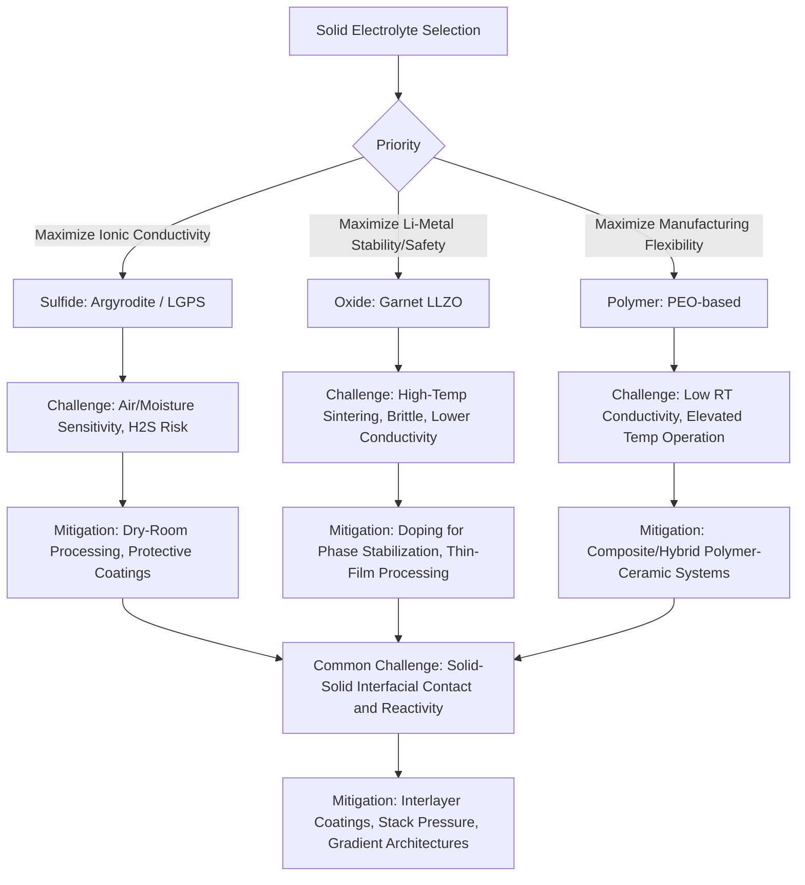

## Solid State Battery Materials

### Overview

Solid-state batteries replace the conventional liquid or gel electrolyte with a solid ionic conductor, motivated primarily by two potential advantages: elimination of flammable liquid electrolyte (addressing a major safety limitation of conventional Li-ion cells) and enablement of lithium metal anodes (which liquid electrolytes cannot safely support due to dendritic growth), potentially unlocking substantially higher energy density. Realizing these advantages in practice requires solid electrolyte materials that simultaneously achieve high ionic conductivity, wide electrochemical stability windows, mechanical robustness against dendrite penetration, and manufacturable interfaces with both electrodes—a combination no single material system has yet fully achieved, making solid electrolyte selection an exercise in navigating distinct trade-off profiles rather than identifying a clearly superior option.

### Why Solid Electrolytes: Motivation and Fundamental Requirements

**Dendrite Suppression Rationale**

In liquid-electrolyte cells, lithium metal anodes suffer from non-uniform lithium deposition during charging, forming dendritic (needle-like) structures that can grow through the porous separator and cause internal short circuits—a primary reason lithium metal anodes have not been broadly commercialized with liquid electrolytes outside primary cells. A sufficiently rigid solid electrolyte was theoretically proposed (via the Monroe-Newman mechanical stability criterion) to mechanically suppress dendrite penetration if its shear modulus exceeds roughly twice that of lithium metal. **[Inference]** Experimental results across multiple solid electrolyte systems have shown that dendrite/lithium filament formation still occurs even in nominally rigid solid electrolytes—propagating through grain boundaries, pores, and microstructural defects—indicating that mechanical rigidity alone is an incomplete predictor of dendrite suppression, and that interfacial microstructure quality is at least as important as bulk modulus.

**Key Performance Requirements**

- **Ionic conductivity**: ideally approaching or exceeding liquid electrolyte performance (~10⁻² S/cm) to avoid unacceptable power density penalties; many solid electrolyte candidates fall meaningfully short of this benchmark.
- **Electronic insulation**: must remain electronically insulating (unlike ionic conductivity, near-zero electronic conductivity) to prevent internal self-discharge and short-circuiting.
- **Electrochemical stability window**: must remain stable against both the reducing potential of the anode (especially critical for lithium metal) and the oxidizing potential of high-voltage cathodes.
- **Mechanical and interfacial properties**: sufficient toughness to resist crack propagation and to maintain intimate, low-resistance contact with electrode particles despite volume changes during cycling.

### Sulfide-Based Solid Electrolytes

**Representative Materials**

Argyrodite-type (Li₆PS₅Cl, Li₆PS₅Br) and thio-LISICON-related compounds (Li₁₀GeP₂S₁₂, LGPS) represent the highest-conductivity solid electrolyte class identified to date, with some formulations reported to match or exceed liquid electrolyte ionic conductivity (on the order of 10⁻² S/cm at room temperature).

**Advantages**

- Highest room-temperature ionic conductivity among major solid electrolyte classes, driven by highly polarizable sulfide anion frameworks that create low-energy-barrier lithium diffusion pathways.
- Relatively soft/deformable mechanically compared to oxide ceramics, enabling better interfacial contact formation under moderate stack pressure (cold-pressing rather than requiring high-temperature sintering).

**Challenges**

- **Air/moisture sensitivity**: sulfide electrolytes react with ambient moisture to generate toxic hydrogen sulfide (H₂S) gas, necessitating dry-room or inert-atmosphere processing throughout cell manufacturing—a substantial manufacturing infrastructure and cost consideration.
- **Narrow electrochemical stability window**: many sulfide electrolytes are thermodynamically unstable against both high-voltage oxide cathodes and lithium metal, requiring protective interlayer coatings (e.g., LiNbO₃ coating on cathode particles) to prevent continuous interfacial decomposition and impedance growth.
- **Germanium cost** (for LGPS-type compositions) has motivated exploration of germanium-free sulfide compositions for cost reduction.

### Oxide-Based Solid Electrolytes

**Garnet-Type (LLZO Family)**

Li₇La₃Zr₂O₁₂ (LLZO) and doped variants (e.g., Al- or Ta-doped LLZO, stabilizing the higher-conductivity cubic phase over the lower-conductivity tetragonal phase) represent the most widely studied oxide solid electrolyte, offering good chemical stability against lithium metal (a notable advantage over most sulfides) and wide electrochemical stability window.

**Advantages**

- Good electrochemical and chemical stability, including relatively favorable (though not perfect) stability against lithium metal anodes.
- Non-toxic decomposition behavior compared to sulfide H₂S generation risk.

**Challenges**

- **Lower ionic conductivity** than leading sulfides (typically ~10⁻⁴ to 10⁻³ S/cm at room temperature for optimized compositions), constraining rate capability.
- **High-temperature sintering requirement** (often >1000°C) to achieve dense, low-grain-boundary-resistance pellets, complicating integration with temperature-sensitive cathode materials and increasing manufacturing energy cost.
- **Brittle mechanical behavior** typical of ceramic oxides, making thin-film processing and mechanical durability under cell assembly/cycling stress more challenging than with softer sulfide or polymer electrolytes.
- Despite favorable bulk stability against lithium, lithium filament penetration through grain boundaries and pores remains an observed failure mode, consistent with the broader dendrite-suppression caveat noted above.

**Other Oxide Systems**

NASICON-type (Li₁.₃Al₀.₃Ti₁.₇(PO₄)₃, LATP) and perovskite-type (Li₃ₓLa₂/₃₋ₓTiO₃, LLTO) oxide electrolytes offer alternative conductivity/stability trade-off profiles, though LATP's titanium is generally reduced by direct contact with lithium metal, limiting its use to configurations with a protective interlayer or non-lithium-metal anode pairing.

### Polymer-Based Solid Electrolytes

**Representative Systems**

Polyethylene oxide (PEO) complexed with a lithium salt (e.g., LiTFSI) is the most extensively studied polymer solid electrolyte, where lithium ion transport occurs via coordination with PEO's ether oxygen atoms and segmental polymer chain motion, rather than through a rigid crystalline ion-conduction pathway as in ceramic electrolytes.

**Advantages**

- Mechanically flexible and readily processed into thin films via conventional polymer processing/coating techniques, offering manufacturing compatibility advantages over brittle ceramics.
- Generally better interfacial contact conformability against electrode particles and lithium metal (soft contact, reduced interfacial void formation) compared to rigid ceramics.

**Challenges**

- **Low room-temperature ionic conductivity** (often several orders of magnitude below sulfides/leading oxides), since PEO segmental motion—the primary conduction mechanism—requires the amorphous polymer state, which is favored at elevated temperature; PEO-based cells often require operation above ~60°C for practical conductivity, limiting standalone applicability for many consumer/automotive use cases without supplementary heating.
- Narrower electrochemical stability window against high-voltage cathodes than some ceramic alternatives.

**Composite/Hybrid Approaches**

Combining polymer and ceramic (or sulfide) components—polymer-in-ceramic or ceramic-in-polymer composite electrolytes—is an active research direction seeking to combine ceramic conductivity/stability with polymer processability and interfacial conformability; **[Speculation]** whether such hybrid approaches will achieve a commercially viable balance superior to optimized single-phase systems, or whether they primarily add manufacturing complexity without proportional performance benefit, remains genuinely unresolved and is likely to depend heavily on the specific composite architecture and interface engineering achieved by a given developer.

### Interfacial Challenges: The Central Engineering Problem

Across all solid electrolyte classes, the solid-solid interfaces (electrolyte-cathode and electrolyte-anode) present the dominant practical engineering challenge, distinct from bulk electrolyte conductivity:

**Contact Loss and Void Formation**

Unlike liquid electrolytes, which conformally wet electrode surfaces, solid-solid contact is inherently imperfect at the microstructural level; volume changes during cycling (particularly pronounced for silicon or lithium metal anodes and for cathode materials undergoing structural change on delithiation) can open interfacial voids, increasing impedance and creating localized current concentration that promotes further degradation.

**Interfacial Chemical Reactivity**

Many solid electrolytes are thermodynamically unstable in direct contact with high-voltage cathode materials or lithium metal, forming interfacial decomposition layers (space-charge layers, resistive interphases) analogous to but often less favorable than the SEI formed in liquid-electrolyte systems—since these interphases are frequently poor ionic conductors and lack the self-limiting passivation behavior of a well-formed conventional SEI.

**Mitigation Strategies**

- Thin protective coatings on cathode particles (e.g., LiNbO₃, Li₃PO₄) to physically and chemically buffer electrolyte-cathode reactivity.
- Applied external stack pressure during cycling to maintain mechanical contact and suppress void formation, though this introduces additional cell/pack engineering complexity not required in conventional liquid-electrolyte pouch or cylindrical cells.
- Interlayer or gradient-composition electrolyte architectures pairing a lithium-metal-stable electrolyte layer against the anode with a cathode-stable (often higher-conductivity) electrolyte layer against the cathode.

### Manufacturing and Scale-Up Considerations

**[Unverified]** Solid-state battery manufacturing readiness varies substantially by developer and chemistry class, with multiple companies and research groups reporting differing timelines and technology readiness levels; because this is a rapidly evolving commercial landscape, current production status, announced capacity, and specific performance claims from any named company should be verified against recent, dated sources rather than treated as settled fact, since public claims in this space have historically outpaced independently verified mass-production milestones.

General manufacturing challenges distinct from conventional liquid-electrolyte cell production include: dry-room or inert-atmosphere requirements (particularly acute for sulfides), high-temperature sintering steps (for oxide ceramics) incompatible with standard roll-to-roll electrode coating lines, and the need for applied stack pressure during formation and potentially throughout cell life, which affects pack-level mechanical design.

### Solid Electrolyte Class Comparison

### Solid-State Cell Architecture and Interface Zones (svg_diagram)

<svg xmlns="http://www.w3.org/2000/svg" viewBox="0 0 700 380" font-family="Arial, sans-serif">
<text x="350" y="25" text-anchor="middle" font-size="16" font-weight="bold">Solid-State Cell Cross-Section (svg_diagram)</text>
<rect x="150" y="70" width="400" height="40" fill="#c0392b" stroke="#7a2318" />
<text x="350" y="95" text-anchor="middle" font-size="12" fill="white">Cathode (e.g., NMC composite)</text>
<rect x="150" y="110" width="400" height="15" fill="#e67e22" stroke="#a85a15" />
<text x="350" y="122" text-anchor="middle" font-size="9" fill="white">Protective Interlayer (e.g., LiNbO3)</text>
<rect x="150" y="125" width="400" height="90" fill="#2c5f8a" stroke="#1a3a54" />
<text x="350" y="175" text-anchor="middle" font-size="13" fill="white" font-weight="bold">Solid Electrolyte</text>
<text x="350" y="195" text-anchor="middle" font-size="10" fill="white">(Sulfide / Oxide / Polymer)</text>
<rect x="150" y="215" width="400" height="15" fill="#8e44ad" stroke="#5e2d73" />
<text x="350" y="227" text-anchor="middle" font-size="9" fill="white">Interfacial Reaction/SEI-like Layer</text>
<rect x="150" y="230" width="400" height="50" fill="#7f8c8d" stroke="#555" />
<text x="350" y="260" text-anchor="middle" font-size="12" fill="white">Lithium Metal Anode</text>
<path d="M280,230 L280,215 M320,225 L320,210 M400,230 L400,212" stroke="#f1c40f" stroke-width="2" stroke-dasharray="2,2" />
<text x="350" y="310" text-anchor="middle" font-size="10">Yellow marks: potential dendrite/filament</text>
<text x="350" y="325" text-anchor="middle" font-size="10">nucleation sites at grain boundaries/defects</text>
</svg>

### Practical Example: Comparing Conductivity-Driven Cell Design Implications

Consider two candidate solid electrolytes for a given cell design: a sulfide (Li₆PS₅Cl, ~10⁻³ to 10⁻² S/cm) versus a garnet oxide (doped LLZO, ~10⁻⁴ to 10⁻³ S/cm). For a target electrolyte layer thickness of 50 µm, the ohmic area-specific resistance (ASR) scales as thickness divided by conductivity:

$$ASR = \frac{t}{\sigma}$$

For sulfide at $\sigma = 5\times10^{-3}$ S/cm: $ASR \approx \frac{50\times10^{-4}\text{ cm}}{5\times10^{-3}\text{ S/cm}} = 1 \text{ Ω·cm}^2$

For garnet at $\sigma = 5\times10^{-4}$ S/cm: $ASR \approx \frac{50\times10^{-4}\text{ cm}}{5\times10^{-4}\text{ S/cm}} = 10 \text{ Ω·cm}^2$

This order-of-magnitude ASR difference directly impacts achievable power density and fast-charge capability at equivalent electrolyte thickness, illustrating why garnet-based cells often require thinner electrolyte layers (increasing manufacturing difficulty and short-circuit risk) or accept reduced rate performance relative to sulfide-based designs to remain commercially competitive—concretely showing why the "best" solid electrolyte choice depends on which performance dimension a given application prioritizes.

### Key Points

- No solid electrolyte class simultaneously achieves the best conductivity, stability, and manufacturability—sulfides lead in conductivity but suffer air sensitivity, oxides offer better lithium-metal stability but require high-temperature processing, and polymers offer manufacturing flexibility but poor room-temperature conductivity.
- Mechanical rigidity alone does not guarantee dendrite suppression; lithium filament propagation through grain boundaries and defects remains an observed challenge across solid electrolyte classes.
- Solid-solid interfacial contact and reactivity, not bulk electrolyte conductivity alone, represent the central unresolved engineering challenge across the field.
- Manufacturing infrastructure requirements differ substantially by electrolyte class (dry-room processing for sulfides, high-temperature sintering for oxides), directly affecting scale-up cost and complexity.
- Public claims regarding solid-state battery commercialization timelines vary widely across developers and should be verified against current, dated sources given the field's rapid and evolving state.

### Related Topics

- Monroe-Newman Mechanical Stability Criterion for Dendrite Suppression
- Interfacial Coating Strategies for Sulfide-Cathode Compatibility
- Garnet Electrolyte Doping and Cubic Phase Stabilization
- Composite Polymer-Ceramic Electrolyte Architectures
- Stack Pressure Engineering in Solid-State Cell Pack Design
- Lithium Metal Anode Interfacial Behavior in Solid-State Systems