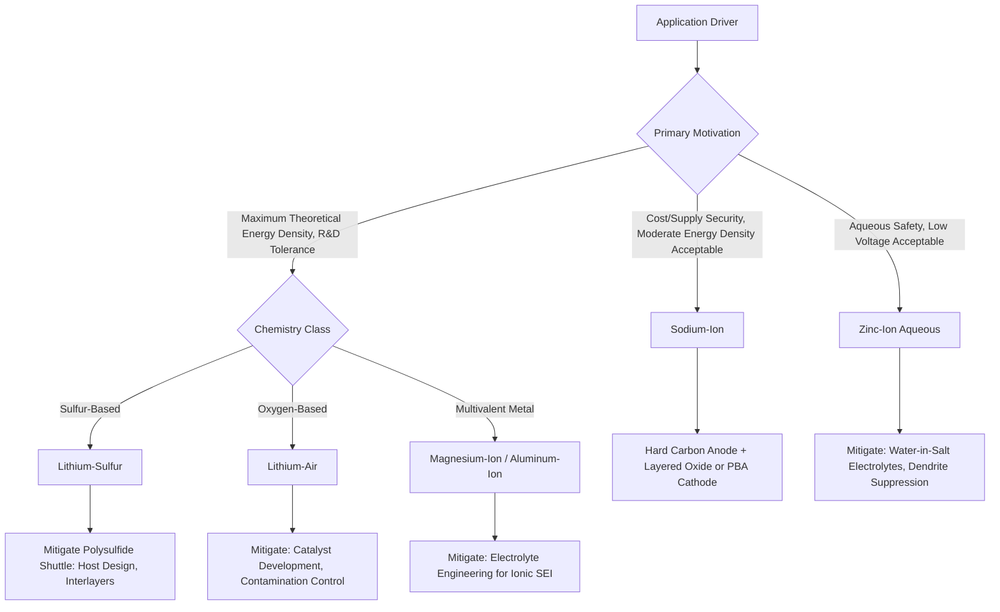

## Sodium Ion and Post Lithium Battery Chemistries

### Overview

Post-lithium battery chemistries encompass alternative electrochemical energy storage systems developed to address lithium-ion limitations—raw material cost and supply concentration (particularly cobalt and lithium itself), theoretical energy density ceilings, and safety characteristics—by substituting different working ions or fundamentally different reaction mechanisms. Sodium-ion batteries represent the most commercially mature post-lithium chemistry, leveraging sodium's abundance and chemical similarity to lithium, while multivalent-ion and lithium-sulfur/lithium-air systems pursue higher theoretical energy density at generally lower technology readiness levels.

### Sodium-Ion Batteries

**Fundamental Rationale**

Sodium and lithium belong to the same alkali metal group, sharing similar (though not identical) electrochemical behavior—reversible ion intercalation/extraction, comparable cell architecture (cathode, anode, electrolyte, separator)—making much of established lithium-ion manufacturing knowledge and equipment transferable to sodium-ion production. Sodium's primary advantages are geological abundance (roughly 1000x more abundant in Earth's crust than lithium) and more geographically distributed supply, reducing raw material cost and supply-chain concentration risk.

**Fundamental Limitations**

Sodium's larger ionic radius (Na⁺ ≈ 1.02 Å vs. Li⁺ ≈ 0.76 Å) and higher atomic mass result in inherently lower theoretical gravimetric and volumetric energy density than equivalent lithium-ion chemistries—sodium-ion cells generally cannot match high-end lithium NMC/NCA energy density, positioning sodium-ion as complementary to (rather than a direct replacement for) lithium-ion in applications where cost and supply security outweigh maximum energy density (stationary grid storage, low-cost/short-range electric vehicles, some two/three-wheeler applications).

**Cathode Materials**

- **Layered oxides** (NaₓMO₂, M = Ni, Mn, Fe, Co in various combinations, analogous in structural concept to lithium layered oxides): offer reasonable capacity and are among the most commercially developed sodium-ion cathode classes, though phase transitions during sodium extraction/insertion are generally more complex than in lithium layered oxides, contributing to more pronounced capacity fade in some formulations.
- **Prussian blue analogues** (NaₓM[Fe(CN)₆], M = Fe, Mn, Ni, etc.): open-framework structure with large interstitial sites well-suited to accommodating the larger Na⁺ ion, offering good rate capability and long cycle life at generally lower cost (avoiding scarce transition metals), though achieving high-quality, low-defect-density Prussian blue analogue material with minimal interstitial water content (a known source of capacity fade and gassing) has required significant synthesis process development.
- **Polyanionic compounds** (Na₃V₂(PO₄)₃ and related NASICON-structured phosphates): offer good structural stability and rate capability, though vanadium-containing formulations raise similar cost/toxicity considerations as some lithium cathode alternatives.

**Anode Materials**

Graphite, the dominant lithium-ion anode, does not effectively intercalate sodium under practical conditions (sodium does not readily form a stable intercalation compound with graphite at achievable potentials), necessitating alternative anode materials:

- **Hard carbon**: the dominant commercial sodium-ion anode, a disordered, non-graphitizable carbon structure with larger interlayer spacing and nanoscale porosity that accommodates sodium storage via a combination of intercalation-like and pore-filling mechanisms; offers reasonable capacity (~200-300 mAh/g depending on precursor and processing) though its distinctive low-voltage plateau region requires careful voltage-window management to avoid sodium plating.
- **Alloy anodes** (Sn, Sb, and their composites): higher theoretical capacity via alloying mechanisms analogous to silicon in lithium-ion systems, facing similar volume-expansion-driven degradation challenges.

**Electrolytes**

Sodium-ion cells generally use sodium salts (e.g., NaPF₆, NaClO₄) in carbonate solvent systems similar in concept to lithium-ion electrolyte formulations, with electrolyte/additive optimization required to form a stable sodium-equivalent SEI layer, which behaves somewhat differently in composition and stability than the lithium-ion SEI given sodium's distinct chemistry.

**[Inference]** Commercial sodium-ion cell energy density figures reported by various manufacturers vary considerably and continue to improve as cathode/anode material optimization matures; specific figures should be treated as representing a given manufacturer's current product generation rather than a fixed technology ceiling, given the chemistry's comparative immaturity relative to decades of lithium-ion optimization.

### Multivalent-Ion Batteries

**Magnesium-Ion Batteries**

Magnesium offers attractive theoretical volumetric energy density (Mg²⁺ carries two electrons per ion, and magnesium metal anodes are generally not susceptible to dendritic growth in the same manner as lithium, offering a potential safety advantage), but faces substantial practical challenges: magnesium's divalent charge creates strong electrostatic interaction with host cathode structures, resulting in sluggish solid-state diffusion kinetics and limited compatible cathode material options; additionally, magnesium metal forms a passivating surface layer in many conventional electrolytes that is ionically blocking (unlike lithium's ionically conductive SEI), requiring specialized electrolyte chemistry (often non-aqueous Grignard-type or specially engineered systems) incompatible with standard lithium-ion electrolyte formulations.

**Aluminum-Ion Batteries**

Aluminum's trivalent charge state offers high theoretical volumetric capacity and aluminum's abundance/low cost is attractive, but similarly suffers from severe kinetic limitations in most candidate cathode hosts due to strong Al³⁺ electrostatic interactions, and practical aluminum-ion systems developed to date (often using ionic liquid electrolytes with graphite-based cathodes via chloroaluminate anion intercalation) have generally demonstrated notably lower cell voltage and energy density than initially theoretically projected.

**Zinc-Ion Batteries**

Aqueous zinc-ion batteries leverage zinc metal's compatibility with water-based electrolytes (offering inherent non-flammability and low-cost/low-toxicity advantages over organic-solvent-based systems), with manganese oxide or vanadium oxide-based cathodes among the most studied candidates; primary challenges include zinc dendrite formation (though generally less severe than lithium dendrites) and hydrogen evolution side reactions inherent to aqueous electrolyte operation, along with generally lower cell voltage than non-aqueous systems due to water's electrochemical stability window constraint (~1.23 V theoretical, though practical aqueous cells can exceed this via kinetic overpotential effects, sometimes termed "water-in-salt" electrolyte strategies to widen the effective stability window).

### Lithium-Sulfur Batteries

**Fundamental Mechanism and Appeal**

Lithium-sulfur cells pair a lithium metal (or lithium-containing) anode with an elemental sulfur cathode, offering very high theoretical specific capacity (1675 mAh/g for sulfur, based on the 16-electron conversion reaction S₈ + 16Li⁺ + 16e⁻ → 8Li₂S) and theoretical energy density substantially exceeding conventional intercalation-based lithium-ion chemistries, alongside sulfur's low cost and abundance.

**The Polysulfide Shuttle Problem**

The central practical challenge distinguishing Li-S from intercalation chemistries: the discharge reaction proceeds through a series of soluble lithium polysulfide intermediates (Li₂Sₓ, varying chain length), which dissolve into the liquid electrolyte and can diffuse (shuttle) between the cathode and anode, reacting parasitically at the lithium metal surface. This "shuttle effect" causes irreversible active material (sulfur) loss, low Coulombic efficiency, and continuous capacity fade—a fundamentally different degradation mechanism than the particle-cracking or SEI-growth mechanisms dominant in conventional Li-ion chemistry.

**Mitigation Strategies**

Substantial research effort has focused on physically or chemically confining polysulfides within the cathode structure: conductive carbon host architectures (mesoporous carbon, graphene-based hosts) providing physical confinement and electrical conductivity to the inherently insulating sulfur/Li₂S; polar/catalytic host materials (metal oxides, metal sulfides, single-atom catalysts) that chemically bind polysulfides and catalyze more complete conversion reactions; and electrolyte/separator modifications (functional interlayers, concentrated electrolyte formulations) to physically or chemically impede polysulfide migration.

**[Inference]** Despite substantial materials engineering progress in polysulfide mitigation, achieving simultaneously high sulfur loading (necessary for practically meaningful cell-level, not just material-level, energy density), long cycle life, and acceptable rate performance in a single cell design remains an active, unresolved engineering challenge—published research cell results at high theoretical energy density frequently use experimental conditions (low sulfur loading, excess electrolyte, excess lithium) that would not translate directly to a commercially viable cell-level energy density if simply scaled up, a distinction important for interpreting reported Li-S performance claims.

### Lithium-Air (Lithium-Oxygen) Batteries

**Concept and Appeal**

Lithium-air batteries pursue the highest theoretical energy density among lithium-based chemistries by using ambient (or stored) oxygen as the cathode active material rather than a solid intercalation host, theoretically offering energy density approaching gasoline on a gravimetric basis when accounting only for the battery's active materials (though practical cell-level figures including all necessary hardware are substantially lower).

**Fundamental Challenges**

The oxygen reduction/evolution reaction at the cathode (forming/decomposing Li₂O₂ or related discharge products) suffers from poor reversibility, sluggish kinetics requiring catalyst development, and practical operational challenges including moisture/CO₂ contamination sensitivity from ambient air (motivating research toward pure-oxygen rather than true open-air systems), electrolyte decomposition instability under the reactive discharge product environment, and cathode pore clogging from insoluble discharge products limiting achievable capacity. **[Inference]** Lithium-air battery technology readiness remains considerably lower than sodium-ion or even lithium-sulfur systems, and the gap between demonstrated laboratory-scale performance and a practically viable, cycleable commercial cell remains substantial as of current published research, making near-term commercialization claims for this specific chemistry warrant particular scrutiny.

### Technology Readiness Comparison

| Chemistry | Theoretical Energy Advantage | Primary Challenge | Approximate Maturity |
| --- | --- | --- | --- |
| Sodium-ion | Lower than Li-ion; cost/supply advantage instead | Lower energy density inherent to Na⁺ size/mass | Early commercial deployment |
| Magnesium-ion | High volumetric (2 e⁻/ion) | Sluggish kinetics, passivating SEI-like layer | Early research stage |
| Aluminum-ion | High volumetric (3 e⁻/ion) | Severe kinetic limitations, low practical voltage | Early research stage |
| Zinc-ion (aqueous) | Moderate; safety/cost advantage | Aqueous voltage window, dendrites, side reactions | Research/early commercial niche |
| Lithium-sulfur | Very high theoretical (1675 mAh/g S) | Polysulfide shuttle, cycle life | Advanced research/early commercial niche |
| Lithium-air | Highest theoretical among Li systems | Reversibility, kinetics, contamination sensitivity | Early/fundamental research stage |

### Post-Lithium Chemistry Selection Logic

### Working Ion Size and Energy Density Trade-off (svg_diagram)

<svg xmlns="http://www.w3.org/2000/svg" viewBox="0 0 700 360" font-family="Arial, sans-serif">
<text x="350" y="25" text-anchor="middle" font-size="16" font-weight="bold">Ionic Radius vs. Relative Abundance (svg_diagram)</text>
<line x1="90" y1="300" x2="640" y2="300" stroke="black" stroke-width="1.5" />
<text x="365" y="330" text-anchor="middle" font-size="12">Ionic Radius (increasing right)</text>
<line x1="90" y1="300" x2="90" y2="60" stroke="black" stroke-width="1.5" />
<text x="50" y="180" text-anchor="middle" font-size="12" transform="rotate(-90 50,180)">Earth-Crust Abundance</text>
<circle cx="150" cy="230" r="16" fill="#2c5f8a" />
<text x="150" y="255" text-anchor="middle" font-size="10">Li+</text>
<text x="150" y="200" text-anchor="middle" font-size="9">High energy density</text>
<circle cx="280" cy="110" r="20" fill="#2ecc71" />
<text x="280" y="140" text-anchor="middle" font-size="10">Na+</text>
<text x="280" y="90" text-anchor="middle" font-size="9">Abundant, lower density</text>
<circle cx="220" cy="200" r="14" fill="#f1c40f" />
<text x="220" y="222" text-anchor="middle" font-size="10">Mg2+</text>
<circle cx="190" cy="220" r="13" fill="#e67e22" />
<text x="190" y="242" text-anchor="middle" font-size="10">Al3+</text>
<circle cx="380" cy="150" r="18" fill="#9b59b6" />
<text x="380" y="178" text-anchor="middle" font-size="10">Zn2+</text>
</svg>

### Practical Example: Sizing Impact on Hard Carbon Anode Selection

Given graphite's inability to intercalate sodium effectively, a sodium-ion cell developer selecting an anode must evaluate hard carbon precursor and processing choices, since hard carbon's disordered structure (unlike graphite's ordered layers) is produced from a range of precursors (biomass-derived, resin-derived, or petroleum-pitch-derived) with resulting differences in interlayer spacing, closed-pore volume, and surface area—directly affecting achievable reversible capacity, initial Coulombic efficiency (typically lower than graphite's, an economically significant sodium-ion-specific formation-cycle consideration), and rate capability. This precursor-dependent variability is a concrete illustration of why "hard carbon" as a category name understates the degree of materials engineering still required to optimize sodium-ion anode performance, in contrast to graphite's comparatively mature and standardized lithium-ion anode role.

### Key Points

- Sodium-ion batteries are the most commercially mature post-lithium chemistry, trading lower energy density for improved raw material cost and supply security, and require fundamentally different anode materials (hard carbon, not graphite) than lithium-ion.
- Multivalent-ion systems (Mg, Al, Zn) offer attractive theoretical volumetric capacity but face persistent kinetic and interfacial challenges that have limited practical energy density realization relative to initial theoretical projections.
- Lithium-sulfur battery development centers on mitigating the polysulfide shuttle effect, a degradation mechanism fundamentally distinct from conventional intercalation-chemistry failure modes.
- Lithium-air batteries offer the highest theoretical energy density among lithium chemistries but remain at an early technology readiness level given unresolved reversibility and contamination-sensitivity challenges.
- Reported performance figures across all post-lithium chemistries should be interpreted cautiously regarding cell-level (versus material-level) translatability, given the field's rapid evolution and variation in experimental reporting conditions across research groups.

### Related Topics

- Hard Carbon Anode Precursor Engineering and Sodium Storage Mechanisms
- Prussian Blue Analogue Cathode Synthesis and Interstitial Water Management
- Polysulfide Confinement Strategies in Lithium-Sulfur Cathode Design
- Water-in-Salt Electrolytes for Aqueous Zinc-Ion Batteries
- Comparative Life-Cycle and Critical Material Assessment: Li-ion vs. Na-ion
- Catalyst Development for Lithium-Air Oxygen Reduction/Evolution Reactions