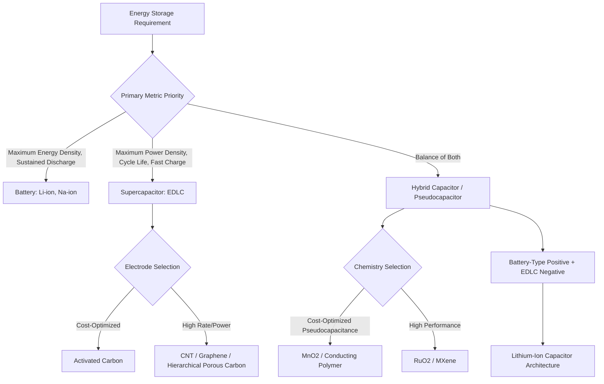

## Supercapacitor Materials

### Overview

Supercapacitors (also termed electrochemical capacitors or ultracapacitors) store energy through mechanisms distinct from the Faradaic redox reactions dominating battery operation, instead relying primarily on electrostatic charge accumulation at electrode-electrolyte interfaces (electric double-layer capacitance) or fast, surface-confined reversible redox reactions (pseudocapacitance). This distinction produces a characteristic performance profile complementary to batteries: substantially higher power density and cycle life (often 10⁵–10⁶+ cycles versus hundreds to thousands for batteries), but markedly lower energy density, positioning supercapacitors for applications prioritizing rapid charge/discharge and long operational lifetime over maximum stored energy.

### Fundamental Energy Storage Mechanisms

**Electric Double-Layer Capacitance (EDLC)**

Charge storage occurs via electrostatic accumulation of ions from the electrolyte at the electrode surface, forming a charge-separated "double layer" without any charge-transfer (Faradaic) reaction occurring. Capacitance in this mechanism scales directly with accessible electrode surface area, making high-surface-area carbon materials the dominant EDLC electrode class. Energy storage in EDLCs is fundamentally limited by the physical charge-separation distance (a few angstroms, set by ion size and the compact double-layer structure), constraining achievable energy density relative to Faradaic battery mechanisms operating on the full bulk volume of an active material.

**Pseudocapacitance**

Charge storage arises from fast, reversible surface or near-surface Faradaic redox reactions (e.g., metal oxide oxidation state changes, or rapid ion intercalation into materials with structurally favorable, low-barrier insertion sites) that, despite being Faradaic in nature, exhibit capacitor-like (linear voltage-charge) electrochemical signature rather than the flat voltage plateau characteristic of conventional battery intercalation reactions. Pseudocapacitive materials generally offer higher specific capacitance than pure EDLC carbons (since Faradaic charge storage accesses more charge per unit mass/volume than electrostatic double-layer formation alone) but typically at reduced power density and cycle life relative to pure EDLC mechanisms, reflecting the intermediate character between capacitors and batteries.

**Hybrid Capacitor Architectures**

Combine an EDLC-type electrode (typically the negative electrode, often activated carbon) with a battery-type or pseudocapacitive electrode (typically the positive electrode, e.g., a lithium-intercalation material in lithium-ion capacitors), seeking to capture higher energy density than pure EDLC devices while retaining better power density and cycle life than conventional batteries—an increasingly commercially significant device category bridging the battery-supercapacitor performance gap.

### EDLC Electrode Materials: Carbon-Based

**Activated Carbon**

The dominant commercial EDLC electrode material, produced by chemical or physical activation (steam, CO₂, or KOH activation) of carbon precursors (coconut shell, coal, synthetic polymers) to develop very high specific surface area (typically 1000-3000 m²/g) through an extensive network of micropores (<2 nm), mesopores (2-50 nm), and macropores (>50 nm). Low cost and mature, scalable production make activated carbon the default choice for commodity EDLC devices, though not all measured BET surface area contributes equally to capacitance—pores too small to admit solvated electrolyte ions do not contribute to double-layer formation, meaning pore size distribution relative to electrolyte ion size is as functionally important as total surface area.

**Carbon Nanotubes and Graphene**

Both offer high theoretical surface area, good electrical conductivity, and mesoporous (rather than predominantly microporous) structure that can improve ion transport kinetics and rate capability relative to conventional activated carbon, particularly valuable for high-power applications. **[Inference]** Despite favorable individual-material properties, achieving graphene's full theoretical surface area (~2630 m²/g) in a practical bulk electrode is substantially limited by restacking of graphene sheets during electrode fabrication (driven by van der Waals attraction between sheets), meaning measured practical capacitance for graphene-based electrodes frequently falls well short of values that might be extrapolated from single-sheet theoretical surface area, a gap that structural engineering approaches (3-D graphene foams, spacer/pillaring strategies) attempt to address with varying success.

**Templated and Hierarchical Porous Carbons**

Carbide-derived carbons, zeolite-templated carbons, and other engineered porous carbon architectures allow more precise control over pore size distribution than conventional activation, enabling optimization of the micropore/mesopore balance for specific electrolyte systems—an area where the trade-off between capacitance (favoring micropores for surface area) and rate capability (favoring mesopores for ion transport) is directly engineered rather than an incidental outcome of the activation process.

### Pseudocapacitive Electrode Materials

**Transition Metal Oxides**

- **RuO₂ (ruthenium oxide)**: the archetypal pseudocapacitive material, offering very high specific capacitance via reversible multi-electron-transfer redox reactions across a wide potential window, but ruthenium's high cost has confined RuO₂ primarily to specialized/niche high-performance applications rather than broad commercial deployment.
- **MnO₂ (manganese oxide)**: a widely studied lower-cost pseudocapacitive alternative, offering good specific capacitance in aqueous electrolytes at substantially reduced material cost versus RuO₂, though generally with lower electronic conductivity requiring composite formulation with conductive carbon additives.
- **NiO, Co₃O₄, and mixed transition metal oxides**: additional pseudocapacitive candidates studied for their favorable redox activity, often explored in nanostructured or composite forms to improve conductivity and rate capability.

**Conducting Polymers**

Polyaniline (PANI), polypyrrole (PPy), and PEDOT (poly(3,4-ethylenedioxythiophene)) undergo reversible doping/dedoping (oxidation/reduction) reactions across their conjugated polymer backbone, providing pseudocapacitive charge storage with generally higher theoretical specific capacitance than carbon EDLC materials at potentially lower cost than noble-metal oxides, but typically exhibiting more limited cycle life due to mechanical degradation (swelling/shrinking) of the polymer structure during repeated doping/dedoping.

**MXenes**

A relatively recently developed (post-2011) class of two-dimensional transition metal carbides/nitrides (general formula Mₙ₊₁XₙTₓ, e.g., Ti₃C₂Tₓ), produced by selective etching of the "A" layer element from MAX-phase precursor materials, offering metallic-level electronic conductivity combined with pseudocapacitive redox activity at the surface termination groups (commonly -O, -OH, -F depending on synthesis route), and demonstrated high volumetric capacitance in various studies. **[Unverified]** MXene research remains a rapidly active and evolving field with numerous compositional variants under study; specific performance figures and synthesis protocol details should be verified against current literature given the pace of ongoing development in this material class since its relatively recent discovery.

### Electrolyte Systems for Supercapacitors

**Aqueous Electrolytes**

Acidic (H₂SO₄), alkaline (KOH), or neutral salt (Na₂SO₄) aqueous electrolytes offer high ionic conductivity and low cost, but are fundamentally constrained by water's electrochemical stability window (~1.23 V theoretical, with practical operating windows sometimes extending somewhat beyond this via kinetic overpotential effects), limiting achievable cell voltage and, since energy scales with voltage squared ($E = \frac{1}{2}CV^2$), constraining energy density more severely than the voltage limitation alone might suggest.

**Organic Electrolytes**

Typically acetonitrile or propylene carbonate-based solvents with a quaternary ammonium salt (e.g., tetraethylammonium tetrafluoroborate, TEABF₄), offering substantially wider stability windows (typically 2.5-2.7 V) than aqueous systems, and consequently dominating commercial EDLC devices where energy density matters, despite higher cost, lower ionic conductivity than aqueous electrolytes, and (for acetonitrile-based systems specifically) flammability and toxicity considerations that have prompted regulatory attention in some jurisdictions.

**Ionic Liquids**

Room-temperature ionic liquids offer the widest electrochemical stability windows (potentially exceeding 3.5-4 V in some formulations) and non-flammability, of interest for maximizing energy density via the voltage-squared relationship, but generally exhibit lower ionic conductivity (particularly at reduced temperature) than organic electrolytes, constraining power density and low-temperature performance—an illustration of the recurring conductivity-stability trade-off seen across electrochemical energy storage material selection generally.

### Energy and Power Density Relationships

The fundamental capacitor energy equation:

$$E = \frac{1}{2}CV^2$$

directly explains why electrolyte voltage window is often the single most impactful lever for supercapacitor energy density improvement—doubling operating voltage quadruples theoretical energy density at fixed capacitance, generally a larger effect than achievable through electrode material capacitance improvements alone. Power density, by contrast, is governed primarily by equivalent series resistance (ESR, combining electrode, electrolyte, and interfacial resistance contributions):

$$P_{max} = \frac{V^2}{4 \times ESR}$$

explaining why supercapacitor power optimization focuses heavily on minimizing internal resistance contributions (electrode conductivity, electrolyte conductivity, current collector contact resistance) alongside voltage window maximization.

### Applications

**Regenerative Braking and Power Assist**

High power density and excellent cycle life make supercapacitors well-suited for capturing and rapidly discharging regenerative braking energy in hybrid/electric vehicles and transit systems, often paired with batteries in hybrid energy storage architectures where the supercapacitor handles high-power transient loads while the battery provides sustained energy delivery.

**Grid Frequency Regulation**

Fast response time and high cycle life support grid-stabilization applications requiring rapid power injection/absorption to maintain frequency stability, a duty cycle poorly suited to conventional battery cycle-life characteristics.

**Memory Backup and Pulse Power**

Long shelf life, wide operating temperature range, and reliable performance make supercapacitors suitable for memory backup power and pulse-power applications (camera flash, industrial actuator power assist) requiring brief high-current bursts.

### Battery vs. Supercapacitor Performance Positioning

### Ragone Plot: Power vs. Energy Density Positioning (svg_diagram)

<svg xmlns="http://www.w3.org/2000/svg" viewBox="0 0 700 400" font-family="Arial, sans-serif">
<text x="350" y="25" text-anchor="middle" font-size="16" font-weight="bold">Ragone Plot: Energy Storage Technology Positioning (svg_diagram)</text>
<line x1="90" y1="340" x2="640" y2="340" stroke="black" stroke-width="1.5" />
<text x="365" y="370" text-anchor="middle" font-size="12">Energy Density (Wh/kg, log scale)</text>
<line x1="90" y1="340" x2="90" y2="60" stroke="black" stroke-width="1.5" />
<text x="50" y="200" text-anchor="middle" font-size="12" transform="rotate(-90 50,200)">Power Density (W/kg, log scale)</text>
<ellipse cx="180" cy="120" rx="70" ry="45" fill="#e74c3c" fill-opacity="0.5" stroke="#a83a3a" />
<text x="180" y="120" text-anchor="middle" font-size="11" font-weight="bold">EDLC</text>
<ellipse cx="280" cy="170" rx="75" ry="45" fill="#9b59b6" fill-opacity="0.5" stroke="#6e3a8a" />
<text x="280" y="170" text-anchor="middle" font-size="11" font-weight="bold">Pseudo-</text>
<text x="280" y="183" text-anchor="middle" font-size="11" font-weight="bold">capacitors</text>
<ellipse cx="380" cy="220" rx="80" ry="50" fill="#f1c40f" fill-opacity="0.5" stroke="#a8890f" />
<text x="380" y="220" text-anchor="middle" font-size="11" font-weight="bold">Hybrid/Li-ion</text>
<text x="380" y="233" text-anchor="middle" font-size="11" font-weight="bold">Capacitors</text>
<ellipse cx="500" cy="270" rx="90" ry="55" fill="#2ecc71" fill-opacity="0.5" stroke="#1a7a3a" />
<text x="500" y="270" text-anchor="middle" font-size="12" font-weight="bold">Batteries</text>
<text x="500" y="284" text-anchor="middle" font-size="10">(Li-ion, Na-ion)</text>
<path d="M90,340 Q300,330 640,90" stroke="#555" stroke-width="1" stroke-dasharray="4,3" fill="none" />
<text x="500" y="80" font-size="10" fill="#555">Constant discharge time reference line</text>
</svg>

### Practical Example: Estimating Voltage Window Impact on Energy Density

Comparing an aqueous EDLC (V = 1.0 V) against an organic-electrolyte EDLC (V = 2.7 V) at identical specific capacitance (assume C = 100 F/g for illustration):

Aqueous: $E = \frac{1}{2}(100)(1.0)^2 = 50$ J/g ≈ 13.9 Wh/kg

Organic: $E = \frac{1}{2}(100)(2.7)^2 = 364.5$ J/g ≈ 101.3 Wh/kg

This roughly 7x energy density improvement from voltage window alone (despite identical capacitance) directly explains why commercial high-energy-density EDLC products overwhelmingly use organic or ionic liquid electrolytes despite their higher cost and lower conductivity relative to aqueous alternatives—concretely demonstrating why electrolyte voltage window optimization frequently yields larger practical energy density gains than electrode material capacitance improvements of comparable research effort.

### Key Points

- EDLC and pseudocapacitive mechanisms are fundamentally distinct (electrostatic vs. fast Faradaic), producing the characteristic power-energy trade-off spectrum spanning pure carbon EDLCs through pseudocapacitors to hybrid/battery-type devices.
- Not all measured BET surface area translates to usable capacitance; pore size relative to solvated electrolyte ion size determines accessible double-layer-forming surface area.
- Because energy scales with voltage squared, electrolyte stability window (aqueous vs. organic vs. ionic liquid) is frequently the most impactful single lever for supercapacitor energy density, often outweighing electrode capacitance improvements.
- MXenes represent an actively evolving 2-D material class combining metallic conductivity with pseudocapacitive activity, though the field's rapid development pace warrants verification of specific claims against current literature.
- Supercapacitors occupy a complementary rather than competitive niche relative to batteries, prioritized where power density, cycle life, and fast response outweigh maximum energy density.

### Related Topics

- MXene Synthesis via MAX-Phase Etching and Surface Termination Chemistry
- Lithium-Ion Capacitor Hybrid Architecture and Electrode Balancing
- Pore Size Engineering in Activated Carbon for Electrolyte-Specific Optimization
- Conducting Polymer Pseudocapacitor Degradation Mechanisms
- Ionic Liquid Electrolytes for Wide-Voltage-Window Supercapacitors
- Hybrid Battery-Supercapacitor Energy Storage System Design