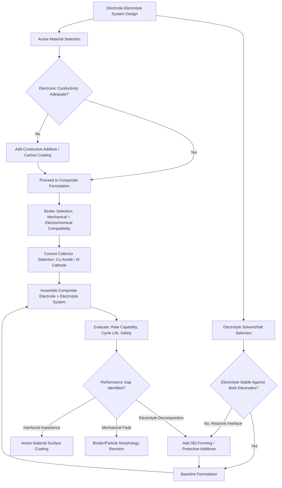

## Electrode and Electrolyte Materials

### Overview

Electrode and electrolyte materials constitute the functional core of any electrochemical energy storage device, and their design principles cut across the specific battery and supercapacitor chemistries covered elsewhere in this chapter. This section addresses the cross-cutting materials science governing electrode composite formulation, current collector selection, electrolyte formulation principles, and interfacial engineering that apply broadly across lithium-ion, sodium-ion, and supercapacitor systems alike, rather than chemistry-specific active material selection.

### Electrode Composite Architecture

**Composite Electrode Composition**

Practical electrodes are rarely composed of pure active material alone; a typical composite electrode formulation combines:

- **Active material** (60-97 wt% depending on chemistry and application, e.g., NMC, graphite, activated carbon): provides the primary charge-storage function.
- **Conductive additive** (typically 1-10 wt%, e.g., carbon black, carbon nanotubes, graphene flakes): establishes electronic percolation pathways between active material particles and the current collector, compensating for active materials with inherently poor electronic conductivity (many oxide cathodes and LFP in particular require substantial conductive additive loading or carbon coating).
- **Binder** (typically 1-10 wt%, e.g., PVDF, CMC/SBR, polyacrylic acid): provides mechanical cohesion holding active material and conductive additive particles together and adhering the composite to the current collector, while ideally remaining electrochemically inert and minimizing added inactive mass/volume.

**Electrode Porosity and Tortuosity**

Composite electrodes are intentionally porous (typical porosity 20-40%) rather than fully dense, allowing electrolyte infiltration throughout the electrode thickness for ion transport to/from active material particles not in direct contact with the electrolyte-facing surface. This porous structure introduces **tortuosity**—the ratio of actual ion diffusion path length through the porous network to the straight-line electrode thickness—which increases effective ion transport resistance beyond what electrode thickness alone would suggest. **[Inference]** Electrode tortuosity is generally difficult to predict purely from porosity fraction via simple geometric models, since particle shape, size distribution, and processing-induced alignment (e.g., calendering-induced particle orientation) all influence the actual tortuous path, meaning tortuosity is typically measured empirically (via electrochemical impedance or tracer diffusion methods) for a given electrode formulation rather than reliably predicted from composition alone.

**Electrode Thickness and the Energy-Power Trade-off**

Thicker electrodes increase active material loading per unit current collector and separator area, improving cell-level energy density (since current collectors and separators are inactive mass/volume overhead), but simultaneously increase ion diffusion path length and electronic conduction path length through the composite, degrading rate capability—a direct, well-established design trade-off requiring electrode thickness optimization specific to the target application's energy-versus-power priority.

### Current Collector Materials

**Function and Selection Criteria**

Current collectors provide the electronically conductive pathway between the composite electrode and the external circuit, requiring high electronic conductivity, mechanical robustness for electrode coating/handling processes, and—critically—electrochemical stability across the operating potential window of the electrode they support.

**Material Selection Logic**

- **Copper foil**: used for negative electrodes (anodes) in lithium-ion systems, stable against the low reduction potentials encountered at typical anode operating voltages, but would electrochemically alloy with lithium (and undergo dissolution) if used at typical cathode (positive electrode) potentials.
- **Aluminum foil**: used for positive electrodes (cathodes), forming a passivating native oxide layer that provides stability against oxidative cathode potentials, but aluminum would alloy destructively with lithium if placed at anode potentials—explaining why the copper/aluminum assignment is not arbitrary or interchangeable between electrodes.
- **Foil thickness and surface treatment**: typical current collector foils range roughly 6-20 µm thickness, balancing mechanical handling robustness against minimizing inactive mass/volume; surface treatments (etching, carbon coating) are sometimes applied to improve adhesion between the collector and the composite electrode coating, reducing interfacial contact resistance.

### Binder Chemistry and Function

**PVDF (Polyvinylidene Fluoride)**

The traditional binder for both lithium-ion cathodes and graphite anodes, offering good electrochemical stability and adhesion when processed from N-methyl-2-pyrrolidone (NMP) solvent, though NMP's toxicity and cost, along with solvent recovery/recycling requirements in manufacturing, have motivated interest in alternative water-processable binder systems, particularly for anode applications.

**Water-Processable Binders (CMC/SBR, PAA)**

Carboxymethyl cellulose combined with styrene-butadiene rubber (CMC/SBR) and polyacrylic acid (PAA)-based binders are increasingly used, particularly for graphite and silicon-composite anodes, offering environmental and cost advantages from aqueous processing while, for silicon-containing anodes specifically, providing improved mechanical resilience against the large volume changes silicon undergoes during cycling—PAA's carboxylic acid functional groups can form reversible hydrogen-bonding networks that better accommodate repeated expansion/contraction than PVDF's comparatively rigid polymer network.

**[Inference]** Binder selection involves trade-offs not always fully captured by simple mechanical adhesion metrics alone—electrochemical stability window compatibility with the specific electrode's operating potential, swelling behavior in the chosen electrolyte solvent system, and long-term interfacial stability under repeated cycling stress all factor into binder selection, meaning a binder performing well in one electrode/electrolyte combination does not necessarily transfer directly to a different system without re-validation.

### Electrolyte Formulation Principles

**Solvent Selection Criteria**

Electrolyte solvents must balance several often-competing requirements: sufficiently high dielectric constant to dissolve and dissociate the chosen salt, low viscosity for good ionic conductivity (mobility), wide electrochemical stability window against both electrodes, appropriate liquid range (low freezing point, high boiling point) for the target operating temperature range, and acceptable flash point/flammability characteristics for safety.

**Cyclic and Linear Carbonate Solvent Blending**

A common formulation strategy (particularly in lithium-ion electrolytes) blends a high-dielectric-constant cyclic carbonate (ethylene carbonate, EC, which also plays an important SEI-forming role due to its favorable reductive decomposition chemistry) with lower-viscosity linear carbonates (dimethyl carbonate, DMC; ethyl methyl carbonate, EMC; diethyl carbonate, DEC) to achieve a practical balance of ionic conductivity and dissociation capability that neither solvent class alone would provide—illustrating a general electrolyte design principle of complementary solvent blending rather than single-solvent optimization.

**Salt Selection**

The dissolved salt must offer high solubility and dissociation in the chosen solvent, good ionic mobility, and electrochemical/thermal stability. LiPF₆ remains the dominant lithium-ion electrolyte salt despite known thermal decomposition and moisture-sensitivity limitations (generating HF upon hydrolysis, a corrosive and SEI-degrading byproduct), largely because alternative salts (LiBF₄, LiClO₄, LiTFSI, and others) each present their own distinct trade-offs (lower conductivity, aluminum current collector corrosion at cathode potentials for LiTFSI, or explosivity/instability concerns for LiClO₄) that have collectively prevented wholesale replacement of LiPF₆ in mainstream commercial cells despite decades of alternative salt research.

### Electrolyte Additives

**Function of Additives**

Present typically at low concentration (often <5 wt%) but exerting outsized influence on cell performance, electrolyte additives serve targeted functions including SEI-forming enhancement, overcharge protection, flame retardancy, and gas-generation suppression:

- **SEI-forming additives** (vinylene carbonate, VC; fluoroethylene carbonate, FEC): preferentially decompose at the anode surface before bulk electrolyte solvent decomposition, forming a more stable, lower-impedance SEI layer than would form from base electrolyte alone—FEC in particular has shown notable benefit for silicon-containing anodes given silicon's especially demanding SEI stability requirements under large volume change.
- **Flame-retardant additives** (organophosphate compounds): reduce electrolyte flammability, a safety-motivated additive category of particular relevance given liquid carbonate electrolytes' inherent flammability risk.
- **Overcharge protection additives**: compounds that polymerize or undergo redox shuttling at voltages above normal operating range, providing a chemical safety mechanism supplementing electronic battery management system protections.

**[Inference]** Electrolyte additive selection and optimal concentration are frequently determined through substantially empirical, iterative testing across specific electrode material combinations, given the complexity of predicting additive decomposition products and their interaction with the evolving SEI/interphase chemistry from first-principles calculation alone—this is a recognized characteristic of electrolyte formulation development in the field rather than a gap unique to any single research group or company.

### Interfacial Engineering Across Electrode-Electrolyte Systems

**Coating and Surface Modification of Active Materials**

Thin protective coatings applied directly to active material particles (e.g., Al₂O₃ or LiNbO₃ coatings on cathode particles, carbon coating on LFP or silicon anode particles) serve multiple functions depending on the system: suppressing direct electrolyte-active-material side reactions, improving electronic conductivity (carbon coatings on inherently insulating materials like LFP), or buffering interfacial reactivity in solid-state systems as discussed in the solid-state battery materials context.

**Particle Morphology Engineering**

Active material particle size, shape, and secondary-particle architecture (e.g., single-crystal versus polycrystalline secondary particle morphology in NMC cathodes) influence mechanical stability under cycling-induced volume change, electrolyte-accessible surface area (affecting both rate capability and parasitic side-reaction extent), and processing behavior (electrode coating uniformity, calendering density achievable)—an active area of materials engineering distinct from bulk crystal structure/composition optimization alone.

### Electrode-Electrolyte System Design Interdependencies

### Composite Electrode Cross-Section Schematic (svg_diagram)

<svg xmlns="http://www.w3.org/2000/svg" viewBox="0 0 700 380" font-family="Arial, sans-serif">
<text x="350" y="25" text-anchor="middle" font-size="16" font-weight="bold">Composite Electrode Microstructure (svg_diagram)</text>
<rect x="80" y="300" width="540" height="20" fill="#b8860b" stroke="#7a5a08" />
<text x="350" y="315" text-anchor="middle" font-size="11" fill="white">Current Collector (Cu or Al foil)</text>
<rect x="80" y="80" width="540" height="220" fill="#f0f0f0" stroke="#999" />
<circle cx="150" cy="140" r="28" fill="#2c5f8a" />
<circle cx="240" cy="180" r="32" fill="#2c5f8a" />
<circle cx="330" cy="130" r="26" fill="#2c5f8a" />
<circle cx="420" cy="200" r="30" fill="#2c5f8a" />
<circle cx="510" cy="150" r="28" fill="#2c5f8a" />
<circle cx="200" cy="250" r="24" fill="#2c5f8a" />
<circle cx="380" cy="260" r="27" fill="#2c5f8a" />
<circle cx="480" cy="240" r="22" fill="#2c5f8a" />
<g fill="#333">
<circle cx="180" cy="160" r="3" />
<circle cx="270" cy="150" r="3" />
<circle cx="360" cy="175" r="3" />
<circle cx="450" cy="165" r="3" />
<circle cx="220" cy="210" r="3" />
<circle cx="310" cy="220" r="3" />
</g>

<text x="150" y="110" text-anchor="middle" font-size="9">Active material</text>

<text x="620" y="140" font-size="9" text-anchor="end">Conductive additive (dots)</text>

<text x="350" y="345" text-anchor="middle" font-size="10">White space: porosity, filled with electrolyte during operation</text>

</svg>

### Practical Example: Diagnosing a High-Impedance Cell Through Material Selection Review

A cell exhibiting unexpectedly high impedance and poor rate capability might be diagnosed by reviewing each material layer systematically: first checking whether conductive additive content is adequate for the active material's intrinsic conductivity (e.g., insufficient carbon coating on an LFP cathode would manifest as high charge-transfer resistance concentrated at the active material-electrolyte interface); then evaluating whether binder distribution is uniform (binder migration toward the electrode surface during drying, a known processing defect, can create an insulating skin layer increasing surface impedance without proportionally affecting bulk conductivity); and finally assessing electrolyte formulation adequacy (insufficient SEI-forming additive concentration could allow continued parasitic electrolyte decomposition, progressively increasing interfacial impedance over cycling rather than presenting as an initial, fixed impedance value). This layered diagnostic approach—rather than assuming any single material component in isolation—reflects how electrode/electrolyte systems are practically troubleshot, since impedance contributions from composite formulation, current collector contact, and electrolyte/SEI chemistry are frequently convolved in a simple total-impedance measurement and require complementary characterization (e.g., electrochemical impedance spectroscopy with equivalent circuit fitting) to disaggregate.

### Key Points

- Composite electrode formulation (active material, conductive additive, binder ratios) and resulting porosity/tortuosity are engineering variables independent of active material chemistry choice, directly affecting rate capability and energy density trade-offs.
- Current collector material selection (Cu anode / Al cathode) is dictated by electrochemical stability at each electrode's operating potential, not interchangeable by convenience.
- LiPF₆'s continued dominance as the standard lithium-ion salt despite known limitations illustrates that incumbent material choices often persist due to the absence of an alternative solving all trade-offs simultaneously, not because the incumbent is without flaws.
- Electrolyte additives, despite low concentration, exert outsized influence on SEI quality, safety, and cycle life, with additive optimization remaining a substantially empirical process across the field.
- Cell impedance and performance issues typically require disaggregated, multi-layer diagnostic approaches given the convolution of composite electrode, current collector, and electrolyte/interfacial contributions in simple aggregate measurements.

### Related Topics

- Electrochemical Impedance Spectroscopy and Equivalent Circuit Modeling
- Electrode Calendering and Porosity Optimization for Manufacturing
- LiPF6 Alternatives and Next-Generation Electrolyte Salt Development
- Binder Migration Defects in Electrode Drying Processes
- Active Material Surface Coating Techniques (ALD, Wet-Chemical Coating)
- Single-Crystal vs. Polycrystalline Cathode Particle Morphology