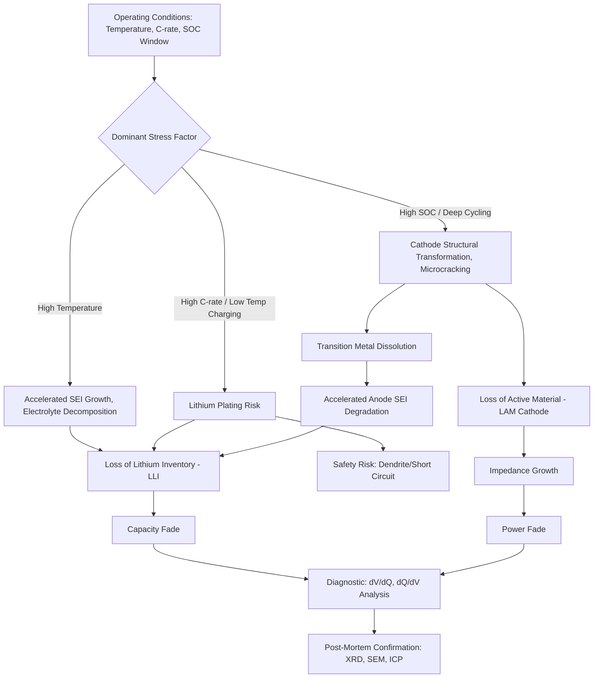

## Battery Degradation Mechanisms

### Overview

Battery degradation encompasses the progressive, largely irreversible loss of capacity and increase in internal resistance that occurs over a cell's calendar life and cycle life, arising from a combination of chemical, electrochemical, and mechanical processes occurring simultaneously at both electrodes and within the electrolyte. Understanding degradation requires distinguishing between distinct underlying mechanisms—since capacity fade and power fade can arise from mechanistically unrelated processes—and recognizing that degradation rate depends strongly on operating conditions (temperature, state-of-charge window, C-rate) rather than being an intrinsic, fixed material property alone.

### Fundamental Degradation Categories

**Loss of Lithium Inventory (LLI)**

Irreversible consumption of cyclable lithium ions that are no longer available to shuttle between electrodes during normal operation, most commonly through continued SEI growth (each increment of SEI formation permanently consumes some lithium and electrolyte), lithium plating (metallic lithium deposition that may become electrically isolated and electrochemically inactive), or side reactions trapping lithium in electrochemically inactive compounds. LLI directly reduces cell capacity by depleting the finite lithium inventory shared between both electrodes, independent of whether the electrode host structures themselves remain intact.

**Loss of Active Material (LAM)**

Physical or structural degradation of electrode host material reducing the material's capacity to store lithium (or the relevant working ion), independent of lithium inventory. Distinguished into LAM at the cathode (LAM_CAM) and anode (LAM_AAM), since the two often proceed via different mechanisms and at different rates, and diagnostic differentiation between LLI and LAM contributions is often necessary to correctly identify the dominant degradation pathway and target appropriate mitigation.

**Resistance/Impedance Growth**

Increase in internal cell resistance over calendar or cycle life, distinct from capacity loss mechanisms, though the two frequently occur concurrently and can share underlying causes (e.g., SEI growth simultaneously consumes lithium inventory and increases interfacial impedance). Resistance growth manifests primarily as reduced power capability and increased voltage polarization under load, rather than directly as reduced capacity, though severe resistance growth can indirectly limit accessible capacity within practical voltage cutoff constraints.

### Cathode Degradation Mechanisms

**Transition Metal Dissolution**

Particularly relevant for spinel (LMO) and, to varying degrees, layered oxide cathodes, transition metal ions (Mn²⁺ especially, via a disproportionation reaction in spinel structures) can dissolve into the electrolyte, migrate to the anode, and deposit/catalyze further SEI decomposition there—a mechanism connecting cathode degradation directly to accelerated anode-side capacity loss, illustrating that degradation mechanisms at the two electrodes are not always independent.

**Structural/Phase Transformations**

Repeated deep delithiation, particularly in high-nickel-content layered oxides (NMC811 and similar), can drive irreversible structural transformation from the desired layered structure toward a disordered rock-salt-like phase at the particle surface, creating a resistive surface layer and reducing accessible lithium sites—a mechanism distinct from but sometimes coupled with microcrack formation.

**Microcracking**

Layered oxide secondary particles (agglomerates of smaller primary crystallites) undergo anisotropic volume change during lithium extraction/insertion; repeated cycling induces intergranular microcracking along primary particle boundaries, which can expose fresh, previously unreacted particle surface to electrolyte (triggering additional parasitic side reactions and cathode electrolyte interphase, CEI, growth) and can also electronically isolate fragmented particle regions, contributing to both LAM and impedance growth simultaneously.

**Oxygen Release**

At high states of charge, particularly for nickel-rich layered oxides, lattice oxygen can be released from the cathode structure, contributing to both structural degradation (oxygen vacancy formation destabilizing the layered structure) and, in more severe cases, serving as an internal oxidizer that can accelerate thermal runaway reactions—connecting this degradation mechanism directly to battery safety considerations rather than being purely a capacity-fade concern.

### Anode Degradation Mechanisms

**Continued SEI Growth**

While an initial, ideally self-limiting SEI layer forms during formation cycling, SEI growth in practice continues (at a reduced rate) throughout cell life, particularly accelerated at elevated temperature and high state of charge, progressively consuming lithium inventory and electrolyte while increasing interfacial impedance—generally recognized as a dominant calendar-life degradation mechanism in graphite-anode lithium-ion cells.

**Lithium Plating**

Under conditions where lithium-ion intercalation into graphite cannot keep pace with the applied charge current—low temperature (reduced ion diffusivity and intercalation kinetics), high C-rate charging, or over-full states of charge—the anode surface potential can drop below 0 V vs. Li/Li⁺, at which point metallic lithium deposits on the graphite surface rather than intercalating. Plated lithium represents both a direct LLI mechanism (some fraction becomes electrically isolated "dead lithium," electrochemically inactive but still consuming lithium inventory) and a significant safety hazard, since dendritic lithium plating morphology can penetrate the separator and cause internal short-circuiting—making lithium plating avoidance a primary design constraint on fast-charging protocols and low-temperature charging limits.

**Silicon Anode-Specific Degradation**

For silicon-containing anodes, the large volume change (up to ~300%) during lithiation/delithiation drives particle pulverization/cracking, continuous exposure of fresh silicon surface to electrolyte, and consequently continuous SEI reformation at a rate substantially exceeding graphite—explaining why silicon incorporation, despite its capacity advantage, requires substantial electrode engineering (composite architecture, protective coatings, robust binders) to achieve commercially acceptable cycle life.

**Graphite Exfoliation**

Co-intercalation of solvated lithium-solvent complexes (particularly with propylene carbonate-based electrolytes lacking effective SEI-forming additives) can cause graphite structural exfoliation—a less common but historically significant degradation mode that motivated the electrolyte formulation practices (EC-based solvent systems, SEI-forming additives) now standard in commercial lithium-ion electrolytes.

### Electrolyte Degradation

**Solvent and Salt Decomposition**

Beyond SEI-forming decomposition at the anode, electrolyte solvents and salts undergo continued, generally slower parasitic decomposition throughout cell life, accelerated by elevated temperature, high voltage exposure, and trace contamination (particularly water, which hydrolyzes LiPF₆ to generate HF, a species that both directly degrades electrode materials—dissolving surface layers and transition metal ions—and further catalyzes additional electrolyte decomposition).

**Gas Generation**

Electrolyte and electrode side reactions frequently generate gaseous byproducts (CO₂, CO, various hydrocarbons and fluorinated species depending on specific decomposition pathway), which in sealed cells can cause internal pressure buildup, physical cell swelling (particularly problematic in pouch cell formats), and, in extreme cases, contribute to venting or rupture—making gas generation both a degradation indicator and a safety-relevant consequence of underlying chemical degradation processes.

### Mechanical and Thermal Degradation

**Calendering and Stack Pressure Effects**

Inadequate or non-uniform stack pressure within a cell can allow progressive loss of interparticle and particle-current-collector contact over cycling (particularly relevant for electrode materials undergoing volume change), contributing to impedance growth and LAM through contact loss rather than material-intrinsic structural failure—an engineering/mechanical degradation contributor distinct from the chemical mechanisms above.

**Thermal Cycling and Elevated Temperature Storage**

Nearly all degradation mechanisms described above are thermally activated, generally following Arrhenius-type temperature dependence, meaning both calendar-life degradation (during storage) and cycle-life degradation (during active use) accelerate substantially at elevated temperature—a well-established empirical relationship underlying widespread thermal management system design in commercial battery packs and standard cell storage/handling recommendations (cool, moderate state-of-charge storage for calendar-life preservation).

**[Inference]** While Arrhenius-type acceleration is a broadly reliable qualitative guide across degradation mechanisms, the specific activation energy and consequently the precise quantitative acceleration factor differ across distinct degradation mechanisms (SEI growth, transition metal dissolution, mechanical fatigue), meaning a single temperature-acceleration factor derived from aggregate capacity fade data may not accurately extrapolate across different temperature ranges or different dominant degradation regimes, particularly when the dominant mechanism itself shifts with temperature or state of charge.

### Diagnostic Methods for Degradation Mode Identification

**Differential Voltage and Incremental Capacity Analysis**

Differential voltage analysis (dV/dQ vs. Q) and incremental capacity analysis (dQ/dV vs. V) exploit the characteristic voltage plateau features of specific electrode phase transitions; shifts, broadening, or disappearance of specific characteristic peaks in these curves over cycling can be correlated with specific degradation modes (LLI vs. LAM at a specific electrode) without requiring cell disassembly, making these techniques valuable non-destructive diagnostic tools in both research and field/fleet battery health monitoring contexts.

**Post-Mortem and Destructive Analysis**

Cell disassembly combined with techniques discussed in nanomaterial and general materials characterization sections (XRD for phase identification, SEM/TEM for particle morphology and cracking assessment, XPS for surface chemistry, ICP for transition metal dissolution quantification) provides direct mechanistic confirmation of degradation modes suspected from non-destructive electrochemical diagnostics, though destructive analysis obviously precludes continued testing of the specific cell examined.

### Degradation Mechanism Interaction Map

### Degradation Mechanism Coupling Across Electrodes (svg_diagram)

<svg xmlns="http://www.w3.org/2000/svg" viewBox="0 0 740 360" font-family="Arial, sans-serif">
<text x="370" y="25" text-anchor="middle" font-size="16" font-weight="bold">Cross-Electrode Degradation Coupling (svg_diagram)</text>
<rect x="60" y="70" width="240" height="200" rx="8" fill="#fce8e8" stroke="#a83a3a" />
<text x="180" y="95" text-anchor="middle" font-size="13" font-weight="bold">Cathode</text>
<text x="90" y="120" font-size="10">• Transition metal dissolution</text>
<text x="90" y="140" font-size="10">• Microcracking</text>
<text x="90" y="160" font-size="10">• Phase transformation</text>
<text x="90" y="180" font-size="10">• Oxygen release</text>
<rect x="440" y="70" width="240" height="200" rx="8" fill="#dbe9f7" stroke="#2c5f8a" />
<text x="560" y="95" text-anchor="middle" font-size="13" font-weight="bold">Anode</text>
<text x="470" y="120" font-size="10">• SEI growth</text>
<text x="470" y="140" font-size="10">• Lithium plating</text>
<text x="470" y="160" font-size="10">• Particle cracking (Si)</text>
<text x="470" y="180" font-size="10">• Graphite exfoliation</text>
<path d="M300,150 Q370,100 440,150" stroke="#e74c3c" stroke-width="2.5" fill="none" marker-end="url(#arrow4)" />
<text x="370" y="105" text-anchor="middle" font-size="10" fill="#e74c3c">Mn2+ migration</text>
<path d="M440,200 Q370,250 300,200" stroke="#2c5f8a" stroke-width="2.5" fill="none" marker-end="url(#arrow4)" />
<text x="370" y="255" text-anchor="middle" font-size="10" fill="#2c5f8a">Shared electrolyte decomposition</text>
</svg>

### Practical Example: Interpreting a Capacity Fade Curve

A cell exhibiting rapid initial capacity fade during the first ~50 cycles followed by a much slower, roughly linear fade rate through cycle 500, followed again by an accelerating fade rate ("knee point") beyond cycle 500, illustrates three distinct degradation regimes requiring different mechanistic interpretation: the initial rapid fade is typically dominated by formation-cycle SEI consumption and initial particle/electrode settling effects (often partially anticipated and factored into rated capacity specifications); the extended linear regime typically reflects steady-state SEI growth and gradual LAM accumulation at a roughly constant rate; and the later accelerating "knee point" often signals a transition to a qualitatively different or newly dominant degradation mechanism—commonly onset of more severe lithium plating as available graphite intercalation sites diminish, or a threshold-triggered acceleration in microcracking-driven LAM—rather than simple continuation of the earlier linear mechanism. Recognizing this knee-point behavior is practically significant because extrapolating early linear-regime fade rates to predict long-term cycle life will generally overestimate actual achievable cycle life once a knee-point transition occurs, a well-documented pitfall in battery life prediction.

### Key Points

- Degradation separates into loss of lithium inventory (LLI), loss of active material (LAM), and impedance growth—mechanistically distinct categories often requiring different diagnostic approaches and mitigation strategies.
- Cathode and anode degradation are frequently coupled rather than independent, as with transition metal dissolution migrating from cathode to anode and accelerating SEI-related lithium consumption there.
- Lithium plating represents a degradation mechanism directly linked to safety risk (dendrite-induced short circuits), not merely a capacity-fade concern, making its avoidance a primary fast-charging design constraint.
- Nearly all degradation mechanisms are thermally activated, but differing activation energies across distinct mechanisms mean a single aggregate temperature-acceleration factor may not reliably extrapolate across all conditions.
- Capacity fade curves often exhibit distinct regimes (initial rapid fade, extended linear fade, accelerating knee-point fade) reflecting a shift in dominant degradation mechanism rather than continuation of a single constant-rate process, with direct implications for cycle-life prediction accuracy.

### Related Topics

- Differential Voltage and Incremental Capacity Analysis for Non-Destructive Diagnostics
- Fast-Charging Protocol Design and Lithium Plating Avoidance
- Thermal Management System Design for Calendar-Life Preservation
- Cathode Electrolyte Interphase (CEI) Formation and Characterization
- Knee-Point Behavior and Battery Cycle-Life Prediction Modeling
- Post-Mortem Cell Analysis Techniques for Degradation Root-Cause Diagnosis