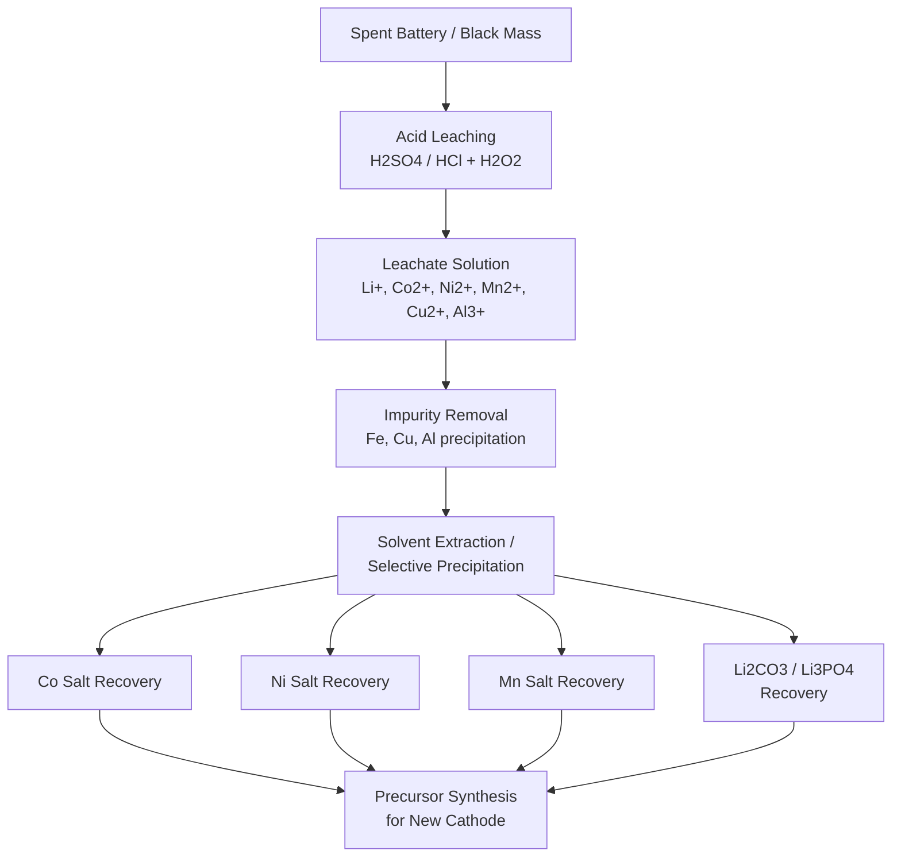

## Recycling of Battery Materials

### Overview and Motivation

The rapid growth of lithium-ion battery (LIB) deployment in electric vehicles (EVs), grid storage, and consumer electronics has created a parallel imperative for end-of-life battery recovery. Recycling addresses three converging pressures: resource scarcity of critical metals (Li, Co, Ni), environmental hazards from improper disposal (electrolyte flammability, heavy metal leaching), and economic incentives from recovering high-value materials.

**Key Points**

- Global LIB demand is projected to generate tens of millions of tonnes of spent batteries by the 2030s, driven primarily by EV retirements
- Cobalt and nickel are classified as critical/strategic materials by multiple governments due to geopolitical supply concentration (e.g., DRC for cobalt)
- Recycling is distinct from second-life reuse: recycling recovers constituent materials, while second-life repurposes degraded-but-functional packs (e.g., stationary storage) before eventual recycling
- Battery recycling closes the loop in a circular economy model, reducing dependence on virgin ore mining

### Battery Chemistries and Recyclability

Different cathode chemistries present different recycling economics and process requirements.

| Chemistry | Composition | Recycling Value Driver | Relative Recyclability |
| --- | --- | --- | --- |
| LCO (LiCoO₂) | High Co content | Co recovery highly profitable | High economic pull |
| NMC (LiNiMnCoO₂) | Ni-Mn-Co blend | Ni and Co recovery valuable | Moderate-high |
| NCA (LiNiCoAlO₂) | Ni-Co-Al | Ni and Co recovery valuable | Moderate-high |
| LFP (LiFePO₄) | Fe-P based, no Co/Ni | Low intrinsic metal value | Economically challenging |
| LMO (LiMn₂O₄) | Mn-based | Low metal value | Low |

**Key Points**

- LFP recycling economics depend heavily on lithium recovery value and regulatory mandates rather than transition-metal value, since iron and phosphate are low-cost commodities
- As NMC formulations shift toward higher nickel, lower cobalt (e.g., NMC 811) to reduce cobalt dependence, the per-kg recycling value of cathode scrap declines, altering recycler business models
- Anode-side graphite is technically recoverable but historically undervalued in commercial recycling streams; this is an active area of process development

### Primary Recycling Process Routes

Three principal industrial approaches exist, often combined in hybrid flowsheets.

#### 1. Pyrometallurgical Recycling

Spent batteries (often whole modules) are fed into a high-temperature furnace (typically >1400°C), smelting the material into a metal alloy (Co, Ni, Cu) and a slag phase.

**Key Points**

- Organic components (electrolyte, binders, separator) are combusted, providing partial process energy and simplifying pretreatment
- Lithium, aluminum, and manganese largely report to the slag phase and are difficult to recover economically, representing a significant yield loss
- Simple, robust, tolerant of mixed/contaminated feedstock — a major operational advantage
- High energy consumption and CO₂ emissions from furnace operation
- Industrial examples include Umicore's process (Belgium) [Unverified: specific current operational parameters may vary by facility and campaign]

#### 2. Hydrometallurgical Recycling

Black mass (shredded, sorted electrode material) is dissolved using aqueous acid leaching, followed by selective precipitation, solvent extraction, or ion exchange to recover individual metal salts.

**Typical process sequence:**

**Key Points**

- Achieves high selectivity and purity (>99% for many metal salts), enabling direct reuse in new cathode precursor synthesis (closed-loop recycling)
- Recovers lithium, unlike pyrometallurgy, which is increasingly important as Li demand rises
- Leaching agents commonly include sulfuric acid (H$_2$SO$_4$) with hydrogen peroxide (H$_2$O$_2$) as a reducing agent to convert Co³⁺/Ni³⁺ to more soluble +2 states
- Generates aqueous waste streams requiring treatment; process complexity scales with the number of metals targeted for separation
- Sensitive to feedstock consistency; mixed chemistries complicate selective separation

#### 3. Direct Recycling (Cathode Regeneration)

Rather than breaking cathode material down to elemental/ionic form, direct recycling aims to preserve and repair the existing crystal structure of the cathode active material, then relithiate it.

**Key Points**

- Potentially the lowest energy-intensity route since it avoids full dissolution and re-synthesis
- Relithiation is commonly performed via hydrothermal or solid-state methods, replenishing lithium lost during cycling-induced degradation
- Highly sensitive to feedstock purity and chemistry uniformity — mixing cathode types (e.g., NMC with LFP) degrades product quality significantly
- Currently less commercially mature than pyro- and hydrometallurgical routes; scale-up remains an active R&D challenge [Inference: based on current commercialization trends, this route is expected to mature over the coming decade but timelines remain uncertain]

### Pretreatment and Black Mass Production

Before hydrometallurgical or direct recycling, spent battery packs undergo mechanical and safety pretreatment.

**Typical pretreatment steps:**

1. **Discharge** — Cells/modules are fully discharged to reduce thermal runaway risk during subsequent handling
2. **Disassembly** — Mechanical dismantling of packs into modules, then cells
3. **Shredding/Crushing** — Cells are shredded, often under inert atmosphere (N₂ or CO₂) or submerged in liquid to suppress fire/explosion risk from residual charge and flammable electrolyte
4. **Thermal treatment (optional)** — Low-temperature pyrolysis removes electrolyte and binder (e.g., PVDF)
5. **Mechanical separation** — Sieving, magnetic separation (Fe casing), and eddy-current separation (Al/Cu foils) isolate the "black mass" (mixed cathode/anode powder) from casing and foil

**Key Points**

- Black mass is the primary intermediate product traded in the recycling supply chain, with composition (Co%, Ni%, Li%) determining its market value
- Copper contamination in black mass is particularly detrimental to downstream hydrometallurgical selectivity and is tightly specified in commercial contracts
- Inert-atmosphere shredding is a critical safety control, as shredding charged or partially charged cells in air has caused documented fires at recycling facilities [Unverified: specific incident frequency varies by facility and safety protocol]

### Electrolyte and Safety Considerations

**Key Points**

- LIB electrolytes contain flammable organic carbonates (e.g., ethylene carbonate, dimethyl carbonate) and the salt LiPF₆, which hydrolyzes to release corrosive and toxic hydrogen fluoride (HF) gas upon contact with moisture
- Thermal runaway risk persists in retired cells even at low state-of-charge, necessitating careful logistics, storage, and transport under regulations for hazardous goods (e.g., UN 3480/3481 classifications)
- Recycling facility design must incorporate fire suppression systems compatible with lithium battery fires (Class D-adjacent hazards), gas scrubbing for HF, and explosion venting

### Material Recovery and Reuse Loop

$$\eta_{recovery} = \frac{m_{recovered}}{m_{initial}} \times 100\%$$

Recovery efficiency ($\eta_{recovery}$) is chemistry- and process-specific; hydrometallurgical routes typically report high recovery fractions for Co, Ni, and Li (often exceeding 90% under optimized conditions), though figures vary considerably by facility, feedstock quality, and reporting methodology [Unverified: cite specific facility data rather than treating as universal benchmarks].

**Closed-loop material flow (svg_diagram):**

<svg xmlns="http://www.w3.org/2000/svg" viewBox="0 0 800 420">
<title>Closed-Loop Battery Material Flow (svg_diagram)</title>
\<style\>
.box { fill: #eef4fb; stroke: #2b5c8a; stroke-width: 2; }
.box2 { fill: #f6efe0; stroke: #a3762a; stroke-width: 2; }
.txt { font-family: Arial, sans-serif; font-size: 14px; fill: #222; text-anchor: middle; }
.lbl { font-family: Arial, sans-serif; font-size: 12px; fill: #444; text-anchor: middle; }
\</style\>
<rect x="30" y="30" width="160" height="60" rx="8" class="box" />
<text x="110" y="55" class="txt">Cell/Pack</text>
<text x="110" y="73" class="txt">Manufacturing</text>
<rect x="30" y="180" width="160" height="60" rx="8" class="box" />
<text x="110" y="205" class="txt">EV / Grid</text>
<text x="110" y="223" class="txt">Service Life</text>
<rect x="30" y="330" width="160" height="60" rx="8" class="box2" />
<text x="110" y="355" class="txt">End-of-Life</text>
<text x="110" y="373" class="txt">Collection</text>
<rect x="320" y="330" width="160" height="60" rx="8" class="box2" />
<text x="400" y="355" class="txt">Pretreatment /</text>
<text x="400" y="373" class="txt">Black Mass</text>
<rect x="610" y="330" width="160" height="60" rx="8" class="box2" />
<text x="690" y="355" class="txt">Hydro/Pyro/Direct</text>
<text x="690" y="373" class="txt">Recycling</text>
<rect x="610" y="180" width="160" height="60" rx="8" class="box2" />
<text x="690" y="205" class="txt">Recovered Metal</text>
<text x="690" y="223" class="txt">Salts / Li2CO3</text>
<rect x="610" y="30" width="160" height="60" rx="8" class="box" />
<text x="690" y="55" class="txt">Precursor &amp;</text>
<text x="690" y="73" class="txt">Cathode Synthesis</text>
<line x1="110" y1="90" x2="110" y2="180" stroke="#333" stroke-width="2" marker-end="url(#arrow)" />
<line x1="110" y1="240" x2="110" y2="330" stroke="#333" stroke-width="2" marker-end="url(#arrow)" />
<line x1="190" y1="360" x2="320" y2="360" stroke="#333" stroke-width="2" marker-end="url(#arrow)" />
<line x1="480" y1="360" x2="610" y2="360" stroke="#333" stroke-width="2" marker-end="url(#arrow)" />
<line x1="690" y1="330" x2="690" y2="240" stroke="#333" stroke-width="2" marker-end="url(#arrow)" />
<line x1="690" y1="180" x2="690" y2="90" stroke="#333" stroke-width="2" marker-end="url(#arrow)" />
<line x1="610" y1="60" x2="190" y2="60" stroke="#333" stroke-width="2" stroke-dasharray="6,4" marker-end="url(#arrow)" />
<text x="400" y="45" class="lbl">Closed loop: new cell uses recycled precursor</text>
</svg>

### Environmental and Regulatory Drivers

**Key Points**

- The EU Battery Regulation (2023/1542) mandates minimum recycled-content thresholds for new batteries (Co, Li, Ni, Pb) and sets collection/recovery efficiency targets, phasing in over the 2020s–2030s [Unverified: exact percentage thresholds and phase-in dates should be verified against the current official regulation text, as amendments may occur]
- Extended Producer Responsibility (EPR) frameworks increasingly place recycling cost/logistics burden on battery manufacturers in various jurisdictions
- Life-cycle assessment (LCA) studies generally show recycled cathode material has substantially lower embodied carbon than virgin-mined and refined material, though the magnitude depends on the recycling route's energy source and regional grid carbon intensity [Inference: directionally well-supported across published LCAs, though exact percentage reductions vary by study methodology]

### Technical and Economic Challenges

**Key Points**

- **Chemistry heterogeneity**: mixed waste streams (LCO, NMC, LFP, NCA all together) complicate sorting and reduce achievable purity in output streams
- **Declining cobalt content**: as cell manufacturers reduce Co in favor of Ni-rich or cobalt-free (LFP) chemistries, the primary economic driver for recycling weakens, requiring policy support or process innovation to remain viable
- **Collection logistics**: geographically dispersed EV retirements and long vehicle lifespans (10–15+ years) create feedstock forecasting uncertainty
- **Design for recycling**: current cell/pack designs (adhesives, welded tabs, mixed materials) were historically optimized for performance and cost, not disassembly; design-for-disassembly is an emerging engineering consideration
- **Graphite anode recovery**: commercially underdeveloped relative to cathode metal recovery, representing an area of ongoing process R&D

### Example: Simplified Hydrometallurgical Mass Balance

For 1000 kg of NMC-based black mass with a nominal composition of approximately 20% Co, 20% Ni, 7% Li, 5% Mn (illustrative values; actual composition varies by cell formulation):

**Example**

- Input: 1000 kg black mass
- Leaching stage recovers ~95% of Co and Ni into solution (typical range, process-dependent)
- Co recovered: $1000 \times 0.20 \times 0.95 = 190 \text{ kg}$
- Ni recovered: $1000 \times 0.20 \times 0.95 = 190 \text{ kg}$
- These recovered metal salts (e.g., CoSO₄, NiSO₄) are then supplied to precursor manufacturers for new cathode active material synthesis

*Note: actual plant-specific yields depend on leaching kinetics, reagent stoichiometry, and impurity levels; figures above are illustrative, not measured plant data.*

### Emerging and Alternative Approaches

**Key Points**

- **Direct cathode-to-cathode (closed-loop) regeneration** research focuses on hydrothermal relithiation with lithium salt solutions to restore capacity in degraded NMC/NCA particles without full dissolution
- **Bioleaching** using microorganisms (e.g., certain bacteria/fungi capable of metal solubilization) is under research as a lower-reagent-intensity alternative to acid leaching, though throughput and scale-up remain developmental [Speculation: commercial viability timeline is not well-established in current literature]
- **Solvent-based cathode delamination** (e.g., using green solvents to separate binder from current collector foils) aims to reduce shredding-induced material losses and improve foil recovery purity

**Related Topics**

- Battery Electrolyte Chemistry and Degradation Mechanisms
- Cathode Active Material Synthesis (Co-precipitation Methods)
- Critical Raw Materials Supply Chains (Li, Co, Ni)
- Second-Life Battery Applications in Stationary Storage
- Life-Cycle Assessment (LCA) Methodology for Energy Storage
- Battery Pack Design for Disassembly and Circularity
- Solid-State Battery Materials (recyclability implications)
- Hydrometallurgical Extraction Fundamentals (Leaching, Solvent Extraction)