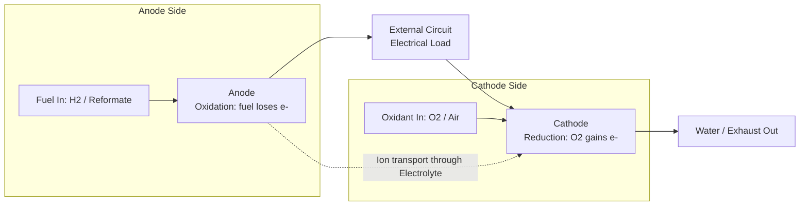

## Fuel Cell Types and Materials

### Overview

A fuel cell is an electrochemical device that directly converts chemical energy from a fuel (commonly hydrogen) and an oxidant (commonly oxygen) into electrical energy, bypassing the combustion cycle and its associated Carnot efficiency limitations. Fuel cells are classified primarily by their electrolyte type, which in turn determines their operating temperature, suitable materials, fuel flexibility, and application domain.

**Key Points**

- Fuel cells produce electricity via redox reactions occurring at spatially separated electrodes (anode and cathode), linked by an ion-conducting electrolyte
- Unlike batteries, fuel cells do not store their own reactants internally — they are supplied continuously with fuel and oxidant, enabling continuous operation as long as reactants are supplied
- Theoretical efficiency is governed by Gibbs free energy conversion rather than thermal-cycle limits, allowing fuel cells to exceed the efficiency of comparable internal combustion systems in ideal conditions

### General Operating Principle

At the anode, fuel is oxidized, releasing electrons that travel through an external circuit to do work before reaching the cathode, where the oxidant is reduced. Ions complete the internal circuit through the electrolyte.

**General reaction (hydrogen-oxygen system):**

$$H_2 + \frac{1}{2}O_2 \rightarrow H_2O + \text{electrical energy} + \text{heat}$$

The theoretical open-circuit voltage is governed by the Nernst equation:

$$E = E^0 - \frac{RT}{nF}\ln{Q}$$

where $E^0$ is the standard cell potential, $R$ is the gas constant, $T$ is temperature, $n$ is the number of electrons transferred, $F$ is Faraday's constant, and $Q$ is the reaction quotient.

### Classification by Electrolyte Type

Fuel cells are conventionally grouped into five to six major types, distinguished by electrolyte chemistry and operating temperature range.

| Type | Electrolyte | Operating Temp. | Charge Carrier | Typical Efficiency |
| --- | --- | --- | --- | --- |
| PEMFC | Solid polymer (e.g., Nafion) | 50–100°C | H⁺ | 40–60% |
| AFC | Aqueous KOH | 60–90°C | OH⁻ | 60–70% |
| PAFC | Liquid phosphoric acid | 150–200°C | H⁺ | 40–45% |
| MCFC | Molten alkali carbonate | 600–700°C | CO₃²⁻ | 45–55% |
| SOFC | Solid ceramic oxide | 600–1000°C | O²⁻ | 50–65% |

*Efficiency figures are typical reported ranges for electrical efficiency and can vary substantially with system design, load, and whether combined heat and power (CHP) integration is included [Unverified: precise efficiency depends on specific system configuration and operating conditions].*

### Proton Exchange Membrane Fuel Cells (PEMFC)

PEMFCs use a thin, solid polymer electrolyte membrane that conducts protons while remaining electronically insulating.

**Materials:**

- **Electrolyte membrane**: Perfluorosulfonic acid (PFSA) polymers, most notably Nafion, consisting of a PTFE backbone with pendant sulfonic acid (-SO₃H) side chains that facilitate proton conduction when hydrated
- **Catalyst**: Platinum or platinum-alloy nanoparticles (e.g., Pt-Co, Pt-Ni) dispersed on high-surface-area carbon black support, used at both electrodes
- **Gas diffusion layer (GDL)**: Carbon fiber paper or cloth, often treated with PTFE for hydrophobicity to manage water removal
- **Bipolar plates**: Graphite composite or coated stainless steel, providing structural support, gas flow channels, and electrical interconnection between cells

**Key Points**

- Membrane conductivity is strongly dependent on hydration state — water management is a critical system-level engineering challenge, since dry membranes lose proton conductivity while flooding blocks gas diffusion
- Pt catalyst loading is a major cost driver; catalyst research focuses heavily on reducing Pt content through alloying and improved utilization (e.g., core-shell nanoparticle structures)
- Highly sensitive to CO poisoning of the Pt catalyst (even ppm-level CO from reformed hydrogen can significantly degrade performance), necessitating high-purity hydrogen feed
- Fast startup and dynamic response make PEMFCs the dominant choice for automotive and portable applications

### Alkaline Fuel Cells (AFC)

AFCs use an aqueous potassium hydroxide (KOH) solution as the electrolyte, historically notable for early spaceflight applications (e.g., Apollo program).

**Materials:**

- **Electrolyte**: Aqueous KOH solution (typically 30–45 wt%), either free-flowing or immobilized in a matrix (e.g., asbestos historically, now alternative matrices)
- **Catalyst**: Non-precious metal catalysts feasible (e.g., Ni, Ag) due to favorable alkaline kinetics, though Pt is also used in some designs

**Key Points**

- Faster oxygen reduction kinetics in alkaline media historically allowed non-noble-metal catalysts, reducing cost relative to acidic-electrolyte systems
- Critically sensitive to CO₂ contamination: CO₂ reacts with KOH to form carbonate precipitates ($2KOH + CO_2 \rightarrow K_2CO_3 + H_2O$), which degrades electrolyte conductivity and can block pores — this restricts AFCs to pure oxygen/hydrogen feeds rather than ambient air, limiting terrestrial applications

### Phosphoric Acid Fuel Cells (PAFC)

**Materials:**

- **Electrolyte**: Concentrated liquid phosphoric acid (H₃PO₄) immobilized in a silicon carbide (SiC) matrix
- **Catalyst**: Platinum on carbon support (similar to PEMFC but generally more CO-tolerant due to higher operating temperature)
- **Electrodes**: Carbon-based, similar in construction principle to PEMFC electrodes

**Key Points**

- Higher operating temperature (~150–200°C) improves CO tolerance relative to PEMFC, allowing use of less-pure reformed hydrogen
- Among the most commercially mature fuel cell types for stationary power generation, with substantial field deployment history in distributed/combined heat-and-power applications
- Relatively low power density compared to PEMFC, and slower startup due to thermal mass

### Molten Carbonate Fuel Cells (MCFC)

**Materials:**

- **Electrolyte**: Molten mixture of alkali carbonates (typically lithium and potassium carbonate, Li₂CO₃/K₂CO₃) retained in a porous ceramic lithium aluminate (LiAlO₂) matrix
- **Anode**: Porous nickel-chromium (Ni-Cr) alloy
- **Cathode**: Lithiated nickel oxide (NiO), which forms in situ during operation
- **Interconnects**: Stainless steel, engineered for corrosion resistance in the molten carbonate environment

**Key Points**

- High operating temperature (~600–700°C) enables internal reforming of hydrocarbon fuels (e.g., natural gas) directly within the stack, simplifying system balance-of-plant
- CO₃²⁻ ion transport requires CO₂ to be supplied at the cathode as part of the reduction reaction, creating a coupled CO₂/O₂ feed requirement
- Corrosion of metallic components (especially the nickel cathode, which can dissolve and migrate) and long-term electrolyte loss are significant durability challenges affecting stack lifetime

### Solid Oxide Fuel Cells (SOFC)

SOFCs use a fully solid ceramic electrolyte, enabling robust, high-temperature operation with broad fuel flexibility.

**Materials:**

- **Electrolyte**: Yttria-stabilized zirconia (YSZ), typically 8 mol% Y₂O₃-doped ZrO₂, providing O²⁻ ion conductivity at elevated temperature; alternative electrolytes include gadolinium-doped ceria (GDC) for intermediate-temperature operation
- **Anode**: Nickel-YSZ cermet (ceramic-metal composite), combining Ni's catalytic/electronic conductivity with YSZ's ionic conductivity and thermal expansion compatibility
- **Cathode**: Lanthanum strontium manganite (LSM) or lanthanum strontium cobalt ferrite (LSCF), mixed ionic-electronic conductors
- **Interconnects**: Lanthanum chromite ceramics (historically) or chromium-based metallic alloys (in lower-temperature designs), engineered to match thermal expansion coefficients of adjacent cell layers

**Key Points**

- Highest operating temperature range (600–1000°C) among common fuel cell types enables direct internal reforming of hydrocarbons and even some direct-carbon operation
- No precious metal catalyst required due to high-temperature reaction kinetics, offering a materials cost advantage over PEMFC
- Thermal expansion coefficient (TEC) matching between electrolyte, electrode, and interconnect layers is a critical materials engineering constraint — mismatch causes delamination and cracking during thermal cycling
- Slow startup time (due to thermal mass and ramp requirements) makes SOFCs best suited to stationary/continuous-operation applications rather than dynamic automotive use
- Redox cycling (repeated oxidation/reduction of the Ni-YSZ anode) can cause volume changes and mechanical degradation, an active area of materials durability research

### Comparative Cell Architecture (Diagram)

### Fuel Flexibility and Reforming

**Key Points**

- PEMFC and AFC require high-purity hydrogen, typically necessitating external reforming and extensive gas cleanup (e.g., water-gas shift, preferential oxidation) when hydrocarbon feedstocks are the hydrogen source
- MCFC and SOFC, operating at high temperature, can perform internal reforming of methane and other light hydrocarbons directly at the anode, reducing system complexity: $CH_4 + H_2O \rightarrow CO + 3H_2$ (steam reforming), followed by the water-gas shift reaction
- Sulfur compounds in hydrocarbon fuels are catalyst poisons across most fuel cell types and require desulfurization pretreatment regardless of cell type

### Degradation Mechanisms

**Key Points**

- **PEMFC**: membrane chemical degradation (radical attack thinning the membrane), catalyst Pt dissolution/Ostwald ripening (loss of active surface area), carbon support corrosion under start-stop cycling
- **SOFC**: Ni coarsening in the anode, Cr poisoning of the cathode from metallic interconnects (chromium migrating and depositing at cathode active sites), electrolyte/electrode delamination from thermal cycling stress
- **MCFC**: electrolyte loss via evaporation and corrosion product formation, NiO cathode dissolution into the molten carbonate followed by Ni metal precipitation causing internal short circuits
- Degradation rates and dominant mechanisms are strongly dependent on operating conditions (load cycling, temperature excursions, fuel impurities), so quantitative lifetime predictions vary considerably by application and should be treated as system-specific [Unverified: exact degradation rates depend on specific operating protocols]

### Example: PEMFC Stack Voltage Calculation

**Example**

For a PEMFC stack composed of 50 cells connected in series, each producing a typical operating voltage of approximately 0.7 V under load:

$$V_{stack} = N_{cells} \times V_{cell} = 50 \times 0.7\text{ V} = 35\text{ V}$$

This illustrates why practical fuel cell systems stack many individual cells in series (bipolar plate architecture) to reach usable system voltages, since a single cell's open-circuit voltage rarely exceeds ~1.2 V and drops further under load due to activation, ohmic, and concentration polarization losses.

### Applications by Fuel Cell Type

| Type | Primary Application Domain |
| --- | --- |
| PEMFC | Automotive (FCEVs), portable power, backup power |
| AFC | Aerospace (historical), niche terrestrial with pure O₂/H₂ |
| PAFC | Stationary distributed generation, CHP |
| MCFC | Utility-scale stationary power, industrial CHP |
| SOFC | Stationary power generation, CHP, some auxiliary power units (APUs) |

**Related Topics**

- Hydrogen Production Methods (Electrolysis, Steam Methane Reforming)
- Proton Exchange Membrane Materials and Degradation
- Solid Oxide Electrolysis Cells (SOEC) and Reversible Fuel Cells
- Platinum Group Metal Catalysis and Catalyst Cost Reduction Strategies
- Hydrogen Storage Materials (Metal Hydrides, Compressed/Liquid H₂)
- Bipolar Plate Materials and Corrosion Resistance
- Balance-of-Plant Engineering for Fuel Cell Systems