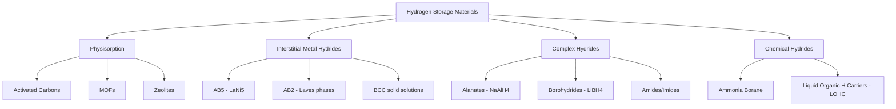
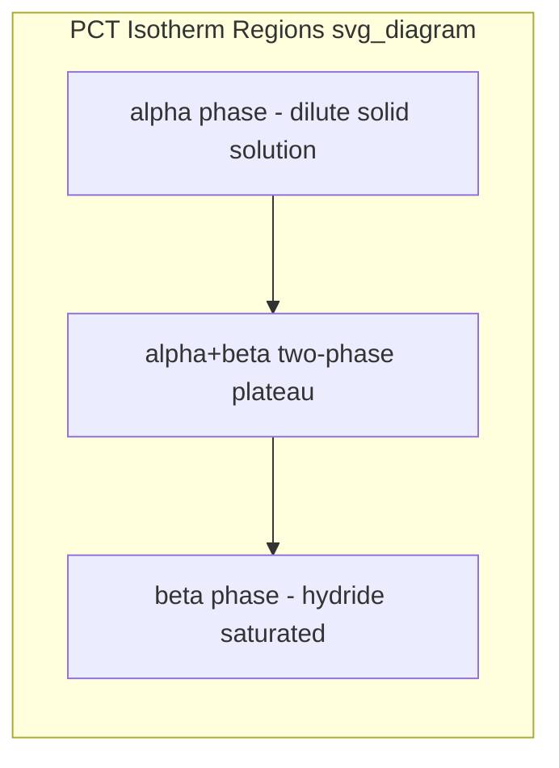

## Hydrogen Storage Materials

### Overview

Hydrogen storage materials are the class of solid- and liquid-phase media engineered to hold hydrogen at higher volumetric and gravimetric densities than compressed gas or cryogenic liquid storage alone, while allowing controlled uptake and release. They are central to fuel cell vehicles, stationary power buffering, and grid-scale hydrogen economy infrastructure, where the core engineering trade-off is packing density versus kinetics versus thermodynamics versus cost.

### Storage Strategy Taxonomy

**Key Points**

- Physical storage: compressed gas (350–700 bar) and cryogenic liquid (20 K) — not materials-based, but the baseline comparison
- Physisorption materials: hydrogen physically adsorbed via van der Waals forces onto high-surface-area solids
- Chemisorption/interstitial materials: hydrogen dissociates and occupies lattice interstitial sites (metal hydrides)
- Chemical hydrides: hydrogen bound in covalent/ionic compounds, released via hydrolysis or thermolysis, often irreversible on-board
- Complex hydrides: hydrogen in covalent anionic complexes ($\text{AlH}_4^-$, $\text{BH}_4^-$, $\text{NH}_2^-$), reversible under specific $P$-$T$ conditions

### Thermodynamics of Metal Hydride Formation

The reversible metal-hydrogen reaction is:

$$M + \frac{x}{2}H_2 \leftrightarrow MH_x + \Delta H$$

The equilibrium hydrogen pressure over a hydride phase follows the van't Hoff relation:

$$\ln\left(\frac{P_{eq}}{P^0}\right) = \frac{\Delta H}{RT} - \frac{\Delta S}{R}$$

where $\Delta H$ is the hydride formation enthalpy (negative, exothermic) and $\Delta S$ is dominated by the loss of translational entropy of $H_2$ gas upon absorption, approximately $130\ \text{J/(mol·K)}$ across nearly all metal hydrides. This near-universal $\Delta S$ value means $\Delta H$ alone dictates the equilibrium (plateau) pressure at a given temperature — the central design lever for tuning a hydride's operating window.

Pressure-Composition-Temperature (PCT) behavior is characterized by an isotherm with a flat two-phase plateau region ($\alpha$ + $\beta$ hydride coexistence) bounded by solid-solution ($\alpha$) and hydride ($\beta$) single-phase regions:

### Interstitial Metal Hydrides

**Key Points**

- Hydrogen occupies tetrahedral or octahedral interstitial sites in the host metal lattice
- Classic intermetallic families follow $AB_x$ nomenclature: A = hydride-forming element (high $\Delta H$ affinity, e.g., La, Ti, Zr, Mg), B = weak/non-hydride former (e.g., Ni, Fe, Mn, Cr) that tunes thermodynamics and adds catalytic dissociation sites
- $AB_5$ (e.g., $\text{LaNi}_5\text{H}_6$): CaCu5-type hexagonal structure, ~1.4 wt% H, room-temperature plateau near 2 bar, excellent kinetics, used in NiMH batteries
- $AB_2$ Laves phases (e.g., $\text{ZrMn}_2$, $\text{TiMn}_2$): ~1.8–2.0 wt%, cubic C15 or hexagonal C14 structures
- $AB$ (e.g., $\text{TiFe}$): ~1.9 wt%, low cost, but requires activation (surface oxide removal) before first hydrogenation
- $A_2B$ (e.g., $\text{Mg}_2\text{Ni}$): ~3.6 wt%, higher capacity but requires elevated temperatures (~300 °C) due to high $\Delta H$
- BCC solid solutions (Ti-V-Cr, Ti-V-Mn alloys): higher capacities (2–4 wt%) via multiple interstitial site occupation

**Example**

$\text{LaNi}_5$ hydrogenation:

$$\text{LaNi}_5 + 3H_2 \leftrightarrow \text{LaNi}_5\text{H}_6$$

The reaction proceeds via $H_2$ dissociative chemisorption on Ni sites (catalytically active), followed by atomic H diffusion into octahedral interstices of the hexagonal lattice, producing a ~25% unit cell volume expansion in the fully hydrided $\beta$-phase — a major driver of decrepitation (particle pulverization) over cycling.

### Complex (Chemical) Hydrides

**Key Points**

- Hydrogen bound covalently within a complex anion, offset by an alkali/alkaline-earth cation
- Substantially higher gravimetric capacities than interstitial hydrides because light elements (Al, B, N) replace heavy transition metals
- Often suffer from sluggish kinetics and multi-step decomposition pathways requiring catalytic doping

**Alanates** ($\text{AlH}_4^-$-based):

$$3\text{NaAlH}_4 \leftrightarrow \text{Na}_3\text{AlH}_6 + 2\text{Al} + 3H_2 \quad (3.7\ \text{wt\%})$$

$$\text{Na}_3\text{AlH}_6 \leftrightarrow 3\text{NaH} + \text{Al} + \frac{3}{2}H_2 \quad (1.9\ \text{wt\%})$$

Ti-catalyzed $\text{NaAlH}_4$ (Bogdanović & Schwickardi, 1997) was the landmark discovery demonstrating reversibility of an alanate under moderate conditions ($\sim$80–150 °C, 1–150 bar), a milestone since undoped alanates are otherwise kinetically inert at practical temperatures.

**Borohydrides** ($\text{BH}_4^-$-based):

$$\text{LiBH}_4 \rightarrow \text{LiH} + \text{B} + \frac{3}{2}H_2 \quad (13.9\ \text{wt\% theoretical})$$

$\text{LiBH}_4$ has one of the highest gravimetric capacities of any known hydride but decomposition requires >400 °C and rehydrogenation requires extreme pressures (>350 bar $H_2$), limiting on-board practicality; nanoconfinement (e.g., in mesoporous carbon scaffolds) has been shown to improve kinetics and lower onset temperatures. [Inference: the degree of improvement is scaffold- and pore-size-dependent, and reported values vary considerably across studies.]

**Amides/Imides** (Mg-N-H, Li-N-H systems):

$$\text{LiNH}_2 + \text{LiH} \leftrightarrow \text{Li}_2\text{NH} + H_2 \quad (6.5\ \text{wt\%})$$

Destabilization via cation mixing (e.g., combining $\text{LiNH}_2$ with $\text{MgH}_2$) lowers the effective $\Delta H$ compared to the pure Li-N-H system, an application of thermodynamic "destabilization" — deliberately mixing two hydride systems so their combined reaction enthalpy is lower than either alone.

### Physisorption-Based Materials

**Key Points**

- Hydrogen molecules bind via weak van der Waals interactions ($\Delta H \approx 4$–10 kJ/mol) — much weaker than chemisorption ($\Delta H \approx 20$–100+ kJ/mol)
- Fully reversible with near-zero hysteresis and fast kinetics, but requires cryogenic temperatures (typically 77 K) for appreciable uptake because binding energy is comparable to thermal energy $k_BT$ at room temperature
- Metal-Organic Frameworks (MOFs): ultra-high surface area (>5000 m²/g for materials like MOF-210), tunable pore architecture; e.g., MOF-5, MOF-177, NU-100
- Activated carbons and carbon nanotubes: surface-area-driven uptake, roughly correlating with BET surface area at 77 K
- Zeolites: lower capacity than MOFs/carbons due to smaller pore volumes but excellent thermal/chemical stability

**Example**

Excess gravimetric uptake in MOFs at 77 K scales approximately linearly with BET surface area up to ~10 wt% for record materials such as NU-100 and MOF-210, but drops sharply at 298 K to well under 1 wt% at practical pressures, illustrating the fundamental physisorption temperature penalty. [Unverified: exact uptake figures are highly dependent on measurement protocol, sample activation, and pressure range, and published values differ across research groups.]

### Liquid Organic Hydrogen Carriers (LOHC)

**Key Points**

- Aromatic organic molecules that are catalytically hydrogenated (H-loading) and dehydrogenated (H-release) using heterogeneous catalysts (typically Pt, Pd, Ru, Ni-based)
- Common pairs: toluene/methylcyclohexane (MCH), dibenzyltoluene/perhydro-dibenzyltoluene (commercial "Hydrogenious" system), N-ethylcarbazole
- Behave like conventional liquid fuels at ambient conditions — compatible with existing tanker/pipeline infrastructure
- Dehydrogenation is strongly endothermic (~65–70 kJ/mol $H_2$ for dibenzyltoluene systems), requiring significant heat input at the point of release, which is the principal efficiency penalty of the LOHC approach

$$\text{Perhydro-DBT} \xrightarrow{\text{catalyst, heat}} \text{DBT} + 9H_2$$

### Chemical Hydrides (Non-Reversible On-Board)

**Key Points**

- Ammonia borane ($\text{NH}_3\text{BH}_3$): ~19.6 wt% theoretical, releases $H_2$ via thermolysis/hydrolysis but by-product regeneration requires off-board chemical reprocessing
- Sodium borohydride hydrolysis: $\text{NaBH}_4 + 2H_2O \rightarrow \text{NaBO}_2 + 4H_2$, historically explored (e.g., Millennium Cell) but abandoned commercially due to regeneration energy penalty
- These systems trade on-board simplicity and safety for off-board infrastructure burden — the spent fuel must be collected and chemically regenerated at a separate facility rather than refilled directly

### DOE Technical Targets Framework (Benchmarking Context)

**Key Points**

- The U.S. DOE Hydrogen Program sets system-level (not just materials-level) targets for light-duty vehicle onboard storage, commonly cited reference points historically included ~6.5 wt% gravimetric and ~50 g H₂/L volumetric capacity along with operating temperature, kinetics, and cost metrics [Unverified: exact numeric targets have been revised across program years; consult current DOE Hydrogen Program documentation for the authoritative figures in force at any given time]
- System-level capacity is always lower than materials-level capacity due to tank, insulation, valve, and heat-exchanger overhead — a critical distinction when comparing literature values

### Comparative Summary Table

| Material Class | Example | Gravimetric Capacity | Operating Temp | Reversibility |
| --- | --- | --- | --- | --- |
| $AB_5$ hydride | $\text{LaNi}_5\text{H}_6$ | ~1.4 wt% | RT | Excellent |
| $AB_2$ Laves | $\text{ZrMn}_2\text{H}_x$ | ~1.8 wt% | RT–100 °C | Good |
| $A_2B$ hydride | $\text{Mg}_2\text{NiH}_4$ | ~3.6 wt% | ~300 °C | Good |
| Alanate | $\text{NaAlH}_4$ (Ti-doped) | 3.7–5.6 wt% | 80–150 °C | Moderate |
| Borohydride | $\text{LiBH}_4$ | up to 13.9 wt% (theor.) | >400 °C | Poor (bulk) |
| MOF (physisorption) | MOF-177, NU-100 | up to ~10 wt% (77 K) | 77 K | Excellent |
| LOHC | Perhydro-DBT | ~6.2 wt% | 150–300 °C (release) | Good (catalytic) |
| Chemical hydride | $\text{NH}_3\text{BH}_3$ | ~19.6 wt% (theor.) | Variable | Off-board only |

### Degradation and Cycling Considerations

**Key Points**

- Interstitial hydrides: lattice expansion/contraction over cycling causes decrepitation (particle size reduction), increasing surface area but also promoting pyrophoric oxide layer formation and reducing tap density
- Complex hydrides: incomplete reversibility due to phase segregation, sluggish solid-state diffusion, and irreversible side-phase formation (e.g., borate/boride formation in borohydrides)
- Poisoning: trace $\text{O}_2$, $\text{H}_2\text{O}$, and CO in feed hydrogen can poison catalytic surface sites (particularly Ti-dopant sites in alanates and Pd/Pt in LOHC dehydrogenation catalysts)
- Physisorbents: generally excellent cyclability due to weak, non-destructive binding, though pore collapse/framework degradation can occur in humid or reactive environments (notably in some MOFs)

### Illustrative Schematic: Interstitial Hydride Unit Cell Concept

<svg xmlns="http://www.w3.org/2000/svg" viewBox="0 0 500 300">
<text x="250" y="25" font-size="16" text-anchor="middle" font-family="sans-serif" font-weight="bold">AB5 Interstitial Hydride Lattice (svg_diagram)</text>
<circle cx="150" cy="150" r="14" fill="#4a7ab5" />
<circle cx="250" cy="150" r="14" fill="#4a7ab5" />
<circle cx="350" cy="150" r="14" fill="#4a7ab5" />
<circle cx="200" cy="90" r="14" fill="#4a7ab5" />
<circle cx="300" cy="90" r="14" fill="#4a7ab5" />
<circle cx="200" cy="210" r="14" fill="#4a7ab5" />
<circle cx="300" cy="210" r="14" fill="#4a7ab5" />
<circle cx="200" cy="150" r="6" fill="#d1495b" />
<circle cx="250" cy="120" r="6" fill="#d1495b" />
<circle cx="300" cy="150" r="6" fill="#d1495b" />
<circle cx="250" cy="180" r="6" fill="#d1495b" />
<line x1="150" y1="150" x2="200" y2="90" stroke="#999" stroke-width="1" />
<line x1="200" y1="90" x2="300" y2="90" stroke="#999" stroke-width="1" />
<line x1="300" y1="90" x2="350" y2="150" stroke="#999" stroke-width="1" />
<line x1="150" y1="150" x2="200" y2="210" stroke="#999" stroke-width="1" />
<line x1="200" y1="210" x2="300" y2="210" stroke="#999" stroke-width="1" />
<line x1="300" y1="210" x2="350" y2="150" stroke="#999" stroke-width="1" />
<line x1="150" y1="150" x2="350" y2="150" stroke="#999" stroke-width="1" stroke-dasharray="4,3" />
<circle cx="380" cy="255" r="8" fill="#4a7ab5" />
<text x="400" y="260" font-size="12" font-family="sans-serif">Host metal atom (B-site, e.g. Ni)</text>
<circle cx="380" cy="275" r="5" fill="#d1495b" />
<text x="400" y="280" font-size="12" font-family="sans-serif">Interstitial H atom</text>
</svg>

### Related Topics

- Metal hydride hydrogen compressors and thermal compression cycles
- Destabilized hydride systems and reactive hydride composites (RHC)
- Nanoconfinement and scaffold-based kinetic enhancement
- Catalytic dopant mechanisms (Ti in alanates, transition-metal nanoparticles)
- MOF pore-engineering for room-temperature physisorption
- On-board vs. off-board regeneration system design for chemical hydrides
- Hydrogen embrittlement in structural/tank materials (complementary failure mode)
- Fuel cell integration: heat management coupling between hydride desorption and PEMFC waste heat