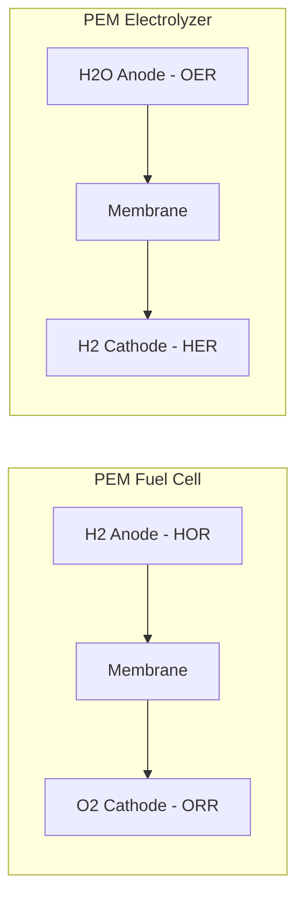
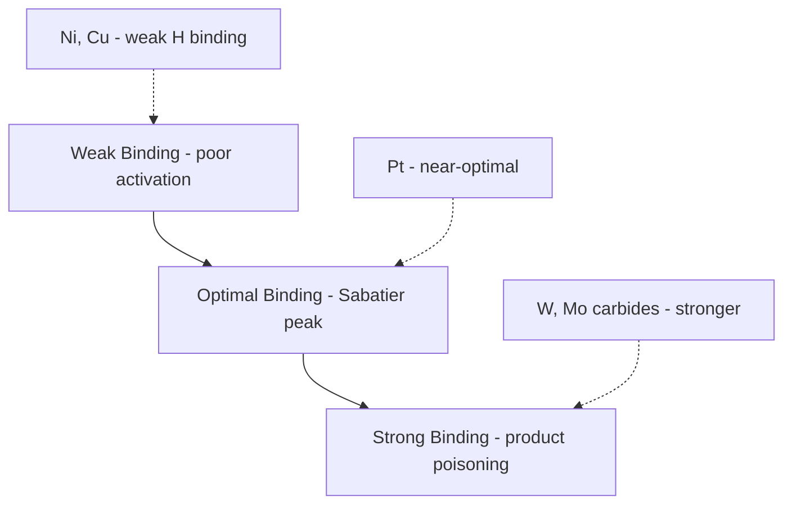

## Catalyst Materials for Energy Conversion

### Overview

Catalyst materials for energy conversion accelerate the electrochemical and thermochemical reactions that interconvert chemical and electrical energy — hydrogen oxidation/evolution, oxygen reduction/evolution, and related redox processes in fuel cells, electrolyzers, and photoelectrochemical devices. Performance is governed by the interplay of intrinsic activity (electronic structure), active site density (nanostructuring), mass transport (support/ionomer architecture), and long-term stability under operating potentials.

### Core Reaction Classes

**Key Points**

- Hydrogen Oxidation Reaction (HOR): $H_2 \rightarrow 2H^+ + 2e^-$ (fuel cell anode) — kinetically facile on Pt, among the fastest electrocatalytic reactions known
- Hydrogen Evolution Reaction (HER): $2H^+ + 2e^- \rightarrow H_2$ (electrolyzer cathode)
- Oxygen Reduction Reaction (ORR): $O_2 + 4H^+ + 4e^- \rightarrow 2H_2O$ (fuel cell cathode) — the dominant efficiency-limiting reaction in PEM fuel cells due to sluggish kinetics
- Oxygen Evolution Reaction (OER): $2H_2O \rightarrow O_2 + 4H^+ + 4e^-$ (electrolyzer anode) — the dominant overpotential source in water electrolysis

### Sabatier Principle and Volcano Plots

**Key Points**

- Catalytic activity for a given reaction peaks at an intermediate binding energy of the key adsorbed intermediate — binding too weakly limits adsorption/activation, binding too strongly poisons the surface by blocking desorption
- For HER, the descriptor is hydrogen adsorption free energy $\Delta G_{H^*}$; Pt sits near the apex of the HER volcano plot with $\Delta G_{H^*} \approx 0$
- For ORR, the descriptor is typically oxygen or OH* binding energy; Pt again sits near the volcano apex, which is the fundamental reason platinum-group metals (PGMs) dominate practical catalyst formulations despite cost

$$\text{Activity} \approx f(\Delta G_{intermediate}), \quad \text{maximized near } \Delta G \approx 0$$

### Platinum-Group Metal (PGM) Catalysts

**Key Points**

- Pt and Pt-alloy nanoparticles (typically 2–5 nm) supported on high-surface-area carbon (Pt/C) remain the benchmark for both HOR and ORR in PEM fuel cells
- Pt-alloys (Pt-Co, Pt-Ni, Pt-Cu) with de-alloyed, Pt-skin surface structures shift the d-band center of surface Pt atoms via strain and ligand effects, weakening OH* binding relative to pure Pt and improving mass activity
- Pt-Ni octahedral nanoframes and other shape-controlled nanocrystals expose specific low-coordination facets (e.g., Pt3Ni(111)) with enhanced intrinsic ORR activity per unit Pt mass
- PGM loading reduction is a primary cost-driver focus: state-of-the-art catalyst layers target well under 0.2 mg Pt/cm² total loading for both electrodes combined in automotive PEM stacks [Inference: exact target values are program- and manufacturer-specific and shift with DOE/industry roadmap updates]

**d-Band Center Model**

The d-band center theory (Hammer-Nørskov) explains how alloying shifts adsorbate binding strength:

$$\varepsilon_d \downarrow \Rightarrow \text{antibonding states fill} \Rightarrow \text{weaker adsorbate binding}$$

Compressive strain from a smaller alloying element (e.g., Co, Ni in a Pt shell) lowers the Pt d-band center, weakening OH* adsorption and reducing OH*-induced site-blocking, a major contributor to ORR overpotential on pure Pt.

### PGM-Free and PGM-Reduced Catalysts

**Key Points**

- Fe-N-C and Co-N-C catalysts (metal-nitrogen-carbon, "M-N-C"): atomically dispersed transition-metal-N4 moieties embedded in a nitrogen-doped carbon matrix, derived typically via pyrolysis of metal-N precursor complexes (e.g., ZIF-8-based MOFs)
- Active site debate centers on $\text{Fe-N}_4$ (FeN4C12-type) planar coordination sites analogous to porphyrin/heme active centers
- Durability remains the principal barrier versus Pt/C: demetalation, carbon corrosion, and $H_2O_2$-mediated Fenton-type radical attack on the carbon matrix under fuel-cell operating potentials
- Transition-metal chalcogenides (e.g., $\text{Co}_9\text{S}_8$, $\text{MoS}_2$ edge sites) and carbides ($\text{Mo}_2\text{C}$, $\text{WC}$) serve as PGM-free HER catalysts, particularly in alkaline and acidic electrolyzer contexts

### OER Catalysts (Electrolyzer Anode)

**Key Points**

- OER is the most thermodynamically and kinetically demanding step in water splitting due to its four-electron/four-proton-coupled mechanism and multiple high-energy intermediates ($\text{OH}^*$, $\text{O}^*$, $\text{OOH}^*$)
- Acidic-media OER (PEM electrolyzers) requires corrosion-resistant oxides: $\text{IrO}_2$ and $\text{RuO}_2$ dominate; Ir is preferred for stability despite lower intrinsic activity than Ru, since $\text{RuO}_2$ dissolves via over-oxidation to soluble $\text{RuO}_4$ under anodic bias
- Alkaline-media OER permits far more catalyst diversity due to milder corrosion demands: Ni-Fe (oxy)hydroxides ($\text{NiFeOOH}$) show activity rivaling or exceeding $\text{IrO}_2$ in alkaline electrolytes, with Fe incorporation (even trace, from electrolyte impurities) critical to activity — a well-documented but mechanistically still-debated promotion effect [Unverified: the precise electronic origin of Fe promotion in NiFeOOH is an active area of ongoing mechanistic study with multiple competing models in the literature]
- Perovskite oxides ($\text{LaNiO}_3$, $\text{Ba}_{0.5}\text{Sr}_{0.5}\text{Co}_{0.8}\text{Fe}_{0.2}\text{O}_{3-\delta}$, "BSCF") offer tunable $e_g$ orbital filling correlated with OER activity trends (Suntivich descriptor)

### Scaling Relations and Their Limits

**Key Points**

- Adsorbate binding energies of chemically related intermediates (e.g., $\text{OH}^*$, $\text{OOH}^*$, $\text{O}^*$ in ORR/OER) scale linearly with one another across many catalyst surfaces — because they share a common bonding atom to the surface
- The ORR/OER scaling relation between $\Delta G_{OH^*}$ and $\Delta G_{OOH^*}$ imposes a theoretical minimum overpotential (~0.2–0.4 V) that single-site catalysts cannot fully overcome, since no single descriptor value optimizes all intermediates simultaneously
- Breaking scaling relations is an active design strategy: dual-site catalysts, non-planar coordination environments, and single-atom catalysts with tailored second-coordination-sphere effects aim to decouple intermediate binding energies

### Photoelectrochemical and Photocatalytic Materials

**Key Points**

- Semiconductor photocatalysts (e.g., $\text{TiO}_2$, $\text{BiVO}_4$, $\text{Fe}_2\text{O}_3$) absorb photons to generate electron-hole pairs that drive redox reactions at the semiconductor-electrolyte interface
- Band-edge alignment relative to the $H_2/H_2O$ and $O_2/H_2O$ redox potentials determines whether unassisted overall water splitting is thermodynamically feasible
- Co-catalyst decoration (e.g., Pt or $\text{NiO}_x$ nanoparticles on $\text{TiO}_2$) suppresses electron-hole recombination by providing spatially separated reaction sites and accelerating interfacial charge transfer
- Band gap-efficiency trade-off: narrower gaps absorb more of the solar spectrum but provide less driving-force overpotential margin for the reaction

$$\eta_{STH} = \frac{P_{output}}{P_{solar\ input}} \times 100\%$$

where $\eta_{STH}$ is solar-to-hydrogen efficiency, the standard figure of merit for integrated photoelectrochemical water-splitting devices.

### Catalyst Support and Durability Engineering

**Key Points**

- Carbon black supports (e.g., Vulcan XC-72) provide high surface area and electrical conductivity but are susceptible to electrochemical corrosion, especially during fuel-cell start-stop cycling, which drives local cathode potentials above 1.5 V and accelerates carbon oxidation
- Corrosion-resistant supports under active development: doped tin oxides, titanium suboxides ($\text{Ti}_4\text{O}_7$, Magnéli phases), and graphitized carbons
- Nanoparticle sintering/coarsening (Ostwald ripening) and particle detachment are principal degradation modes reducing electrochemically active surface area (ECSA) over cycling
- Accelerated stress tests (ASTs) with defined potential-cycling protocols are the standard method to benchmark catalyst durability against fuel-cell/electrolyzer operating-life targets

### Comparative Summary Table

| Reaction | Benchmark Catalyst | Alternative/Emerging | Key Limitation |
| --- | --- | --- | --- |
| HOR | Pt/C | PtRu/C (CO-tolerant) | CO poisoning (reformate H2) |
| ORR | Pt-alloy/C (PtCo, PtNi) | Fe-N-C, PGM-free | Sluggish kinetics, Pt cost |
| HER | Pt/C | $\text{MoS}_2$, $\text{Mo}_2\text{C}$, $\text{Ni}_2\text{P}$ | Lower intrinsic activity |
| OER (acid) | $\text{IrO}_2$ | — | Ir scarcity, cost |
| OER (alkaline) | $\text{NiFeOOH}$ | Perovskite oxides | Lower intrinsic conductivity |

### Illustrative Schematic: ORR Volcano Plot Concept

<svg xmlns="http://www.w3.org/2000/svg" viewBox="0 0 500 320">
<text x="250" y="25" font-size="16" text-anchor="middle" font-family="sans-serif" font-weight="bold">ORR Activity Volcano Plot (svg_diagram)</text>
<line x1="60" y1="270" x2="460" y2="270" stroke="black" stroke-width="1.5" />
<line x1="60" y1="270" x2="60" y2="60" stroke="black" stroke-width="1.5" />
<text x="260" y="300" font-size="13" text-anchor="middle" font-family="sans-serif">ΔG(OH*) binding energy (eV)</text>
<text x="25" y="170" font-size="13" text-anchor="middle" font-family="sans-serif" transform="rotate(-90,25,170)">ORR Activity</text>
<path d="M 80 250 Q 260 70 440 250" fill="none" stroke="#4a7ab5" stroke-width="2.5" />
<circle cx="260" cy="90" r="6" fill="#d1495b" />
<text x="260" y="75" font-size="12" text-anchor="middle" font-family="sans-serif">Pt</text>
<circle cx="150" cy="200" r="6" fill="#3d8b52" />
<text x="150" y="220" font-size="12" text-anchor="middle" font-family="sans-serif">Ni (weak binding)</text>
<circle cx="370" cy="210" r="6" fill="#e29b1a" />
<text x="370" y="230" font-size="12" text-anchor="middle" font-family="sans-serif">Au (strong binding)</text>
<circle cx="300" cy="110" r="6" fill="#7b4fa0" />
<text x="300" y="130" font-size="12" text-anchor="middle" font-family="sans-serif">Pd</text>
</svg>

### Related Topics

- Membrane electrode assembly (MEA) architecture and ionomer/catalyst-layer integration
- Single-atom catalysts (SACs) and atomic dispersion strategies
- Bipolar plate materials and interfacial contact resistance
- Fuel cell/electrolyzer degradation mechanisms and accelerated stress testing protocols
- Perovskite and spinel oxide catalyst design for alkaline OER
- CO tolerance and reformate-gas compatible anode catalysts
- Techno-economic analysis of PGM loading reduction pathways
- Photoelectrode band-gap engineering for solar water splitting