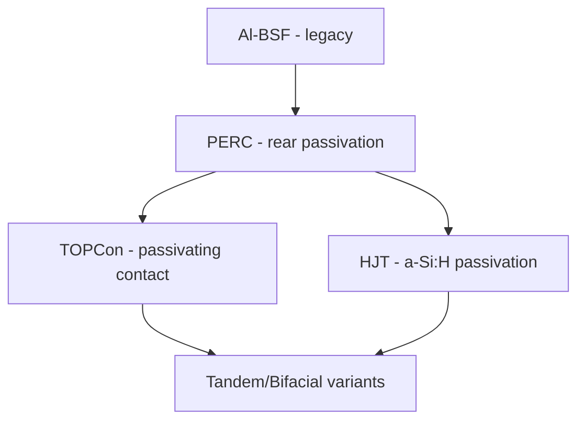

## Silicon Photovoltaic Materials

### Overview

Silicon photovoltaic materials convert solar photons directly into electrical current via the semiconductor photovoltaic effect, underpinning roughly 90%+ of global installed PV capacity. Performance and cost are governed by the interplay of crystallinity, doping architecture, defect/impurity control, light-trapping design, and surface passivation — each addressed by a distinct materials-processing lineage from metallurgical-grade silicon through to finished cell.

### Silicon Purification Chain

**Key Points**

- Metallurgical-grade silicon (MG-Si, ~98–99% pure) is produced by carbothermic reduction of quartz ($\text{SiO}_2 + 2\text{C} \rightarrow \text{Si} + 2\text{CO}$) in an arc furnace
- Siemens process converts MG-Si to electronic/solar-grade polysilicon via trichlorosilane ($\text{SiHCl}_3$) distillation and chemical vapor deposition, achieving purity levels of 9N (99.9999999%) or higher required to suppress deep-level trap states
- Fluidized bed reactor (FBR) processes offer a lower-energy alternative to Siemens reactors for granular polysilicon production, increasingly used for solar-grade feedstock where slightly relaxed purity tolerances vs. semiconductor-grade are acceptable
- Upgraded metallurgical-grade (UMG-Si) routes bypass the chlorosilane cycle entirely via directional solidification and slag refining, trading purity for lower cost; less common in dominant high-efficiency cell lines today

### Crystallization Routes

**Key Points**

- Czochralski (CZ) growth: seed crystal pulled from a rotating molten silicon melt, producing single-crystal cylindrical ingots; dominant route for mono-crystalline (mono-Si) cells due to superior electronic quality
- Float-zone (FZ) growth: crucible-free zone-melting technique yielding the highest-purity single crystals (minimal oxygen/carbon contamination) but at higher cost; used primarily for high-efficiency research and specialty cells rather than mainstream commodity PV
- Directional solidification (DS)/cast: multicrystalline silicon (multi-Si, "poly-Si") grown in large rectangular crucibles, historically lower cost but lower efficiency than mono-Si due to grain boundaries acting as recombination centers
- Market share has shifted decisively toward mono-Si (specifically mono-PERC and higher-efficiency architectures) over multi-Si in recent years, driven by diamond-wire sawing cost reductions and efficiency gains from advances such as the CZ-based "Cz-mono" ecosystem [Inference: exact year-by-year market share figures shift with industry data releases; consult current PV industry roadmap reports (e.g., ITRPV) for precise figures]

### Silicon Crystal Structure and Electronic Properties

**Key Points**

- Silicon crystallizes in the diamond cubic structure, space group $Fd\bar{3}m$, with each atom tetrahedrally bonded via $sp^3$ hybridization to four nearest neighbors
- Indirect band gap of $E_g \approx 1.12\ \text{eV}$ at 300 K — the phonon-assisted absorption process (versus direct-gap semiconductors) necessitates substantially thicker absorber layers (~100–200 μm historically, trending thinner) to achieve adequate photon absorption
- Doping: Group III elements (B, Ga) create p-type material via acceptor states near the valence band; Group V elements (P, As) create n-type material via donor states near the conduction band

$$E_g(T) = E_g(0) - \frac{\alpha T^2}{T + \beta}$$

(Varshni-type relation describing the temperature dependence of the indirect band gap, relevant to cell performance de-rating at elevated operating temperatures)

### p-n Junction and Photovoltaic Effect

**Key Points**

- The p-n junction creates a built-in electric field within the depletion region that separates photogenerated electron-hole pairs before recombination
- Photogenerated minority carriers diffusing into the depletion region are swept across by the built-in field, producing photocurrent; carriers generated far from the junction (beyond the diffusion length) are lost to bulk recombination
- Diode equation under illumination:

$$J = J_0\left[\exp\left(\frac{qV}{nk_BT}\right) - 1\right] - J_{sc}$$

where $J_0$ is the dark saturation current density (recombination-dependent), $n$ is the ideality factor, and $J_{sc}$ is short-circuit current density set by photogeneration and collection efficiency.

- Open-circuit voltage $V_{oc}$ is fundamentally limited by recombination — minimizing $J_0$ (via reduced bulk and surface defect density) is the central lever for approaching the radiative (Shockley-Queisser) efficiency limit of ~29% for a single-junction silicon cell

### Cell Architectures

**Key Points**

- Al-BSF (Aluminum Back Surface Field): legacy full-area rear aluminum contact creating a p+ back surface field; largely superseded in new production due to lower efficiency ceiling (~19–20%)
- PERC (Passivated Emitter and Rear Cell): dielectric rear passivation layer (typically $\text{Al}_2\text{O}_3$/$\text{SiN}_x$ stack) with localized laser-opened rear contacts, reducing rear-surface recombination; became the dominant commercial architecture, typically reaching efficiencies in the low-to-mid 20s percent range
- TOPCon (Tunnel Oxide Passivated Contact): ultra-thin $\text{SiO}_2$ tunneling layer plus doped polysilicon layer forming a passivating contact on the rear (or both) surfaces, suppressing metal-contact recombination while maintaining good carrier selectivity; has been displacing PERC as the new mainstream architecture in recent industry transitions
- HJT (Heterojunction with Intrinsic Thin-layer): crystalline silicon wafer sandwiched between intrinsic and doped amorphous silicon (a-Si:H) layers, providing excellent surface passivation and enabling high $V_{oc}$; typically paired with symmetric bifacial design
- IBC (Interdigitated Back Contact): both p+ and n+ contacts on the rear surface, eliminating front-side metallization shading losses entirely, associated with some of the highest commercial single-junction efficiencies but at higher processing complexity/cost

### Surface Passivation and Light Management

**Key Points**

- Surface recombination velocity (SRV) is suppressed via chemical passivation (dangling-bond termination, e.g., $\text{SiN}_x$:H hydrogen passivation) and field-effect passivation (fixed charge in dielectrics repelling one carrier type from the interface, e.g., negative fixed charge in $\text{Al}_2\text{O}_3$ repelling electrons at a p-type surface)
- Anti-reflection coatings (ARC), typically $\text{SiN}_x$ single or multi-layer stacks, reduce front-surface reflectance from the bare-silicon value of ~30–35% down to a few percent via destructive interference tuned to $\lambda/4n$ optical thickness
- Surface texturing (random pyramids via anisotropic alkaline etching on mono-Si, or acidic isotropic texturing on multi-Si) increases the effective optical path length and reduces reflectance through multiple-bounce light trapping
- Rear-side light trapping via textured internal reflectors extends the effective optical path beyond the physical wafer thickness, important as wafer thicknesses continue trending downward for material cost reduction

### Metallization

**Key Points**

- Front-side metallization: screen-printed silver paste fingers/busbars form the front grid contact; a persistent trade-off exists between grid coverage (series resistance) and shading losses (reduced $J_sc$)
- Silver consumption per cell is a significant industry cost and supply-chain focus, driving development of copper-plated and reduced-silver-content paste metallization schemes as substitution strategies [Inference: adoption rates and specific silver-loading figures vary by manufacturer and evolve with paste formulation advances]
- Busbar count evolution (from 3BB toward multi-busbar and busbar-less "SmartWire" designs) reduces resistive losses and silver usage by finer current collection grids

### Efficiency-Limiting Loss Mechanisms

**Key Points**

- Optical losses: front-surface reflection, grid shading, parasitic absorption in passivation/ARC stacks
- Recombination losses: Shockley-Read-Hall (SRH) recombination at bulk defects/metal impurities, surface recombination at unpassivated interfaces, Auger recombination (dominant at high carrier densities, sets a fundamental efficiency ceiling even in defect-free material)
- Resistive losses: series resistance from metallization, emitter sheet resistance, and contact resistance at metal-semiconductor interfaces
- Thermalization losses: photon energy in excess of the band gap is lost as heat rather than converted to usable voltage — an intrinsic single-junction limitation addressed only by multi-junction/tandem architectures

$$\eta = \frac{V_{oc} \cdot J_{sc} \cdot FF}{P_{in}}$$

where $FF$ is the fill factor, capturing the combined impact of resistive and recombination non-idealities on the I-V curve shape.

### Emerging Directions: Tandem Integration

**Key Points**

- Silicon serves as the bottom cell in tandem architectures paired with a wider-band-gap top cell (most prominently perovskite) to exceed the single-junction Shockley-Queisser limit by splitting the solar spectrum across two absorbers
- Requires specialized bottom-cell surface texture (often reduced-height pyramid or planar-polished front surface) and transparent interconnect layers to accommodate monolithic tandem integration
- This remains an active area of rapid efficiency-record progress at the time of writing; specific efficiency figures should be verified against current literature given the pace of reported advances [Unverified: tandem efficiency records are updated frequently by multiple research groups and certified test labs]

### Illustrative Schematic: PERC Cell Cross-Section

<svg xmlns="http://www.w3.org/2000/svg" viewBox="0 0 500 300">
<text x="250" y="22" font-size="15" text-anchor="middle" font-family="sans-serif" font-weight="bold">PERC Cell Cross-Section (svg_diagram)</text>
<rect x="60" y="60" width="380" height="15" fill="#c0c0c0" />
<text x="250" y="55" font-size="11" text-anchor="middle" font-family="sans-serif">SiNx ARC</text>
<rect x="60" y="75" width="380" height="10" fill="#8b6f47" />
<text x="20" y="83" font-size="10" font-family="sans-serif">n+ emitter</text>
<rect x="60" y="85" width="380" height="110" fill="#4a4a4a" />
<text x="250" y="145" font-size="12" text-anchor="middle" fill="white" font-family="sans-serif">p-type Si wafer (bulk)</text>
<rect x="60" y="195" width="380" height="10" fill="#7a5230" />
<text x="20" y="203" font-size="10" font-family="sans-serif">p+ BSF</text>
<rect x="60" y="205" width="380" height="8" fill="#2e6b8f" />
<text x="20" y="213" font-size="9" font-family="sans-serif">Al2O3/SiNx</text>
<rect x="90" y="70" width="15" height="5" fill="silver" />
<rect x="240" y="70" width="15" height="5" fill="silver" />
<rect x="390" y="70" width="15" height="5" fill="silver" />
<rect x="120" y="213" width="20" height="15" fill="silver" />
<rect x="240" y="213" width="20" height="15" fill="silver" />
<rect x="360" y="213" width="20" height="15" fill="silver" />
<rect x="60" y="228" width="380" height="20" fill="#d0d0d0" />
<text x="250" y="242" font-size="11" text-anchor="middle" font-family="sans-serif">Full-area Al rear contact</text>
<text x="60" y="270" font-size="10" font-family="sans-serif">Legend: Silver = metal contact | Blue = laser-opened local rear contact through dielectric</text>
</svg>

### Related Topics

- PERC vs. TOPCon vs. HJT efficiency and cost trade-off analysis
- Perovskite-silicon tandem cell architecture and interconnect design
- Diamond-wire wafer sawing and kerf-loss reduction
- Bifacial cell design and albedo-dependent energy yield
- Copper metallization and silver-substitution paste development
- Light-induced degradation (LID) and light- and elevated-temperature-induced degradation (LeTID) mechanisms
- PV module encapsulation materials (EVA, POE) and potential-induced degradation (PID)
- Multi-junction III-V concentrator photovoltaics (contrasting non-Si approach)