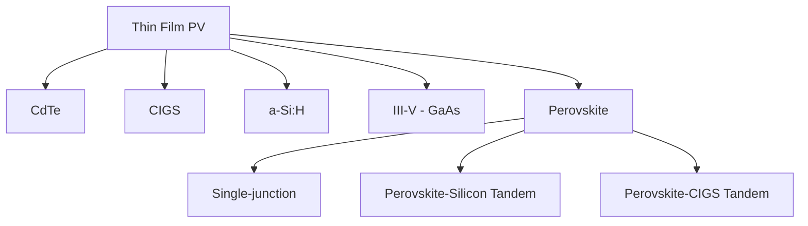

## Thin Film and Perovskite Solar Cells

### Overview

Thin film and perovskite photovoltaics use direct-band-gap absorber layers only a few micrometers thick (or less) to capture sunlight, in contrast to the ~100+ μm indirect-gap wafers required by crystalline silicon. This category spans mature commercial technologies (CdTe, CIGS) and the rapidly advancing perovskite/tandem field, unified by thin-film deposition on low-cost substrates and, in principle, lower material and energy input per watt.

### Thin Film Technology Families

**Key Points**

- Cadmium Telluride (CdTe): direct band gap $E_g \approx 1.5\ \text{eV}$, near-ideal single-junction absorber per the Shockley-Queisser limit; dominant commercial thin-film technology, primarily manufactured via close-space sublimation (CSS) or vapor transport deposition
- Copper Indium Gallium Selenide (CIGS, $\text{Cu(In,Ga)Se}_2$): tunable band gap (1.0–1.7 eV) via In/Ga ratio, deposited by co-evaporation or sputtering plus selenization; higher lab efficiencies historically than CdTe but more complex multi-element process control
- Amorphous silicon (a-Si:H): disordered silicon network deposited by plasma-enhanced CVD; largely displaced from mainstream power generation by crystalline and other thin-film technologies but retained in niche/flexible and HJT passivation-layer applications
- Gallium Arsenide (GaAs) and III-V multijunctions: highest single- and multi-junction efficiencies of any PV technology, direct band gap with minimal non-radiative loss; cost restricts use to space and concentrator photovoltaics rather than terrestrial utility-scale deployment

### CdTe Cell Architecture

**Key Points**

- Superstrate configuration: glass/TCO (transparent conducting oxide, e.g., SnO2:F)/CdS (or Mg-Zn-O) buffer/CdTe absorber/back contact, with light entering through the glass superstrate
- CdCl2 activation treatment (post-deposition annealing) is essential to grain growth, recrystallization, and passivation of grain boundaries — a critical, technology-defining processing step without which device efficiency is severely limited
- Back-contact formation is challenging because CdTe's high electron affinity makes low-resistance ohmic contact formation intrinsically difficult; Cu-doped or graphite-based contacts with a Te-rich surface layer are used to reduce the back-contact barrier
- Cd-free buffer layers (window layers) have progressively reduced parasitic absorption losses in the blue spectral region compared to legacy CdS buffers

### CIGS Cell Architecture

**Key Points**

- Substrate configuration (opposite of CdTe): glass or flexible metal foil/Mo back contact/CIGS absorber/CdS buffer/ZnO:Al (or similar TCO) window layer
- Bandgap grading achieved by varying the Ga/(Ga+In) ratio through the absorber thickness, engineering a "double-graded" profile that improves carrier collection by creating a back-surface field and front-surface grading that reduces recombination
- Alkali post-deposition treatment (Na, K, Rb, Cs incorporation, commonly via NaF/RbF/CsF evaporation) passivates grain boundaries and has been central to record CIGS efficiency improvements
- Flexible CIGS on polyimide or metal foil substrates enables lightweight, conformable modules for applications (e.g., building-integrated PV, portable/aerospace) not well served by rigid wafer-based technologies

### Perovskite Crystal Structure

**Key Points**

- Halide perovskites follow the general formula $\text{ABX}_3$, where A is a monovalent cation (methylammonium $\text{CH}_3\text{NH}_3^+$, formamidinium $\text{CH(NH}_2)_2^+$, or Cs+), B is typically $\text{Pb}^{2+}$ (or Sn2+ in lead-free variants), and X is a halide ($\text{I}^-$, $\text{Br}^-$, $\text{Cl}^-$)
- Corner-sharing $\text{BX}_6$ octahedra form the 3D framework, with the A-site cation occupying the cuboctahedral cavity; structural stability is commonly assessed via the Goldschmidt tolerance factor

$$t = \frac{r_A + r_X}{\sqrt{2}(r_B + r_X)}$$

where perovskite structures are typically stable for $t$ in the approximate range 0.8–1.0, with values toward the edges of this range associated with lower-symmetry or less thermally stable phases.

- Mixed-cation, mixed-halide compositions (e.g., $\text{Cs}_x\text{FA}_{1-x}\text{Pb(I}_{1-y}\text{Br}_y\text{)}_3$) are used to stabilize the desired photoactive "black phase" and tune the band gap continuously across a wide range, which is what makes perovskites especially attractive as tunable-gap tandem top cells

### Perovskite Optoelectronic Properties

**Key Points**

- Direct band gap with very high absorption coefficient (>$10^4$–$10^5$ cm⁻¹ near the band edge), enabling full spectral absorption in layers under ~500 nm thick
- Long charge-carrier diffusion lengths (hundreds of nm to microns in high-quality films) and low trap-state densities despite solution-processed, polycrystalline morphology — an unusual combination often attributed to "defect tolerance," where the dominant intrinsic point defects form shallow rather than deep trap states
- Band gap tunability via halide composition makes perovskites the leading top-cell candidate for tandem architectures, since the top-cell gap can be matched to the bottom cell (Si or CIGS) for optimal current-matched spectral splitting

### Device Architecture

**Key Points**

- n-i-p (standard/regular) architecture: TCO/electron transport layer (ETL, e.g., $\text{TiO}_2$, $\text{SnO}_2$)/perovskite absorber/hole transport layer (HTL, e.g., spiro-OMeTAD, doped organic HTLs)/metal electrode
- p-i-n (inverted) architecture: TCO/HTL (e.g., NiOx, self-assembled monolayer HTLs)/perovskite/ETL (e.g., $\text{C}_{60}$, fullerene derivatives)/electrode; generally shows improved operational and thermal stability and reduced hysteresis relative to standard n-i-p, and is widely used in tandem device stacks
- Charge-transport layer selection governs both energy-level alignment (minimizing interfacial voltage loss) and chemical compatibility (preventing ion migration-driven degradation at interfaces)
- Solution processing (spin-coating, blade-coating, slot-die coating) and vacuum co-evaporation are the two principal perovskite film deposition routes, with scalable coating methods (blade/slot-die) central to translating lab-cell results to large-area modules

### Stability and Degradation Mechanisms

**Key Points**

- Moisture sensitivity: water ingress hydrolyzes the organic-cation perovskite lattice, a primary historical driver of the field's stability challenges, mitigated via encapsulation, hydrophobic capping layers, and compositional engineering (increased Cs/FA content, reduced MA content)
- Thermal and light-induced ion migration: halide and cation migration under illumination and bias can cause phase segregation (particularly in mixed-halide, wide-gap compositions used for tandem top cells) and hysteresis in J-V measurements
- UV-induced degradation at the ETL interface (notably with mesoporous $\text{TiO}_2$) has driven a shift toward UV-filtering layers or alternative ETL materials
- Lead toxicity and encapsulation/containment strategies remain an active regulatory and materials-engineering focus for eventual large-scale deployment
- Recent materials-level work (e.g., barrier-film approaches) continues to target weather-induced and moisture-driven degradation pathways as a central reliability engineering focus, with ongoing research such as work at the Technical University of Munich aimed at preventing weather-induced deterioration of perovskite solar cells [pv-tech](https://www.pv-tech.org/tag/perovskite-cells/)

### Tandem Architectures

**Key Points**

- Perovskite-silicon tandems are the most advanced tandem pathway toward commercialization, pairing a wide-gap perovskite top cell (~1.6–1.8 eV) with the ~1.12 eV silicon bottom cell to reduce thermalization losses and exceed the single-junction Shockley-Queisser limit
- Monolithic (2-terminal) tandem integration requires a transparent, low-loss interconnect layer between subcells and current-matching between top and bottom cell photocurrents; mechanically stacked (4-terminal) designs avoid current-matching constraints at the cost of additional transparent electrodes and complexity
- Perovskite-CIGS tandems are a parallel pathway pursued by several research groups, offering a flexible/lightweight all-thin-film tandem stack, with researchers from HZB and Humboldt-Universität in Berlin having reported a 25.5% conversion efficiency in a CIGS-perovskite tandem cell [pv-tech](https://www.pv-tech.org/news/suntech-and-trina-solar-funding-unsw-perovskite-rd)
- Commercial-scale progress has included full module-level milestones, such as a manufacturer reporting a peak power output of 907W and a full-area efficiency of 29.2% for a perovskite/crystalline-silicon tandem module, and initial industry certification steps, with at least one company reported to be first to achieve UL and IEC certifications for silicon-perovskite tandem technology [Unverified: efficiency records and certification milestones in this field are updated frequently by multiple manufacturers and labs; treat specific cited figures as a snapshot rather than a fixed benchmark] [pv-tech](https://www.pv-tech.org/news/suntech-and-trina-solar-funding-unsw-perovskite-rd)[pv-tech](https://www.pv-tech.org/news/suntech-and-trina-solar-funding-unsw-perovskite-rd)

### Efficiency Landscape Context

**Key Points**

- Single-junction perovskite lab-cell efficiencies have progressed rapidly from initial sub-4% demonstrations in 2009 toward figures now competitive with or exceeding crystalline silicon's practical single-junction ceiling, with multiple record claims reported by different labs and certification bodies in successive announcementsincluding reported single-junction perovskite results in the upper-27% range on small-area lab devices, certified by accredited Chinese testing centers [pv-magazine](https://www.pv-magazine.com/2026/01/28/chinese-startup-claims-record-breaking-27-87-efficiency-for-single-junction-perovskite-solar-cell/)[perovskite-info](https://www.perovskite-info.com/huarou-pv-claims-single-junction-perovskite-efficiency-2798)
- These figures represent small-area (often well under 1 cm²) laboratory champion cells rather than commercial module-scale performance, and the gap between record lab cells and stable, bankable commercial modules remains the central translation challenge for the technology
- Because record announcements arrive frequently from multiple competing groups, any single number cited here should be treated as illustrative rather than the current state of the art at the time of reading [Unverified: given the pace of reported record updates, consult NREL's Best Research-Cell Efficiency Chart or the Solar Cell Efficiency Tables for the current authoritative figures]

### Comparative Summary Table

| Technology | Typical Band Gap | Deposition Method | Key Advantage | Key Challenge |
| --- | --- | --- | --- | --- |
| CdTe | ~1.5 eV | CSS, vapor transport | Low cost, mature | Cd toxicity management, Te scarcity |
| CIGS | 1.0–1.7 eV (graded) | Co-evaporation, sputter+selenize | High efficiency, flexible substrates | Multi-element process complexity |
| a-Si:H | ~1.7 eV | PECVD | Low-temp, flexible | Light-induced degradation (Staebler-Wronski) |
| Perovskite (single) | Tunable ~1.5–2.3 eV | Spin/blade/slot-die coating | Very high absorption, low-cost processing | Moisture/thermal/ion-migration stability |
| Perovskite-Si tandem | 1.6–1.8 / 1.12 eV | Coating + Si cell integration | Exceeds single-junction SQ limit | Current matching, interconnect losses, stability |

### Illustrative Schematic: Perovskite-Silicon Tandem Stack

<svg xmlns="http://www.w3.org/2000/svg" viewBox="0 0 500 320">
<text x="250" y="22" font-size="15" text-anchor="middle" font-family="sans-serif" font-weight="bold">Monolithic Perovskite-Si Tandem (svg_diagram)</text>
<rect x="120" y="45" width="260" height="18" fill="#a8c8e8" />
<text x="250" y="58" font-size="10" text-anchor="middle" font-family="sans-serif">Front TCO / ARC</text>
<rect x="120" y="63" width="260" height="14" fill="#3d8b52" />
<text x="250" y="74" font-size="10" text-anchor="middle" fill="white" font-family="sans-serif">ETL</text>
<rect x="120" y="77" width="260" height="45" fill="#d1495b" />
<text x="250" y="103" font-size="12" text-anchor="middle" fill="white" font-family="sans-serif">Perovskite Top Cell (~1.68 eV)</text>
<rect x="120" y="122" width="260" height="14" fill="#7b4fa0" />
<text x="250" y="133" font-size="10" text-anchor="middle" fill="white" font-family="sans-serif">HTL</text>
<rect x="120" y="136" width="260" height="12" fill="#e29b1a" />
<text x="250" y="146" font-size="10" text-anchor="middle" font-family="sans-serif">Recombination / Interconnect Layer</text>
<rect x="120" y="148" width="260" height="14" fill="#4a4a4a" />
<text x="250" y="159" font-size="10" text-anchor="middle" fill="white" font-family="sans-serif">n+ poly-Si contact</text>
<rect x="120" y="162" width="260" height="90" fill="#2b2b2b" />
<text x="250" y="210" font-size="12" text-anchor="middle" fill="white" font-family="sans-serif">Silicon Bottom Cell (~1.12 eV)</text>
<rect x="120" y="252" width="260" height="14" fill="#4a4a4a" />
<text x="250" y="263" font-size="10" text-anchor="middle" fill="white" font-family="sans-serif">Rear contact</text>
<line x1="120" y1="45" x2="120" y2="266" stroke="black" stroke-width="1" />
<line x1="380" y1="45" x2="380" y2="266" stroke="black" stroke-width="1" />
<text x="60" y="300" font-size="10" font-family="sans-serif">Wide-gap top cell absorbs high-energy photons; low-gap Si bottom cell absorbs the transmitted remainder.</text>
</svg>

### Related Topics

- CdCl2 activation chemistry and grain-boundary passivation in CdTe
- Alkali post-deposition treatments in CIGS record-efficiency devices
- Ion migration and hysteresis mechanisms in halide perovskites
- Lead-free/lead-reduced perovskite absorber development (Sn-based, double perovskites)
- Encapsulation materials and barrier-film design for perovskite module reliability
- Transparent conducting oxides and interconnect layers for monolithic tandems
- Roll-to-roll and slot-die scalable perovskite manufacturing
- NREL Best Research-Cell Efficiency Chart as a living reference benchmark