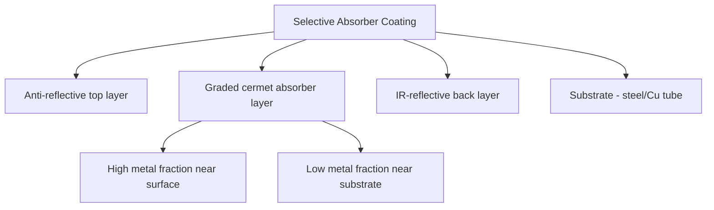
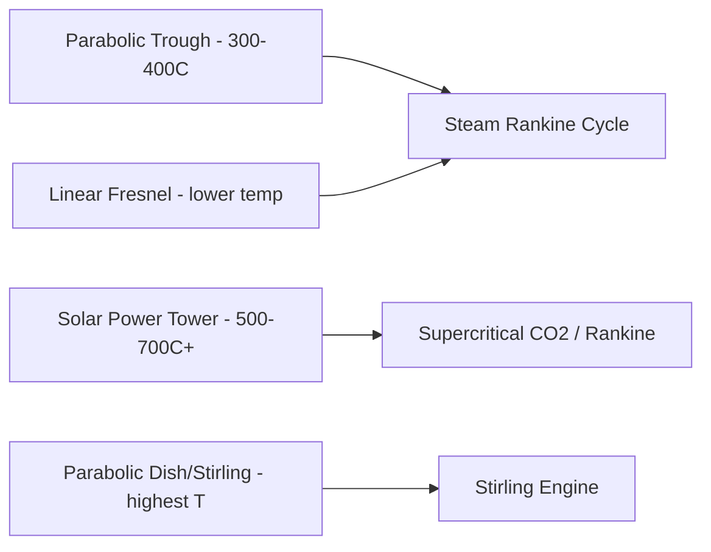

## Materials for Solar Thermal Applications

### Overview

Solar thermal materials convert incident solar radiation into usable heat rather than electricity, spanning selective absorber coatings for concentrating solar power (CSP) and flat-plate collectors, high-temperature heat transfer fluids, thermal energy storage media, and glazing/reflector optics. Materials selection is governed by spectral selectivity, thermal stability at operating temperature, corrosion compatibility with heat transfer media, and long-term durability under thermal cycling and environmental exposure.

### Spectral-Selective Absorber Coatings

**Key Points**

- The central design goal is high solar absorptance ($\alpha$, ideally >0.9–0.95 across the solar spectrum, ~0.3–2.5 μm) combined with low thermal emittance ($\varepsilon$, ideally <0.1) in the infrared, to minimize radiative heat loss at elevated operating temperature
- Selectivity is achieved via cermet (ceramic-metal composite) coatings: metal nanoparticles (e.g., Mo, W, Ni, Pt, Cr) embedded in a dielectric matrix (e.g., $\text{Al}_2\text{O}_3$, $\text{AlN}$, $\text{SiO}_2$) exploit the wavelength-dependent absorption of the metal-dielectric composite
- Multi-layer graded cermet structures (varying metal volume fraction through the coating thickness, high near the surface, low near the substrate) further tune the spectral response and reduce reflection losses via a graded refractive-index transition
- Anti-reflective top layers (typically low-index dielectric, e.g., $\text{SiO}_2$ or $\text{AlN}$) reduce front-surface reflectance and improve overall absorptance

$$\alpha = \frac{\int_0^\infty \alpha(\lambda) I_{solar}(\lambda)\, d\lambda}{\int_0^\infty I_{solar}(\lambda)\, d\lambda}, \qquad \varepsilon = \frac{\int_0^\infty \varepsilon(\lambda,T) I_{bb}(\lambda,T)\, d\lambda}{\int_0^\infty I_{bb}(\lambda,T)\, d\lambda}$$

where $I_{solar}$ is the solar spectral irradiance and $I_{bb}$ is the Planck blackbody spectral distribution at the coating's operating temperature $T$.

### High-Temperature Coating Material Systems

**Key Points**

- Black chrome ($\text{Cr}$/$\text{Cr}_2\text{O}_3$ cermet, electroplated): historically widely used in flat-plate and parabolic-trough collectors, effective up to ~400 °C but with long-term stability concerns above that range and environmental/regulatory concerns around hexavalent chromium electroplating
- Molybdenum/aluminum-oxide (Mo-$\text{Al}_2\text{O}_3$) and similar refractory-metal cermets: sputter-deposited coatings rated for higher-temperature parabolic-trough and central-receiver applications, offering improved thermal stability versus black chrome
- Titanium nitride/titanium oxynitride (TiN/$\text{TiN}_x\text{O}_y$) graded coatings: PVD-deposited, tunable optical properties via nitrogen/oxygen stoichiometry gradients, used in evacuated-tube collectors
- Pyromark-type high-temperature black paints (silicone-based, high-emissivity, non-selective): used on central-receiver (solar tower) external receiver surfaces where operating temperatures (>500–700 °C) and durability requirements favor a simple, re-coatable high-absorptance coating over spectrally selective but less robust cermet layers
- Coating degradation mechanisms at high temperature include oxidation of the metal phase, interdiffusion between coating layers, and dielectric-layer microstructural coarsening, all of which progressively degrade spectral selectivity over service life

### CSP Collector Architectures and Material Demands

**Key Points**

- Parabolic trough: linear receiver tubes (typically steel absorber tube with selective coating, enclosed in an evacuated borosilicate glass envelope) at the focal line of a curved mirror; operating temperatures typically in the 300–400 °C range with synthetic oil or molten salt heat transfer fluid
- Solar power tower (central receiver): heliostat field concentrates sunlight onto a receiver atop a tower, reaching substantially higher temperatures (500–700+ °C) than trough systems, enabling higher-efficiency power cycles but demanding more thermally robust receiver materials and coatings
- Linear Fresnel: flat or slightly curved mirror segments approximate a parabolic trough at lower structural/mirror cost, generally operating at somewhat lower concentration ratios and temperatures than true parabolic troughs
- Parabolic dish/Stirling: point-focus concentration achieving the highest concentration ratios and temperatures among mainstream CSP configurations, paired with a Stirling engine at the receiver focal point

### Reflector and Mirror Materials

**Key Points**

- Low-iron float glass with a silver reflective backing (back-silvered glass mirrors) remains the benchmark for CSP heliostats and trough mirrors, offering high specular reflectance (>93-94%) and good long-term durability with proper edge sealing
- Front-surface and thin-glass mirrors reduce weight and material use versus thick back-silvered glass, trading some durability/cost balance
- Polymer-film reflectors (silvered or aluminized PET/PVDF laminate films) offer significantly lower weight and cost than glass mirrors, used in some trough and dish designs, but historically show greater susceptibility to UV degradation, moisture ingress, and reflectance loss over multi-year outdoor exposure compared to glass mirrors [Inference: relative degradation rates vary considerably by specific film formulation, protective coating, and climate exposure conditions]
- Anti-soiling coatings and protective overcoats are an active development area to reduce reflectance losses from dust accumulation, a major operations and maintenance cost driver in arid CSP deployment regions

### Heat Transfer Fluids (HTF)

**Key Points**

- Synthetic thermal oils (e.g., biphenyl/diphenyl oxide eutectic mixtures): widely used in parabolic trough plants, practical upper temperature limit around 390–400 °C due to thermal decomposition above that range, requiring nitrogen blanketing/overpressure systems to suppress fluid degradation and vapor-phase losses
- Molten nitrate salts (typically binary $\text{NaNO}_3$/$\text{KNO}_3$ "solar salt" mixtures): enable higher operating temperatures (~290–565 °C typical range) than synthetic oils and serve the dual role of heat transfer fluid and direct thermal storage medium in many trough and tower plants, but have a relatively high freezing point (~220 °C) requiring freeze-protection/trace-heating system design
- Next-generation chloride salts and other advanced molten-salt chemistries are under active development to push operating temperatures higher (targeting >700 °C) for higher power-cycle efficiency, though corrosion compatibility with containment alloys at these elevated temperatures is a significant ongoing materials engineering challenge [Unverified: specific corrosion-mitigation approaches and qualified containment alloys for next-generation chloride-salt systems remain an active research area without a single settled industry-standard solution at this time]
- Direct steam generation (DSG) and supercritical $\text{CO}_2$ as working fluid/HTF are alternative pathways that eliminate the intermediate HTF loop or improve power-cycle efficiency respectively, each with distinct materials/piping design implications

### Thermal Energy Storage (TES) Materials

**Key Points**

- Sensible heat storage: molten nitrate salt (two-tank hot/cold configuration, or single-tank thermocline) is the dominant commercial CSP TES approach, storing heat via temperature change in the bulk fluid/solid medium
- Concrete and castable ceramic sensible-storage media are explored as lower-cost solid-storage alternatives to molten salt, typically with embedded heat-exchanger tubing, trading lower cost for lower energy density and more complex heat-exchange geometry
- Latent heat storage (phase-change materials, PCMs): exploits the enthalpy of fusion of a material at a defined phase-transition temperature, offering higher storage density than sensible-only systems at a given temperature range; candidate PCMs include select nitrate/chloride salt eutectics and metallic alloys, chosen to match the target charge/discharge temperature window
- Thermochemical storage: reversible chemical reactions (e.g., metal oxide reduction/oxidation cycles, carbonate reactions) store energy in chemical bonds rather than sensible or latent heat, offering potentially very high energy density and long-duration storage with minimal thermal loss, but remains at an earlier stage of commercial deployment maturity relative to molten-salt sensible storage [Unverified: thermochemical TES commercial readiness and specific reaction-system maturity levels continue to evolve and should be checked against current pilot/demonstration project status]

$$Q_{sensible} = mc_p\Delta T, \qquad Q_{latent} = m\Delta H_{fusion}$$

### Containment and Structural Alloys

**Key Points**

- Molten-salt containment (tanks, piping, pumps) at elevated temperature requires corrosion-resistant austenitic stainless steels (e.g., 316/316L) or, for the highest-temperature next-generation salt systems, nickel-based superalloys, since standard carbon steels suffer accelerated oxidation/corrosion in hot nitrate and especially chloride salt environments
- Receiver tube alloys in central-receiver and trough systems must resist thermal fatigue from daily thermal cycling (dawn start-up to dusk shutdown) in addition to steady-state creep resistance at operating temperature
- Evacuated-tube receiver seals (metal-to-glass seals between the steel absorber tube and borosilicate glass envelope) require closely matched thermal expansion coefficients between the metal (often a specialized kovar-type alloy) and glass to maintain vacuum integrity over thousands of thermal cycles

### Flat-Plate and Domestic Solar Thermal Collectors

**Key Points**

- Copper or aluminum absorber plates with selective coating (black chrome, TiNOx, or similar) bonded to copper tubing carrying the working fluid (typically water/glycol mixture) remain the standard for domestic hot water and low-temperature (<100 °C) solar thermal collectors
- Low-iron tempered glass glazing minimizes reflection losses while providing convective heat-loss suppression and mechanical/environmental protection for the absorber
- Evacuated-tube collectors eliminate convective heat loss entirely via a vacuum gap between absorber and outer glass envelope, improving performance particularly in colder ambient/lower-irradiance conditions relative to flat-plate designs
- Insulation materials (mineral wool, polyurethane/polyisocyanurate foam) behind the absorber plate reduce rear-surface conductive heat loss; material selection must account for long-term thermal stability at collector stagnation temperatures

### Comparative Summary Table

| Component | Material Class | Operating Temp Range | Primary Function |
| --- | --- | --- | --- |
| Selective absorber | Cermet (Mo/Al2O3, TiNOx) | Up to ~400–600 °C | Spectral selectivity: high α, low ε |
| Central receiver coating | High-temp black paint (Pyromark-type) | 500–700+ °C | High broadband absorptance, durability |
| CSP mirrors | Back-silvered low-iron glass | Ambient (optical) | High specular reflectance |
| Trough HTF | Synthetic oil | Up to ~390–400 °C | Heat transport |
| Trough/tower HTF + storage | Molten nitrate salt | ~290–565 °C | Heat transport + sensible TES |
| Containment | 316/316L stainless, Ni superalloys | Matches HTF/salt temp | Corrosion-resistant piping/tanks |
| Domestic collector absorber | Cu/Al with selective coating | <100 °C | Low-temp heat collection |

### Illustrative Schematic: Selective Absorber Coating Cross-Section

<svg xmlns="http://www.w3.org/2000/svg" viewBox="0 0 480 280">
<text x="240" y="22" font-size="15" text-anchor="middle" font-family="sans-serif" font-weight="bold">Graded Cermet Selective Absorber (svg_diagram)</text>
<rect x="100" y="50" width="280" height="16" fill="#cfd8dc" />
<text x="240" y="45" font-size="10" text-anchor="middle" font-family="sans-serif">Anti-reflective layer (SiO2/AlN)</text>
<rect x="100" y="66" width="280" height="18" fill="#8d6e63" />
<text x="240" y="79" font-size="10" text-anchor="middle" fill="white" font-family="sans-serif">High metal-fraction cermet</text>
<rect x="100" y="84" width="280" height="18" fill="#a1887f" />
<text x="240" y="97" font-size="10" text-anchor="middle" fill="white" font-family="sans-serif">Mid metal-fraction cermet</text>
<rect x="100" y="102" width="280" height="18" fill="#bcaaa4" />
<text x="240" y="115" font-size="10" text-anchor="middle" font-family="sans-serif">Low metal-fraction cermet</text>
<rect x="100" y="120" width="280" height="14" fill="#ffd54f" />
<text x="240" y="131" font-size="10" text-anchor="middle" font-family="sans-serif">IR-reflective metal layer</text>
<rect x="100" y="134" width="280" height="60" fill="#607d8b" />
<text x="240" y="168" font-size="12" text-anchor="middle" fill="white" font-family="sans-serif">Substrate (steel/Cu tube)</text>
<line x1="60" y1="40" x2="90" y2="70" stroke="#e29b1a" stroke-width="2" />
<line x1="70" y1="40" x2="95" y2="70" stroke="#e29b1a" stroke-width="2" />
<text x="40" y="35" font-size="10" font-family="sans-serif">Solar</text>
<line x1="400" y1="140" x2="430" y2="120" stroke="#d1495b" stroke-width="2" stroke-dasharray="3,2" />
<text x="395" y="210" font-size="10" font-family="sans-serif">Dashed arrow = suppressed IR re-emission</text>
</svg>

### Related Topics

- Thermal cycling fatigue and coating delamination mechanisms in receiver tubes
- Chloride-salt corrosion mitigation for next-generation high-temperature TES
- Anti-soiling coatings and dust-mitigation materials for arid-region CSP deployment
- Vacuum seal (metal-glass) design for evacuated-tube receivers
- Thermochemical energy storage reaction systems (metal oxide redox cycles)
- Supercritical CO2 Brayton cycle integration with CSP receivers
- Concrete and ceramic solid-media sensible storage design
- Comparative techno-economics of CSP vs. PV+battery storage pathways