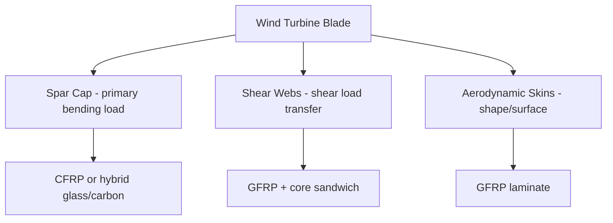

## Materials for Wind Energy Applications

### Overview

Materials for wind energy applications span the composite blades, structural towers, drivetrain/generator components, and corrosion-protection systems that must withstand cyclic aerodynamic and gravitational loading over 20–25+ year service lifetimes, in environments ranging from onshore temperate sites to offshore marine conditions. Selection is governed by the combined demands of high specific stiffness/strength, fatigue resistance under millions of load cycles, and, increasingly, end-of-life recyclability.

### Blade Composite Materials

**Key Points**

- Glass-fiber-reinforced polymer (GFRP) composites, typically E-glass fiber in an epoxy or unsaturated polyester/vinyl ester matrix, remain the dominant blade structural material due to favorable cost-to-performance ratio
- Carbon-fiber-reinforced polymer (CFRP) is used selectively in high-stiffness-critical regions (notably spar caps) of longer blades, where carbon's substantially higher specific stiffness reduces blade mass and deflection compared to an all-glass laminate, at higher material cost
- Hybrid glass/carbon laminates balance cost and performance by using carbon only where stiffness-to-weight is most structurally critical (spar cap) while retaining glass fiber in lower-stress regions (skins, shear webs)
- Matrix resin selection trades off: epoxy offers superior mechanical properties and fatigue performance versus polyester/vinyl ester, which offer lower cost and, in some formulations, easier processability; infusion-grade epoxy resins dominate modern large-blade manufacturing via vacuum-assisted resin transfer molding (VARTM)

### Blade Structural Architecture

**Key Points**

- The spar cap is the primary load-bearing structural element resisting flapwise (out-of-plane) bending loads from aerodynamic thrust; its stiffness directly governs blade tip deflection and tower-strike clearance margin
- Shear webs connect the spar caps (typically in a box-spar or single/dual-web configuration) to transfer shear loads and maintain aerodynamic cross-sectional shape under bending
- Sandwich-panel construction using lightweight core materials (balsa wood or PVC/PET structural foam) between thin composite face sheets provides bending stiffness in the skins and shear webs at low areal mass, exploiting the sandwich-beam principle where core shear stiffness and face-sheet bending stiffness combine efficiently
- Root section (blade-to-hub connection) uses thick laminate buildup and embedded steel or composite root inserts/studs to transfer the full blade root bending moment into the hub bolted joint, representing one of the highest local stress-concentration regions in the blade

### Fatigue and Damage Mechanisms in Blades

**Key Points**

- Wind turbine blades experience on the order of $10^8$–$10^9$ load cycles over a design life, making high-cycle fatigue resistance (rather than static strength alone) the governing design driver for composite layup and matrix selection
- Matrix microcracking, fiber-matrix debonding, and delamination are the principal progressive damage mechanisms in GFRP/CFRP laminates under cyclic loading, generally initiating well before catastrophic fracture and detectable via structural health monitoring
- Leading-edge erosion from rain, hail, and airborne particle impact progressively degrades aerodynamic performance and can expose underlying laminate to moisture ingress; leading-edge protection systems (polyurethane coatings, elastomeric tapes, or shields) are standard mitigation
- Lightning strike protection systems (embedded copper/aluminum down-conductors and receptor systems) are integrated into the blade structure, since direct lightning strikes can cause severe internal laminate damage and delamination if current is not safely conducted to the tower/ground

### Tower Materials

**Key Points**

- Tubular steel towers (rolled and welded steel plate sections, typically S355-grade structural steel or similar) remain the dominant tower construction for both onshore and offshore turbines, offering well-established fabrication, transport, and erection practices
- Concrete and hybrid concrete-steel towers are used for taller hub heights, where transportable steel-section diameter/weight limits become constraining; precast or slip-formed concrete lower sections combined with steel upper sections balance cost, stiffness, and transport logistics
- Tower design is governed substantially by fatigue at welded joints and flange connections, and by first natural-frequency placement relative to rotor excitation frequencies (avoiding resonance with blade-passing and rotational frequencies) rather than static strength alone
- Corrosion protection (hot-dip galvanizing for smaller components, multi-layer epoxy/polyurethane paint systems for large tower sections) is essential for the multi-decade design life, with offshore towers requiring substantially more demanding coating systems and cathodic protection

### Offshore-Specific Materials Considerations

**Key Points**

- Splash-zone corrosion (the region of alternating wet/dry and wave-impact exposure on monopile/tower foundations) is the most aggressive corrosion environment on an offshore structure, typically addressed with thicker corrosion-allowance steel sections plus high-performance coating systems
- Cathodic protection (sacrificial anodes, typically Al-Zn-In alloy anodes, or impressed current systems) protects submerged steel foundation structures below the splash zone from electrochemical corrosion
- Monopile and jacket foundation steels require high fracture toughness at low service temperatures and excellent weldability given the very large plate thicknesses involved in foundation fabrication
- Marine biofouling on submerged structures can be addressed via coating systems or accepted as a maintenance factor, and adds hydrodynamic loading that must be accounted for in foundation design margins

### Drivetrain and Generator Materials

**Key Points**

- Gearbox components (where a gearbox is used, as opposed to direct-drive architectures) require case-hardened alloy steels with high surface fatigue (pitting/contact fatigue) resistance at gear tooth contact surfaces, since gearbox reliability has historically been a significant driver of unplanned turbine downtime
- Permanent-magnet direct-drive and hybrid-drive generators use high-remanence rare-earth permanent magnets, predominantly Nd-Fe-B (neodymium-iron-boron) magnets, often with dysprosium or terbium additions to maintain coercivity at elevated operating temperature and resist demagnetization
- Main shaft and bearing steels require high-cleanliness, fatigue-resistant bearing steels (typically vacuum-degassed alloy steels) given the combination of high cyclic loads and long maintenance-interval requirements in the nacelle
- Rare-earth magnet supply-chain concentration and price volatility have motivated development of reduced-rare-earth and rare-earth-free generator designs (e.g., ferrite-magnet or wound-rotor synchronous alternatives), an active area of ongoing materials substitution research [Inference: the pace and extent of rare-earth-reduction adoption varies by manufacturer and market conditions]

### Nacelle and Structural Housing

**Key Points**

- Nacelle covers and structural housings commonly use GFRP composite panels for weather protection combined with a steel or cast-iron structural bedframe/mainframe that carries the primary drivetrain loads
- Cast iron (typically ductile/nodular cast iron, e.g., grades comparable to GJS-400/500) is widely used for the main bedframe, hub, and large structural castings due to good castability for complex geometries combined with adequate fatigue and fracture toughness for these applications
- Bolted flange joints throughout the drivetrain and tower assembly are engineered against fatigue at the bolt/flange interface, a recognized critical-joint design consideration across the turbine structure

### Blade Recyclability and End-of-Life Materials Considerations

**Key Points**

- Thermoset epoxy/polyester composite blades are inherently difficult to recycle via conventional mechanical or thermal routes because the cross-linked thermoset matrix cannot be re-melted or easily separated from reinforcing fiber, a widely recognized industry challenge as the first generation of utility-scale turbines reaches end of life
- Mechanical recycling (shredding/grinding for use as filler material) and cement co-processing (using shredded composite as an alternative fuel/raw material in cement kilns) are established near-term disposal/recovery routes
- Recyclable thermoset resin systems (e.g., certain covalent adaptable network or vitrimer-type epoxy chemistries) and thermoplastic composite blade concepts are active development areas aimed at enabling true end-of-life fiber/matrix separation and reuse
- Balsa wood core material sourcing has itself become a supply-chain sustainability consideration given rapidly increased global demand from the wind blade sandwich-core market, motivating increased adoption of engineered PET/PVC foam core alternatives

### Comparative Summary Table

| Component | Primary Material | Key Property Driver |
| --- | --- | --- |
| Spar cap | CFRP or hybrid glass/carbon | Specific stiffness, fatigue |
| Blade skins/webs | GFRP + balsa/foam core sandwich | Bending stiffness at low mass |
| Tower (onshore) | Rolled/welded structural steel | Fatigue at welds, resonance avoidance |
| Tower (tall/offshore) | Concrete-steel hybrid | Transport limits, stiffness |
| Offshore foundation | High-toughness structural steel | Fracture toughness, corrosion allowance |
| Gearbox gears | Case-hardened alloy steel | Contact/pitting fatigue |
| Generator magnets | Nd-Fe-B (+ Dy/Tb) | High remanence, thermal coercivity |
| Bedframe/hub | Nodular (ductile) cast iron | Castability + fatigue/toughness balance |

### Illustrative Schematic: Blade Cross-Section

<svg xmlns="http://www.w3.org/2000/svg" viewBox="0 0 500 260">
<text x="250" y="22" font-size="15" text-anchor="middle" font-family="sans-serif" font-weight="bold">Wind Turbine Blade Cross-Section (svg_diagram)</text>
<path d="M 60 130 Q 150 60 400 110 Q 350 130 400 150 Q 150 200 60 130 Z" fill="#dbe4ea" stroke="#333" stroke-width="1.5" />
<rect x="150" y="105" width="60" height="14" fill="#5a3d2b" />
<text x="180" y="100" font-size="9" text-anchor="middle" font-family="sans-serif">Spar cap (top)</text>
<rect x="150" y="145" width="60" height="14" fill="#5a3d2b" />
<text x="180" y="175" font-size="9" text-anchor="middle" font-family="sans-serif">Spar cap (bottom)</text>
<line x1="180" y1="119" x2="180" y2="145" stroke="#8d6e63" stroke-width="8" />
<text x="225" y="135" font-size="9" font-family="sans-serif">Shear web</text>
<text x="320" y="105" font-size="9" font-family="sans-serif">Trailing-edge skin</text>
<text x="90" y="135" font-size="9" font-family="sans-serif">Leading edge</text>
</svg>

### Related Topics

- VARTM and prepreg blade manufacturing process comparison
- Structural health monitoring (fiber-optic, acoustic emission) for in-service blade damage detection
- Offshore floating turbine mooring and foundation material requirements
- Bearing steel cleanliness and rolling-contact fatigue in main shaft/yaw bearings
- Rare-earth-free and ferrite-magnet direct-drive generator design
- Vitrimer and thermoplastic composite chemistries for recyclable blades
- Lightning protection system design and down-conductor materials
- Cathodic protection system design for offshore monopile foundations