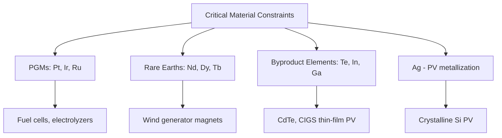
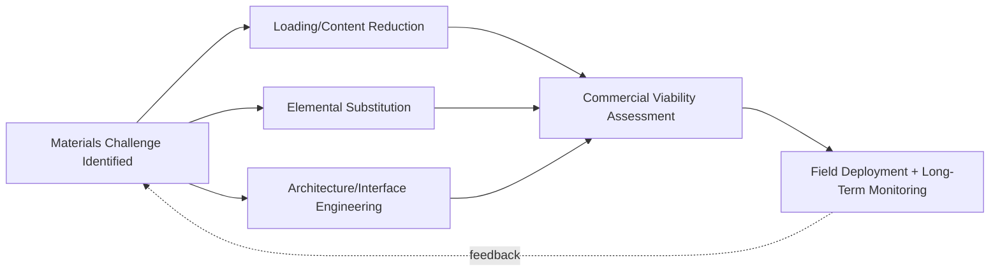

## Materials Challenges in Renewable Energy Systems

### Overview

Materials challenges in renewable energy systems are the cross-cutting engineering and supply-chain constraints that recur across fuel cell, hydrogen, photovoltaic, wind, and thermal storage technologies: critical-element scarcity, long-term durability under cyclic and environmental stress, scalable manufacturing, and end-of-life circularity. This synthesis integrates the recurring bottlenecks seen across the preceding chapter topics into a unified framework.

### Critical Raw Material Constraints

**Key Points**

- Platinum-group metals (Pt, Ir, Ru): essential to PEM fuel cell and electrolyzer catalysts (HOR/ORR/OER), with Ir in particular facing severe supply constraints as a byproduct of platinum mining with very limited global annual production, making acidic-media OER catalyst loading a first-order cost and scale-up bottleneck for PEM electrolysis
- Rare-earth elements (Nd, Dy, Tb): required for high-performance permanent-magnet wind generators; geographically concentrated supply chains and price volatility have driven parallel development of reduced-rare-earth and rare-earth-free generator architectures
- Silver: significant cost factor in crystalline silicon PV metallization, driving substitution efforts (copper plating, reduced-silver pastes) as PV deployment scales into the multi-terawatt range
- Lithium, cobalt, nickel: relevant to associated battery storage co-deployed with renewables (context-adjacent to, though distinct from, the primary generation materials covered in this chapter)
- Tellurium and indium: constrain CdTe and CIGS thin-film PV scale-up respectively, as both are low-abundance byproduct elements of base-metal (Cu, Zn, Pb) refining rather than primary-mined commodities

### Durability Under Cyclic and Environmental Stress

**Key Points**

- Thermal cycling fatigue is common across CSP receiver coatings (daily start-up/shutdown), fuel cell/electrolyzer catalyst layers (potential cycling), and PV modules (diurnal temperature swings), each requiring materials-specific fatigue-resistant design rather than a single unified solution
- Corrosion in aggressive media recurs across offshore wind foundations (marine splash-zone corrosion), molten-salt CSP containment (high-temperature salt corrosion), and PEM electrolyzer acidic environments (requiring Ti or PGM-coated bipolar plates), each demanding distinct alloy/coating strategies matched to its specific chemical environment
- Moisture and environmental ingress degrade perovskite PV absorbers, metal hydride hydrogen storage materials (sensitive to trace $\text{O}_2$/$\text{H}_2\text{O}$ poisoning), and wind blade composite laminates (moisture-driven delamination) via distinct but analogous barrier/encapsulation engineering challenges
- UV degradation affects PV encapsulants, polymer mirror films in CSP, and wind blade leading-edge coatings, generally addressed via UV-stabilized formulations and protective topcoats

### Manufacturing Scalability

**Key Points**

- Transitioning from laboratory champion-cell performance to large-area, high-throughput commercial manufacturing consistently introduces efficiency and yield losses, seen across perovskite PV (lab cells vs. modules), fuel cell catalyst layers (ink formulation and coating uniformity at scale), and CIGS thin-film deposition (large-area compositional uniformity)
- Roll-to-roll and continuous coating processes (relevant to perovskite PV, LOHC systems, and thin-film deposition generally) offer a path to lower-cost, higher-throughput manufacturing but introduce process-control challenges not present in batch/small-area laboratory fabrication
- Supply-chain bottlenecks in specialized equipment (e.g., MOCVD/sputtering tool capacity for thin-film PV, large-scale electrolyzer stack assembly lines) can constrain deployment pace independent of the underlying materials science being mature
- Quality control and in-line characterization (critical for catching micro-defects in wafers, coatings, and composite laminates before they propagate into field failures) is a recurring cross-cutting manufacturing engineering challenge

### Long-Term Reliability and Field Performance Gaps

**Key Points**

- A persistent theme across renewable energy materials is the gap between accelerated laboratory stress testing and actual multi-decade field performance — accelerated stress test (AST) protocols for fuel cell catalysts, damp-heat/UV chamber testing for PV modules, and accelerated corrosion testing for offshore structures all involve extrapolation assumptions that carry inherent uncertainty [Inference: the degree of correlation between accelerated testing and real-world multi-decade field performance is technology- and protocol-specific, and remains an active validation challenge industry-wide]
- Degradation mode interactions (e.g., combined thermal-mechanical-chemical stress) are often more severe than single-mechanism laboratory tests capture in isolation, motivating combined-stress and field-deployed long-term monitoring programs
- Warranty and bankability requirements (typically 20–25 year performance guarantees for PV and wind assets) place a premium on materials and coatings with well-characterized long-term degradation rates, favoring incumbent, field-proven technologies over higher-performance but less field-validated alternatives in commercial deployment decisions

### Circularity and End-of-Life Challenges

**Key Points**

- Thermoset composite wind blades and cross-linked PV encapsulant (EVA) both present recycling challenges structurally analogous to each other: a cured polymer matrix that resists conventional remelting/reprocessing, driving parallel research into recyclable resin chemistries (vitrimers) and improved delamination/separation processes
- Critical-element recovery (Pt from spent fuel cell catalysts, In/Te from thin-film PV, rare earths from wind generator magnets) is economically and technically important for supply-chain security but recovery process yield and economics vary substantially by material and device architecture
- Regulatory frameworks for end-of-life renewable energy equipment (particularly PV module and wind blade disposal) are still maturing in many jurisdictions relative to the pace of first-generation asset retirements, creating near-term disposal-capacity and logistics challenges
- Design-for-recyclability principles (e.g., mechanically fastened rather than adhesively bonded blade sections, easier-to-separate PV module layer stacks) are an increasingly prioritized consideration at the initial materials-selection and product-design stage rather than solely an end-of-life afterthought

### Cross-Technology Synthesis Table

| Challenge Category | Fuel Cell/H2 | Photovoltaic | Wind | CSP/Thermal |
| --- | --- | --- | --- | --- |
| Critical material | Pt, Ir | Ag, Te, In | Nd, Dy | — |
| Thermal cycling | Catalyst potential cycling | Diurnal ΔT | Gearbox/bearing loads | Daily receiver start-stop |
| Corrosion environment | PEM acidic media | — | Offshore splash zone | Molten salt containment |
| Environmental ingress | Hydride O2/H2O poisoning | Perovskite moisture sensitivity | Blade moisture/delamination | Coating oxidation |
| End-of-life challenge | PGM recovery economics | Module recycling, In/Te recovery | Thermoset blade recycling | Salt/fluid disposal |

### Systemic Design Response Pattern

**Key Points**

- Across all technologies in this chapter, three recurring engineering response strategies address materials scarcity and durability challenges: (1) loading/content reduction (lower PGM loading, reduced rare-earth content, thinner PV absorber layers), (2) substitution (PGM-free catalysts, ferrite magnets, earth-abundant thin-film absorbers), and (3) architecture-level mitigation (protective coatings, encapsulation, graded/multilayer structures) rather than relying on a single fix
- The common thread linking degradation across technologies is that most failure mechanisms originate at interfaces (catalyst-support, coating-substrate, fiber-matrix, encapsulant-cell) rather than in the bulk of the primary functional material, making interfacial engineering a unifying focus area across the field
- Techno-economic viability at scale, not just laboratory-demonstrated performance, is the ultimate integrating constraint governing which materials solutions transition from research to commercial deployment across all of these technology classes

### Related Topics

- Life-cycle assessment (LCA) methodology applied across renewable energy material systems
- Critical mineral supply-chain diversification and recycling policy frameworks
- Accelerated stress testing standardization efforts across PV, fuel cell, and wind industries
- Interfacial engineering as a unifying degradation-mitigation strategy
- Techno-economic modeling of materials substitution pathways
- Design-for-recyclability principles in renewable energy hardware
- Cross-sector critical element demand forecasting (PGMs, rare earths, byproduct metals)
- Circular economy strategies for end-of-life PV, wind, and fuel cell components