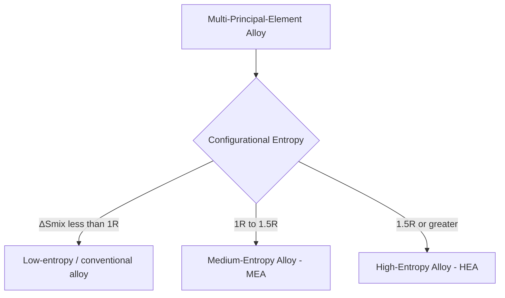
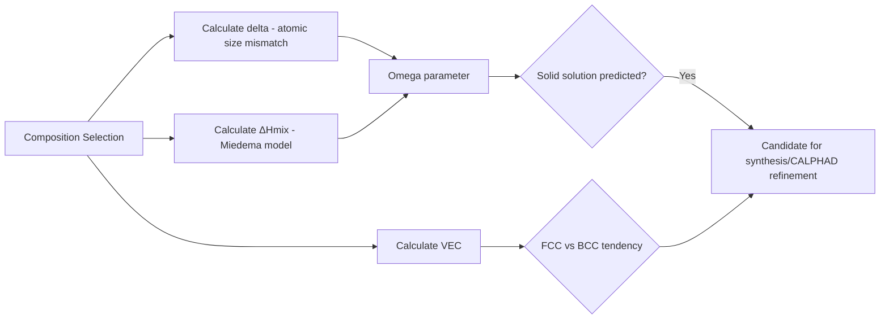

## Concept and Design Principles of High Entropy Alloys

### Overview

High entropy alloys (HEAs) are multi-principal-element alloys (MPEAs) that depart fundamentally from the traditional one-base-element-plus-minor-additions paradigm of conventional alloy design. Instead, HEAs combine four or more elements in near-equiatomic or substantial proportions, exploiting configurational entropy to favor simple solid-solution phases over the complex intermetallic compounds classical Hume-Rothery rules would predict for such compositionally complex mixtures.

### Defining Criteria

**Key Points**

- Compositional definition: typically five or more principal elements each present between 5 and 35 atomic percent, though the field has broadened to include "medium entropy alloys" (3–4 principal elements) and non-equiatomic HEA compositions
- Configurational entropy definition (the namesake criterion): alloys with ideal molar configurational entropy of mixing $\Delta S_{mix} \geq 1.5R$ are classified as "high entropy," where $R$ is the gas constant; alloys in the range $1R \leq \Delta S_{mix} < 1.5R$ are termed "medium entropy"
- The two definitions (compositional vs. entropy-based) are related but not strictly equivalent, since entropy depends on the number of elements and their relative proportions together, not element count alone — a highly non-equiatomic 5-element alloy may fall below the 1.5R threshold
- Distinct from traditional "base metal + alloying additions" design philosophy (e.g., Fe-based steels, Ni-based superalloys), HEAs treat all principal elements as co-equal contributors to the resulting solid solution

$$\Delta S_{mix} = -R\sum_{i=1}^{n} c_i \ln c_i$$

where $c_i$ is the mole fraction of element $i$ and $n$ is the number of principal elements. For an equiatomic alloy, this simplifies to $\Delta S_{mix} = R\ln n$, so a 5-component equiatomic alloy has $\Delta S_{mix} = R\ln5 \approx 1.61R$, exceeding the high-entropy threshold.

### The Four Core Effects

**Key Points**

- **High-entropy effect**: elevated configurational entropy thermodynamically stabilizes disordered solid-solution phases (FCC, BCC, HCP) relative to competing ordered intermetallic compounds, since the $-T\Delta S_{mix}$ term in the Gibbs free energy becomes increasingly favorable at higher temperature and higher entropy, suppressing phase separation that would otherwise be expected from the complex multi-element chemistry
- **Sluggish diffusion effect**: the complex, fluctuating local lattice environment (each lattice site is surrounded by a different, randomly varying set of neighboring species) is hypothesized to raise effective activation energies for atomic diffusion, potentially slowing precipitation, grain growth, and phase transformation kinetics relative to conventional alloys — this remains a debated hypothesis rather than a universally confirmed mechanism, with some experimental and computational studies reporting diffusion rates in HEAs comparable to conventional alloys under equivalent homologous temperature normalization [Unverified: the magnitude and universality of the sluggish diffusion effect is actively contested in the literature and appears to vary significantly by specific alloy system]
- **Severe lattice distortion effect**: the random occupation of lattice sites by atoms of differing atomic radii produces substantial local lattice strain, since each atom's neighbors differ in size from the "ideal" single-element lattice, contributing to solid-solution strengthening and influencing physical properties (e.g., reduced thermal and electrical conductivity via enhanced phonon/electron scattering)
- **Cocktail effect**: HEA properties are not simply a linear rule-of-mixtures average of constituent element properties but can exhibit synergistic, non-linear combinations arising from complex electronic and structural interactions between the mixed species — used descriptively for unexpected property combinations (e.g., simultaneous high strength and toughness) rather than as a predictive design tool per se

### Empirical Phase-Formation Design Parameters

**Key Points**

- Atomic size difference parameter $\delta$ quantifies the degree of lattice distortion expected from differing atomic radii among constituent elements:

$$\delta = 100\sqrt{\sum_{i=1}^{n} c_i\left(1 - \frac{r_i}{\bar{r}}\right)^2}, \qquad \bar{r} = \sum_{i=1}^{n} c_i r_i$$

Solid-solution formation is empirically favored for small $\delta$ (commonly cited threshold around $\delta < 4$–6.6%); larger atomic size mismatch increasingly favors intermetallic compound formation due to excessive local strain energy.

- Mixing enthalpy $\Delta H_{mix}$ (calculated via Miedema-model pairwise binary enthalpies) must fall within a moderate range (commonly cited as roughly $-15$ to $+5$ kJ/mol) for solid-solution stability: strongly negative $\Delta H_{mix}$ favors ordered intermetallic compound formation, while strongly positive $\Delta H_{mix}$ favors phase separation into multiple solid solutions rather than a single homogeneous phase
- The combined $\Omega$ parameter integrates entropy, enthalpy, and melting temperature into a single solid-solution-formation predictor:

$$\Omega = \frac{T_m \Delta S_{mix}}{|\Delta H_{mix}|}, \qquad T_m = \sum_{i=1}^n c_i T_{m,i}$$

Solid-solution formation is empirically favored when $\Omega \geq 1.1$ combined with $\delta \leq 6.6\%$, providing a two-parameter screening map widely used in early-stage HEA composition design, though these empirical thresholds are guidelines derived from historical alloy datasets rather than rigorous thermodynamic proofs and admit exceptions. [Inference: specific threshold values reported across the literature vary somewhat depending on the dataset and alloy family used to derive them]

- Valence electron concentration (VEC) is used as an empirical predictor of crystal structure selection: alloys with VEC $\geq 8$ tend to form FCC solid solutions, VEC $< 6.87$ tend to form BCC solid solutions, and the intermediate range often shows FCC+BCC dual-phase or transitional behavior

### Phase Selection: FCC, BCC, and HCP Solid Solutions

**Key Points**

- FCC-structured HEAs (archetype: the Cantor alloy, equiatomic $\text{CoCrFeMnNi}$) generally exhibit good ductility and toughness, particularly at cryogenic temperatures, but comparatively lower strength than BCC counterparts, following the general strength-ductility trend familiar from conventional FCC metals
- BCC-structured HEAs (archetype: refractory HEAs such as $\text{MoNbTaW}$) generally exhibit higher strength and superior high-temperature strength retention, of particular interest for elevated-temperature structural applications, but often at the cost of reduced room-temperature ductility
- HCP-structured HEAs are comparatively less studied than FCC/BCC systems, often based on combinations involving elements with HCP or near-HCP tendencies (e.g., certain rare-earth or Ti/Zr/Hf-rich compositions)
- Dual-phase and multi-phase HEA/MPEA design (deliberately engineering FCC+BCC or precipitate-strengthened microstructures) has emerged as a strategy to overcome the classical strength-ductility trade-off, drawing on heterogeneous microstructure design principles analogous to those in conventional dual-phase steels

### Major HEA Alloy Families

**Key Points**

- 3d transition-metal HEAs (Cantor-type: Co, Cr, Fe, Mn, Ni and related subsystems): the original and most extensively studied HEA family, generally FCC solid solutions with good room- and cryogenic-temperature mechanical properties
- Refractory HEAs (RHEAs): composed of high-melting-point refractory elements (Nb, Mo, Ta, W, Ti, Zr, Hf, V), targeting high-temperature structural applications (e.g., aerospace, energy) where conventional Ni-superalloy temperature capability is exceeded; typically BCC solid solutions with high strength but limited room-temperature ductility, an active area of ongoing alloy development to address
- Lightweight HEAs: incorporate low-density elements (Al, Mg, Li, Ti, Sc) to target high specific strength for weight-sensitive structural applications, a comparatively newer and less mature subfield than 3d-transition-metal or refractory HEAs
- High-entropy ceramics and high-entropy oxides/carbides/borides: extend the multi-principal-element concept beyond metallic solid solutions into ceramic sublattices, an actively expanding research direction adjacent to but distinct from metallic HEAs proper

### Strengthening Mechanisms in HEAs

**Key Points**

- Solid-solution strengthening is the dominant baseline strengthening mechanism in single-phase HEAs, amplified relative to conventional dilute solid solutions by the severe lattice distortion effect arising from multiple, comparably concentrated species occupying the lattice
- Precipitation strengthening via engineered secondary-phase precipitates (analogous to precipitation-hardened conventional alloys such as Ni-superalloys or Al-Cu systems) is increasingly used in second-generation HEA/MPEA design to push beyond single-phase solid-solution strength limits
- Grain boundary (Hall-Petch) strengthening applies to HEAs following broadly the same grain-refinement principles as conventional polycrystalline metals, though some HEA systems have shown Hall-Petch behavior extending to unusually fine grain sizes
- Twinning-induced plasticity (TWIP), notably documented in the Cantor alloy at cryogenic temperature, contributes to the exceptional combination of strength and toughness observed in some FCC HEAs at low temperature, via deformation twinning activating as an additional plastic deformation mode as dislocation slip becomes more difficult at low temperature

### CALPHAD and Computational Design Tools

**Key Points**

- CALPHAD (CALculation of PHAse Diagrams) thermodynamic modeling, extended to multi-component systems via extrapolation from assessed binary and ternary subsystems, is the primary computational tool for predicting HEA phase stability across composition and temperature, supplementing the simpler empirical parameters ($\delta$, $\Delta H_{mix}$, $\Omega$, VEC) with more rigorous free-energy-based predictions
- High-throughput computational screening (combining CALPHAD, DFT-derived formation energies, and machine-learning surrogate models) is increasingly used to navigate the vast compositional space of multi-principal-element systems, which grows combinatorially with the number of candidate elements and is intractable to explore purely experimentally
- Machine-learning-assisted composition-property prediction is an active and rapidly evolving research direction for accelerating HEA discovery, though model reliability depends heavily on the size and diversity of the training dataset used, an important caveat given the comparatively limited experimental HEA dataset relative to conventional alloy systems [Unverified: the general reliability and transferability of ML-based HEA property prediction across novel compositional regions remains an active area of methodological development]

### Illustrative Schematic: HEA Composition Design Workflow

<svg xmlns="http://www.w3.org/2000/svg" viewBox="0 0 500 300">
<text x="250" y="22" font-size="15" text-anchor="middle" font-family="sans-serif" font-weight="bold">HEA Design Screening Workflow (svg_diagram)</text>
<rect x="30" y="45" width="140" height="40" rx="6" fill="#4a7ab5" />
<text x="100" y="69" font-size="11" text-anchor="middle" fill="white" font-family="sans-serif">Candidate Elements</text>
<rect x="200" y="45" width="140" height="40" rx="6" fill="#4a7ab5" />
<text x="270" y="62" font-size="10" text-anchor="middle" fill="white" font-family="sans-serif">Empirical Parameters</text>
<text x="270" y="76" font-size="9" text-anchor="middle" fill="white" font-family="sans-serif">δ, ΔHmix, Ω, VEC</text>
<rect x="370" y="45" width="110" height="40" rx="6" fill="#3d8b52" />
<text x="425" y="69" font-size="11" text-anchor="middle" fill="white" font-family="sans-serif">CALPHAD</text>
<line x1="170" y1="65" x2="200" y2="65" stroke="black" stroke-width="1.5" marker-end="url(#arrow1)" />
<line x1="340" y1="65" x2="370" y2="65" stroke="black" stroke-width="1.5" marker-end="url(#arrow1)" />
<rect x="200" y="140" width="140" height="40" rx="6" fill="#e29b1a" />
<text x="270" y="164" font-size="11" text-anchor="middle" fill="white" font-family="sans-serif">Phase Prediction</text>
<line x1="270" y1="85" x2="270" y2="140" stroke="black" stroke-width="1.5" marker-end="url(#arrow1)" />
<line x1="425" y1="85" x2="330" y2="140" stroke="black" stroke-width="1.5" marker-end="url(#arrow1)" />
<rect x="200" y="230" width="140" height="40" rx="6" fill="#d1495b" />
<text x="270" y="254" font-size="11" text-anchor="middle" fill="white" font-family="sans-serif">Synthesis + Validation</text>
<line x1="270" y1="180" x2="270" y2="230" stroke="black" stroke-width="1.5" marker-end="url(#arrow1)" />
</svg>

### Related Topics

- The Cantor alloy (CoCrFeMnNi) as the archetypal FCC high-entropy alloy
- Refractory HEAs for high-temperature aerospace and energy applications
- Precipitation-strengthened second-generation HEA/MPEA design
- High-entropy ceramics: oxides, carbides, and borides
- Thermodynamic modeling (CALPHAD) extension to multi-component compositional space
- Machine-learning-accelerated HEA composition discovery
- Deformation mechanisms in FCC HEAs at cryogenic temperature (TWIP effect)
- Lightweight HEAs for specific-strength-critical structural applications