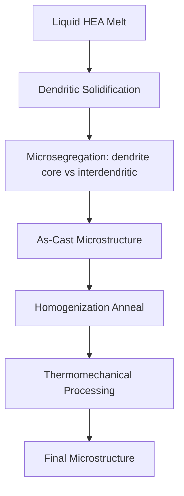
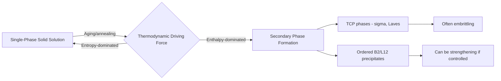

## Microstructure and Phase Formation in High Entropy Alloys

### Overview

Microstructure and phase formation in high entropy alloys governs the transition from the multi-principal-element compositional design space (covered by the $\delta$, $\Delta H_{mix}$, $\Omega$, and VEC parameters) into the actual solidified and solid-state microstructures that determine mechanical and functional performance. Unlike conventional alloys where a dominant base element anchors the phase diagram, HEA microstructure evolution must be understood across a genuinely multi-component compositional and thermal landscape.

### Solidification Behavior

**Key Points**

- HEA solidification proceeds through the same fundamental nucleation-and-growth framework as conventional alloys, but with substantially more complex partitioning behavior since multiple elements simultaneously redistribute between solid and liquid during freezing
- Elemental segregation (microsegregation) during dendritic solidification is common in as-cast HEAs, with elements distributing preferentially between dendrite cores and interdendritic regions according to their individual partition coefficients, similarly in principle to conventional multi-component castings but with more elements partitioning simultaneously
- Scheil-Gulliver solidification simulation (extended to multi-component systems via CALPHAD-coupled tools) is commonly used to predict solidification path, phase sequence, and microsegregation severity in as-cast HEA microstructures, given the impracticality of assuming full solid-state diffusional equilibrium during casting
- Homogenization heat treatment (extended-time high-temperature annealing) is frequently required post-casting to reduce microsegregation before subsequent thermomechanical processing, analogous to homogenization practice in conventional multi-element alloys but often requiring longer times or higher temperatures given the larger number of simultaneously diffusing species

### Single-Phase Solid Solution Formation

**Key Points**

- Single-phase FCC, BCC, or HCP solid solutions represent the idealized outcome the empirical design parameters ($\delta$, $\Omega$, VEC) aim to predict, where all principal elements occupy a common disordered lattice without long-range chemical ordering or secondary-phase precipitation
- Even nominally "single-phase" HEAs frequently exhibit short-range chemical ordering (SRO) — local, non-random clustering tendencies among specific atomic pairs that fall short of forming a distinct crystallographic phase but measurably influence properties such as stacking fault energy and deformation behavior; SRO in HEAs has been an area of increasing experimental and computational characterization interest, particularly enabled by advances in atom probe tomography and synchrotron/neutron diffuse scattering techniques [Unverified: the quantitative extent and property impact of SRO varies by specific alloy system and processing history, and remains an active characterization research area]
- Single-phase stability is temperature-dependent: entropy stabilization of the disordered solid solution is most effective at elevated temperature (favorable $-T\Delta S_{mix}$ term), meaning some alloys nominally "single-phase" at high homologous temperature can exhibit phase separation or ordering upon lower-temperature annealing, an important distinction between as-processed and thermodynamically stable equilibrium microstructures

### Secondary Phase and Intermetallic Formation

**Key Points**

- Despite the high-entropy effect favoring solid-solution formation, many real HEA compositions form secondary phases including ordered intermetallic compounds (e.g., sigma phase, Laves phases, B2-ordered phases) particularly upon prolonged intermediate-temperature exposure, since configurational entropy alone does not guarantee solid-solution stability against sufficiently favorable enthalpic driving forces for ordering
- Sigma ($\sigma$) phase formation, a topologically close-packed (TCP) intermetallic familiar from conventional stainless steel and Ni-superalloy metallurgy, is commonly observed in Cr/Co/Fe-rich HEA systems upon intermediate-temperature annealing and is generally associated with embrittlement, analogous to its detrimental role in conventional alloys
- B2-ordered BCC phases (a chemically ordered superlattice variant of the disordered BCC solid solution) frequently co-exist with disordered BCC matrix in refractory HEA systems, forming a two-phase BCC+B2 microstructure that can be either deliberately exploited for strengthening or need to be avoided depending on the target ductility-strength balance
- Second-phase formation is not inherently undesirable: deliberately engineered precipitate-strengthened HEA/MPEA microstructures (analogous in philosophy to precipitation-hardened Ni-superalloys) represent an active and promising second-generation HEA design strategy rather than simply a failure mode to eliminate

### Deformation-Induced and Processing-Induced Microstructures

**Key Points**

- Severe plastic deformation processing (e.g., high-pressure torsion, accumulative roll bonding, mechanical alloying) is widely used to refine HEA grain structure and can, in some systems, promote or suppress secondary-phase formation relative to conventionally cast-and-annealed processing routes, since deformation-enhanced diffusion and defect density alter subsequent precipitation kinetics
- Mechanical alloying (high-energy ball milling of elemental or pre-alloyed powders) followed by consolidation (e.g., spark plasma sintering, hot pressing) is a widely used powder-metallurgy route to HEA fabrication, offering access to compositions and grain-size regimes difficult to achieve via conventional ingot casting
- Additive manufacturing (laser powder bed fusion, directed energy deposition) of HEAs produces distinctive rapid-solidification microstructures (fine cellular/dendritic substructure, elevated defect and residual-stress states, and potential for compositional segregation at the melt-pool scale) that differ meaningfully from both cast and wrought HEA microstructures, an active and rapidly developing area of HEA processing research [Inference: specific AM-HEA microstructure-property relationships are highly process-parameter-dependent and continue to be characterized across a growing range of alloy-process combinations]
- Deformation twinning (particularly documented in FCC Cantor-type HEAs at low homologous temperature or high strain rate) is governed by stacking fault energy, which in HEAs is itself composition- and temperature-dependent and can be tuned as a microstructure design lever analogous to SFE engineering in conventional austenitic steels

### Grain Structure and Recrystallization

**Key Points**

- Grain growth kinetics in single-phase HEAs follow the same general thermally activated framework as conventional single-phase alloys, though the sluggish diffusion effect (where applicable and to the extent it manifests in a given system) has been proposed as a contributing factor to comparatively fine, stable grain structures observed in some HEA systems after thermomechanical processing
- Recrystallization behavior following cold or warm deformation broadly follows classical nucleation-and-growth recrystallization theory, with recrystallization temperature, texture development, and grain-boundary character distribution characterized using standard techniques (EBSD, in-situ synchrotron diffraction) adapted from conventional alloy metallurgy
- Second-phase particles (where present) can pin grain boundaries via Zener pinning, a well-established conventional-metallurgy mechanism that applies equally in HEA/MPEA systems containing stable secondary-phase dispersions, providing a route to grain-size stabilization at elevated service temperature

### Characterization Techniques for HEA Microstructure

**Key Points**

- Electron backscatter diffraction (EBSD) and X-ray/synchrotron diffraction remain the primary tools for phase identification, grain-orientation mapping, and texture analysis, applied to HEAs using the same fundamental crystallographic principles as conventional alloy characterization
- Atom probe tomography (APT) has become particularly valuable for HEA characterization given its capability for three-dimensional, near-atomic-scale compositional mapping, well-suited to detecting subtle short-range ordering, nanoscale clustering, and segregation that are difficult to resolve by diffraction-based techniques alone
- Transmission electron microscopy (TEM), including high-resolution and analytical (STEM-EDS) modes, is used to characterize nanoscale precipitates, dislocation structures, and local chemical ordering at length scales below EBSD resolution
- Thermodynamic/kinetic modeling (CALPHAD-based phase-field and precipitation simulation) is increasingly coupled with experimental characterization to predict and interpret phase evolution during processing and service, particularly valuable given the combinatorially large compositional space that cannot be exhaustively explored experimentally

### Microstructure-Property Linkages

**Key Points**

- Single-phase FCC HEAs generally couple good ductility/toughness with moderate strength, with strengthening levers including solid-solution strengthening (amplified by severe lattice distortion), grain refinement (Hall-Petch), and deformation twinning at low temperature
- Single-phase BCC HEAs (particularly refractory compositions) generally exhibit higher strength but reduced room-temperature ductility, with ductility often improved by controlling secondary B2-phase content, grain size, and minor alloying additions that promote dislocation mobility
- Precipitate-strengthened dual-phase HEA/MPEA microstructures aim to combine matrix ductility with precipitate-driven strength increments, following design philosophy directly analogous to precipitation-hardened conventional alloys (e.g., Ni-superalloy $\gamma/\gamma'$ microstructures), and represent one of the most actively pursued directions for pushing HEA mechanical performance beyond single-phase solid-solution limits
- Microstructural stability at intended service temperature (resistance to undesired secondary-phase coarsening or embrittling TCP-phase formation over long-term exposure) is a critical and still-developing characterization requirement before HEAs can be qualified for long-service-life structural applications, paralleling the extensive long-term thermal-stability qualification history required for conventional Ni-superalloys

### Comparative Summary Table

| Microstructure Feature | Typical Manifestation in HEAs | Property Consequence |
| --- | --- | --- |
| Single-phase FCC solid solution | Cantor-type alloys | Good ductility/toughness, moderate strength |
| Single-phase BCC solid solution | Refractory HEAs | High strength, limited RT ductility |
| Short-range order (SRO) | Local compositional clustering, sub-phase-scale | Alters SFE and deformation behavior |
| TCP phases (sigma, Laves) | Cr/Co/Fe-rich systems, intermediate-T anneal | Generally embrittling |
| B2-ordered precipitates | BCC refractory HEA systems | Strengthening if controlled; can embrittle if excessive |
| AM-processed microstructure | Fine cellular/dendritic, rapid solidification | Distinct from cast/wrought; process-parameter dependent |

### Illustrative Schematic: HEA Phase Evolution with Temperature

<svg xmlns="http://www.w3.org/2000/svg" viewBox="0 0 500 300">
<text x="250" y="22" font-size="15" text-anchor="middle" font-family="sans-serif" font-weight="bold">Schematic HEA Phase Evolution (svg_diagram)</text>
<line x1="70" y1="260" x2="460" y2="260" stroke="black" stroke-width="1.5" />
<line x1="70" y1="260" x2="70" y2="50" stroke="black" stroke-width="1.5" />
<text x="265" y="285" font-size="12" text-anchor="middle" font-family="sans-serif">Temperature</text>
<text x="30" y="155" font-size="12" text-anchor="middle" font-family="sans-serif" transform="rotate(-90,30,155)">Phase Fraction</text>
<rect x="80" y="60" width="370" height="60" fill="#4a7ab5" opacity="0.85" />
<text x="265" y="94" font-size="12" text-anchor="middle" fill="white" font-family="sans-serif">Single-Phase Solid Solution (high T)</text>
<rect x="80" y="120" width="370" height="70" fill="#e29b1a" opacity="0.85" />
<text x="265" y="159" font-size="12" text-anchor="middle" fill="white" font-family="sans-serif">B2/Ordered Precipitate Onset (intermediate T)</text>
<rect x="80" y="190" width="370" height="60" fill="#d1495b" opacity="0.85" />
<text x="265" y="224" font-size="12" text-anchor="middle" fill="white" font-family="sans-serif">TCP Phase (sigma/Laves) Region (lower T, long time)</text>
<text x="60" y="55" font-size="10" font-family="sans-serif">High T</text>
<text x="60" y="272" font-size="10" font-family="sans-serif">Low T</text>
</svg>

### Related Topics

- CALPHAD-coupled Scheil-Gulliver simulation for as-cast HEA microsegregation prediction
- Short-range order characterization via atom probe tomography and diffuse scattering
- Sigma-phase and TCP-phase embrittlement in Cr/Co/Fe-rich HEA systems
- Additive manufacturing process-microstructure relationships in HEAs
- Precipitate-strengthened second-generation HEA/MPEA design (γ/γ'-analogous systems)
- Stacking fault energy engineering and deformation twinning in FCC HEAs
- Long-term thermal stability qualification for structural HEA applications
- Mechanical alloying and powder-metallurgy HEA fabrication routes