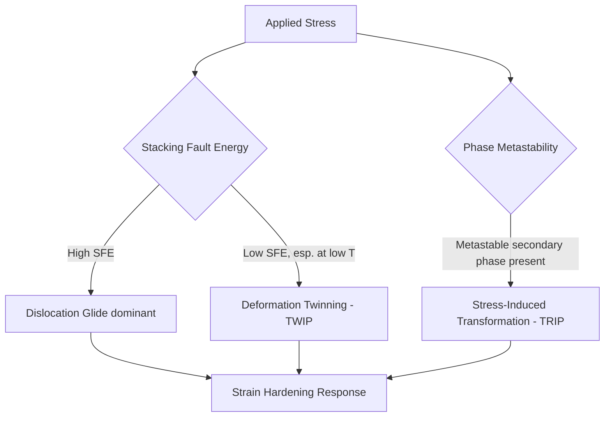

## Mechanical Properties of High Entropy Alloys

### Overview

The mechanical properties of high entropy alloys have attracted substantial research interest because several HEA systems exhibit property combinations — notably simultaneous high strength and toughness, or exceptional cryogenic performance — that are difficult to achieve simultaneously in conventional alloys, where strength and ductility/toughness typically trade off against one another. This item examines strengthening mechanisms, deformation behavior, temperature-dependent properties, and fatigue/fracture response specific to HEA solid-solution and multi-phase microstructures.

### Fundamental Strengthening Mechanisms

**Key Points**

- Solid-solution strengthening is the dominant intrinsic strengthening contribution in single-phase HEAs, arising from lattice friction (Peierls-Nabarro-type resistance to dislocation glide) imposed by the severe lattice distortion of multiple, comparably concentrated atomic species occupying the lattice — generally stronger than the solid-solution strengthening observed in conventional dilute binary/ternary alloys at comparable solute content
- Grain-boundary (Hall-Petch) strengthening follows the same functional form as conventional polycrystalline metals:

$$\sigma_y = \sigma_0 + k_y d^{-1/2}$$

where $\sigma_0$ is the friction stress (dominated by solid-solution strengthening in single-phase HEAs) and $k_y$ is the Hall-Petch slope; several HEA systems have shown Hall-Petch relationships extending to unusually fine grain sizes achieved via severe plastic deformation processing.

- Precipitation strengthening in dual-phase and precipitate-containing HEA/MPEA microstructures follows Orowan bypass and/or shearing mechanisms analogous to conventional precipitation-hardened alloys, providing a route to strength levels substantially exceeding single-phase solid-solution HEAs
- Strain hardening behavior in FCC HEAs (particularly Cantor-type alloys) is notably high relative to many conventional FCC metals, contributing significantly to their combination of strength and uniform elongation prior to necking

### Deformation Mechanisms

**Key Points**

- Dislocation glide (planar or wavy slip depending on stacking fault energy) is the primary room-temperature deformation mechanism in single-phase FCC and BCC HEAs, following the same crystallographic slip-system framework as conventional metals of the same crystal structure
- Deformation-induced twinning (TWIP behavior), most extensively documented in the equiatomic Cantor alloy ($\text{CoCrFeMnNi}$), becomes an increasingly active deformation mode at cryogenic temperature and/or high strain rate as dislocation slip becomes progressively more difficult, contributing an additional strain-hardening mechanism that helps sustain ductility and toughness at low temperature
- Stacking fault energy (SFE) in FCC HEAs is composition- and temperature-dependent and governs the transition between dislocation-glide-dominated and twinning-dominated deformation, functioning as a composition-design lever analogous to SFE engineering in conventional austenitic stainless steels and TWIP steels
- Transformation-induced plasticity (TRIP) effects, where a metastable phase transforms under applied stress to accommodate additional plastic strain, have been reported in select metastable HEA/MPEA compositions engineered specifically to exploit this mechanism, extending the toolbox of strengthening/toughening strategies available beyond the originally reported single-phase Cantor-type systems

### Temperature-Dependent Mechanical Behavior

**Key Points**

- Several single-phase FCC HEAs, most notably the Cantor alloy, exhibit an unusual combination of increasing strength, ductility, and fracture toughness with decreasing temperature down to cryogenic conditions (e.g., liquid nitrogen and liquid helium temperature), in contrast to the more typical toughness loss with decreasing temperature seen in many conventional structural metals (particularly BCC steels, which can exhibit ductile-to-brittle transition behavior)
- This favorable low-temperature behavior in FCC HEAs is generally attributed to the progressive activation of deformation twinning as an additional plastic accommodation mechanism at low temperature, supplementing dislocation glide as it becomes increasingly restricted
- At elevated temperature, single-phase HEA strength generally decreases following thermally activated deformation mechanisms similar to conventional alloys, though refractory BCC HEAs are specifically of interest for retaining useful strength at temperatures exceeding the practical service limits of conventional Ni-based superalloys, motivating their consideration for high-temperature structural applications
- Creep behavior (time-dependent deformation under sustained load at elevated temperature) in HEAs is governed by the same fundamental creep mechanisms (diffusional creep, dislocation creep) as conventional alloys, with the sluggish diffusion effect (where applicable) proposed as a potential contributor to improved creep resistance in some systems, though this remains an area of ongoing investigation rather than a settled conclusion [Unverified: creep-resistance claims attributable specifically to the sluggish diffusion effect are not uniformly established across all HEA systems studied]

### Strength-Ductility Trade-off and Design Strategies

**Key Points**

- Single-phase FCC HEAs generally sit toward the ductile/tough end of the strength-ductility trade-off space, with moderate yield strength but high uniform elongation and toughness
- Single-phase BCC (particularly refractory) HEAs generally sit toward the high-strength end, often with markedly reduced room-temperature tensile ductility, a persistent challenge for refractory HEA structural application that has motivated substantial alloy-design effort
- Heterogeneous and gradient microstructure design (deliberately engineering non-uniform grain size, dual-phase, or compositionally graded structures) is an active strategy for overcoming the classical strength-ductility trade-off, drawing on heterostructure strengthening/toughening principles that have parallels in conventional dual-phase and gradient-structured metals
- Precipitate-strengthened dual-phase HEA/MPEA design (combining a ductile matrix with strengthening precipitates) represents one of the more mature strategies for achieving strength levels competitive with or exceeding conventional high-performance alloys while retaining useful ductility

### Fracture Toughness and Fatigue Behavior

**Key Points**

- Fracture toughness in single-phase FCC HEAs (notably the Cantor alloy) has been reported to reach exceptionally high values at cryogenic temperature, among the highest reported for any structural metallic material at those conditions, attributed to the extensive crack-tip plasticity enabled by the combined dislocation glide and twinning deformation modes
- Fatigue crack growth behavior in HEAs is characterized using the same fracture-mechanics framework (Paris-law crack growth rate description) applied to conventional structural alloys, with HEA-specific fatigue datasets still comparatively limited relative to the extensive long-term fatigue databases available for conventional structural alloys such as steels, Al alloys, and Ni-superalloys [Inference: given the relative novelty of the field, comprehensive long-term fatigue qualification data for most HEA systems remains less extensive than for established conventional structural alloys]
- Environmental and hydrogen embrittlement susceptibility in HEAs is an area of active investigation given the relevance to potential structural applications in hydrogen-containing service environments, with susceptibility found to vary considerably by specific alloy composition and microstructure

$$\frac{da}{dN} = C(\Delta K)^m$$

(Paris law relating fatigue crack growth rate $da/dN$ to the stress intensity factor range $\Delta K$, applied to HEAs using the same framework as conventional alloys, with $C$ and $m$ determined empirically for each specific alloy/microstructure combination.)

### Physical Property Interplay with Mechanical Behavior

**Key Points**

- The severe lattice distortion effect that contributes to solid-solution strengthening simultaneously tends to reduce thermal and electrical conductivity relative to conventional single-element-based alloys, via enhanced electron and phonon scattering from the locally disordered lattice environment — a coupling between mechanical and physical properties characteristic of the HEA design space
- Elastic modulus in HEAs generally follows an approximately rule-of-mixtures trend based on constituent element moduli, though deviations attributable to the cocktail effect have been reported in some systems, making elastic-property prediction somewhat less reliably predictable than for simpler alloy systems
- Density, a critical consideration for weight-sensitive structural applications, varies substantially across HEA families — 3d-transition-metal HEAs are comparatively dense, refractory HEAs (incorporating W, Ta, Nb) are notably dense, while lightweight HEA compositions (incorporating Al, Mg, Ti, Li) specifically target reduced density for improved specific strength

### Comparative Summary Table

| Property Regime | Representative HEA Family | Characteristic Behavior |
| --- | --- | --- |
| Room-temperature ductility/toughness | FCC (Cantor-type) | Good ductility, strain hardening, moderate strength |
| Cryogenic toughness | FCC (Cantor-type) | Increasing strength/ductility/toughness with decreasing T (twinning-enabled) |
| High-temperature strength | Refractory BCC HEAs | Retains strength beyond typical Ni-superalloy limits; often low RT ductility |
| High strength (dual-phase) | Precipitate-strengthened MPEA | Strength competitive with conventional high-performance alloys |
| Specific strength | Lightweight HEAs (Al/Mg/Ti-containing) | Reduced density, targeting weight-sensitive structural use |

### Illustrative Schematic: Strength-Ductility Trade-off Map

<svg xmlns="http://www.w3.org/2000/svg" viewBox="0 0 500 320">
<text x="250" y="22" font-size="15" text-anchor="middle" font-family="sans-serif" font-weight="bold">HEA Strength-Ductility Design Space (svg_diagram)</text>
<line x1="70" y1="270" x2="460" y2="270" stroke="black" stroke-width="1.5" />
<line x1="70" y1="270" x2="70" y2="50" stroke="black" stroke-width="1.5" />
<text x="265" y="295" font-size="12" text-anchor="middle" font-family="sans-serif">Ductility / Toughness</text>
<text x="30" y="160" font-size="12" text-anchor="middle" font-family="sans-serif" transform="rotate(-90,30,160)">Strength</text>
<path d="M 90 90 Q 260 260 440 250" fill="none" stroke="#999" stroke-width="1.5" stroke-dasharray="5,3" />
<text x="300" y="250" font-size="9" font-family="sans-serif">Conventional trade-off boundary</text>
<circle cx="150" cy="200" r="7" fill="#3d8b52" />
<text x="150" y="220" font-size="10" text-anchor="middle" font-family="sans-serif">FCC Cantor-type</text>
<circle cx="380" cy="120" r="7" fill="#4a7ab5" />
<text x="380" y="105" font-size="10" text-anchor="middle" font-family="sans-serif">Refractory BCC</text>
<circle cx="300" cy="140" r="7" fill="#d1495b" />
<text x="300" y="160" font-size="10" text-anchor="middle" font-family="sans-serif">Precipitate-strengthened dual-phase</text>
<circle cx="180" cy="80" r="7" fill="#e29b1a" />
<text x="180" y="65" font-size="10" text-anchor="middle" font-family="sans-serif">Heterostructure-designed HEA</text>
</svg>

### Related Topics

- Twinning-induced plasticity (TWIP) mechanisms in FCC HEAs at cryogenic temperature
- Stacking fault energy composition-dependence and its role as a design lever
- Precipitate-strengthened dual-phase HEA/MPEA design strategies
- Heterostructure and gradient-microstructure toughening approaches
- Hydrogen embrittlement susceptibility across HEA compositional families
- Fatigue crack growth characterization and long-term qualification data gaps
- Creep behavior and the sluggish diffusion effect debate
- Refractory HEA ductility improvement strategies for structural application