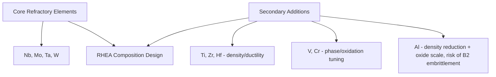
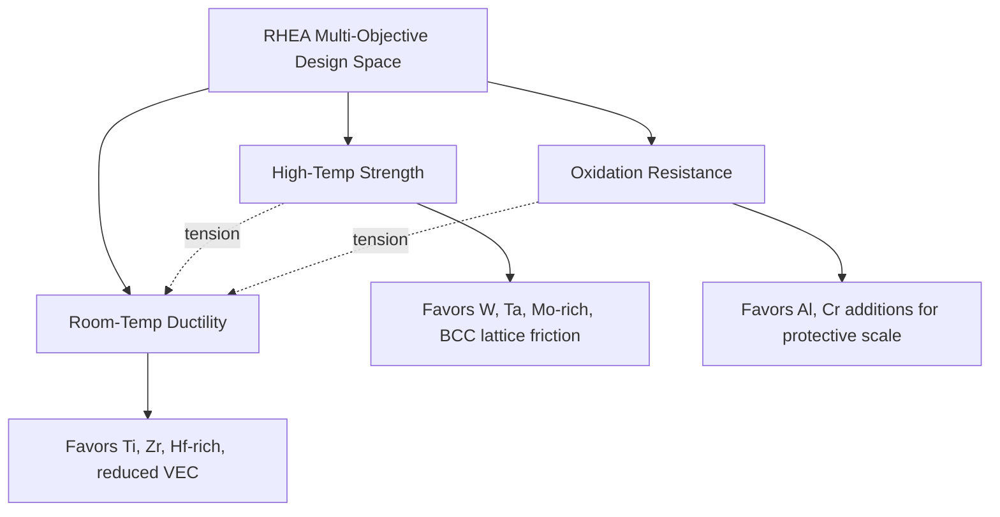

## Refractory High Entropy Alloys

### Overview

Refractory high entropy alloys (RHEAs) are a specialized HEA subclass built from high-melting-point refractory elements — principally Nb, Mo, Ta, W, Ti, Zr, Hf, V, and Cr — targeting structural applications above the practical temperature ceiling of conventional Ni-based superalloys. RHEAs generally form BCC solid solutions and are of particular interest for aerospace propulsion, hypersonic, and energy-sector high-temperature components, though room-temperature ductility remains a persistent, actively researched limitation.

### Compositional Landscape

**Key Points**

- The archetypal first-generation RHEA, equiatomic $\text{MoNbTaW}$ (and the closely related $\text{MoNbTaVW}$), was among the earliest reported refractory MPEA systems and remains a reference composition for the subfield
- Refractory elements are selected specifically for their high individual melting points ($T_m$ for W $\approx$ 3422 °C, Ta $\approx$ 3017 °C, Mo $\approx$ 2623 °C, Nb $\approx$ 2477 °C), which combine to produce RHEA compositions with substantially elevated alloy melting/solidus temperatures relative to conventional Ni-superalloys
- Secondary alloying additions (Ti, Zr, Hf, V, Cr, Al) are incorporated to modify density, room-temperature ductility, oxidation resistance, and phase stability relative to the simplest refractory-only base compositions
- Al additions in particular are widely explored both for density reduction (Al being comparatively light relative to the core refractory elements) and for promoting protective oxide-scale formation, though excessive Al content can also promote embrittling ordered B2/L2$_1$ phase formation, illustrating a characteristic RHEA design trade-off

### Phase Structure

**Key Points**

- RHEAs predominantly form single-phase disordered BCC solid solutions, consistent with the valence electron concentration (VEC) empirical trend where VEC $< 6.87$ favors BCC structure, which most core refractory-element combinations satisfy
- Disordered BCC + ordered B2 dual-phase microstructures are common, particularly in Al- or Ti-containing RHEA compositions, where the B2 superlattice phase can precipitate as a coherent or semi-coherent secondary phase within the disordered BCC matrix
- Laves phase (topologically close-packed, TCP) formation is observed in several RHEA systems, particularly those containing Cr, Zr, or Hf in combination with the core refractory elements, and is generally associated with embrittlement in a manner analogous to TCP-phase formation in conventional Ni-superalloys
- Phase stability assessment in RHEAs relies heavily on CALPHAD-based thermodynamic modeling given the practical difficulty of exhaustively mapping high-order multi-component phase diagrams experimentally, supplemented by the same empirical $\delta$/$\Delta H_{mix}$/$\Omega$/VEC screening parameters used across HEA design generally

### High-Temperature Strength Retention

**Key Points**

- RHEAs, particularly BCC solid-solution compositions such as $\text{MoNbTaW}$, have demonstrated compressive yield strength retention at temperatures where conventional Ni-based superalloys have already lost substantial strength, motivating their consideration for the highest-temperature structural applications beyond current superalloy capability
- Strength retention at elevated temperature is generally attributed to the combination of inherently high melting points of the constituent elements (correlating empirically with high-temperature strength via the classical relationship between homologous temperature and thermally activated deformation resistance) and solid-solution strengthening effects amplified by severe lattice distortion
- BCC crystal structure itself contributes to elevated strength via inherently higher Peierls-Nabarro lattice friction stress relative to FCC structures, consistent with the general observation that BCC refractory metals (W, Mo, Ta, Nb individually) are already recognized for high-temperature strength in conventional (non-HEA) alloy form
- Comparative strength-retention figures between specific RHEA compositions and specific Ni-superalloy grades are reported across a range of studies and depend strongly on the exact compositions, test conditions, and temperature ranges compared; such comparisons should be evaluated against the specific alloys and conditions cited in the primary literature rather than treated as a single universal RHEA-vs-superalloy performance ranking [Unverified: specific quantitative strength-retention comparisons vary considerably by study and should be verified against the specific compositions and test conditions reported]

### Room-Temperature Ductility Challenge

**Key Points**

- Limited room-temperature tensile ductility is the most significant and widely recognized barrier to structural RHEA application, with several early-generation compositions (including base $\text{MoNbTaW}$) exhibiting minimal tensile elongation and, in compression testing, limited ductility relative to typical structural-alloy requirements
- The BCC crystal structure's inherently more limited number of independent easy slip systems relative to FCC, combined with strong solid-solution lattice friction (the same mechanism providing high strength), is generally understood as the fundamental origin of the strength-ductility trade-off observed in RHEAs, analogous in principle to the brittleness challenges long recognized in conventional refractory metals (e.g., W, Mo) in their pure or lightly alloyed forms
- Compositional ductilization strategies include partial substitution of the heaviest, most brittle elements (W, Ta) with more ductile-tendency refractory-adjacent elements (Ti, Zr, Hf, V), reducing valence electron concentration toward more ductile BCC compositional regions, and controlling/eliminating embrittling B2 or Laves secondary phases
- Grain-boundary engineering and microstructural refinement (via thermomechanical processing or powder-metallurgy consolidation routes) are also actively explored as ductility-improvement levers, paralleling grain-refinement ductilization strategies used historically in conventional refractory-metal processing

### Oxidation Resistance

**Key Points**

- Oxidation resistance at high temperature is a second major RHEA challenge alongside room-temperature ductility, since several core refractory elements (particularly Mo and W) form volatile oxide species at elevated temperature (e.g., $\text{MoO}_3$ sublimation) rather than protective, adherent oxide scales, a well-known limitation carried over from conventional refractory-metal high-temperature oxidation behavior
- Al and Cr additions are commonly explored to promote formation of more protective alumina- or chromia-based oxide scales, following oxidation-resistance design principles directly analogous to those used in conventional superalloy and coating design (e.g., alumina-forming vs. chromia-forming alloy design strategies)
- Environmental barrier and thermal barrier coating systems, adapted from Ni-superalloy and ceramic-matrix-composite coating technology, are an actively pursued complementary strategy for enabling RHEA use in oxidizing high-temperature service environments where the base alloy's intrinsic oxidation resistance alone is insufficient
- The combined strength-ductility-oxidation-resistance optimization space represents a genuinely multi-objective RHEA design challenge, where improving one property (e.g., adding Al for oxidation resistance) can adversely affect another (e.g., promoting embrittling B2 phase formation), requiring integrated computational-experimental design approaches rather than single-property optimization

### Processing Routes

**Key Points**

- Arc melting and vacuum induction melting are common laboratory-to-pilot-scale RHEA fabrication routes, chosen for compatibility with the very high melting points of the constituent elements, which exceed the practical capability of many conventional industrial casting processes
- Powder metallurgy routes (mechanical alloying followed by spark plasma sintering or hot isostatic pressing) offer access to fine, more homogeneous microstructures and can mitigate the severe elemental segregation challenges associated with the very wide melting-point range among RHEA constituent elements during conventional ingot solidification
- Additive manufacturing of RHEAs (laser or electron-beam powder-bed fusion, directed energy deposition) is an active and rapidly developing research area, offering near-net-shape fabrication capability for the complex geometries often required in aerospace/high-temperature structural components, though RHEA-specific AM process windows and resulting microstructure-property relationships remain less mature than for conventional AM alloys [Inference: given the relative novelty of RHEA-AM research, process-property relationships continue to be established across a growing but still comparatively limited set of specific alloy-process combinations]
- Post-processing thermomechanical treatment (hot working, annealing) is generally required to homogenize as-cast segregation and control secondary-phase (B2, Laves, TCP) content toward the target balance of strength, ductility, and oxidation resistance

### Comparative Summary Table

| Property | RHEA Characteristic | Design Lever |
| --- | --- | --- |
| High-temperature strength | Retained beyond typical Ni-superalloy limits | Core W/Ta/Mo/Nb content, BCC lattice friction |
| Room-temperature ductility | Often limited in base compositions | Ti/Zr/Hf/V substitution, reduced VEC, phase control |
| Oxidation resistance | Often poor for W/Mo-rich base compositions | Al/Cr additions, protective coatings |
| Density | Generally high (W, Ta rich) | Substitution with lighter refractory-adjacent elements |
| Processing | Requires high-temperature melting or PM routes | Arc melting, mechanical alloying, AM |

### Illustrative Schematic: RHEA Property Optimization Triangle

<svg xmlns="http://www.w3.org/2000/svg" viewBox="0 0 480 320">
<text x="240" y="22" font-size="15" text-anchor="middle" font-family="sans-serif" font-weight="bold">RHEA Design Trade-off Triangle (svg_diagram)</text>
<polygon points="240,50 90,260 390,260" fill="none" stroke="#333" stroke-width="1.5" />
<circle cx="240" cy="50" r="6" fill="#d1495b" />
<text x="240" y="35" font-size="11" text-anchor="middle" font-family="sans-serif">High-Temp Strength</text>
<circle cx="90" cy="260" r="6" fill="#4a7ab5" />
<text x="90" y="280" font-size="11" text-anchor="middle" font-family="sans-serif">Room-Temp Ductility</text>
<circle cx="390" cy="260" r="6" fill="#3d8b52" />
<text x="390" y="280" font-size="11" text-anchor="middle" font-family="sans-serif">Oxidation Resistance</text>
<circle cx="240" cy="190" r="5" fill="#e29b1a" />
<text x="240" y="210" font-size="10" text-anchor="middle" font-family="sans-serif">Target: balanced RHEA</text>
</svg>

### Related Topics

- MoNbTaW and MoNbTaVW as archetypal first-generation RHEA compositions
- B2 and Laves phase embrittlement mechanisms in refractory MPEAs
- Alumina/chromia protective scale design adapted from superalloy oxidation-resistance principles
- Powder metallurgy and mechanical alloying routes for RHEA microstructure control
- Environmental and thermal barrier coating integration for RHEA components
- Additive manufacturing process-window development for refractory MPEAs
- Valence electron concentration as a ductility-design screening parameter
- Comparative high-temperature performance benchmarking against Ni-based superalloys