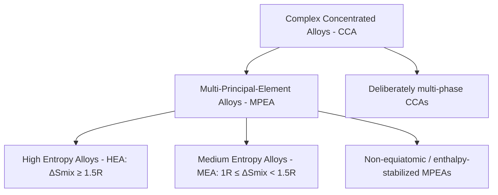
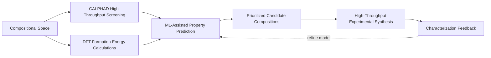

## Complex Concentrated Alloy Design

### Overview

Complex concentrated alloy (CCA) design is the broader compositional and computational framework encompassing high entropy alloys as one region within a larger multi-principal-element design space. "Complex concentrated alloy" is the more general term preferred in much of the contemporary literature, since it does not presuppose that high configurational entropy is the dominant or necessary stabilizing mechanism — a CCA may be single-phase, multi-phase, entropy-stabilized, enthalpy-stabilized, or deliberately non-equiatomic, with HEAs representing the entropy-favored subset of this broader compositional territory.

### Terminology and Scope

**Key Points**

- "Complex concentrated alloy" (CCA) and "multi-principal-element alloy" (MPEA) are largely used interchangeably in the literature to describe alloys with multiple elements present at substantial (non-dilute) concentration, without requiring the alloy to satisfy the strict $\Delta S_{mix} \geq 1.5R$ high-entropy threshold
- This terminological broadening reflects a recognition within the field that many of the most promising alloys in this design space are not necessarily single-phase or maximally high-entropy, but rather deliberately multi-phase or non-equiatomic compositions optimized for specific target properties
- The relationship between CCA, MPEA, and HEA terminology is best understood as a set of overlapping and nested categories rather than strict synonyms: HEA is the entropy-defined subset, MPEA emphasizes the compositional (multi-element) criterion, and CCA is the most general umbrella term encompassing both

### Design Philosophy Shift: From Entropy-Maximization to Property-Targeting

**Key Points**

- First-generation HEA design (exemplified by early equiatomic compositions like the Cantor alloy and $\text{MoNbTaW}$) emphasized maximizing configurational entropy as the primary design criterion, following the original hypothesis that entropy maximization would reliably produce single-phase solid solutions with favorable properties
- Second-generation CCA design has shifted toward property-driven, non-equiatomic composition optimization, treating configurational entropy as one design variable among several (alongside enthalpy of mixing, atomic size mismatch, valence electron concentration, and target phase fraction) rather than the primary objective to be maximized
- This shift reflects accumulated evidence that many equiatomic, maximum-entropy compositions do not necessarily deliver optimal mechanical or functional properties, and that deliberately engineered non-equiatomic or multi-phase compositions can outperform their equiatomic counterparts for specific target applications
- The design question has evolved from "how do I maximize entropy to stabilize a solid solution" toward "what composition and phase architecture (single-phase, precipitate-strengthened, eutectic, etc.) best achieves my target property combination," with entropy control remaining one tool within that broader optimization

### Non-Equiatomic and Off-Stoichiometric Design

**Key Points**

- Non-equiatomic CCAs deliberately weight principal-element concentrations unevenly (rather than the strict equal-atomic-fraction approach of early HEA compositions) to fine-tune phase stability, strengthening precipitate volume fraction, or specific property targets
- Minor alloying additions (elements present below the ~5 at% principal-element threshold but still deliberately incorporated) are increasingly used within the CCA framework to achieve specific microstructural or property outcomes, paralleling the "base alloy plus minor additions" logic of conventional alloy design layered onto the multi-principal-element base
- Eutectic high entropy alloys (EHEAs) are a specific non-equiatomic CCA design strategy that deliberately targets a eutectic composition between two or more constituent phases (rather than a single-phase solid solution), exploiting the excellent castability and fine, well-controlled lamellar/rod-like eutectic microstructure this affords, combined with the intrinsic strength-ductility balance achievable from a soft-phase/hard-phase eutectic combination
- Interstitial-strengthened CCAs (incorporating C, N, or B as minor interstitial-solute additions within a multi-principal-element matrix, conceptually related to interstitial strengthening in conventional steels) represent another active non-equiatomic design direction for boosting strength without the ductility penalty often associated with heavy substitutional alloying

### Computational and High-Throughput Design Approaches

**Key Points**

- CALPHAD thermodynamic modeling remains the backbone computational tool for CCA phase-stability prediction, extended via high-throughput automated calculation across large compositional grids to identify promising regions of the vast multi-component compositional space before committing to experimental synthesis
- Density functional theory (DFT) calculations provide first-principles formation-energy and elastic-property data that can supplement or validate CALPHAD-based empirical thermodynamic databases, particularly valuable for compositional regions where experimentally assessed thermodynamic data is sparse or unavailable
- Machine-learning-assisted composition-property prediction models, trained on growing experimental and computational CCA datasets, are increasingly used to accelerate the search for promising compositions within the combinatorially vast design space, though model performance depends heavily on training-dataset size, diversity, and the degree of extrapolation required beyond previously characterized compositional regions [Unverified: the general transferability and reliability of ML-based CCA property prediction to genuinely novel compositional regions remains an active area of methodological development, with reported model performance varying by dataset and property being predicted]
- High-throughput experimental synthesis and characterization methods (combinatorial thin-film deposition, diffusion-multiple techniques, and rapid parallel bulk-sample synthesis) are increasingly paired with computational screening to close the loop between predicted and experimentally validated compositions at a pace impractical for traditional one-composition-at-a-time alloy development

### Target-Property-Driven Design Frameworks

**Key Points**

- Inverse design approaches (specifying a target property combination first, then computationally searching the compositional space for candidates predicted to satisfy that target) represent a methodological shift from the traditional forward-design approach (select composition, then characterize resulting properties) that dominated early HEA research
- Multi-objective optimization frameworks explicitly balance competing property targets (e.g., strength vs. ductility vs. density vs. cost vs. oxidation resistance) using techniques such as Pareto-front optimization, reflecting the recognition that most practical CCA design problems involve several simultaneously constrained objectives rather than a single property to maximize
- Application-specific design frameworks (e.g., dedicated RHEA design methodologies for high-temperature structural use, or dedicated EHEA design methodologies for castable structural components) have emerged as the field has matured beyond general-purpose HEA exploration toward targeted engineering alloy development
- Cost and criticality considerations (avoiding excessive reliance on scarce or expensive elements such as Ta, Hf, or certain rare-earth-adjacent additions) are increasingly incorporated as explicit design constraints in later-generation CCA design frameworks, reflecting a maturing recognition that laboratory-optimal compositions must also be economically and supply-chain viable for eventual structural or functional deployment

### Phase Architecture as a Design Variable

**Key Points**

- Single-phase solid-solution design (the original HEA design target) remains a valid and useful strategy for applications prioritizing ductility, toughness, and compositional/microstructural simplicity
- Deliberately engineered multi-phase CCA microstructures (precipitate-strengthened, dual-phase, or eutectic architectures) are increasingly treated as first-class design targets rather than undesired deviations from single-phase ideality, reflecting the broader CCA design philosophy that phase complexity is a design variable to be controlled, not necessarily avoided
- Eutectic high entropy alloys specifically exploit a two-(or more)-phase lamellar/rod eutectic microstructure to combine the castability advantages of a eutectic reaction with a soft-phase/hard-phase property combination analogous in spirit to conventional eutectic and dual-phase alloy systems
- The choice between single-phase and multi-phase CCA design ultimately depends on the target application's property priorities, processing route constraints, and cost/criticality considerations, reinforcing that there is no universally "optimal" CCA phase architecture independent of the specific engineering context

### Comparative Summary Table

| Design Generation | Primary Criterion | Representative Approach |
| --- | --- | --- |
| First-generation HEA | Maximize configurational entropy | Equiatomic single-phase (Cantor, MoNbTaW) |
| Non-equiatomic CCA | Property-targeted composition tuning | Off-stoichiometric substitutional design |
| Eutectic HEA (EHEA) | Castability + soft/hard phase balance | Deliberate eutectic-composition targeting |
| Interstitial-strengthened CCA | Strength without ductility penalty | C/N/B minor-addition strengthening |
| Computationally-driven CCA | Multi-objective property optimization | CALPHAD + DFT + ML high-throughput screening |

### Illustrative Schematic: CCA Design Space Evolution

<svg xmlns="http://www.w3.org/2000/svg" viewBox="0 0 500 280">
<text x="250" y="22" font-size="15" text-anchor="middle" font-family="sans-serif" font-weight="bold">Evolution of CCA Design Philosophy (svg_diagram)</text>
<rect x="40" y="60" width="130" height="60" rx="6" fill="#4a7ab5" />
<text x="105" y="85" font-size="10" text-anchor="middle" fill="white" font-family="sans-serif">Entropy</text>
<text x="105" y="100" font-size="10" text-anchor="middle" fill="white" font-family="sans-serif">Maximization</text>
<text x="105" y="140" font-size="9" text-anchor="middle" font-family="sans-serif">(equiatomic, single-phase)</text>
<line x1="170" y1="90" x2="220" y2="90" stroke="black" stroke-width="1.5" marker-end="url(#arrow2)" />
<rect x="220" y="60" width="130" height="60" rx="6" fill="#e29b1a" />
<text x="285" y="85" font-size="10" text-anchor="middle" fill="white" font-family="sans-serif">Property-Targeted</text>
<text x="285" y="100" font-size="10" text-anchor="middle" fill="white" font-family="sans-serif">Composition Tuning</text>
<text x="285" y="140" font-size="9" text-anchor="middle" font-family="sans-serif">(non-equiatomic, multi-phase)</text>
<line x1="350" y1="90" x2="400" y2="90" stroke="black" stroke-width="1.5" marker-end="url(#arrow2)" />
<rect x="400" y="60" width="90" height="60" rx="6" fill="#3d8b52" />
<text x="445" y="85" font-size="10" text-anchor="middle" fill="white" font-family="sans-serif">Inverse</text>
<text x="445" y="100" font-size="10" text-anchor="middle" fill="white" font-family="sans-serif">Design</text>
</svg>

### Related Topics

- Eutectic high entropy alloys (EHEAs): design principles and castability advantages
- Interstitial strengthening in complex concentrated alloy matrices
- Pareto-front multi-objective optimization for alloy composition design
- High-throughput combinatorial synthesis and characterization methods
- Diffusion-multiple techniques for rapid compositional space exploration
- Machine-learning surrogate models for alloy property prediction
- Cost- and criticality-constrained alloy design frameworks
- Application-specific CCA design methodologies (structural, functional, high-temperature)