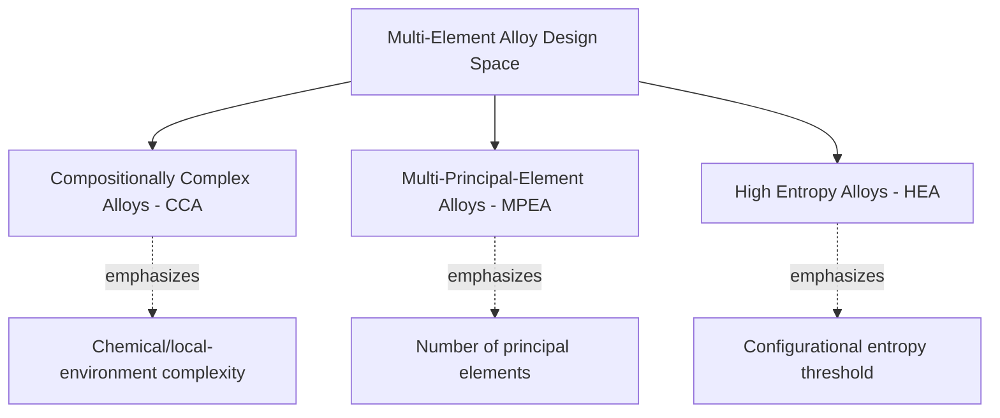

## Compositionally Complex Alloys

### Overview

Compositionally complex alloys (CCAs, in this specific usage) represent a further terminological and conceptual refinement within the multi-principal-element alloy field, referring to alloys whose defining feature is chemical complexity itself — many elements at varied, often non-equiatomic concentrations — independent of whether the resulting phase is single-phase, entropy-stabilized, or otherwise. This item examines compositional complexity as a distinct design axis and clarifies its relationship to the closely related HEA/MPEA terminology already covered in this chapter.

### Clarifying "Compositional Complexity" as a Design Axis

**Key Points**

- "Compositionally complex alloy" places explicit emphasis on the number and variety of constituent elements and their often-irregular, non-equiatomic concentration distribution, rather than on any threshold criterion (entropy, atomic size mismatch, etc.) used to predict phase behavior
- This framing deliberately decouples compositional complexity from any presumption about resulting phase simplicity: a compositionally complex alloy may just as readily form multiple phases, complex intermetallic structures, or graded/heterogeneous microstructures as it may form a single disordered solid solution
- The term has gained usage particularly in contexts emphasizing that the interesting materials science lies in the complexity of local chemical environment and its consequences (local lattice distortion, chemical short-range order, complex electronic structure) rather than in satisfying a specific entropy-based classification threshold
- In practice, "compositionally complex alloy," "multi-principal-element alloy," and "complex concentrated alloy" are used with substantial overlap across the literature; the distinctions are best understood as differences in which aspect of the alloy (chemical complexity, principal-element count, or concentration profile) a given author chooses to emphasize, rather than as rigorously separated technical categories

### Local Chemical Complexity and Its Structural Consequences

**Key Points**

- Local lattice environment in a compositionally complex alloy varies from site to site: each lattice position is surrounded by a locally unique, randomly varying combination of neighboring species differing in atomic size, electronegativity, and bonding character, in contrast to the statistically uniform local environment of a conventional dilute alloy
- This local heterogeneity is the structural root of the severe lattice distortion effect (already covered in the context of HEA design principles) and extends further into local elastic-modulus fluctuation, local electronic-structure variation, and local chemical short-range ordering tendencies that are increasingly resolvable with modern atomic-resolution characterization techniques
- Chemical short-range order (SRO), a recurring theme in compositionally complex alloy characterization, reflects the fact that even a globally "random" solid solution composition can exhibit statistically significant local clustering or ordering tendencies among specific atomic-pair species, without forming a distinct long-range-ordered crystallographic phase
- Characterizing and quantifying this local complexity (via atom probe tomography, diffuse scattering, and complementary atomistic simulation methods such as special quasi-random structure, SQS, modeling) has become a central research focus specifically because bulk average composition alone is insufficient to predict local-environment-dependent properties such as stacking fault energy, deformation behavior, and point-defect energetics

### Compositional Complexity and Property Tunability

**Key Points**

- A larger number of independently variable elemental concentrations provides a correspondingly larger number of independent design degrees of freedom for property tuning, in principle enabling finer-grained optimization of target property combinations than is achievable with conventional low-order (binary/ternary) alloy systems
- This expanded design space is simultaneously the field's greatest opportunity and its greatest practical challenge: the compositional space to be searched grows combinatorially with the number of candidate elements and achievable concentration resolution, motivating the high-throughput computational and experimental screening approaches discussed in the complex concentrated alloy design context
- Property "cocktail effects" (non-linear, non-rule-of-mixtures property combinations) are most pronounced and most actively studied specifically in highly compositionally complex systems, where the sheer number of interacting species makes simple linear-superposition property prediction least reliable
- Compositional complexity does not automatically confer property advantages; the relationship between compositional complexity and resulting property performance is alloy-system- and property-specific, and highly compositionally complex alloys can just as readily underperform simpler alloys for a given target property if the composition is not deliberately optimized toward that target

### Distinguishing Compositional Complexity from Entropy-Based Stabilization

**Key Points**

- It is a common misconception, addressed explicitly in much of the foundational literature, that compositional complexity alone guarantees single-phase solid-solution formation; as covered in the concept and design principles discussion, phase formation depends on the interplay of configurational entropy with mixing enthalpy, atomic size mismatch, and valence electron concentration, not compositional complexity in isolation
- A highly compositionally complex alloy (many elements, highly non-equiatomic) can have relatively low configurational entropy if concentrations are strongly skewed toward one or two dominant elements, illustrating that element count and configurational entropy, while related, are not equivalent metrics
- This distinction is precisely why the field has increasingly gravitated toward the broader "compositionally complex alloy" and "complex concentrated alloy" terminology rather than relying exclusively on "high entropy alloy," since the latter term can misleadingly suggest that entropy maximization is both necessary and sufficient for the favorable properties observed in this alloy class
- Genuinely entropy-stabilized behavior (where the disordered solid solution is thermodynamically favored specifically because of its configurational entropy contribution, particularly at elevated temperature) remains an important and real phenomenon within this broader compositionally complex alloy space, but represents one mechanism among several by which compositionally complex alloys can achieve useful phase stability and properties

### Characterization Techniques Specific to Compositional Complexity

**Key Points**

- Atom probe tomography (APT) provides near-atomic-scale, three-dimensional compositional mapping uniquely suited to resolving local compositional fluctuations, clustering, and short-range order in highly compositionally complex systems where conventional diffraction-based techniques average over larger sampling volumes
- Energy-dispersive X-ray spectroscopy (EDS) and electron energy-loss spectroscopy (EELS) coupled with scanning transmission electron microscopy (STEM) provide complementary nanoscale-to-microscale compositional mapping, valuable for characterizing larger-scale (but still sub-micron) compositional heterogeneity such as dendritic segregation or secondary-phase composition
- Synchrotron and neutron diffuse scattering techniques probe local structural and chemical correlations that fall between the fully long-range-ordered signal captured by conventional Bragg diffraction and the fully local signal captured by atom-probe techniques, providing statistically averaged information about short-range ordering tendencies across a larger sampled volume
- Computational atomistic modeling, particularly special quasi-random structure (SQS) approaches combined with DFT, provides a complementary theoretical framework for representing and studying the effects of chemical complexity and local disorder at the atomic scale, especially valuable for properties (e.g., point-defect formation energies, local elastic constants) that are extremely difficult to resolve experimentally at the necessary spatial resolution

### Design and Application Implications

**Key Points**

- The compositionally-complex-alloy framing has practical design implications: rather than treating "achieve high entropy" as the design objective, practitioners increasingly treat "select the right combination and concentration profile of elements for the target local chemical environment and resulting property set" as the operative design objective, with entropy, enthalpy, and other empirical parameters serving as useful predictive tools within that broader objective rather than as the objective itself
- This shift supports the non-equiatomic, property-targeted, and computationally-driven design strategies already covered under complex concentrated alloy design, reinforcing that compositional complexity, phase architecture, and target property optimization are best treated as interconnected design variables rather than addressed in isolation
- Extending the compositionally complex alloy concept beyond metallic solid solutions (into high-entropy ceramics, oxides, and other non-metallic compositionally complex material systems) reflects the field's recognition that the core design principle — leveraging deliberate multi-element chemical complexity for property tunability — is not inherently limited to metallic alloy systems

### Comparative Summary Table

| Term | Primary Emphasis | Phase Assumption |
| --- | --- | --- |
| High Entropy Alloy (HEA) | Configurational entropy threshold | Historically implied single-phase solid solution |
| Multi-Principal-Element Alloy (MPEA) | Number of principal elements | No inherent phase assumption |
| Complex Concentrated Alloy (CCA) | Broad umbrella; property-driven design | No inherent phase assumption; explicitly includes multi-phase |
| Compositionally Complex Alloy | Local chemical/structural complexity | No inherent phase assumption; emphasizes local environment |

### Illustrative Schematic: Local Chemical Environment Complexity

<svg xmlns="http://www.w3.org/2000/svg" viewBox="0 0 500 280">
<text x="250" y="22" font-size="15" text-anchor="middle" font-family="sans-serif" font-weight="bold">Local Environment: Dilute vs Compositionally Complex (svg_diagram)</text>
<text x="130" y="50" font-size="11" text-anchor="middle" font-family="sans-serif">Dilute Alloy (conventional)</text>
<g>
<circle cx="60" cy="90" r="10" fill="#4a7ab5" /><circle cx="100" cy="90" r="10" fill="#4a7ab5" /><circle cx="140" cy="90" r="10" fill="#4a7ab5" /><circle cx="180" cy="90" r="10" fill="#4a7ab5" />
<circle cx="80" cy="120" r="10" fill="#4a7ab5" /><circle cx="120" cy="120" r="10" fill="#d1495b" /><circle cx="160" cy="120" r="10" fill="#4a7ab5" />
<circle cx="60" cy="150" r="10" fill="#4a7ab5" /><circle cx="100" cy="150" r="10" fill="#4a7ab5" /><circle cx="140" cy="150" r="10" fill="#4a7ab5" /><circle cx="180" cy="150" r="10" fill="#4a7ab5" />
</g>
<text x="370" y="50" font-size="11" text-anchor="middle" font-family="sans-serif">Compositionally Complex Alloy</text>
<g>
<circle cx="300" cy="90" r="10" fill="#4a7ab5" /><circle cx="340" cy="90" r="10" fill="#e29b1a" /><circle cx="380" cy="90" r="10" fill="#3d8b52" /><circle cx="420" cy="90" r="10" fill="#7b4fa0" />
<circle cx="320" cy="120" r="10" fill="#d1495b" /><circle cx="360" cy="120" r="10" fill="#4a7ab5" /><circle cx="400" cy="120" r="10" fill="#e29b1a" />
<circle cx="300" cy="150" r="10" fill="#3d8b52" /><circle cx="340" cy="150" r="10" fill="#7b4fa0" /><circle cx="380" cy="150" r="10" fill="#d1495b" /><circle cx="420" cy="150" r="10" fill="#4a7ab5" />
</g>
<text x="250" y="190" font-size="10" text-anchor="middle" font-family="sans-serif">Each color represents a distinct element; right panel shows locally varying neighbor environments</text>
<text x="250" y="210" font-size="10" text-anchor="middle" font-family="sans-serif">driving severe lattice distortion and local short-range-order tendencies</text>
</svg>

### Related Topics

- Chemical short-range order (SRO) characterization via atom probe tomography and diffuse scattering
- Special quasi-random structure (SQS) atomistic modeling for compositionally complex systems
- High-entropy ceramics and oxides as an extension of the compositional-complexity concept
- Local lattice distortion effects on stacking fault energy and deformation behavior
- Non-equiatomic and property-targeted design within the compositional complexity framework
- Relationship between element count, configurational entropy, and phase stability
- Cocktail effects and their origin in local chemical/electronic interactions
- High-throughput computational and experimental exploration of compositional space