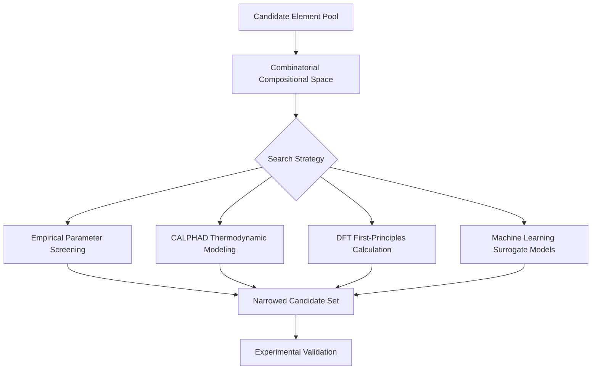
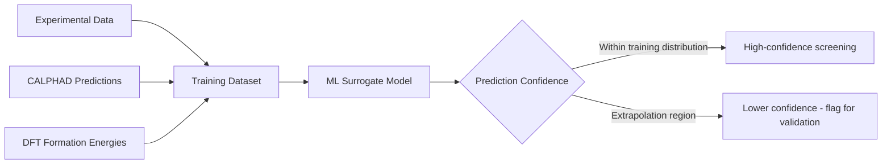

## Computational Design of Multicomponent Alloys

### Overview

Computational design of multicomponent alloys is the integrated methodological framework — spanning thermodynamic modeling, first-principles calculation, atomistic simulation, and data-driven machine learning — used to navigate the combinatorially vast compositional space of HEAs, RHEAs, and CCAs without relying solely on exhaustive experimental synthesis. This item consolidates and extends the computational themes introduced piecemeal across preceding chapter items into a unified methodological treatment.

### The Combinatorial Search Problem

**Key Points**

- The fundamental challenge motivating computational design is scale: even restricting consideration to a modest pool of 20–30 candidate elements, the number of possible 4-to-7-element compositions at reasonable concentration resolution vastly exceeds what could ever be experimentally synthesized and characterized one composition at a time
- This combinatorial explosion is qualitatively different from the design problem faced in conventional alloy development (typically one base element plus a handful of minor additions), where the search space, while still large, is orders of magnitude smaller and more tractable via traditional Edisonian (trial-and-error) or CALPHAD-guided approaches
- Computational design methods are therefore not merely a convenience but a practical necessity for systematically exploring multicomponent alloy space, motivating the layered computational workflow (empirical screening → thermodynamic modeling → first-principles validation → machine-learning acceleration) that has become standard practice in the field

### Empirical Parameter Screening (First-Pass Filtering)

**Key Points**

- The empirical parameters introduced in the concept and design principles item — atomic size mismatch $\delta$, mixing enthalpy $\Delta H_{mix}$, the combined $\Omega$ parameter, and valence electron concentration (VEC) — serve as computationally inexpensive first-pass filters, rapidly screening large candidate composition sets before committing to more computationally expensive thermodynamic or first-principles methods
- These parameters are attractive as an initial screening layer specifically because they require only tabulated elemental data (atomic radii, binary mixing enthalpies, valence electron counts) and simple closed-form calculations, making them tractable to evaluate across millions of candidate compositions
- The known limitations of these empirical parameters (guideline thresholds derived from historical datasets, imperfect predictive accuracy, exceptions in the literature) mean they are best understood as a coarse filtering stage rather than a definitive design tool, with more rigorous methods reserved for the reduced candidate set that survives this initial screen
- Extensions to the basic parameter set, including electronegativity difference and various empirically fitted phase-formation-rule combinations, continue to be proposed and refined in the literature as the experimental HEA/CCA dataset available for parameter validation and refinement grows

### CALPHAD Thermodynamic Modeling

**Key Points**

- CALPHAD (CALculation of PHAse Diagrams) modeling, already introduced in the microstructure and phase formation item, extends thermodynamic assessments of binary and ternary subsystems to predict multi-component phase equilibria via established extrapolation methods (e.g., Muggianu-type geometric extrapolation), providing a substantially more rigorous free-energy-based phase-stability prediction than the empirical parameters alone
- CALPHAD accuracy for genuinely high-order (5+ element) systems depends critically on the completeness and quality of the underlying assessed binary/ternary thermodynamic database; compositional regions or element combinations with sparse or unassessed lower-order subsystem data introduce correspondingly greater extrapolation uncertainty into higher-order predictions
- High-throughput CALPHAD calculation, automating phase-equilibrium calculation across large compositional and temperature grids, allows systematic mapping of predicted phase-stability regions across multicomponent space, directly supporting the composition-screening workflows used throughout HEA/CCA/RHEA design
- CALPHAD-coupled Scheil-Gulliver solidification simulation (introduced in the microstructure item) extends equilibrium phase-diagram calculation to predict non-equilibrium solidification paths and microsegregation, an important practical extension since as-cast multicomponent alloy microstructures frequently deviate substantially from full-equilibrium predictions

### First-Principles (DFT) Calculation

**Key Points**

- Density functional theory (DFT) calculations provide formation energies, elastic constants, and electronic structure data directly from quantum-mechanical first principles, offering an independent validation route and filling gaps where assessed CALPHAD thermodynamic data is sparse or unavailable for specific element combinations
- Special quasi-random structure (SQS) modeling, introduced in the compositionally complex alloys item, is the standard DFT-compatible approach for representing chemically disordered multicomponent solid solutions within the periodic supercell framework DFT methods require, since DFT calculations fundamentally operate on defined atomic arrangements rather than statistically averaged random occupation
- DFT-calculated formation energies and elastic properties are increasingly used both as standalone predictive tools and as training data for machine-learning surrogate models, extending the practical reach of first-principles-level accuracy to compositional regions too numerous to calculate individually via DFT alone
- Computational cost remains a meaningful practical constraint for DFT-based multicomponent alloy screening: each SQS-DFT calculation is substantially more computationally expensive than a CALPHAD or empirical-parameter evaluation, reinforcing the layered screening workflow where DFT is applied selectively to a pre-narrowed candidate set rather than across the full combinatorial space

### Machine Learning and Data-Driven Design

**Key Points**

- Machine-learning surrogate models, trained on combined experimental and computational (CALPHAD/DFT) datasets, aim to predict phase stability and target properties (strength, ductility, density, thermal conductivity) across compositional space at a fraction of the computational cost of direct CALPHAD or DFT calculation, enabling screening of orders of magnitude more candidate compositions
- Model architectures applied in this space range from relatively simple regression and classification methods to more complex approaches (e.g., neural networks, gradient-boosted trees, Gaussian process regression), with model selection generally guided by dataset size, feature representation choices, and the specific property being predicted
- Feature engineering (representing alloy composition via physically meaningful descriptors such as the empirical parameters discussed above, elemental property statistics, or learned representations) significantly influences model performance and is an active area of methodological development specific to multicomponent alloy property prediction
- Model reliability and transferability to genuinely novel compositional regions distant from the training dataset remains a well-recognized limitation across the field, since machine-learning models generally interpolate more reliably within their training distribution than they extrapolate beyond it — an important caveat given that the entire motivation for computational multicomponent alloy design is to explore under-sampled regions of compositional space [Unverified: the degree to which current ML models for multicomponent alloys can reliably extrapolate beyond their training data varies by specific model, dataset, and target property, and is an active area of methodological research without a single settled answer]

### Inverse Design and Multi-Objective Optimization

**Key Points**

- Inverse design frameworks, introduced conceptually in the complex concentrated alloy design item, use computational optimization methods (genetic algorithms, Bayesian optimization, and related search strategies) to work backward from a specified target property combination toward candidate compositions predicted to satisfy that target, rather than the traditional forward workflow of proposing a composition and then predicting its properties
- Multi-objective optimization techniques, particularly Pareto-front-based approaches, explicitly handle the reality that most practical multicomponent alloy design problems involve several simultaneously constrained objectives (e.g., strength, ductility, density, cost, oxidation resistance) that cannot generally all be maximized simultaneously, providing the designer with a set of non-dominated trade-off solutions rather than a single "optimal" composition
- Active learning approaches, where computational predictions guide targeted experimental validation and the resulting experimental data is fed back to refine the predictive model, are increasingly integrated into multicomponent alloy design workflows to make efficient use of limited experimental synthesis and characterization capacity
- The practical output of these methods is typically a prioritized, substantially reduced candidate composition list for experimental follow-up, rather than a final validated alloy composition — underscoring that computational design methods across this entire field function as an efficiency-multiplying screening and prioritization tool, with experimental synthesis and characterization remaining the essential final validation step

### High-Throughput Experimental Integration

**Key Points**

- High-throughput experimental synthesis and characterization methods (combinatorial thin-film deposition libraries, diffusion-multiple techniques, and parallel rapid bulk-sample synthesis, all introduced in the complex concentrated alloy design item) provide the essential experimental counterpart to computational high-throughput screening, closing the design-validation loop at a pace more compatible with the scale of computational candidate generation
- Automated and semi-automated characterization workflows (rapid mechanical testing, automated microstructural imaging and analysis) are increasingly paired with high-throughput synthesis to further accelerate the experimental validation stage, reducing the traditional bottleneck where computational screening substantially outpaces experimental follow-up capacity
- Data generated through high-throughput experimental campaigns feeds directly back into machine-learning model training and CALPHAD database refinement, creating an integrated computational-experimental design loop rather than a purely one-directional computation-then-validation workflow
- Despite these advances, the overall multicomponent alloy design pipeline remains ultimately experimentally validated rather than purely computationally determined — computational methods prioritize and narrow the search, but final composition selection for any genuinely novel structural or functional application continues to require physical synthesis and characterization

### Comparative Summary Table

| Method | Computational Cost | Primary Role | Key Limitation |
| --- | --- | --- | --- |
| Empirical parameters (δ, ΔHmix, Ω, VEC) | Very low | First-pass screening filter | Guideline thresholds, imperfect accuracy |
| CALPHAD | Moderate | Rigorous phase-stability prediction | Depends on assessed database completeness |
| DFT (SQS-based) | High | First-principles formation energy/elastic data | Expensive per-composition; disorder representation |
| Machine learning | Low (after training) | Rapid large-scale property/phase prediction | Limited extrapolation reliability |
| Inverse design / multi-objective optimization | Moderate-high | Target-driven candidate generation | Requires reliable underlying property models |

### Illustrative Schematic: Integrated Computational-Experimental Design Loop

<svg xmlns="http://www.w3.org/2000/svg" viewBox="0 0 500 300">
<text x="250" y="22" font-size="15" text-anchor="middle" font-family="sans-serif" font-weight="bold">Computational-Experimental Design Loop (svg_diagram)</text>
<circle cx="120" cy="90" r="55" fill="#4a7ab5" opacity="0.85" />
<text x="120" y="85" font-size="10" text-anchor="middle" fill="white" font-family="sans-serif">Empirical +</text>
<text x="120" y="100" font-size="10" text-anchor="middle" fill="white" font-family="sans-serif">CALPHAD + DFT</text>
<circle cx="380" cy="90" r="55" fill="#e29b1a" opacity="0.85" />
<text x="380" y="85" font-size="10" text-anchor="middle" fill="white" font-family="sans-serif">ML Surrogate</text>
<text x="380" y="100" font-size="10" text-anchor="middle" fill="white" font-family="sans-serif">+ Inverse Design</text>
<circle cx="250" cy="220" r="55" fill="#3d8b52" opacity="0.85" />
<text x="250" y="215" font-size="10" text-anchor="middle" fill="white" font-family="sans-serif">High-Throughput</text>
<text x="250" y="230" font-size="10" text-anchor="middle" fill="white" font-family="sans-serif">Experiment</text>
<line x1="170" y1="105" x2="330" y2="105" stroke="black" stroke-width="1.5" marker-end="url(#arrow3)" />
<line x1="350" y1="135" x2="280" y2="185" stroke="black" stroke-width="1.5" marker-end="url(#arrow3)" />
<line x1="220" y1="185" x2="150" y2="135" stroke="black" stroke-width="1.5" marker-end="url(#arrow3)" />
</svg>

### Related Topics

- Special quasi-random structure (SQS) methodology for DFT modeling of disordered alloys
- CALPHAD database assessment and extrapolation uncertainty in high-order systems
- Bayesian optimization and genetic algorithms for inverse alloy design
- Active learning workflows integrating computation and high-throughput experiment
- Feature engineering and descriptor selection for alloy property machine learning
- Diffusion-multiple and combinatorial thin-film high-throughput synthesis techniques
- Pareto-front multi-objective optimization for competing property targets
- Extrapolation reliability limits of machine-learning models in novel compositional regions