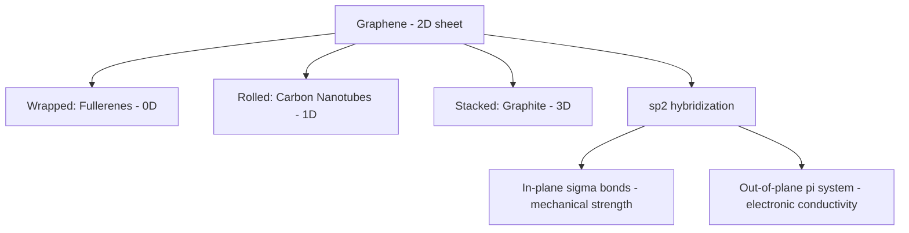
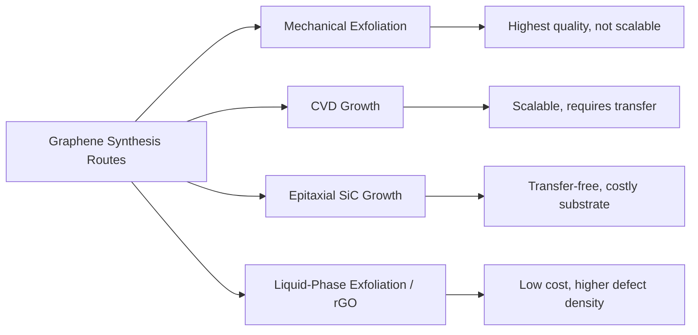

## Graphene Structure and Properties

### Overview

Graphene is a single atomic layer of carbon atoms arranged in a two-dimensional hexagonal (honeycomb) lattice, representing the foundational member of the broader two-dimensional materials family covered in this chapter. Its extraordinary combination of mechanical strength, electrical conductivity, and thermal conductivity — arising directly from its unique atomic bonding and electronic band structure — established the experimental and conceptual template for the layered-materials research field that followed its isolation.

### Atomic Structure

**Key Points**

- Graphene consists of carbon atoms arranged in a two-dimensional hexagonal lattice with $sp^2$ hybridization: each carbon atom forms three strong in-plane $\sigma$ bonds to its three nearest neighbors (bond angle 120°, bond length $\approx$ 0.142 nm) plus one out-of-plane $\pi$ bond formed from the unhybridized $p_z$ orbital
- The honeycomb lattice is technically a two-atom-basis triangular Bravais lattice, meaning it consists of two interpenetrating triangular sublattices (commonly labeled A and B) rather than a simple single-atom-basis lattice, a structural detail with direct consequences for graphene's electronic band structure
- The delocalized $\pi$-electron system, formed by the overlap of the out-of-plane $p_z$ orbitals across the entire sheet, is responsible for graphene's electrical conductivity and is the structural feature most directly analogous to the aromatic $\pi$-system of benzene, extended across a macroscopic two-dimensional sheet
- Graphene is the fundamental 2D building block from which other sp2-carbon allotropes are conceptually derived: it can be wrapped into 0D fullerenes, rolled into 1D carbon nanotubes, or stacked into 3D graphite, making it the dimensional reference point for the broader carbon-allotrope family

### Electronic Band Structure

**Key Points**

- Graphene is a zero-bandgap semiconductor (or "semimetal"), with conduction and valence $\pi$-bands meeting exactly at discrete points in momentum space called Dirac points (located at the corners of the hexagonal Brillouin zone, conventionally labeled K and K')
- Near the Dirac points, the electronic energy dispersion is linear rather than the parabolic dispersion typical of conventional semiconductors:

$$E(\vec{k}) = \pm \hbar v_F |\vec{k}|$$

where $v_F$ is the Fermi velocity (approximately $10^6$ m/s in graphene, roughly 1/300th the speed of light) and $\vec{k}$ is the momentum measured from the Dirac point. This linear dispersion means charge carriers near the Dirac point behave as massless relativistic particles (Dirac fermions) described by an equation mathematically analogous to the relativistic Dirac equation rather than the conventional non-relativistic Schrödinger effective-mass framework.

- This massless-Dirac-fermion behavior underlies several of graphene's distinctive electronic transport phenomena, including an anomalous (half-integer) quantum Hall effect and ambipolar electric field effect (the ability to continuously tune between electron and hole conduction via applied gate voltage, since the material has no intrinsic bandgap separating the two carrier types)
- The absence of an intrinsic bandgap, while enabling exceptionally high carrier mobility, is simultaneously the central limitation for graphene's direct application in conventional digital logic transistors, which require a bandgap to achieve an effective off-state — motivating extensive bandgap-engineering research (strain, substrate interaction, bilayer stacking, chemical functionalization, nanoribbon confinement)

### Mechanical Properties

**Key Points**

- Graphene exhibits exceptionally high intrinsic mechanical strength and stiffness, with reported values placing it among the strongest materials ever measured, attributed directly to the strength of the in-plane $sp^2$ $\sigma$-bonded honeycomb lattice
- The commonly cited benchmark experimental measurements (via nanoindentation of suspended graphene membranes) report an in-plane elastic (Young's) modulus on the order of ~1 TPa and intrinsic tensile strength on the order of tens of GPa for defect-free monolayer graphene, though exact reported values vary somewhat across measurement studies and depend on sample quality, defect density, and measurement methodology [Inference: precise numerical property values for graphene vary across the literature depending on specific sample preparation and characterization technique; treat cited figures as representative benchmarks rather than fixed universal constants]
- Real-world (non-idealized) graphene samples, particularly those produced via scalable methods such as CVD growth or solution processing, typically exhibit substantially reduced mechanical performance relative to defect-free mechanically exfoliated samples, due to grain boundaries, wrinkles, and point/line defects introduced during synthesis and transfer
- Graphene's mechanical properties are highly anisotropic between the strong in-plane bonding and the weak out-of-plane van der Waals interaction (relevant in multilayer graphene and graphite), a structural anisotropy pattern that recurs throughout the broader 2D layered materials family covered later in this chapter

### Thermal Properties

**Key Points**

- Suspended single-layer graphene exhibits exceptionally high in-plane thermal conductivity, among the highest reported for any known material, dominated by phonon transport through the strongly bonded $sp^2$ lattice rather than by electronic thermal conduction
- Reported thermal conductivity values are substrate- and sample-dependent: suspended graphene generally shows substantially higher thermal conductivity than substrate-supported graphene, since substrate phonon coupling introduces additional phonon-scattering pathways that reduce the effective thermal conductivity relative to the free-standing case
- The two-dimensional phonon transport regime in graphene differs fundamentally from three-dimensional bulk thermal transport, with reduced-dimensionality effects on phonon scattering and boundary-scattering contributions playing a more prominent role than in bulk crystalline solids
- High thermal conductivity combined with high electrical conductivity motivates interest in graphene for thermal management applications (heat spreaders, thermal interface materials) as a complementary application direction alongside its electronic and mechanical property applications

### Optical Properties

**Key Points**

- Monolayer graphene absorbs a remarkably well-defined and wavelength-independent fraction of incident visible light (commonly cited at approximately 2.3% per layer, given by $\pi\alpha$ where $\alpha$ is the fine-structure constant), a striking and unusual result that follows directly from graphene's linear Dirac-cone band structure and provides a simple, non-destructive optical method for identifying and counting the number of layers in few-layer graphene samples
- This universal optical absorbance (nearly wavelength-independent across the visible spectrum, in contrast to the strongly wavelength-dependent absorption typical of conventional semiconductors with a defined bandgap) is a direct experimental signature of graphene's gapless, linear electronic dispersion
- Combined with high electrical conductivity, graphene's high optical transparency motivates interest as a transparent conducting electrode material, a potential complement or alternative to conventional transparent conducting oxides (e.g., indium tin oxide) in applications such as touchscreens and photovoltaic device electrodes
- Graphene's optical properties are tunable via electrostatic gating and chemical doping, since shifting the Fermi level relative to the Dirac point modifies the available interband and intraband optical transition pathways, an active area of graphene photonics and optoelectronics research

### Synthesis Methods

**Key Points**

- Mechanical exfoliation ("Scotch tape method"), the technique used in graphene's original 2004 isolation, produces the highest-quality, lowest-defect-density graphene samples but is impractical for scalable production, remaining primarily a research and benchmark-quality-sample technique
- Chemical vapor deposition (CVD), typically on catalytic copper or nickel substrates using a hydrocarbon precursor gas, is the dominant scalable synthesis route for large-area, relatively high-quality graphene films, followed by a transfer process to move the grown film from the growth substrate to the target application substrate
- Epitaxial growth on silicon carbide (SiC), via controlled thermal decomposition/sublimation of Si from the SiC surface leaving a graphitized carbon layer, offers a transfer-free synthesis route directly compatible with certain semiconductor processing workflows, at the cost of higher substrate cost and more specialized processing conditions relative to CVD
- Liquid-phase exfoliation and reduced graphene oxide (rGO) production (via oxidation of graphite to graphene oxide, followed by chemical or thermal reduction) offer lower-cost, more scalable routes suited to bulk/composite and coating applications, generally at the cost of higher defect density and reduced electronic/mechanical performance relative to CVD or mechanically exfoliated graphene

### Comparative Summary Table

| Property | Characteristic Value/Behavior | Governing Mechanism |
| --- | --- | --- |
| Electronic structure | Zero-bandgap, linear Dirac dispersion | sp2 π-electron system, honeycomb lattice symmetry |
| Carrier mobility | Very high intrinsic mobility | Massless Dirac fermion transport |
| Mechanical strength/stiffness | Among highest known for any material | Strong in-plane sp2 σ-bonding |
| Thermal conductivity | Very high (suspended monolayer) | Efficient phonon transport in 2D lattice |
| Optical absorbance | ~2.3% per layer, wavelength-independent | Direct consequence of linear band dispersion |
| Bandgap | None (intrinsic limitation for digital logic) | Dirac-point band touching |

### Illustrative Schematic: Honeycomb Lattice and Dirac Cone

<svg xmlns="http://www.w3.org/2000/svg" viewBox="0 0 520 300">
<text x="260" y="22" font-size="15" text-anchor="middle" font-family="sans-serif" font-weight="bold">Graphene Lattice and Band Structure (svg_diagram)</text>
<text x="120" y="45" font-size="11" text-anchor="middle" font-family="sans-serif">Honeycomb Lattice</text>
<g stroke="#333" stroke-width="1.5" fill="none">
<polyline points="60,90 90,72 120,90 120,126 90,144 60,126 60,90" />
<polyline points="120,90 150,72 180,90 180,126 150,144 120,126" />
<polyline points="60,126 90,144 90,180 60,198 30,180 30,144 60,126" />
<polyline points="90,180 120,162 150,180 150,216 120,234 90,216 90,180" />
</g>
<circle cx="60" cy="90" r="4" fill="#4a7ab5" /><circle cx="90" cy="72" r="4" fill="#d1495b" />
<circle cx="120" cy="90" r="4" fill="#4a7ab5" /><circle cx="120" cy="126" r="4" fill="#d1495b" />
<circle cx="90" cy="144" r="4" fill="#4a7ab5" /><circle cx="60" cy="126" r="4" fill="#d1495b" />
<text x="120" y="255" font-size="9" text-anchor="middle" font-family="sans-serif">Blue/red = sublattice A/B</text>
<text x="390" y="45" font-size="11" text-anchor="middle" font-family="sans-serif">Dirac Cone (near K point)</text>
<line x1="390" y1="90" x2="390" y2="220" stroke="black" stroke-width="1" />
<line x1="320" y1="190" x2="460" y2="190" stroke="black" stroke-width="1" />
<path d="M 330 100 L 390 190 L 450 100" fill="none" stroke="#3d8b52" stroke-width="2" />
<path d="M 330 280 L 390 190 L 450 280" fill="none" stroke="#e29b1a" stroke-width="2" />
<circle cx="390" cy="190" r="3" fill="black" />
<text x="410" y="185" font-size="9" font-family="sans-serif">Dirac point</text>
<text x="390" y="80" font-size="9" text-anchor="middle" font-family="sans-serif">Conduction band</text>
<text x="390" y="235" font-size="9" text-anchor="middle" font-family="sans-serif">Valence band (linear, E=ħvF|k|)</text>
</svg>

### Related Topics

- Bandgap engineering strategies in graphene (bilayer stacking, strain, nanoribbons, substrate effects)
- Quantum Hall effect and Dirac fermion transport phenomena in graphene
- CVD graphene transfer process optimization and defect mitigation
- Graphene oxide chemistry and reduction methods
- Graphene as a transparent conducting electrode alternative to ITO
- Twisted bilayer graphene and magic-angle superconductivity (connects to later chapter items on stacked 2D systems)
- Graphene-based composite materials and mechanical reinforcement applications
- Thermal interface and heat-spreading applications of graphene