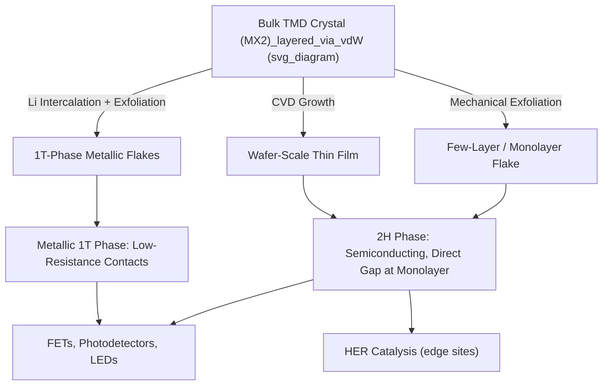

## Transition Metal Dichalcogenides

### Overview

Transition metal dichalcogenides (TMDs) are layered materials with the general formula $MX_2$, where $M$ is a transition metal (Mo, W, Nb, Ta, Ti, Re, Pt, etc.) and $X$ is a chalcogen (S, Se, or Te). Each layer consists of a plane of metal atoms sandwiched between two planes of chalcogen atoms in an X-M-X arrangement. Adjacent layers are held together by weak van der Waals forces, allowing TMDs to be exfoliated down to monolayers, similar to graphene derived from graphite.

Unlike graphene, which is semimetallic, many TMDs (especially group VI TMDs like $MoS_2$, $WS_2$, $MoSe_2$, $WSe_2$) are semiconductors with sizable bandgaps, making them attractive for electronic and optoelectronic applications where graphene's lack of a bandgap is a limitation.

### Crystal Structure

**Coordination and Polytypes**

Within a single $MX_2$ layer, the metal atom can be coordinated in two main geometries:

- **Trigonal prismatic (2H phase)**: metal atoms sit at the center of a trigonal prism formed by six chalcogen atoms
- **Octahedral (1T phase)**: metal atoms sit at the center of an octahedron formed by six chalcogen atoms

Stacking of these layers produces several polytypes:

- **2H**: hexagonal symmetry, two layers per unit cell, trigonal prismatic coordination, thermodynamically stable for most semiconducting TMDs
- **1T**: tetragonal symmetry, one layer per unit cell, octahedral coordination, often metastable and metallic
- **3R**: rhombohedral symmetry, three layers per unit cell, trigonal prismatic coordination

**Lattice Parameters**

For $MoS_2$ (2H phase), typical lattice constants are $a \approx 3.16$ Å (in-plane) and $c \approx 12.3$ Å (out-of-plane, spanning two layers). The intralayer M-X bonding is strong (covalent-ionic), while interlayer coupling is dominated by van der Waals interaction, giving an interlayer spacing around 6.5 Å (half of $c$).

### Electronic Structure

**Indirect-to-Direct Bandgap Transition**

A defining electronic feature of semiconducting TMDs (group VI, 2H phase) is the thickness-dependent nature of the bandgap:

- **Bulk and multilayer**: indirect bandgap
- **Monolayer**: direct bandgap

For $MoS_2$, bulk material has an indirect gap of approximately 1.2 eV, while the monolayer has a direct gap around 1.8–1.9 eV. This transition occurs because interlayer coupling in bulk/few-layer material hybridizes states near the conduction band minimum and valence band maximum at points away from the K-point, which are absent once the material is reduced to a single layer, leaving the direct gap at K as the fundamental transition.

**Consequence for Optics**

The indirect-to-direct transition strongly enhances photoluminescence (PL) quantum yield in monolayers relative to bulk, since direct-gap transitions do not require phonon-assisted momentum conservation. Monolayer $MoS_2$ shows PL intensities orders of magnitude higher than bulk crystals.

**Spin-Orbit Coupling and Valley Physics**

Broken inversion symmetry in the monolayer (present in bulk 2H due to the AB-stacking arrangement, but broken at the single-layer level) combined with strong spin-orbit coupling from the heavy transition metal d-orbitals produces spin-valley coupling at the K and K' valleys of the Brillouin zone. This gives rise to:

- **Valley-selective circular dichroism**: right- and left-circularly polarized light couple selectively to the K and K' valleys respectively
- **Spin-valley locking**: spin and valley degrees of freedom become linked, suppressing certain spin-relaxation pathways

This underlies the field of **valleytronics**, which seeks to use the valley index as an additional degree of freedom for information processing, alongside charge and spin.

### Classification by Electronic Character

TMDs span a wide range of electronic behaviors depending on the metal-chalcogen combination:

- **Semiconducting**: $MoS_2$, $MoSe_2$, $MoTe_2$, $WS_2$, $WSe_2$ (group VI, 2H phase)
- **Metallic**: $NbS_2$, $NbSe_2$, $TaS_2$, $TaSe_2$ (group V) — many exhibit charge density wave (CDW) order
- **Semimetallic**: $WTe_2$, $MoTe_2$ (1T' phase) — some are candidate type-II Weyl semimetals
- **Superconducting**: $NbSe_2$ shows superconductivity below approximately 7 K at bulk, with $T_c$ modifiable by layer thickness and gating

### Synthesis Methods

**Mechanical Exfoliation**

The "Scotch-tape method" is used to peel layers from bulk crystals, producing high-quality flakes suitable for fundamental studies but with poor scalability and yield.

**Chemical Vapor Deposition (CVD)**

CVD is the primary route to large-area, wafer-scale TMD growth:

- Metal oxide precursors (e.g., $MoO_3$) are vaporized and reacted with chalcogen vapor (e.g., S powder) at elevated temperature (600–900°C) on a substrate such as $SiO_2$/Si or sapphire
- Growth proceeds via nucleation of triangular islands that coalesce into continuous films
- Metal-organic CVD (MOCVD) uses gaseous precursors (e.g., $Mo(CO)_6$, $(C_2H_5)_2S$) for improved uniformity over wafer-scale areas

**Liquid-Phase Exfoliation**

Bulk crystals are exfoliated in solvents (often assisted by sonication or lithium intercalation, e.g., n-butyllithium intercalation followed by exfoliation in water) to produce dispersions of few-layer flakes, suitable for solution processing, inks, and composite applications, though typically at lower crystalline quality than mechanical exfoliation or CVD.

**Chemical Vapor Transport (CVT)**

Used to grow bulk single crystals: a transport agent (commonly iodine, $I_2$) carries $M$ and $X$ species along a temperature gradient in a sealed ampoule, depositing high-quality crystals at the cooler end. This is the standard method for producing source crystals used in mechanical exfoliation.

### Phase Engineering: 2H to 1T Transition

Semiconducting 2H-$MoS_2$ can be converted to the metallic 1T phase through:

- **Chemical lithium intercalation**: Li insertion followed by exfoliation induces the phase transition via charge transfer into the d-orbitals of the metal
- **Electron beam irradiation**: locally converts 2H to 1T with in-situ TEM control
- **Strain engineering**: applied strain can lower the energy barrier between phases

The 1T phase is metastable and typically reverts to 2H upon annealing. This phase-engineering capability is exploited to create low-resistance 1T-phase contacts to 2H-phase semiconducting channels, reducing contact resistance in TMD-based transistors.

### Applications

**Field-Effect Transistors (FETs)**

Monolayer $MoS_2$ FETs have demonstrated room-temperature mobilities in the range of 1–200 cm²/(V·s) depending on dielectric environment and processing, with on/off ratios exceeding $10^8$. The finite bandgap (unlike graphene) enables proper transistor switching behavior, and the atomically thin body provides excellent electrostatic control, suppressing short-channel effects — relevant for scaling beyond conventional silicon limits. [Inference: exact mobility figures are highly dependent on substrate, dielectric engineering, and defect density, and reported values vary considerably across literature.]

**Optoelectronics**

- Photodetectors exploiting strong light-matter interaction and direct bandgap in monolayers
- Light-emitting diodes (LEDs) from p-n junctions formed in lateral or vertical TMD heterostructures
- Electroluminescence and photoluminescence-based sensing

**Catalysis**

Edge sites of $MoS_2$ and $WS_2$ (particularly S-terminated edges) are active for the hydrogen evolution reaction (HER), making these materials of interest as non-precious-metal alternatives to platinum-based catalysts. Basal planes are typically catalytically inert, so edge density and defect engineering are key design levers.

**Lubrication**

Bulk $MoS_2$ and $WS_2$ are established solid lubricants, exploiting the weak interlayer shear resistance from van der Waals bonding, used in vacuum and aerospace applications where liquid lubricants are unsuitable.

**Van der Waals Heterostructures**

TMDs are stacked with graphene, hexagonal boron nitride (h-BN), and other 2D materials to form heterostructures with engineered band alignment (type-I, type-II) for applications in tunneling transistors, interlayer excitons, and moiré superlattice physics (e.g., twisted bilayer TMDs hosting flat bands and correlated states).

### Characterization Techniques

- **Raman spectroscopy**: the frequency separation between the $E^1_{2g}$ (in-plane) and $A_{1g}$ (out-of-plane) modes is a standard metric for layer number determination in $MoS_2$; this separation increases with increasing layer count
- **Photoluminescence (PL)**: presence and intensity of PL signal distinguishes monolayer (direct gap, strong PL) from multilayer (indirect gap, weak PL)
- **Atomic force microscopy (AFM)**: step-height measurement for direct layer-thickness determination
- **X-ray photoelectron spectroscopy (XPS)**: oxidation state and stoichiometry verification
- **Transmission electron microscopy (TEM)**: atomic-resolution imaging of lattice structure, defects, and phase (1T vs. 2H) identification

### Structural Diagram

### Key Points

- TMDs ($MX_2$) are van der Waals layered materials with tunable electronic character (semiconducting, metallic, semimetallic, superconducting) depending on composition and phase
- Group VI TMDs (Mo/W with S/Se) undergo an indirect-to-direct bandgap transition upon thinning to a monolayer
- Broken inversion symmetry plus strong spin-orbit coupling in monolayers enables valley-selective optical addressing (valleytronics)
- Phase engineering (2H ↔ 1T) allows tailoring of electronic character within the same chemical composition
- CVD is the leading method for scalable, wafer-level synthesis; CVT is standard for bulk single-crystal growth

**Next Topics:**

- Hexagonal Boron Nitride (h-BN) as a Dielectric and Substrate
- Van der Waals Heterostructures and Moiré Superlattices
- Black Phosphorus and Other Elemental 2D Materials
- Charge Density Waves in Layered Materials
- MXenes and 2D Transition Metal Carbides