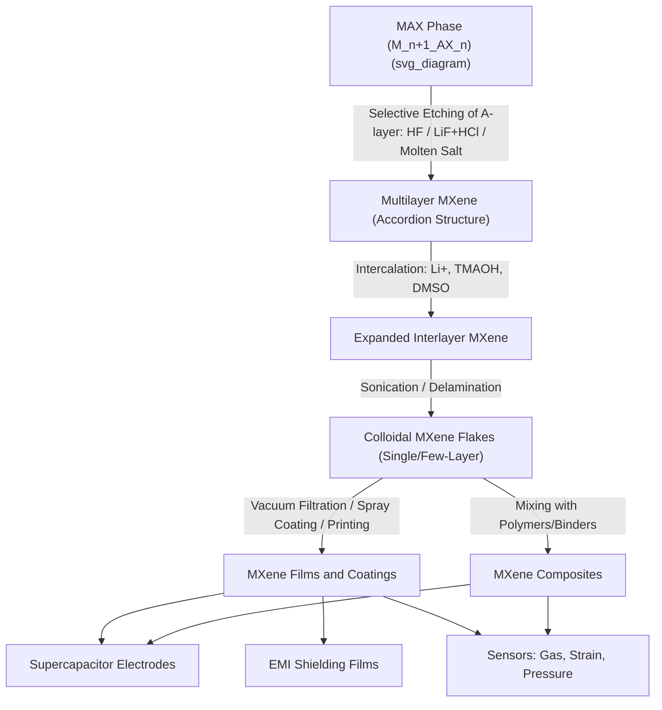

## MXenes and Layered Carbides

### Overview

MXenes are a family of two-dimensional transition metal carbides, nitrides, and carbonitrides derived from layered ternary precursor phases known as MAX phases. The general formula for MXenes is $M_{n+1}X_nT_x$, where $M$ is an early transition metal (Ti, V, Nb, Mo, Ta, Cr, etc.), $X$ is carbon and/or nitrogen, $n = 1, 2, 3$, and $T_x$ represents surface termination groups (commonly $-O$, $-OH$, $-F$, or $-Cl$) that result from the synthesis process. The first reported MXene, $Ti_3C_2T_x$, was derived from the MAX phase $Ti_3AlC_2$ in 2011.

MXenes are notable for combining metallic electrical conductivity (characteristic of the parent carbide/nitride) with the surface hydrophilicity and processability of a 2D oxide-like material, a combination not found in most other 2D material families such as TMDs or graphene.

### Parent MAX Phases

**Structure**

MAX phases have the general formula $M_{n+1}AX_n$, where:

- $M$ = early transition metal
- $A$ = group 13–16 element (most commonly Al, but also Si, Ga, Ge, Sn, etc.)
- $X$ = C and/or N

MAX phases crystallize in a hexagonal layered structure where $M_{n+1}X_n$ carbide/nitride slabs (with strong covalent-ionic-metallic mixed bonding) are interleaved with pure layers of the $A$-element. The $M$-$A$ bond is metallically bonded and comparatively weak relative to the $M$-$X$ bond, which is the structural feature exploited to selectively etch away the $A$ layer.

**Naming Convention by $n$**

- $n=1$: 211 phase (e.g., $Ti_2AlC$)
- $n=2$: 312 phase (e.g., $Ti_3AlC_2$)
- $n=3$: 413 phase (e.g., $Ti_4AlN_3$)

### Synthesis of MXenes

**Selective Etching**

The dominant synthesis route is selective wet-chemical etching of the $A$-layer from the MAX phase, most commonly using fluoride-containing acidic etchants:

- **HF etching**: direct treatment with hydrofluoric acid, the original method reported for $Ti_3C_2T_x$
- **In-situ HF (MILD method)**: a mixture of LiF and HCl generates HF in situ, offering a safer route and producing minimally intensive layer delamination (hence "MILD"), with the added benefit of Li-ion intercalation between MXene sheets that facilitates subsequent delamination
- **Etching mechanism**: fluoride ions attack the M–A bond, replacing the $A$-element layer with surface terminations ($-F$, later partially converted to $-OH$/$-O$ upon exposure to aqueous media)

**Delamination**

After etching, the material exists as a multilayer "accordion-like" structure. Intercalation of cations (Li⁺, or larger organic molecules such as tetramethylammonium hydroxide, TMAOH, or dimethyl sulfoxide, DMSO) expands the interlayer spacing, after which mild sonication or manual shaking in aqueous solution delaminates the stack into single- or few-layer MXene flakes, yielding a stable colloidal suspension.

**Alternative Halogen-Free / Fluorine-Free Routes**

Because fluorine-terminated surfaces can be less desirable for certain applications (electrochemical, biomedical), fluorine-free methods have been developed:

- **Molten salt etching**: uses molten fluoride or chloride salts at elevated temperature to etch the $A$-layer, producing Cl- or halogen-terminated MXenes
- **Alkali (NaOH/KOH) etching**: hydrothermal treatment in concentrated alkaline solution etches Al and produces predominantly $-OH$/$-O$ terminated MXenes
- **Electrochemical etching**: anodic etching in dilute HCl provides fine control over etch depth and avoids handling of HF

### Composition and Surface Chemistry

**Surface Terminations**

Surface functional groups ($T_x$) strongly influence MXene properties:

- Electronic structure (can shift from metallic to semiconducting character depending on termination)
- Work function
- Hydrophilicity and dispersibility in polar solvents
- Electrochemical activity (redox behavior at the surface)

Termination composition and coverage are difficult to control precisely and are typically a mixture of $-O$, $-OH$, and $-F$ groups rather than a single uniform species; this heterogeneity is an active area of synthesis-control research. [Unverified: precise termination ratios and their site-specific arrangement remain difficult to fully resolve experimentally and can vary between synthesis batches.]

**Common MXene Compositions**

- $Ti_3C_2T_x$: most widely studied, high electrical conductivity, good electrochemical performance
- $Ti_2CT_x$: thinner MXene, from 211 MAX phase
- $Mo_2CT_x$, $Mo_2TiC_2T_x$: ordered double-transition-metal MXenes with distinct electronic properties
- $Nb_2CT_x$, $V_2CT_x$: alternative compositions explored for energy storage and magnetism

**Ordered Double-Transition-Metal MXenes**

Some MAX phase precursors incorporate two different transition metals in an ordered arrangement (e.g., $Mo_2TiAlC_2$), producing MXenes such as $Mo_2TiC_2T_x$ where the outer $M$ layers and inner $M$ layer are chemically distinct, offering an additional compositional degree of freedom for tuning electronic and catalytic properties.

### Properties

**Electrical Conductivity**

Most MXenes, particularly $Ti_3C_2T_x$, exhibit metallic conductivity, with reported film conductivities reaching into the range of several thousand to over ten thousand S/cm depending on processing, flake size, and termination chemistry. This makes MXenes attractive as solution-processable conductive materials, in contrast to semiconducting TMDs.

**Mechanical Properties**

Individual MXene flakes exhibit high elastic modulus (values in the range of hundreds of GPa have been reported for $Ti_3C_2T_x$ monolayers via nanoindentation-based AFM measurements), combined with good flexibility, enabling their use in flexible and wearable electronics.

**Hydrophilicity**

The oxide/hydroxide-rich surface termination gives MXenes excellent hydrophilicity relative to other 2D materials, allowing straightforward aqueous processing, spray-coating, and inkjet printing without the need for surfactants required by materials like graphene.

**Electrochemical (Pseudocapacitive) Behavior**

The mixed-valence transition metal surface enables fast, reversible redox reactions ($M^{n+} \leftrightarrow M^{(n+1)+}$ at the surface accompanied by ion intercalation/adsorption), giving rise to pseudocapacitive charge storage with high volumetric capacitance.

### Applications

**Energy Storage**

- **Supercapacitor electrodes**: $Ti_3C_2T_x$ films demonstrate high volumetric capacitance due to fast surface redox reactions and good electronic conductivity, with reported values in the hundreds of F/cm³ range under optimized conditions
- **Battery electrodes**: MXenes have been explored as anode materials for Li-ion, Na-ion, and multivalent-ion (Mg²⁺, Al³⁺) batteries, where the 2D interlayer spacing accommodates ion intercalation

**Electromagnetic Interference (EMI) Shielding**

$Ti_3C_2T_x$ films show high EMI shielding effectiveness at low thickness, attributed to high electrical conductivity combined with multiple internal reflection at layer interfaces, positioning MXenes among the best-performing thin-film EMI shielding materials reported to date.

**Sensors**

High conductivity and abundant surface functional groups make MXenes sensitive to adsorbed gas molecules and mechanical strain, enabling gas sensors, strain sensors, and wearable pressure/motion sensors.

**Electromagnetic and Optical Applications**

MXene films exhibit tunable optical transmittance and plasmonic response, of interest for transparent conductive electrodes and electrochromic devices.

**Catalysis**

MXenes and their derivatives (e.g., partially oxidized or heteroatom-doped MXenes) have been investigated as catalysts and catalyst supports for hydrogen evolution reaction (HER) and other electrocatalytic processes, benefiting from high surface area and tunable surface chemistry.

### Stability Considerations

A key practical limitation of MXenes, especially $Ti_3C_2T_x$, is oxidative degradation in aqueous or humid/oxygen-containing environments, where surface Ti sites can oxidize to $TiO_2$ over time, degrading conductivity and structural integrity. Storage strategies include:

- Vacuum-sealed or inert-atmosphere storage
- Low-temperature storage (refrigeration/freezing of colloidal suspensions)
- Antioxidant additives (e.g., ascorbic acid) in suspension
- Larger flake size and fewer structural defects, which correlate with improved oxidative stability

### Characterization Techniques

- **X-ray diffraction (XRD)**: tracks the (0002) basal-plane peak shift to lower angle upon etching/delamination, confirming interlayer expansion relative to the MAX phase precursor
- **XPS**: identifies surface termination chemistry and transition metal oxidation states
- **Raman spectroscopy**: distinguishes MXene vibrational modes from residual MAX phase or oxidation products
- **SEM/TEM**: reveals the characteristic "accordion" morphology after etching and flake morphology after delamination
- **AFM**: flake thickness and lateral size determination for delaminated single/few-layer MXenes

### Synthesis-to-Application Flow

### Key Points

- MXenes ($M_{n+1}X_nT_x$) are derived by selectively etching the $A$-element layer from MAX phase precursors ($M_{n+1}AX_n$)
- Surface terminations ($-O$, $-OH$, $-F$) critically influence conductivity, hydrophilicity, and electrochemical behavior
- MXenes uniquely combine metallic conductivity with aqueous processability, unlike most other 2D materials
- Primary applications center on energy storage (supercapacitors, batteries), EMI shielding, and sensing
- Oxidative instability in ambient/aqueous conditions remains a key challenge for long-term material stability

**Related Topics:**

- MAX Phase Crystal Chemistry and Elastic Properties
- Pseudocapacitance Mechanisms in 2D Electrode Materials
- Layered Double Hydroxides as 2D Energy Materials
- 2D Material Heterostructures for Energy Storage
- Fluorine-Free Green Synthesis Routes for 2D Materials