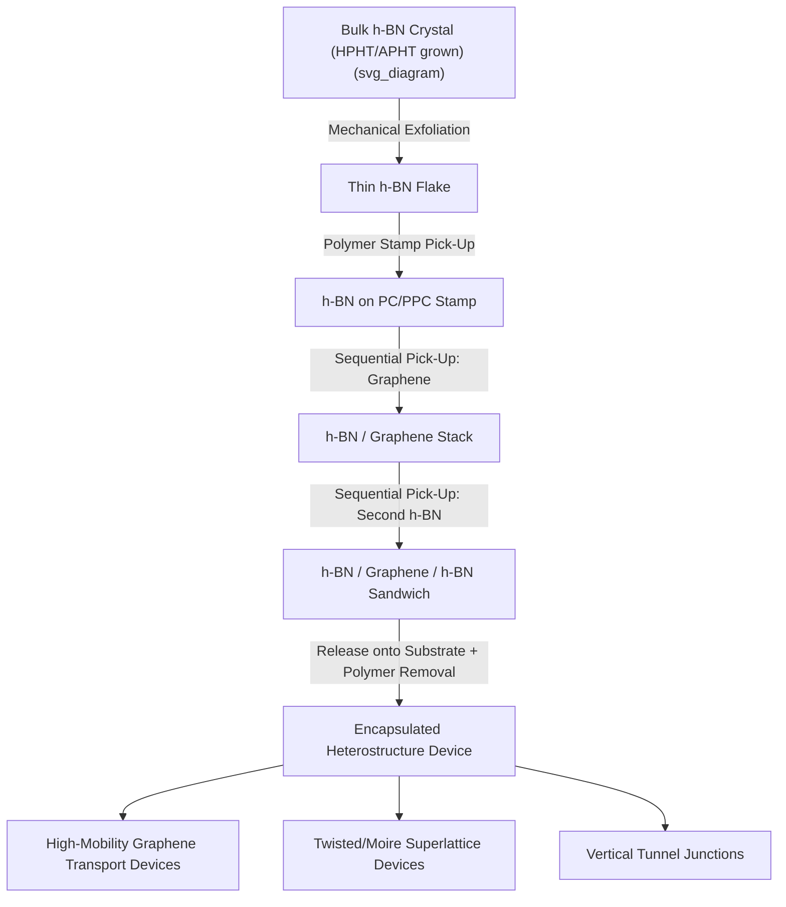

## Hexagonal Boron Nitride

### Overview

Hexagonal boron nitride (h-BN) is a layered material isostructural to graphite, composed of alternating boron and nitrogen atoms arranged in a honeycomb lattice within each layer. It is often referred to as "white graphene" due to its structural similarity to graphite and its white/colorless appearance, contrasting with graphite's black color. Unlike graphene, h-BN is a wide-bandgap insulator rather than a semimetal, owing to the polar, heteronuclear B–N bond that breaks the sublattice symmetry present in graphene's all-carbon lattice.

h-BN has become one of the most important supporting materials in 2D materials research, primarily serving as an atomically flat, chemically inert dielectric substrate and encapsulation layer for other 2D materials such as graphene and TMDs.

### Crystal Structure

**In-Plane Bonding**

Within each layer, boron and nitrogen atoms are covalently bonded in a honeycomb arrangement analogous to graphene, with a B–N bond length of approximately 1.45 Å and in-plane lattice constant $a \approx 2.50$ Å, closely matched to graphene's lattice constant ($a \approx 2.46$ Å), which is why h-BN is an excellent lattice-matched substrate for graphene heterostructures.

**Interlayer Stacking**

Unlike graphite's AB (Bernal) stacking, the thermodynamically stable stacking of h-BN is **AA'** stacking, in which boron atoms sit directly above nitrogen atoms of the adjacent layer (and vice versa), reflecting the electrostatic preference for opposite charges to align. Interlayer spacing is approximately 3.33 Å, slightly smaller than graphite's 3.35 Å, with interlayer bonding dominated by van der Waals forces.

**Polymorphs**

Besides the common hexagonal (h-BN) phase, boron nitride exists in other crystallographic forms:

- **Cubic BN (c-BN)**: zincblende structure, extremely hard (second only to diamond), used as an abrasive
- **Wurtzite BN (w-BN)**: metastable phase formed under shock compression
- **Rhombohedral BN (r-BN)**: ABC stacking variant of the layered structure, less common than h-BN

### Electronic Structure

**Bandgap**

h-BN is a wide-bandgap insulator with an indirect bandgap experimentally and computationally estimated in the range of approximately 5.9–6.4 eV, among the largest bandgaps of any layered material. Because boron and nitrogen occupy inequivalent sublattices with different on-site energies, the Dirac-point degeneracy present in graphene is lifted, opening this large gap.

**Deep Ultraviolet Luminescence**

The wide bandgap enables strong deep-ultraviolet (DUV) luminescence, with h-BN reported as one of the most efficient DUV light emitters among known materials, of interest for UV LEDs and lasers. [Inference: reported DUV emission efficiency figures vary across studies and depend strongly on crystal quality, defect density, and measurement conditions.]

**Dielectric Properties**

h-BN exhibits a moderate dielectric constant (in-plane $\varepsilon \approx 4$–5, depending on measurement method and layer count) combined with very high breakdown electric field strength, and critically, an atomically smooth, dangling-bond-free surface free of the charge traps and surface roughness that plague conventional oxide dielectrics like $SiO_2$.

### Role as a 2D Substrate and Dielectric

**Motivation**

Graphene and other 2D materials placed directly on $SiO_2$ substrates suffer from:

- Surface roughness-induced scattering
- Charged impurity scattering from trapped charges in the oxide
- Dangling bonds and surface optical phonons that degrade carrier mobility

h-BN addresses these issues because it presents an atomically flat, chemically inert surface with a low density of charge traps and no dangling bonds, and its lattice mismatch with graphene is small enough to avoid significant strain.

**Mobility Enhancement**

Graphene devices encapsulated in or placed on h-BN show substantially improved carrier mobility relative to devices on $SiO_2$, with mobilities in h-BN-supported devices approaching or exceeding $10^5$ cm²/(V·s) at low temperature in high-quality samples, enabling observation of delicate quantum transport phenomena (fractional quantum Hall effect, ballistic transport) that are obscured by disorder in $SiO_2$-supported devices.

**Encapsulation ("Graphene Sandwich")**

The standard high-quality device architecture is a **h-BN/graphene/h-BN** stack, where graphene is fully encapsulated between two h-BN layers, providing:

- Protection from ambient contamination (moisture, hydrocarbons, photoresist residue)
- A pristine dielectric environment on both sides
- A platform for subsequent gate-stack fabrication (e.g., top and bottom gates using the h-BN as the gate dielectric)

### Assembly Techniques

**Dry Transfer / Van der Waals Pick-Up Technique**

The dominant method for assembling h-BN-based heterostructures is the polymer-stamp dry transfer technique:

1. A polymer stamp (commonly polycarbonate, PC, or polypropylene carbonate, PPC, on a PDMS support) is used to pick up an exfoliated h-BN flake from a substrate
2. The h-BN-coated stamp is used to sequentially pick up additional 2D flakes (e.g., graphene, then a second h-BN layer) via van der Waals adhesion, exploiting the fact that flake-to-flake adhesion exceeds flake-to-substrate adhesion at controlled temperature
3. The complete stack is released onto a target substrate by melting/dissolving the polymer

This technique avoids exposing sensitive 2D materials (e.g., graphene) to polymer residue or solvents during intermediate steps, since the top and bottom h-BN layers shield the graphene from direct polymer contact.

**Exfoliation of h-BN**

Bulk h-BN single crystals, grown via high-pressure high-temperature (HPHT) or atmospheric-pressure high-temperature (APHT) methods, are mechanically exfoliated using adhesive tape, similar to graphene and TMD exfoliation, to obtain thin flakes for use as substrate/encapsulation layers.

**CVD Growth**

For wafer-scale applications, h-BN can be grown by CVD using precursors such as borazine ($B_3N_3H_6$) or ammonia borane on metal catalyst substrates (Cu, Ni, Pt), though CVD-grown h-BN generally exhibits lower crystalline quality (more grain boundaries, defects) than mechanically exfoliated flakes from bulk crystals, making exfoliated h-BN the preferred choice for high-performance research devices.

### Moiré Physics in h-BN/Graphene Heterostructures

When graphene is aligned at a small twist angle relative to an h-BN substrate, the small lattice mismatch and rotational misalignment produce a moiré superlattice with a period that can extend to tens of nanometers. This moiré potential:

- Reconstructs the electronic band structure, producing secondary Dirac points
- At close-to-zero twist angle, can lead to observable Hofstadter butterfly spectra under applied magnetic field, reflecting the interplay between the moiré superlattice periodicity and magnetic flux quantization

This moiré engineering approach in h-BN/graphene systems was an important precursor to the broader field of twistronics, later extended to twisted bilayer graphene and twisted TMD systems.

### Defects and Single-Photon Emission

h-BN hosts optically active point defects capable of single-photon emission at room temperature, most notably associated with the negatively charged boron vacancy ($V_B^-$) center and carbon-related defect complexes. These defects are of interest for:

- Quantum information and single-photon sources operating at room temperature (an advantage over many other solid-state single-photon emitter platforms that require cryogenic cooling)
- Optically detected magnetic resonance (ODMR) for quantum sensing applications, analogous to nitrogen-vacancy (NV) centers in diamond

[Speculation: the precise microscopic structure of some emitting defect centers in h-BN remains a subject of ongoing investigation and is not universally agreed upon in the literature.]

### Other Applications

**Tunnel Barriers**

Few-layer h-BN serves as an ultrathin, atomically uniform tunnel barrier in vertical tunneling devices (e.g., graphene/h-BN/graphene tunnel junctions), exploiting its large bandgap and controllable, uniform layer thickness down to a single atomic layer.

**Thermal Management**

h-BN possesses high in-plane thermal conductivity combined with electrical insulation, useful as a thermally conductive but electrically insulating filler in composites and as a heat-spreading layer in electronic packaging.

**Protective/Barrier Coatings**

Chemical inertness and impermeability to gases make h-BN of interest as a corrosion-resistant and gas-barrier coating in composite and protective coating applications.

### Characterization Techniques

- **Raman spectroscopy**: the $E_{2g}$ phonon mode near 1366 cm⁻¹ is the primary Raman signature used to confirm h-BN presence and assess quality
- **AFM**: step-height measurement for layer-number determination and surface roughness assessment (h-BN typically shows sub-nanometer RMS roughness)
- **Cathodoluminescence / photoluminescence**: probes deep-UV emission and defect-related sub-bandgap emission
- **TEM**: atomic-resolution imaging of stacking order and identification of point defects

### Heterostructure Assembly Flow

### Key Points

- h-BN is a wide-bandgap (approximately 6 eV) insulating analog of graphite, with a honeycomb lattice closely matched to graphene
- Its atomically flat, dangling-bond-free surface makes it the standard dielectric substrate and encapsulation layer for high-mobility graphene and other 2D material devices
- The h-BN/graphene/h-BN "sandwich" structure, assembled via dry polymer-stamp transfer, is the benchmark architecture for high-quality 2D electronic devices
- Moiré superlattices formed between graphene and h-BN enable band structure engineering and were foundational to the broader field of twistronics
- Point defects in h-BN (e.g., boron vacancy centers) support room-temperature single-photon emission relevant to quantum technologies

**Next Steps:**

- Van der Waals Heterostructure Assembly Techniques (Dry/Wet Transfer)
- Twistronics and Moiré Flat-Band Physics
- Quantum Hall Effect in Encapsulated Graphene Devices
- Point Defect Engineering for Quantum Emitters in 2D Materials
- Dielectric Engineering for 2D Semiconductor Transistors