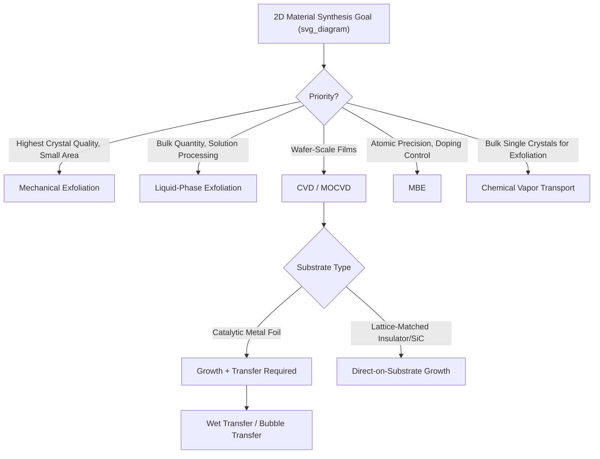

## Synthesis of Two Dimensional Materials

### Overview

Synthesis methods for two-dimensional (2D) materials broadly fall into two philosophical categories: **top-down** approaches, which start from a bulk layered crystal and thin it down to few- or single-layer form, and **bottom-up** approaches, which build the 2D layer directly from atomic or molecular precursors. The choice of method involves fundamental trade-offs between crystalline quality, scalability, layer-number control, and substrate compatibility, and the appropriate method depends heavily on the target application (fundamental research vs. wafer-scale device integration).

### Top-Down Methods

**Mechanical Exfoliation ("Scotch-Tape Method")**

The original method used to isolate graphene, mechanical exfoliation involves repeatedly peeling layers from a bulk van der Waals crystal using adhesive tape until thin flakes remain, which are then transferred onto a target substrate (commonly $SiO_2$/Si for optical contrast-based identification).

- **Advantages**: produces the highest crystalline quality available for a given bulk source crystal, free of the grain boundaries and defect densities typical of grown films; remains the benchmark method for fundamental physics studies
- **Limitations**: low yield, uncontrolled and non-uniform flake size/shape (typically micrometers in lateral dimension), not scalable to wafer-level production
- **Variants**: "gold-tape" exfoliation and other engineered adhesion-energy substrates have been developed to improve flake size and yield for materials like TMDs

**Liquid-Phase Exfoliation (LPE)**

Bulk layered crystals are exfoliated in a liquid medium, typically assisted by ultrasonication or high-shear mixing, to overcome interlayer van der Waals attraction:

- **Solvent-based sonication**: bulk powder is dispersed in a solvent with surface energy matched to the 2D material (e.g., N-methyl-2-pyrrolidone, NMP, for graphene) and sonicated, followed by centrifugation to separate thin flakes from thicker, unexfoliated material
- **Ion intercalation-assisted exfoliation**: intercalating species (e.g., Li⁺ via n-butyllithium treatment) are inserted between layers to expand interlayer spacing and weaken van der Waals cohesion, after which mild sonication or shaking completes exfoliation (this is also the standard approach used for MXene delamination and for producing metallic 1T-phase TMD dispersions)
- **Electrochemical intercalation/exfoliation**: bulk crystal serves as an electrode; applied potential drives ion intercalation, followed by exfoliation, offering better control over intercalant dose than chemical intercalation

LPE methods are attractive for bulk-quantity production suitable for inks, composites, and coatings, but typically yield smaller flake sizes and lower crystalline quality/uniformity than mechanical exfoliation.

**Selective Chemical Etching**

Applicable to materials with a removable interleaved layer, most notably MXene synthesis, where a component ($A$-layer in a MAX phase) is selectively dissolved by an etchant (HF, LiF/HCl, or molten salt), leaving behind the 2D layered product. This is a hybrid case: top-down in the sense of starting from a bulk precursor crystal, but chemically transformative rather than purely mechanical.

### Bottom-Up Methods

**Chemical Vapor Deposition (CVD)**

CVD is the leading method for wafer-scale, large-area 2D material growth and is used across essentially all major 2D material classes (graphene, TMDs, h-BN):

- **General mechanism**: gaseous or vaporized precursors are transported to a heated substrate (often a metal catalyst for graphene, or an oxide/sapphire substrate for TMDs) where they decompose and react, nucleating 2D islands that grow laterally and eventually coalesce into a continuous film
- **Graphene CVD**: hydrocarbon precursors (commonly methane, $CH_4$) decompose on a Cu foil catalyst at high temperature (approximately 1000°C); Cu's low carbon solubility promotes a largely self-limiting, surface-mediated growth mechanism favoring monolayer formation
- **TMD CVD**: metal oxide powders (e.g., $MoO_3$, $WO_3$) are vaporized and reacted with chalcogen vapor (S, Se powder) at 600–900°C on substrates such as $SiO_2$/Si or sapphire, nucleating triangular monolayer domains
- **Metal-Organic CVD (MOCVD)**: uses gaseous metal-organic and chalcogen precursors (e.g., $Mo(CO)_6$, diethyl sulfide) instead of solid powder sources, offering superior thickness uniformity and reproducibility over large wafer areas compared to powder-based CVD, at the cost of more complex and hazardous precursor handling

**Molecular Beam Epitaxy (MBE)**

MBE provides atomic-layer-precision growth under ultra-high vacuum (UHV) conditions, using effusion cells to supply elemental or molecular beams of constituent atoms onto a heated, typically lattice-matched, single-crystal substrate.

- **Advantages**: excellent control over layer thickness, doping, and interface abruptness; compatible with in-situ characterization (RHEED, STM) for real-time growth monitoring
- **Limitations**: slow growth rates and high equipment/operational cost limit throughput and scalability relative to CVD

**Atomic Layer Deposition (ALD)**

ALD uses sequential, self-limiting surface reactions between alternating gaseous precursors to build up material one atomic layer at a time, offering exceptional thickness and conformality control, including on complex 3D topographies. ALD has been explored for select 2D material systems, though achieving high crystalline quality (rather than amorphous or polycrystalline films) via ALD remains more challenging than with CVD for most 2D semiconductors.

**Pulsed Laser Deposition (PLD)**

A high-energy pulsed laser ablates a target of the desired material composition, generating a plasma plume that deposits onto a substrate. PLD offers flexibility in stoichiometry transfer from complex targets but generally provides less precise layer-number control compared to CVD or MBE for 2D materials.

**Chemical Vapor Transport (CVT)**

Primarily used to grow bulk single crystals (rather than direct 2D films) that subsequently serve as source material for mechanical exfoliation. A transport agent (e.g., iodine, $I_2$, or bromine) carries constituent elements along a temperature gradient within a sealed ampoule, with crystal deposition occurring at the cooler zone. CVT-grown bulk crystals are the standard high-quality source material for TMD and related layered crystal exfoliation.

**Wet-Chemical / Colloidal Synthesis**

Solution-based synthesis routes (hot-injection colloidal synthesis, hydrothermal/solvothermal synthesis) can produce 2D nanosheets or nanoplatelets directly in solution, offering compatibility with solution processing and scalable low-cost production, generally at the expense of crystalline perfection and lateral flake size relative to vapor-phase methods.

### Growth Substrate Considerations

**Catalytic Substrates**

Certain metals (Cu, Ni, Pt) serve dual roles as both mechanical support and chemical catalyst in CVD growth (e.g., Cu for graphene), where the substrate's catalytic activity and carbon solubility directly determine growth mode (surface-mediated vs. precipitation-based) and resulting layer number.

**Epitaxial/Lattice-Matched Substrates**

Substrates with close lattice matching to the target 2D material (e.g., sapphire for certain TMD orientations, or SiC for epitaxial graphene formed by Si sublimation) promote aligned, single-crystalline domain growth and can reduce grain boundary density in the resulting film.

**Epitaxial Graphene via SiC Sublimation**

A distinct bottom-up route specific to graphene: heating single-crystal SiC in vacuum or inert atmosphere at high temperature (approximately 1200–1600°C) causes preferential Si sublimation from the surface, leaving behind a carbon-rich surface that reconstructs into few-layer epitaxial graphene, directly on an insulating substrate without requiring a separate transfer step.

### Post-Growth Transfer Techniques

CVD-grown films (especially graphene on Cu) typically require transfer from the growth substrate to a target substrate for device fabrication or further processing:

- **Wet transfer (etch-based)**: a support polymer (commonly PMMA) is coated on the film, the underlying metal catalyst is chemically etched away (e.g., Cu etched in ammonium persulfate or ferric chloride solution), the film/PMMA stack is transferred to the target substrate, and the polymer is subsequently dissolved
- **Electrochemical delamination ("bubble transfer")**: rather than fully dissolving the metal catalyst, an electrochemical reaction is used to generate gas bubbles at the film/metal interface, mechanically delaminating the film while preserving the metal foil for reuse, improving process economics and reducing metal-ion contamination
- **Dry/Van der Waals transfer**: as used extensively for exfoliated flakes (see h-BN encapsulation techniques), a polymer stamp picks up and releases flakes via controlled adhesion-energy differences, avoiding solution-based processing steps entirely

### Quality Control and Common Defects

Across all synthesis routes, key defect and quality metrics include:

- **Grain boundaries**: polycrystalline CVD films contain grain boundaries where misoriented domains merge, degrading electronic and mechanical properties relative to single-crystal exfoliated flakes
- **Point defects**: vacancies, substitutional impurities, and adatoms, which can be intentionally introduced (defect engineering for catalysis) or are unwanted (carrier scattering centers)
- **Wrinkles and folds**: mechanical strain artifacts introduced during growth (thermal expansion mismatch with substrate) or during transfer processes
- **Polymer/transfer residue**: PMMA or other polymer residues remaining after wet transfer, which can degrade electrical contact quality and introduce disorder, motivating polymer-free and dry-transfer alternatives

### Method Selection Overview

### Comparative Summary

| Method | Scalability | Crystal Quality | Layer Control | Typical Use Case |
| --- | --- | --- | --- | --- |
| Mechanical Exfoliation | Very Low | Highest | Variable/Manual | Fundamental research |
| Liquid-Phase Exfoliation | High | Moderate | Poor | Inks, composites, coatings |
| CVD | High | Good-Moderate | Good | Wafer-scale devices |
| MOCVD | High | Good | Very Good | Uniform large-area films |
| MBE | Low-Moderate | Very Good | Excellent | Precision heterostructures |
| CVT | N/A (bulk) | Excellent | N/A | Source crystals for exfoliation |
| SiC Sublimation | Moderate | Good | Moderate | Substrate-integrated graphene |

### Key Points

- Top-down methods (mechanical/liquid-phase exfoliation) prioritize crystalline quality or bulk quantity at the expense of scalability and uniform layer control
- Bottom-up methods (CVD, MOCVD, MBE) prioritize wafer-scale uniformity and integration compatibility, generally at some cost to crystalline perfection relative to exfoliated flakes
- Catalytic metal substrates (Cu, Ni) enable CVD graphene growth but necessitate a subsequent transfer step, introducing potential defects and contamination
- Epitaxial approaches (SiC sublimation, lattice-matched substrate growth) can avoid the transfer step entirely
- Method selection is application-driven: fundamental physics studies favor exfoliation, while device-integration and industrial applications favor CVD/MOCVD

**Related Topics:**

- Transfer Techniques and Polymer-Free Processing for CVD Films
- Wafer-Scale Integration of 2D Materials with Silicon CMOS
- Defect Engineering in CVD-Grown 2D Materials
- Epitaxial Graphene on Silicon Carbide
- Scalable Production Routes for MXenes and TMD Dispersions