## Heterostructures and van der Waals Materials

### Overview

Van der Waals (vdW) heterostructures are artificial layered materials assembled by stacking different 2D materials on top of one another, held together not by covalent bonds but by weak van der Waals forces between layers. Because there is no requirement for lattice matching or chemical compatibility at the interface (unlike epitaxial growth of 3D heterostructures), essentially any combination of 2D materials — conductors, semiconductors, insulators — can in principle be combined, enabling a combinatorial design space often described as building with "atomic-scale Lego blocks."

This concept, formalized in the influential framework proposed by Geim and Grigorieva, has become a central paradigm for engineering emergent electronic, optical, and topological properties not present in any individual constituent layer.

### Building Blocks

The three broad functional categories of 2D materials used as heterostructure components are:

- **Conductors**: graphene, metallic TMDs (e.g., $NbSe_2$, 1T-$MoS_2$), MXenes
- **Semiconductors**: group VI TMDs ($MoS_2$, $WS_2$, $WSe_2$, $MoSe_2$), black phosphorus
- **Insulators/Dielectrics**: hexagonal boron nitride (h-BN), which additionally serves as an atomically flat substrate and encapsulation layer

Combining layers from these categories allows construction of complete device architectures (e.g., a graphene channel, h-BN gate dielectric, and graphite gate electrode) entirely from 2D materials.

### Assembly Techniques

**Dry Transfer (Van der Waals Pick-Up Technique)**

The dominant method for assembling high-quality heterostructures, using a polymer stamp (commonly polycarbonate, PC, or polypropylene carbonate, PPC, mounted on a PDMS support) to sequentially pick up individual exfoliated flakes:

1. The stamp picks up the first (typically top) flake via van der Waals adhesion
2. The flake-coated stamp is aligned over and brought into contact with the next flake, which adheres preferentially to the already-picked-up flake rather than to its original growth/exfoliation substrate (flake-flake adhesion exceeds flake-substrate adhesion under controlled temperature conditions)
3. Steps are repeated to build up the full stack
4. The complete assembly is released onto the target substrate by melting or dissolving the polymer stamp

This technique enables construction of complex multilayer stacks with control over stacking order, and critically, allows internal layers (e.g., graphene) to remain fully encapsulated and never exposed to solvents or polymer residue during intermediate steps.

**Wet Transfer**

Used primarily for CVD-grown films where the growth substrate must be removed by chemical etching (e.g., etching a Cu foil after graphene growth), after which the film supported on a sacrificial polymer layer (commonly PMMA) is transferred onto the target stack and the polymer subsequently dissolved. Wet transfer is more scalable for large-area CVD films but generally introduces more contamination and residue than dry transfer of exfoliated flakes.

**Alignment Considerations**

Precise crystallographic alignment between layers is critical for many heterostructure phenomena (moiré superlattices, interlayer coupling strength), typically achieved using:

- Optical identification of crystal edges corresponding to known crystallographic directions
- Second-harmonic generation (SHG) microscopy to determine crystal orientation without relying on edge geometry
- Motorized micromanipulator stages with sub-degree rotational precision during stacking

### Interlayer Coupling Phenomena

**Moiré Superlattices**

When two layers with a small lattice mismatch and/or small relative twist angle are stacked, the resulting interference pattern produces a moiré superlattice with a periodicity much larger than either constituent lattice constant. The moiré potential modulates the electronic structure, folding bands into a smaller moiré Brillouin zone and can create flat, nearly dispersionless minibands.

**Magic-Angle Twisted Bilayer Graphene**

At a specific "magic" twist angle (theoretically predicted and experimentally confirmed near approximately 1.1°), twisted bilayer graphene develops extremely flat electronic bands near the Fermi level. The strongly suppressed kinetic energy in these flat bands allows electron-electron interactions to dominate, giving rise to correlated insulating states and unconventional superconductivity, discovered experimentally in 2018 and establishing the field of "twistronics" as a major research direction in condensed matter physics.

**Twisted TMD Bilayers**

Similar moiré engineering in twisted TMD homobilayers and heterobilayers (e.g., twisted $WSe_2$/$WSe_2$ or $MoSe_2$/$WSe_2$) produces moiré flat bands and has been used to realize correlated insulating states, generalized Hubbard model physics, and moiré excitons localized within individual moiré unit cells.

**Interlayer Excitons**

In type-II band-aligned semiconducting heterobilayers (e.g., $MoSe_2$/$WSe_2$), photoexcited electrons and holes localize in different layers due to the staggered band alignment, forming spatially indirect interlayer excitons. These excitons exhibit longer lifetimes than intralayer excitons (due to reduced electron-hole wavefunction overlap) and can be further trapped within the moiré potential, creating arrays of quantum-confined excitonic states.

### Band Alignment Engineering

Heterostructure electronic behavior depends critically on the relative band alignment between constituent layers:

- **Type-I (straddling gap)**: one material's conduction and valence bands both lie within the bandgap of the other; useful for confining carriers within a single layer, relevant to light-emission applications
- **Type-II (staggered gap)**: conduction band minimum and valence band maximum reside in different layers, spatially separating electrons and holes; this is the alignment responsible for interlayer exciton formation and is exploited in photovoltaic and photodetector heterojunctions
- **Type-III (broken gap)**: band overlap between layers is so extreme that the conduction band of one material lies below the valence band of the other, enabling band-to-band tunneling; relevant to tunnel field-effect transistor (TFET) device concepts

### Device Applications

**Tunneling Transistors**

Vertical stacks such as graphene/h-BN/graphene exploit the h-BN interlayer as an ultrathin, uniform tunnel barrier, with tunneling current highly sensitive to the applied interlayer bias and any additional gating, forming the basis of vertical field-effect tunneling transistor (VFET) concepts.

**Photodetectors and Photovoltaics**

Type-II aligned TMD heterobilayers form atomically thin p-n junctions capable of efficient photocurrent generation upon illumination, of interest for ultrathin, flexible photodetector and photovoltaic applications where an entire absorber-junction stack can in principle be only a few atoms thick.

**Light-Emitting Devices**

Vertical stacks combining graphene (transparent, conductive electrodes), h-BN (tunnel/injection barrier), and TMD monolayers (light-emitting layer) have been used to demonstrate electroluminescent devices entirely built from 2D materials.

**Gate Stacks and Contacts**

Graphite (few-layer graphene) is commonly used as an atomically flat, low-disorder gate electrode in combination with h-BN gate dielectric layers, forming all-2D gate stacks that avoid the surface roughness and trap states associated with conventional metal/oxide gate structures.

### Fabrication Challenges

- **Bubble and blister formation**: trapped contaminants (hydrocarbons, water, air) between layers during stacking can aggregate into visible bubbles/blisters, locally degrading interlayer contact and introducing strain; annealing and careful stacking protocols help minimize this
- **Twist-angle drift**: small unintentional relaxation or drift in twist angle during or after fabrication can significantly alter moiré physics, given the extreme sensitivity of flat-band phenomena to angle (fractions of a degree matter near the magic angle)
- **Strain and lattice relaxation**: at very small twist angles, the moiré structure can undergo lattice reconstruction, forming domains of locally commensurate stacking (e.g., AB/BA domains) separated by domain walls, rather than a uniformly incommensurate moiré pattern
- **Scalability**: dry-transfer assembly of exfoliated flakes remains a serial, low-throughput process; translating heterostructure device concepts to wafer-scale manufacturing is an active area of process engineering research

### Characterization Techniques

- **Optical microscopy**: rapid identification of flake number, thickness, and stacking via optical contrast on $SiO_2$/Si
- **Raman spectroscopy**: detects interlayer coupling signatures (e.g., shifted or new low-frequency shear/breathing modes) sensitive to twist angle and layer number
- **Scanning tunneling microscopy (STM)**: directly images moiré superlattice periodicity in real space
- **Transport measurements**: magnetotransport (quantum Hall effect, Landau fan diagrams) used to probe band structure reconstruction and correlated electronic phases
- **Photoluminescence and pump-probe spectroscopy**: probes interlayer exciton dynamics and moiré-trapped exciton states

### Heterostructure Assembly and Phenomena Map

```mermaid
graph TD
    A["Individual 2D Flakes: Graphene, h-BN, TMDs (svg_diagram)"] -->|Dry Transfer / Pick-Up Technique| B["Stacked van der Waals Heterostructure"]
    B --> C{Twist Angle / Lattice Mismatch}
    C -->|Small Angle/Mismatch| D["Moire Superlattice"]
    C -->|Large Angle/No Match| E["Incommensurate Stack"]
    D -->|Magic Angle ~1.1deg, Graphene/Graphene| F["Flat Bands: Correlated Insulator, Superconductivity"]
    D -->|TMD/TMD Twisted Bilayer| G["Moire Excitons, Hubbard Physics"]
    B --> H{Band Alignment}
    H -->|Type II Staggered| I["Interlayer Excitons"]
    H -->|Type III Broken Gap| J["Tunneling Devices"]
    I --> K["Photodetectors, LEDs"]
    J --> K
```

### Key Points

- Van der Waals heterostructures assemble different 2D materials via weak interlayer forces, bypassing the lattice-matching constraints of conventional epitaxial heterostructures
- Dry-transfer pick-up techniques enable clean, contamination-free assembly with control over layer order and crystallographic alignment
- Twist angle and lattice mismatch between layers generate moiré superlattices, which can produce flat electronic bands and strongly correlated phases, most notably in magic-angle twisted bilayer graphene
- Band alignment (type-I, -II, -III) between stacked semiconducting layers governs charge separation behavior, underlying interlayer excitons and tunneling device concepts
- Key fabrication challenges include interfacial contamination, twist-angle stability, and scalability beyond serial flake-by-flake assembly

**Next Steps:**

- Twistronics and Magic-Angle Superconductivity in Graphene
- Interlayer Exciton Physics in TMD Heterobilayers
- Moire Flat-Band Engineering Beyond Graphene
- Scalable Manufacturing of van der Waals Heterostructure Devices
- Topological Phases in 2D Material Heterostructures