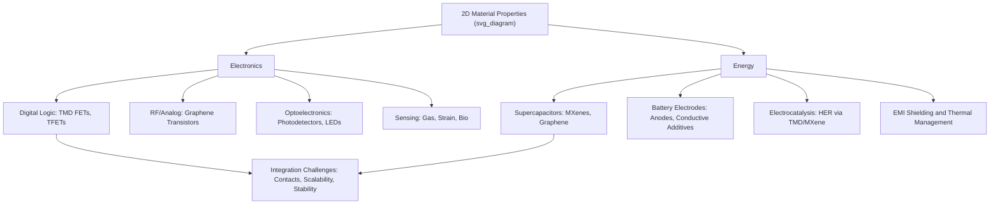

## Applications in Electronics and Energy

### Overview

Two-dimensional materials — graphene, transition metal dichalcogenides (TMDs), hexagonal boron nitride (h-BN), MXenes, and their heterostructures — have moved from fundamental condensed matter research toward application-driven development across electronics and energy technologies. Their common appeal derives from atomically thin geometry (enabling superior electrostatic control and mechanical flexibility), tunable electronic properties across the metal-semiconductor-insulator spectrum, and high surface-area-to-volume ratio relevant to energy storage and catalysis. This section surveys the principal application domains, connecting material properties established in earlier topics to device-level performance considerations.

### Digital Electronics and Transistors

**Motivation for Beyond-Silicon Channels**

As silicon CMOS scaling approaches fundamental physical limits, short-channel effects (drain-induced barrier lowering, threshold voltage roll-off) degrade transistor performance at very small gate lengths. Atomically thin semiconducting channels, particularly monolayer TMDs, offer a potential path forward because the ultrathin body inherently suppresses short-channel electrostatics-related degradation, permitting continued gate-length scaling.

**TMD Field-Effect Transistors**

Monolayer $MoS_2$ and other group VI TMDs have been extensively studied as FET channel materials:

- Direct bandgap (approximately 1.8 eV for monolayer $MoS_2$) enables high on/off current ratios (exceeding $10^8$ in optimized devices), addressing graphene's fundamental limitation (zero bandgap, poor off-state)
- Contact resistance at the metal-semiconductor interface remains a key performance bottleneck; phase-engineered 1T-phase TMD contacts (see prior TMD discussion) are one strategy to reduce this resistance
- Reported carrier mobilities vary widely (single to a few hundred cm²/(V·s)) depending on dielectric environment, substrate quality, and defect density [Inference: mobility figures are strongly processing-dependent and continue to improve with materials and fabrication advances, so specific numbers should be treated as illustrative rather than definitive].

**Graphene in Electronics**

Graphene's extremely high intrinsic carrier mobility and ballistic transport properties make it attractive for high-frequency (RF) analog electronics, where the absence of a bandgap is less limiting than in digital logic (since RF transistors do not require a hard on/off switching state to the same degree). Graphene-based RF transistors have demonstrated cutoff frequencies extending into the hundreds of GHz range in research devices.

**Tunneling and Steep-Slope Devices**

Type-III (broken-gap) band alignments in certain 2D heterostructures enable band-to-band tunneling transistor (TFET) concepts, which in principle can achieve subthreshold swing below the thermionic limit of approximately 60 mV/decade that constrains conventional MOSFETs, offering a route to lower supply-voltage, lower-power digital logic.

**Flexible and Transparent Electronics**

The mechanical flexibility of monolayer/few-layer 2D materials, combined in some cases (graphene) with high optical transparency and electrical conductivity, supports applications in flexible displays, wearable electronics, and transparent conductive electrodes as potential alternatives to indium tin oxide (ITO), which is brittle and reliant on scarce indium.

### Optoelectronics

**Photodetectors**

Direct-bandgap monolayer TMDs and type-II heterobilayer junctions (see prior heterostructures discussion) enable ultrathin photodetectors with fast response times, leveraging strong light-matter interaction per unit thickness despite the atomically thin absorber layer.

**Light-Emitting Devices**

Electroluminescent devices built from graphene/h-BN/TMD vertical stacks demonstrate that complete light-emitting diode functionality can be achieved using entirely 2D material building blocks, with the TMD monolayer serving as the direct-bandgap emissive layer.

**Photovoltaics**

Atomically thin p-n junctions formed from type-II aligned TMD heterobilayers represent a conceptually distinct approach to photovoltaic absorber design, where the entire junction may be only a few atomic layers thick; practical power conversion efficiencies for pure 2D-material photovoltaic devices remain modest relative to established thin-film and crystalline silicon technologies, and this area is best characterized as an active research direction rather than a mature commercial technology. [Inference: efficiency benchmarks for 2D-material photovoltaics are evolving rapidly in the literature and specific performance figures should be verified against current publications.]

### Radio Frequency and High-Speed Electronics

Beyond digital logic, 2D materials are explored for RF/microwave components (mixers, oscillators, high-frequency amplifiers) where graphene's high mobility and saturation velocity, and TMD-based heterojunction devices, offer potential advantages in device footprint and integration density relative to conventional III-V RF technologies.

### Sensing Applications

**Gas and Chemical Sensors**

The extreme surface-to-volume ratio of monolayer materials means that adsorbed molecules produce proportionally large relative changes in electrical resistance, enabling highly sensitive gas sensors. MXenes in particular combine high conductivity with abundant surface functional groups, giving strong sensitivity to a range of analyte gases and vapors.

**Strain and Pressure Sensors**

Mechanical flexibility combined with piezoresistive behavior in materials such as MXenes and certain TMDs supports wearable strain and pressure sensor applications, relevant to health-monitoring and human-motion-tracking devices.

**Biosensors**

Functionalized graphene and TMD-based field-effect biosensors exploit high surface sensitivity to detect binding events (e.g., antibody-antigen interactions, DNA hybridization) as changes in channel conductance, though translating laboratory-demonstrated sensitivity to robust, manufacturable clinical diagnostic devices remains an ongoing engineering challenge.

### Energy Storage

**Supercapacitors**

MXenes, given their metallic conductivity combined with pseudocapacitive surface redox activity, are among the most actively studied 2D materials for supercapacitor electrodes, with reported volumetric capacitances competitive with or exceeding many conventional carbon-based supercapacitor materials under optimized conditions. Graphene-based electrodes (exploiting high surface area and conductivity) are similarly explored, often in composite form to mitigate restacking of graphene sheets, which otherwise reduces accessible surface area.

**Battery Electrodes**

- **Anode materials**: MXenes and certain TMDs (e.g., $MoS_2$) have been investigated as anode materials for Li-ion, Na-ion, and multivalent-ion (Mg²⁺, Al³⁺) batteries, where the interlayer galleries accommodate ion intercalation and the 2D morphology can shorten ion diffusion pathways
- **Conductive additives**: graphene and graphene-based composites are used as conductive scaffolding/additives in battery electrodes to improve overall electrode conductivity and mechanical integrity
- **Solid electrolyte interphase (SEI) engineering**: 2D material coatings on electrode particles are explored as a strategy to stabilize the SEI layer and mitigate capacity fade in cycling

**Hydrogen Evolution Electrocatalysis**

Edge sites of semiconducting TMDs (particularly $MoS_2$ and $WS_2$) and certain MXene-derived catalysts show activity for the hydrogen evolution reaction (HER), motivating their exploration as lower-cost alternatives to platinum-group-metal catalysts for electrochemical water splitting, a key process for green hydrogen production. Basal-plane inertness in pristine TMDs means that catalytic performance is closely tied to edge density and defect engineering strategies.

### Electromagnetic Interference (EMI) Shielding and Thermal Management

**EMI Shielding**

$Ti_3C_2T_x$ MXene films demonstrate high EMI shielding effectiveness at low film thickness, attributed to a combination of high electrical conductivity and multiple internal reflections at layer interfaces, positioning MXene films among the highest-performing thin-film EMI shielding materials reported to date, relevant to compact electronic device shielding applications.

**Thermal Interface Materials**

h-BN's combination of high in-plane thermal conductivity with electrical insulation makes it attractive as a thermally conductive filler in polymer composites and as an electrically isolating heat-spreading layer in electronic packaging, addressing thermal management challenges in increasingly dense electronic systems.

### Integration Challenges

Common engineering challenges spanning both electronics and energy applications include:

- **Scalable, defect-free synthesis**: bridging the quality gap between small-area exfoliated flakes (best performance) and wafer-scale CVD films (necessary for manufacturing)
- **Contact engineering**: minimizing parasitic resistance at metal-2D material interfaces, a persistent bottleneck in 2D transistor performance
- **Process integration with existing infrastructure**: compatibility of 2D material growth/transfer temperatures and chemistries with established silicon CMOS back-end-of-line processing
- **Long-term stability**: environmental degradation (e.g., MXene oxidation, TMD sensitivity to certain ambient conditions) affecting device reliability and shelf life
- **Cost-effective, high-throughput manufacturing**: translating laboratory-scale demonstrations into economically viable production processes

### Application Landscape

### Key Points

- 2D materials address specific limitations of conventional technologies: TMDs provide a finite bandgap with ultrathin-body electrostatic control absent in bulk semiconductor scaling limits, while graphene offers exceptional carrier mobility for RF applications
- MXenes uniquely combine metallic conductivity with solution processability, making them a leading candidate for supercapacitor and EMI shielding applications
- Interlayer band engineering in heterostructures enables photodetector, LED, and photovoltaic device concepts built from atomically thin absorber/junction layers
- Common cross-cutting challenges (contact resistance, scalable synthesis, long-term stability) currently limit translation from laboratory demonstration to commercial-scale deployment
- Energy storage and electrocatalysis applications leverage high surface-area-to-volume ratio and tunable surface chemistry, particularly in MXenes and TMD edge sites

**Related Topics:**

- Contact Engineering in 2D Semiconductor Transistors
- Wafer-Scale Integration of 2D Materials with CMOS
- MXene-Based Supercapacitor Electrode Design
- Electrocatalytic Water Splitting Using 2D Materials
- Flexible and Wearable Electronics Based on 2D Materials