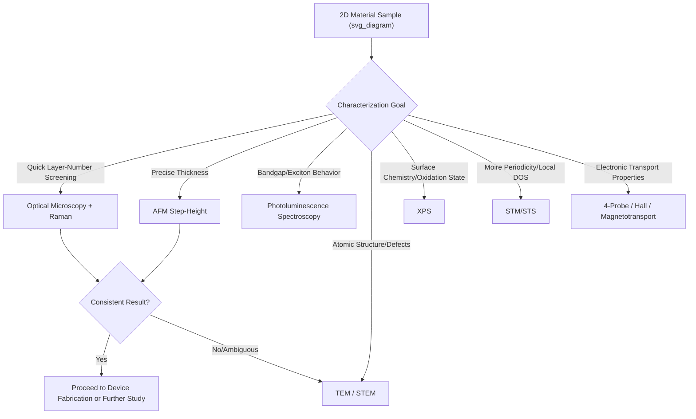

## Characterization of Two Dimensional Materials

### Overview

Characterization of two-dimensional (2D) materials requires techniques capable of resolving atomically thin structures, verifying layer number, assessing crystalline quality, and probing electronic, optical, and mechanical properties at length scales from sub-nanometer to millimeter. No single technique provides complete characterization; a typical materials workflow combines rapid, non-destructive screening methods (optical microscopy, Raman) with more detailed but slower or more invasive techniques (TEM, STM) as needed. This section surveys the principal characterization methods used across the 2D materials classes discussed previously (graphene, TMDs, h-BN, MXenes).

### Optical Microscopy

**Optical Contrast Method**

The simplest and most widely used first-pass technique for identifying and counting layers of exfoliated flakes on a $SiO_2$/Si substrate. Thin flakes produce interference-based optical contrast against the substrate due to thin-film interference effects, with contrast magnitude depending on layer number, $SiO_2$ thickness, and illumination wavelength.

- For graphene, specific $SiO_2$ thicknesses (commonly 90 nm or 300 nm) are chosen to maximize visibility of monolayers under white-light illumination
- Contrast calibration curves (relating optical contrast to layer number) are typically established for a given material/substrate/wavelength combination via cross-validation against AFM or Raman
- Rapid and non-destructive, but only semi-quantitative and substrate-dependent; not applicable to materials on non-reflective or non-standard substrates

### Atomic Force Microscopy (AFM)

**Step-Height Measurement**

AFM provides direct, quantitative measurement of flake thickness by scanning a sharp tip across the sample surface in contact or tapping mode, resolving step heights corresponding to individual atomic layers.

- Measured step heights for a true monolayer often exceed the theoretical interlayer spacing (e.g., measured graphene monolayer height frequently reported in the range of 0.7–1 nm versus a theoretical value near 0.335 nm), attributable to trapped water/contamination layers between the flake and substrate and to tip-substrate interaction differences; this discrepancy is a well-known practical consideration in interpreting AFM step-height data for monolayer identification
- **Surface roughness assessment**: RMS roughness measurements are used to compare substrate quality (e.g., confirming the atomically flat character of h-BN relative to $SiO_2$)
- **Advanced AFM modes**: conductive AFM (c-AFM) probes local electrical conductivity; Kelvin probe force microscopy (KPFM) maps local surface potential/work function; PeakForce AFM enables simultaneous mechanical property mapping (e.g., elastic modulus via nanoindentation-type analysis)

### Raman Spectroscopy

Raman spectroscopy is one of the most widely used non-destructive techniques for rapid, quantitative assessment of 2D materials, probing characteristic vibrational (phonon) modes.

**Graphene**

- **G band** (~1580 cm⁻¹): first-order scattering from the doubly degenerate zone-center optical phonon, present in all sp² carbon
- **2D band** (~2680 cm⁻¹, also called G' band): second-order, double-resonance process; its lineshape (single sharp Lorentzian for monolayer vs. broader multi-component shape for bilayer/few-layer) and its intensity ratio relative to the G band ($I_{2D}/I_G$) are the standard metrics for distinguishing monolayer from few-layer graphene
- **D band** (~1350 cm⁻¹): defect-activated mode, absent in high-quality defect-free graphene; its intensity relative to the G band ($I_D/I_G$) is a standard defect-density metric

**TMDs**

- The frequency separation between the in-plane $E^1_{2g}$ mode and out-of-plane $A_{1g}$ mode in $MoS_2$ increases monotonically with layer number, providing a standard layer-counting metric
- Low-frequency shear and breathing modes (typically below 50 cm⁻¹, requiring specialized ultra-low-frequency Raman filters) probe interlayer coupling strength directly and are sensitive to stacking order and twist angle in heterostructures

**h-BN**

- The single $E_{2g}$ phonon mode near 1366 cm⁻¹ serves as the primary confirmation signature for h-BN presence and, via linewidth analysis, as a rough quality indicator

**General Considerations**

Raman peak positions and linewidths are also sensitive to strain (peak shifts) and doping (peak shifts and intensity ratio changes), meaning careful interpretation is required to disentangle layer-number effects from strain/doping effects in a given sample.

### Photoluminescence (PL) Spectroscopy

For semiconducting 2D materials (notably group VI TMDs), PL spectroscopy directly probes the radiative recombination of excitons and is highly sensitive to the indirect-to-direct bandgap transition:

- Monolayer TMDs show strong PL emission due to their direct bandgap, while bilayer and thicker samples show dramatically suppressed PL intensity due to the indirect gap requiring phonon-assisted recombination
- PL peak position and linewidth provide information on strain, doping, and defect density
- Low-temperature PL can resolve distinct excitonic species (neutral excitons, charged trions, and in some materials dark excitons or defect-bound excitons)
- In heterobilayers, interlayer exciton PL (red-shifted relative to intralayer excitons, due to the spatially indirect nature of the transition) confirms type-II band alignment and interlayer charge transfer

### Electron Microscopy

**Transmission Electron Microscopy (TEM)**

Provides atomic-resolution real-space imaging, essential for directly visualizing:

- Lattice structure and stacking order (e.g., distinguishing 2H from 1T phase in TMDs)
- Point defects (vacancies, substitutions) and their spatial distribution
- Grain boundaries in polycrystalline CVD-grown films
- Edge structures and termination

High-resolution TEM (HRTEM) and scanning TEM (STEM, particularly with high-angle annular dark-field, HAADF, imaging) are standard modes; HAADF-STEM intensity scales with atomic number, useful for distinguishing different atomic species within a lattice (e.g., identifying Mo vs. S columns, or dopant atoms).

**Scanning Electron Microscopy (SEM)**

Used primarily for lower-resolution morphological assessment: CVD film coverage and grain size, MXene "accordion" morphology confirmation after etching, and general sample-scale quality screening prior to more detailed characterization.

### Scanning Probe and Surface Science Techniques

**Scanning Tunneling Microscopy (STM)**

Provides atomic-resolution imaging of conductive or semiconducting 2D material surfaces under ultra-high vacuum conditions, and is the primary technique for directly visualizing moiré superlattice periodicity in twisted bilayer/heterostructure systems in real space. Scanning tunneling spectroscopy (STS), performed with the same instrument, probes the local density of states, relevant to identifying flat-band features in magic-angle systems.

**X-ray Photoelectron Spectroscopy (XPS)**

Provides quantitative elemental composition and chemical/oxidation state information via analysis of core-level binding energy shifts:

- Confirms stoichiometry and identifies unwanted oxidation (e.g., detecting $TiO_2$ formation in degraded MXenes)
- Characterizes surface termination chemistry in MXenes ($-O$, $-OH$, $-F$ speciation)
- Detects doping or intentional surface functionalization

### Structural and Compositional Diffraction Methods

**X-ray Diffraction (XRD)**

For bulk or thick-film samples, XRD tracks basal-plane peak positions and shifts, useful for confirming interlayer spacing changes (e.g., the characteristic shift of the (0002) peak upon MAX-phase-to-MXene conversion) and for phase identification in bulk crystal precursors.

**Selected Area Electron Diffraction (SAED)**

Performed within a TEM, SAED patterns provide crystallographic information (symmetry, lattice constants, stacking arrangement) from a selected sample region, and are used to determine twist angle between stacked layers in heterostructures.

### Electrical and Transport Characterization

**Four-Probe and Hall Measurements**

Standard techniques for extracting sheet resistance, carrier mobility, and carrier density/type (n- or p-type) in fabricated device structures, essential for benchmarking electronic performance of 2D material channels.

**Magnetotransport**

Measurement of resistance as a function of applied magnetic field and gate voltage (producing Landau fan diagrams) is the standard method for probing quantum Hall states, band structure reconstruction in moiré systems, and identifying correlated electronic phases in twisted heterostructures.

### Characterization Technique Selection Flow

### Key Points

- No single characterization technique is sufficient; robust 2D material assessment combines rapid screening (optical contrast, Raman) with targeted, more detailed methods (TEM, STM, XPS) as needed
- Raman spectroscopy is the most widely used quantitative layer-counting and defect-assessment tool, with material-specific spectral signatures (2D/G ratio for graphene, $E_{2g}$-$A_{1g}$ separation for TMDs)
- Photoluminescence directly probes the indirect-to-direct bandgap transition in semiconducting TMDs and confirms interlayer exciton formation in heterobilayers
- AFM step-height measurements provide quantitative thickness data but require careful interpretation due to trapped contamination layers inflating apparent monolayer height
- Electron and scanning-probe microscopies (TEM, STM) provide atomic-resolution structural information essential for defect analysis, phase identification, and moiré superlattice visualization

**Next Steps:**

- Raman Spectroscopy Fundamentals for Layered Materials
- Electronic Transport Measurements in 2D Devices
- Defect Identification via Atomic-Resolution TEM/STEM
- Excitonic Physics via Low-Temperature Photoluminescence
- XPS Analysis of Surface Functionalization in MXenes