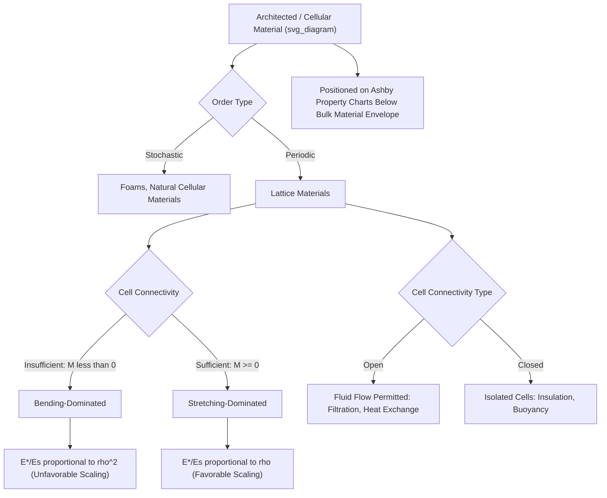

## Concept of Architected and Cellular Materials

### Overview

Architected materials are engineered systems whose macroscopic properties arise primarily from the deliberate geometric arrangement of a base material into a structured lattice or network, rather than solely from the intrinsic chemistry of the constituent material itself. Cellular materials, a major subclass, consist of an interconnected network of struts, walls, or shells that enclose void space (cells), distinguishing them from fully dense solids. The central conceptual shift these materials represent is that **structure becomes a design variable on equal footing with material composition**, enabling combinations of properties (e.g., high stiffness with low weight, or programmable anisotropy) that are unattainable in conventional bulk materials.

### Fundamental Classification

**Stochastic vs. Periodic (Lattice) Architectures**

- **Stochastic cellular materials**: disordered arrangements of cells with statistically random geometry (e.g., conventional metal foams, natural cellular materials like cork or trabecular bone). Properties are typically described using statistical/homogenized models rather than exact unit-cell analysis.
- **Periodic (ordered) lattice materials**: a repeating unit cell is tessellated in space, allowing precise, predictable control over mechanical response through deliberate unit-cell topology design. This category is the primary focus of most modern architected materials research due to the design control it affords.

**Open-Cell vs. Closed-Cell Structures**

- **Open-cell**: struts or walls form an interconnected skeleton with fully connected void space throughout, permitting fluid/gas flow through the structure (relevant to filtration, heat exchange, and biomedical scaffold applications)
- **Closed-cell**: each cell is enclosed by solid walls, isolating adjacent void spaces from one another, generally providing higher compressive strength and better insulation properties (e.g., for buoyancy or thermal insulation) at a given relative density compared to equivalent open-cell structures

### Governing Concept: Relative Density

The single most important parameter characterizing a cellular/lattice material is its **relative density** $\bar{\rho}$, defined as the ratio of the lattice's bulk (homogenized) density to the density of the fully dense parent (solid) material:

$$\bar{\rho} = \frac{\rho^*}{\rho_s}$$

where $\rho^*$ is the effective density of the lattice structure and $\rho_s$ is the density of the solid constituent material. Relative density is typically expressed as a percentage or fraction and is the primary independent variable against which mechanical properties (stiffness, strength) are plotted and scaled in cellular materials analysis.

### Deformation Mechanisms: Stretching vs. Bending-Dominated Behavior

A foundational classification, developed extensively in the cellular solids framework established by Gibson and Ashby, distinguishes lattice architectures by their dominant strut-level deformation mechanism under applied load:

**Bending-Dominated Structures**

Struts in the unit cell primarily deform by bending under applied load. This occurs in topologies where the number of struts meeting at each node is insufficient to provide full kinematic (Maxwell) rigidity, common in many simple architectures (e.g., simple cubic lattices, most open-cell foams).

- Mechanical properties scale unfavorably with relative density, following approximate power-law relationships such as:

  $$\frac{E^*}{E_s} \propto \bar{\rho}^2$$

  for effective Young's modulus $E^*$ relative to solid modulus $E_s$, meaning stiffness degrades rapidly (quadratically) as relative density decreases
- Generally lower stiffness/strength efficiency per unit mass compared to stretching-dominated architectures at low relative density

**Stretching-Dominated Structures**

Struts primarily experience axial tension/compression rather than bending, occurring in topologies satisfying (or approximately satisfying) Maxwell's static rigidity criterion for an ideal pin-jointed framework, typically requiring sufficiently high strut connectivity at each node (e.g., octet-truss, and other triangulated/fully-triangulated lattice topologies).

- Mechanical properties scale much more favorably, approximately linearly with relative density:

  $$\frac{E^*}{E_s} \propto \bar{\rho}$$
- This linear scaling means stretching-dominated lattices retain a much larger fraction of the parent material's stiffness and strength at low relative density, making them the preferred topology choice for lightweight structural applications

**Maxwell's Stability Criterion**

For a pin-jointed 3D framework, the Maxwell number $M$ provides a necessary (though not always sufficient, given the possibility of mechanisms with self-stress states) condition for static and kinematic determinacy:

$$M = b - 3j + 6$$

where $b$ is the number of struts (bars) and $j$ is the number of joints (nodes). $M \geq 0$ indicates a structure that can, in principle, be stretching-dominated (rigid without relying on bending stiffness), while $M < 0$ indicates the structure is necessarily bending-dominated (under-constrained as a pin-jointed framework, requiring nodal/strut bending stiffness to carry load).

### Common Lattice Topologies

- **Octet-truss**: face-centered-cubic-based topology combining octahedral and tetrahedral cells; a canonical stretching-dominated architecture widely used as a benchmark for high stiffness-to-weight lattice design
- **Kelvin foam (tetrakaidecahedron)**: based on the geometry that minimizes surface area for space-filling cells of equal volume (the solution to the Kelvin problem); relevant to idealized open-cell foam modeling
- **Simple cubic and body-centered cubic (BCC) lattices**: simple strut arrangements, generally bending-dominated, widely used in additive manufacturing due to ease of fabrication
- **Gyroid and other triply periodic minimal surfaces (TPMS)**: smooth, shell-based (rather than strut-based) architectures with continuous curvature and no sharp stress-concentrating junctions, offering favorable stress distribution and often improved fatigue/manufacturability characteristics relative to strut-based lattices
- **Auxetic lattices** (e.g., re-entrant honeycomb): engineered to exhibit a negative Poisson's ratio, expanding laterally under axial tension rather than contracting (see further discussion under auxetic materials topics)

### Ashby Materials Selection Framework

Cellular and architected materials are commonly positioned on **Ashby material property charts** (e.g., Young's modulus vs. density), where they characteristically occupy a distinct region below the envelope of conventional bulk engineering materials, illustrating their unique capability to combine low density with tailorable (though generally reduced relative to fully dense material) stiffness and strength. This graphical framework, originating from the broader field of systematic materials selection, is widely used to benchmark new lattice designs against both conventional materials and other architected material classes.

### Natural Cellular Materials as Design Inspiration

Many architected material concepts draw direct inspiration from naturally occurring cellular structures optimized by evolutionary processes for specific mechanical functions:

- **Trabecular (cancellous) bone**: a stochastic, graded cellular structure providing high stiffness-to-weight ratio and adapting its local density/orientation to prevailing mechanical loads (Wolff's law)
- **Wood**: a naturally hierarchical cellular material with aligned tubular cells providing high axial stiffness and strength relative to density
- **Cork**: a closed-cell material providing energy absorption, buoyancy, and thermal insulation
- **Honeycomb structures** (e.g., in beehives): hexagonal cellular geometry providing high in-plane stiffness efficiency, extensively adopted in engineered sandwich-panel core structures

### Manufacturing Considerations

While detailed fabrication methods are addressed in dedicated additive manufacturing topics, a key conceptual point is that periodic lattice architectures with complex, non-planar unit-cell geometries (particularly stretching-dominated and TPMS-based topologies) are frequently only practically manufacturable via additive manufacturing (3D printing) techniques, since conventional subtractive or casting methods struggle to access the internal, often non-line-of-sight geometric features required. This manufacturing dependency is a major reason architected materials have seen accelerated research and application growth in parallel with advances in metal and polymer additive manufacturing technology.

### Property Programmability

A defining conceptual advantage of architected materials is **property programmability**: by varying unit-cell topology, strut/wall thickness, and spatial grading (varying relative density or topology as a function of position within a component), designers can tailor:

- Anisotropic stiffness (direction-dependent mechanical response)
- Energy absorption and impact mitigation characteristics
- Effective Poisson's ratio (including auxetic, near-zero, or highly positive values)
- Thermal and acoustic properties (e.g., engineered bandgaps, discussed under phononic/acoustic metamaterial topics)

This programmability distinguishes architected materials conceptually from conventional material selection, where property combinations are constrained by the fixed characteristics of available bulk materials.

### Classification and Property Scaling Overview

### Key Points

- Relative density $\bar{\rho} = \rho^*/\rho_s$ is the fundamental scaling parameter for cellular/lattice material properties
- Stretching-dominated lattice topologies (satisfying Maxwell's rigidity criterion) scale favorably ($E^*/E_s \propto \bar{\rho}$), while bending-dominated topologies scale unfavorably ($E^*/E_s \propto \bar{\rho}^2$)
- Periodic lattice architectures offer precise, predictable property control compared to stochastic foams, at the cost of typically requiring additive manufacturing for fabrication
- Natural cellular materials (bone, wood, cork, honeycomb) provide long-studied design inspiration for engineered lattice structures
- The core value proposition of architected materials is property programmability: tailoring stiffness, anisotropy, energy absorption, and other properties through geometry rather than base material chemistry alone

**Related Topics:**

- Gibson-Ashby Scaling Laws for Cellular Solids
- Octet-Truss and Stretching-Dominated Lattice Design
- Triply Periodic Minimal Surface (TPMS) Structures
- Additive Manufacturing of Architected Metamaterials
- Auxetic Materials and Negative Poisson's Ratio Structures