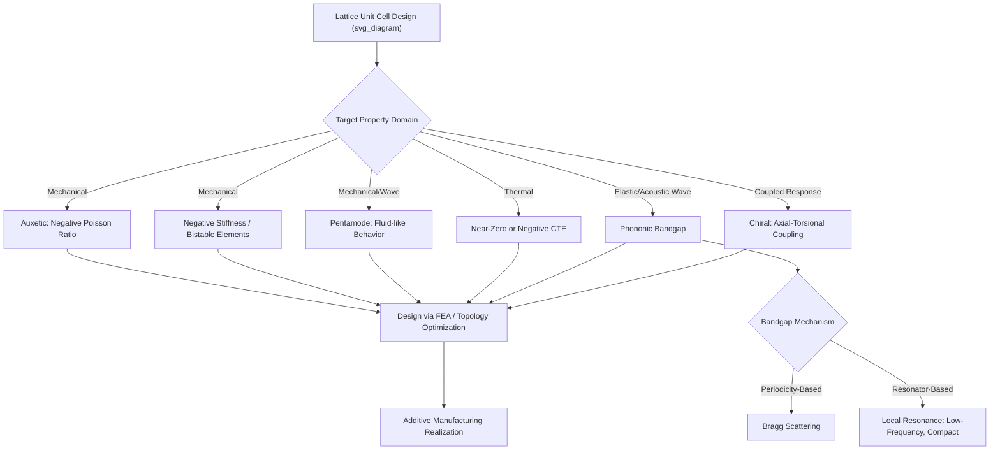

## Lattice Structures and Metamaterials

### Overview

Metamaterials are engineered materials whose functional properties derive primarily from precisely designed sub-unit geometry (the "meta-atom" or unit cell) rather than from the intrinsic chemistry of the constituent bulk material, enabling property combinations (mechanical, electromagnetic, acoustic, or thermal) that are unattainable, or rare, in naturally occurring materials. Lattice structures — periodic three-dimensional networks of struts, plates, or shells — represent the dominant physical implementation strategy for mechanical metamaterials, extending the relative-density and stretching/bending-dominated concepts of general cellular materials toward deliberately engineered, often counterintuitive, effective properties.

### Distinguishing Metamaterials from General Architected/Cellular Materials

While all metamaterials in the mechanical domain are architected/cellular in construction, not all cellular materials are metamaterials in the strict sense. The term "metamaterial" is generally reserved for structures engineered to exhibit a **specific, targeted effective property** that is anomalous or extreme relative to conventional bulk materials — such as negative Poisson's ratio, negative stiffness, near-zero thermal expansion, or programmable band structure — rather than simply providing a lightweight, stiff structural form. This distinction is one of design intent and property targeting rather than a strict structural classification boundary.

### Mechanical Metamaterial Property Classes

**Auxetic Metamaterials (Negative Poisson's Ratio)**

Conventional materials contract laterally when stretched axially (positive Poisson's ratio, typically 0.2–0.5 for common engineering solids). Auxetic metamaterials are engineered to expand laterally under axial tension, exhibiting a negative Poisson's ratio.

- **Re-entrant honeycomb**: the canonical 2D auxetic geometry, using inward-pointing ("re-entrant") cell walls that unfold under tension, causing lateral expansion
- **Rotating rigid units**: networks of rigid polygonal units connected by hinges that rotate relative to one another under load, producing auxetic response
- **Chiral lattices**: structures incorporating rotational asymmetry (ligaments connecting nodes at an angle rather than radially), coupling axial loading to a rotational/expansive response
- **Applications**: enhanced indentation resistance and fracture toughness (auxetic materials tend to flow material toward an impact/indentation site rather than away from it), conformable/dome-forming panels, and impact-protective padding

**Negative Stiffness Metamaterials**

Structures incorporating elements (often bistable buckled beams or snap-through elements) that exhibit a local negative slope in their force-displacement response over some deformation range, meaning force decreases as displacement increases in that regime.

- When embedded within a larger structural system in combination with positive-stiffness elements, negative-stiffness elements can produce extreme, tunable overall effective stiffness, including engineered damping enhancement
- Relevant to vibration isolation and energy absorption applications, where the negative-stiffness regime can be exploited to dissipate energy or decouple a protected structure from external excitation

**Pentamode Metamaterials**

A specialized lattice topology (double-cone strut geometry meeting at nodes) engineered to approximate the ideal mechanical behavior of a fluid: capable of supporting hydrostatic (compressive) loads while offering minimal resistance to shear deformation. Pentamode structures are of particular interest for acoustic/elastic wave cloaking applications, since transformation-based cloaking theory often calls for extreme, anisotropic, fluid-like effective material properties that pentamode lattices can approximate.

**Thermal Expansion-Tailored (Including Near-Zero and Negative CTE) Metamaterials**

By combining two or more constituent materials with different coefficients of thermal expansion (CTE) within a carefully designed bi-material lattice unit cell (e.g., using bimetallic strut pairs arranged to convert differential thermal expansion into a net rotational or translational unit-cell deformation), it is possible to engineer an effective composite coefficient of thermal expansion that is near-zero or even negative, despite both constituent materials having conventional positive CTE values. This is relevant to precision optical/aerospace structures requiring dimensional stability across temperature excursions.

### Elastic and Acoustic Wave Metamaterials (Phononic Crystals)

**Bandgap Engineering**

Periodic lattice structures can be designed such that elastic or acoustic waves within a specific frequency range (a "bandgap") cannot propagate through the structure, analogous to electronic bandgaps in semiconductor crystals or photonic bandgaps in photonic crystals. Bandgap formation arises from either:

- **Bragg scattering**: interference effects from spatial periodicity, requiring unit-cell dimensions comparable to the wavelength of interest
- **Local resonance**: embedded resonant substructures (e.g., mass-in-mass or mass-spring subunits) that create bandgaps at wavelengths much larger than the unit cell itself, enabling low-frequency attenuation in a compact structure — a hallmark distinguishing feature of "locally resonant" acoustic metamaterials from conventional Bragg-scattering phononic crystals

**Applications**

- Vibration isolation and mechanical filtering in aerospace and precision instrumentation
- Acoustic cloaking and noise mitigation panels
- Seismic metamaterials: large-scale periodic structures (e.g., buried resonator arrays) proposed to attenuate or redirect seismic wave energy around protected structures [Speculation: while demonstrated at model/laboratory scale and in limited field trials, large-scale seismic metamaterial deployment for practical earthquake protection remains at an early, largely experimental stage of technological maturity.]

### Chiral and Multifunctional Lattice Metamaterials

**Chirality-Induced Coupling**

Lattices incorporating geometric chirality (structures lacking mirror symmetry) can exhibit coupled mechanical responses not present in achiral structures, such as axial-torsional coupling (a chiral lattice twists when compressed axially, without requiring an externally applied torque), of interest for compact actuator and morphing-structure concepts.

**Multi-Property (Multifunctional) Design**

Contemporary metamaterial research increasingly targets simultaneous, co-optimized control over multiple property domains within a single architecture — for example, a lattice engineered to provide both a targeted mechanical stiffness/Poisson ratio response and a specific phononic bandgap, or combined mechanical and thermal (near-zero CTE) programmability — reflecting a broader trend toward multifunctional metamaterial design rather than single-property optimization.

### Design and Modeling Approaches

**Analytical/Homogenization Methods**

For simple periodic unit cells, classical beam-theory-based analytical models (extending Gibson-Ashby-type scaling relationships) provide closed-form estimates of effective stiffness, Poisson's ratio, and related properties as functions of unit-cell geometry and relative density, useful for rapid preliminary design.

**Finite Element Analysis (FEA)**

Detailed unit-cell and full-lattice finite element simulation is the standard computational workhorse for predicting effective mechanical properties, particularly for complex, non-idealized geometries (e.g., TPMS-based lattices, chiral structures) where closed-form analytical solutions are unavailable or insufficiently accurate.

**Topology Optimization**

Computational topology optimization algorithms are increasingly used to generate unit-cell or full-structure geometries that satisfy specified target property combinations (e.g., a prescribed effective Poisson's ratio and stiffness tensor) directly from an optimization objective, rather than relying solely on designer intuition or pre-cataloged unit-cell libraries. This computational design approach has become particularly prominent given the geometric freedom afforded by additive manufacturing fabrication routes.

**Inverse Design and Machine Learning**

Recent research directions employ machine-learning-based surrogate models and generative design approaches to accelerate the mapping from a desired target property set to a corresponding unit-cell geometry, addressing the large and often non-intuitive design space inherent to metamaterial unit-cell architecture. [Inference: this remains an active and rapidly evolving research area, and the maturity of specific machine-learning-based inverse design tools varies considerably across the literature.]

### Fabrication Pathway

As with general architected/cellular materials, the geometric complexity of most metamaterial unit cells (particularly those requiring internal, non-line-of-sight features such as re-entrant auxetic geometries, pentamode double-cone struts, or embedded local resonators) generally necessitates additive manufacturing for physical realization, with material choice (polymer, metal, ceramic) and printing process selected according to the target application's mechanical, thermal, or environmental performance requirements.

### Metamaterial Property Domains and Mechanisms

### Key Points

- Metamaterials are architected structures specifically engineered to exhibit a targeted, often anomalous, effective property (auxetic, negative stiffness, pentamode, near-zero CTE, phononic bandgap) not readily available in conventional bulk materials
- Auxetic (negative Poisson's ratio) behavior is achieved through re-entrant, rotating-unit, or chiral geometric mechanisms
- Local resonance-based phononic bandgaps enable low-frequency wave attenuation in structures much smaller than the target wavelength, distinguishing them from conventional Bragg-scattering phononic crystals
- Pentamode lattices approximate fluid-like mechanical behavior, relevant to elastic/acoustic cloaking applications
- Modern metamaterial design increasingly relies on topology optimization and machine-learning-based inverse design to navigate large, non-intuitive unit-cell design spaces, with additive manufacturing as the primary fabrication route

**Next Steps:**

- Auxetic Materials and Negative Poisson's Ratio Design
- Phononic Crystals and Locally Resonant Bandgap Engineering
- Pentamode Lattices for Elastic Wave Cloaking
- Topology Optimization Methods for Metamaterial Unit Cells
- Multifunctional Metamaterial Design Strategies