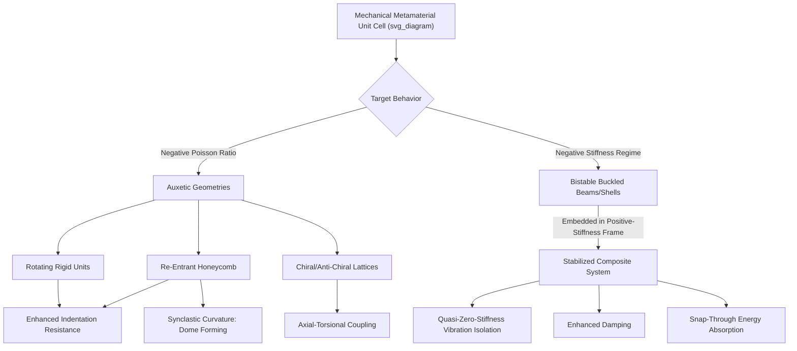

## Mechanical Metamaterials: Auxetic and Negative Stiffness

### Overview

Auxetic materials and negative-stiffness materials represent two of the most extensively studied classes of mechanical metamaterials, each defined by an effective mechanical response that inverts the intuitive behavior of conventional solids. Auxetic materials exhibit a negative Poisson's ratio (lateral expansion under axial tension, rather than contraction), while negative-stiffness materials/elements exhibit a local force-displacement relationship in which force decreases as displacement increases over some deformation range. Both phenomena arise from deliberate microstructural geometry rather than from any anomalous intrinsic constituent material property, making them canonical examples of the structure-as-design-variable principle underlying architected/metamaterial design.

### Auxetic Materials: Poisson's Ratio Fundamentals

**Definition and Sign Convention**

Poisson's ratio $\nu$ relates lateral strain to axial strain under uniaxial loading:

$$\nu = -\frac{\varepsilon_{lateral}}{\varepsilon_{axial}}$$

For conventional isotropic solids, $\nu$ typically falls in the range 0.2–0.5 (e.g., approximately 0.3 for many metals, approaching 0.5 for incompressible rubber-like materials). Classical elasticity theory bounds the Poisson's ratio of an isotropic linear elastic material between $-1$ and $0.5$ for thermodynamic stability; auxetic materials occupy the negative portion of this theoretically permitted, but rarely naturally realized, range.

**Physical Consequence**

An auxetic material becomes thicker in cross-section when stretched and thinner when compressed — the opposite of ordinary material behavior. This counterintuitive response is achieved entirely through internal cellular/lattice geometry rather than through any unusual constituent material chemistry, meaning auxetic behavior can in principle be engineered into essentially any base material capable of being fabricated into the required microstructure.

### Auxetic Geometric Mechanisms

**Re-Entrant Honeycomb**

The most widely studied and earliest documented auxetic geometry: a modified hexagonal honeycomb where some cell walls point inward ("re-entrant") rather than the conventional outward-bowing hexagonal shape.

- Under axial tension, the inward-angled ribs rotate/unfold outward, causing the overall structure to expand laterally rather than contract
- The magnitude and even sign of the effective Poisson's ratio can be tuned by adjusting the re-entrant angle and rib length ratios in the unit cell, allowing a continuous design range from strongly auxetic to conventional positive-Poisson's-ratio behavior within the same general topology family

**Rotating Rigid Units**

Networks of rigid polygonal units (squares, triangles, or rectangles) connected at their vertices by flexible hinges. Under applied tension, adjacent units rotate in alternating directions relative to one another, and this coordinated rotation mechanically produces net lateral expansion.

- "Rotating squares" mechanisms are the most commonly cited example within this class
- The rigid-unit assumption allows relatively straightforward kinematic (geometry-based) prediction of the effective Poisson's ratio, in contrast to the more elasticity-dependent behavior of flexure-based mechanisms like the re-entrant honeycomb

**Chiral and Anti-Chiral Lattices**

Structures built from circular or polygonal nodes connected by tangentially-attached ligaments, lacking mirror symmetry (chirality). Axial loading induces node rotation, which through the tangential ligament connections is kinematically coupled to lateral expansion or contraction, producing auxetic response along with characteristic axial-torsional coupling in 3D chiral variants.

**Hierarchical and Re-Entrant 3D Lattices**

Three-dimensional extensions of 2D auxetic concepts (e.g., re-entrant strut-based unit cells, double-arrowhead structures) extend auxetic behavior to bulk, additively-manufacturable lattice structures rather than planar sheet geometries, broadening the design space to volumetric components.

### Auxetic Material Property Advantages

**Enhanced Indentation and Impact Resistance**

Under localized indentation or impact loading, a conventional material tends to flow away from the impact site laterally, thinning the surrounding region. An auxetic material instead contracts laterally around the impact site (drawing material inward/densifying locally), which can enhance resistance to indentation and improve energy absorption in impact-protective applications.

**Enhanced Fracture Toughness**

Auxetic behavior has been associated with improved resistance to crack propagation in some studies, attributed to a crack-tip densification/contraction effect that can locally blunt or resist crack-opening displacement, though the magnitude of this effect is geometry- and loading-mode-dependent. [Inference: fracture toughness enhancement in auxetic structures is topology- and application-specific, and general quantitative claims should be verified against the specific structure and loading condition of interest.]

**Synclastic (Dome-Forming) Curvature**

Conventional flat sheets bent out-of-plane naturally form anticlastic (saddle-shaped) curvature due to positive Poisson's ratio coupling in-plane and out-of-plane strains. Auxetic sheets instead can form synclastic (dome-shaped, doubly curved in the same sense) curvature when bent, a property directly useful for manufacturing curved panels from flat auxetic sheet material without requiring complex forming processes.

**Variable Permeability**

Because auxetic structures change cell/pore size non-monotonically or in a coupled manner with applied strain, they have been explored for tunable filtration and smart-permeability applications, where mechanical deformation can be used to actively modulate pore size.

### Negative Stiffness: Fundamentals

**Force-Displacement Behavior**

A conventional (positive-stiffness) elastic element exhibits a monotonically increasing force with increasing displacement ($dF/dx > 0$). A negative-stiffness element exhibits a region where force decreases as displacement increases ($dF/dx < 0$), typically over a finite portion of its full deformation range, before returning to positive stiffness at larger displacements (an unstable equilibrium regime bridging two locally stable configurations).

**Bistable Mechanisms**

The most common physical realization of negative stiffness is a **bistable buckled beam or shell**: a pre-curved or pre-buckled beam has two stable equilibrium configurations (e.g., buckled "up" or buckled "down"), separated by an unstable intermediate configuration through which the force-displacement curve exhibits the negative-stiffness region as the beam snaps from one stable state to the other ("snap-through" behavior).

**Stabilization via Composite/Embedded Design**

An isolated negative-stiffness element is inherently unstable on its own (a structure cannot rest in a negative-stiffness equilibrium without an external constraint). However, when negative-stiffness elements are mechanically embedded within, or connected in parallel with, positive-stiffness elements (e.g., a bistable beam constrained within a stiffer surrounding frame), the overall composite system can be stabilized while still exploiting the negative-stiffness contribution to achieve extreme overall effective stiffness — in principle ranging from very high, to zero, to formally negative overall composite stiffness, depending on the relative stiffness and volume fraction of the constituent elements.

### Negative Stiffness Applications

**Vibration Isolation**

Combining negative-stiffness elements with conventional positive-stiffness springs can produce a composite isolator with very low (near-zero) net dynamic stiffness in the isolation direction while maintaining adequate static load-bearing capacity, extending the achievable isolation frequency range to lower frequencies than a conventional linear isolator of similar static stiffness could achieve. This "quasi-zero-stiffness" (QZS) isolator concept is a widely cited application of negative-stiffness metamaterial design.

**Enhanced Damping**

Materials or structures incorporating negative-stiffness inclusions can, under specific configurations, exhibit anomalously high effective damping (loss factor), since energy is dissipated as elements traverse the unstable snap-through region; this has motivated research into negative-stiffness-enhanced composite damping materials.

**Energy Absorption and Impact Mitigation**

The snap-through behavior of bistable/negative-stiffness elements provides a mechanism for absorbing impact energy at a relatively constant (or controllable) force level as successive elements within an array sequentially snap through, of interest for protective packaging and impact-mitigating structures, in some respects analogous to but mechanistically distinct from conventional crushable honeycomb energy absorbers.

**Reconfigurable and Multistable Structures**

Arrays of bistable elements can be used to construct reconfigurable/morphing structures and mechanical memory or logic elements, where the discrete stable states of each element encode information or shape configuration, an area of interest for soft robotics and mechanical metamaterial-based computing concepts.

### Design and Analysis Approaches

**Analytical Beam Models**

Bistable beam behavior is commonly analyzed using classical buckled-beam theory (e.g., extensions of the Euler-Bernoulli or von Kármán beam models applied to pre-curved beams), providing closed-form or semi-analytical predictions of the force-displacement curve, snap-through force, and the geometric parameters (beam curvature, thickness, boundary conditions) governing the negative-stiffness regime.

**Finite Element Analysis**

Nonlinear FEA (accounting for large-deflection geometric nonlinearity) is standard for predicting the detailed force-displacement response of both auxetic unit cells (particularly flexure-dominated geometries like re-entrant honeycombs, where finite rotations are significant) and bistable negative-stiffness elements, especially for complex or 3D geometries beyond the reach of simple analytical beam models.

**Parametric Unit-Cell Libraries**

Both auxetic and negative-stiffness design commonly proceed via parametric exploration of a chosen unit-cell topology family (e.g., varying re-entrant angle, rib thickness ratio, or beam pre-curvature) to map the achievable property range (Poisson's ratio, effective stiffness) as a function of a small number of governing geometric parameters, often visualized as design charts analogous to Ashby-style property maps.

### Fabrication

Both auxetic and negative-stiffness metamaterial unit cells are frequently realized via additive manufacturing (particularly for 3D auxetic lattices and complex bistable geometries), though simpler 2D/planar auxetic and bistable designs (e.g., laser-cut re-entrant honeycomb sheets, planar buckled-beam arrays) can also be fabricated using conventional subtractive or sheet-forming processes, offering a lower-cost prototyping route for these two-dimensional geometry classes specifically.

### Mechanism and Application Summary

### Key Points

- Auxetic materials exhibit negative Poisson's ratio through geometric mechanisms (re-entrant unfolding, rigid-unit rotation, chiral ligament coupling) rather than anomalous constituent material chemistry
- Auxetic behavior confers practical advantages including enhanced indentation/impact resistance and synclastic (dome-forming) curvature useful for flat-sheet-to-curved-panel manufacturing
- Negative-stiffness behavior arises from bistable, buckled-beam-type elements exhibiting a force-decreasing-with-displacement regime between two stable equilibria
- Isolated negative-stiffness elements are inherently unstable and must be mechanically stabilized by embedding within positive-stiffness surrounding structure to realize practical composite systems
- Quasi-zero-stiffness vibration isolation is a leading application of stabilized negative-stiffness metamaterial design, extending isolation performance to lower frequencies than conventional linear isolators

**Related Topics:**

- Poisson's Ratio Bounds and Isotropic Elasticity Theory
- Bistable Beam Mechanics and Snap-Through Buckling
- Quasi-Zero-Stiffness Vibration Isolator Design
- 3D Auxetic Lattice Structures for Additive Manufacturing
- Multistable Mechanical Metamaterials for Soft Robotics