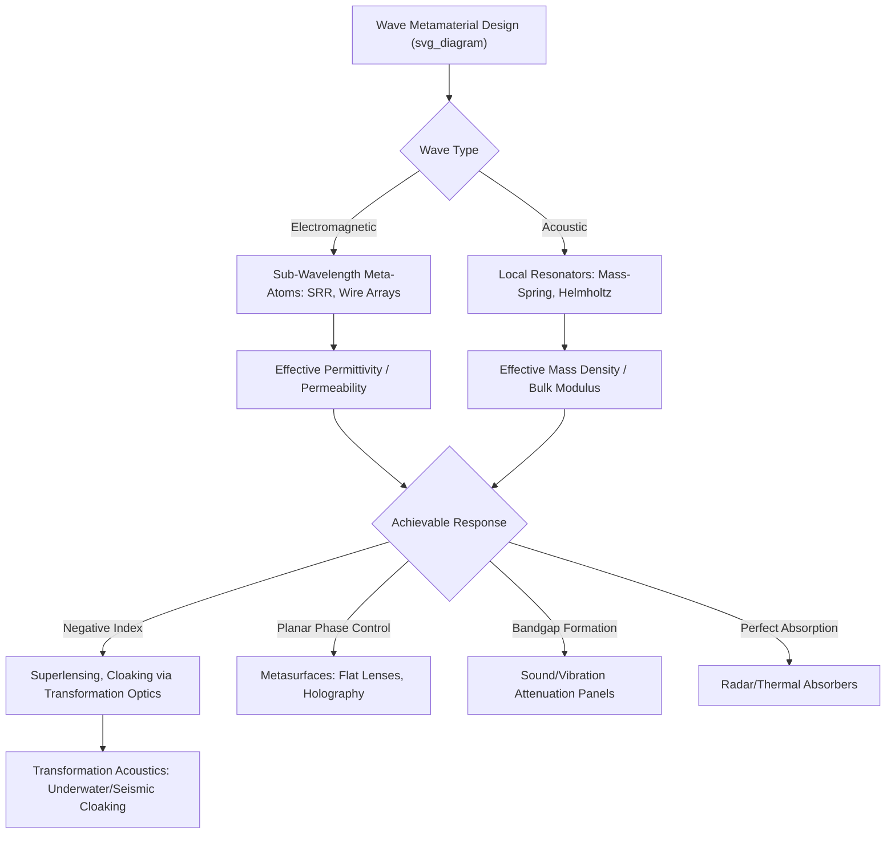

## Electromagnetic and Acoustic Metamaterials

### Overview

Electromagnetic (EM) and acoustic metamaterials are engineered structures composed of sub-wavelength unit cells ("meta-atoms") arranged to produce effective bulk wave-propagation properties — permittivity and permeability for electromagnetic waves, or effective mass density and bulk modulus for acoustic waves — that lie outside the range achievable with naturally occurring materials. Unlike mechanical metamaterials, whose function centers on static or quasi-static force-displacement response, EM and acoustic metamaterials are fundamentally **wave-manipulation** structures, and their unit-cell dimensions are dictated by the wavelength of the target wave phenomenon rather than by structural load-bearing considerations.

### Foundational Electromagnetic Concepts

**Effective Medium Description**

For a periodic array of sub-wavelength unit cells (unit cell dimension much smaller than the wavelength of interest), the composite structure can be described using homogenized effective material parameters: effective permittivity $\varepsilon_{eff}$ and effective permeability $\mu_{eff}$, which need not correspond to any naturally occurring material's response and can be engineered through unit-cell geometry, analogous to how lattice unit-cell geometry engineers effective mechanical properties in architected materials.

**Negative Refractive Index**

A material with simultaneously negative permittivity ($\varepsilon < 0$) and negative permeability ($\mu < 0$) exhibits a negative refractive index, meaning that an incident wave refracts to the same side of the normal as the incident ray, rather than the opposite side, contrary to conventional (Snell's-law-positive-index) refraction. This was theoretically proposed by Veselago and later realized experimentally using engineered split-ring resonator/wire-array metamaterial structures, representing a foundational demonstration in the field.

**Split-Ring Resonators (SRRs)**

A canonical EM metamaterial unit cell: a conducting ring (or nested pair of rings) with a small gap, behaving as an effective LC (inductor-capacitor) resonant circuit at the sub-wavelength scale. Near the resonant frequency, an SRR array can produce a strong effective magnetic response, including negative effective permeability over a frequency band above resonance, and SRR arrays combined with continuous conducting wire arrays (providing negative effective permittivity via a plasma-like response) were used in early experimental demonstrations of negative-index behavior at microwave frequencies.

### Electromagnetic Metamaterial Applications

**Transformation Optics and Cloaking**

Transformation optics is a design framework in which a desired wave-propagation path (e.g., waves bending smoothly around a hidden object) is mathematically mapped onto a required spatial distribution of anisotropic, spatially-varying permittivity and permeability, which a metamaterial unit-cell array is then designed to approximate. This framework underlies experimentally demonstrated microwave-frequency electromagnetic cloaking devices, though practical cloaking at optical frequencies and over broad bandwidths and viewing angles remains a substantially more difficult, largely unsolved engineering challenge. [Inference: the gap between narrow-bandwidth, single-frequency proof-of-concept cloaking demonstrations and a practically useful broadband optical cloak remains large, and claims of "invisibility cloaks" in popular coverage often substantially overstate current capability.]

**Perfect Lenses and Sub-Diffraction Imaging**

Negative-index materials have been theoretically proposed to enable a "superlens" capable of imaging with resolution finer than the conventional diffraction limit, by recovering evanescent wave components that decay before reaching a conventional lens. Experimental realizations (e.g., using thin silver films operating near a surface plasmon resonance condition) have demonstrated sub-diffraction-limited imaging at optical frequencies, though generally over very short working distances and narrow bandwidths.

**Metasurfaces**

A metasurface is a two-dimensional (planar, sub-wavelength-thickness) analog of a bulk metamaterial, composed of an array of sub-wavelength scatterers (meta-atoms) engineered to impart a spatially-varying phase, amplitude, and/or polarization response to an incident wavefront. Metasurfaces enable flat-optic components — lenses, polarization converters, holographic elements, and beam-steering devices — that replace the curved-surface refraction of conventional bulk optical components with a thin, planar, lithographically patterned structure, and represent one of the most actively developed and commercially relevant subfields of electromagnetic metamaterials at present.

**Absorbers and Frequency-Selective Surfaces**

Metamaterial unit cells can be designed to achieve near-perfect absorption of incident EM radiation at a targeted frequency band (metamaterial perfect absorbers), of interest for stealth/radar-absorbing applications and thermal emission engineering, or conversely to selectively reflect/transmit specific frequency bands (frequency-selective surfaces) for antenna and radome applications.

### Foundational Acoustic Concepts

**Effective Mass Density and Bulk Modulus**

Analogous to the EM case, acoustic wave propagation in a homogeneous medium is governed by mass density $\rho$ and bulk modulus $\kappa$ (or equivalently, sound speed and acoustic impedance). Acoustic metamaterials engineer sub-wavelength unit-cell structures (typically incorporating local resonators) to produce an effective mass density and/or bulk modulus that can become negative over specific frequency bands, a behavior with no naturally occurring acoustic material analog.

**Locally Resonant Sonic Materials**

The foundational acoustic metamaterial concept: arrays of local resonators (e.g., dense spherical masses coated with a soft, compliant outer layer, embedded in a host matrix) create resonance-driven anomalous acoustic response — including effective negative mass density near resonance — enabling acoustic bandgap formation at wavelengths much larger than the physical unit-cell size. This local-resonance mechanism, distinguishing these structures from conventional Bragg-scattering-based phononic crystals (whose bandgap requires unit-cell dimensions comparable to the wavelength), enables compact low-frequency sound/vibration attenuation devices.

**Helmholtz Resonator-Based Structures**

Acoustic metamaterials frequently employ arrays of Helmholtz resonators (cavity-and-neck resonant structures) as the local-resonance unit, providing a well-understood, easily tunable resonant element (resonant frequency set by cavity volume and neck geometry) for engineering targeted acoustic bandgaps or negative bulk-modulus response.

### Acoustic Metamaterial Applications

**Sound Attenuation and Noise Barriers**

Locally resonant acoustic metamaterial panels can achieve substantial sound transmission loss at target frequencies using panels significantly thinner than would be required by conventional mass-law-based sound insulation (which requires increasing thickness/mass to attenuate lower frequencies), of particular interest for compact, lightweight low-frequency noise barriers in aerospace, automotive, and building acoustics applications.

**Acoustic Cloaking**

Analogous to electromagnetic transformation-optics cloaking, transformation acoustics provides a design framework for engineering spatially-varying effective acoustic properties (including the pentamode mechanical metamaterial structures discussed previously, which approximate the required anisotropic fluid-like behavior) to route acoustic or underwater sonar waves around a hidden object.

**Acoustic Lensing and Focusing**

Metamaterial-based acoustic lenses exploit engineered effective refractive index profiles (analogous to gradient-index optics) to focus or steer acoustic waves, relevant to medical ultrasound imaging/therapy and underwater sonar applications.

**Underwater and Seismic Applications**

Acoustic metamaterial concepts extend to underwater sound manipulation (submarine sonar evasion/detection applications) and, at much larger length scales, to seismic metamaterials (periodic or resonator-based structures intended to redirect or attenuate seismic wave energy around protected structures), the latter remaining at an early experimental/field-trial stage of technological maturity as previously noted in the context of general lattice metamaterials.

### Design and Analysis Methods

**Full-Wave Electromagnetic Simulation**

Finite-difference time-domain (FDTD) and finite element method (FEM)-based electromagnetic solvers are the standard computational tools for designing and predicting the frequency response of EM metamaterial/metasurface unit cells, given the complex, sub-wavelength, often resonant nature of these structures that generally precludes simple analytical treatment except for the most basic geometries (e.g., idealized SRR circuit models).

**Acoustic/Elastic Wave Simulation**

Analogous finite element-based acoustic/elastodynamic simulation is used for acoustic and phononic metamaterial unit-cell design, typically computing band structure (dispersion relations) via Bloch-Floquet periodic boundary condition analysis to identify and engineer bandgap frequency ranges.

**Transformation-Based Design**

For cloaking and related wave-routing applications, transformation optics/acoustics provides an analytical starting point (a coordinate transformation defining the required spatially-varying material property tensor), which is then discretized and approximated using a practically realizable metamaterial unit-cell array, since the mathematically ideal transformation-derived material properties are frequently impractical or impossible to realize exactly (e.g., requiring singular or extreme anisotropic values at certain points).

### Fabrication Approaches

EM metamaterials at microwave frequencies are typically fabricated using conventional printed-circuit-board photolithography techniques (patterning conductive SRR/wire-array elements on a dielectric substrate), while optical-frequency metasurfaces require nanofabrication techniques such as electron-beam lithography or nanoimprint lithography, given the much smaller sub-wavelength feature sizes required at visible/near-infrared wavelengths. Acoustic metamaterials, since acoustic wavelengths at audible frequencies are on the order of centimeters to meters, are generally more amenable to conventional machining, molding, or additive manufacturing techniques than their optical-frequency EM counterparts.

### Wave Metamaterial Design Overview

### Key Points

- EM and acoustic metamaterials engineer sub-wavelength unit-cell structures to achieve effective bulk wave-propagation properties (permittivity/permeability, or mass density/bulk modulus) unavailable in natural materials
- Split-ring resonators and wire arrays enabled the first experimental demonstrations of negative refractive index at microwave frequencies, a foundational milestone in the field
- Metasurfaces represent the most actively developed and commercially relevant EM metamaterial subfield, replacing bulk curved optics with thin, planar, phase-engineered flat optics
- Locally resonant acoustic metamaterials achieve low-frequency bandgaps and sound attenuation in structures much thinner/smaller than conventional mass-law acoustic insulation would require
- Transformation optics/acoustics provides the mathematical design framework underlying cloaking concepts in both domains, though practical broadband, wide-angle cloaking remains substantially unsolved relative to narrowband proof-of-concept demonstrations

**Next Steps:**

- Split-Ring Resonator Design and Negative-Index Realization
- Metasurface-Based Flat Optics and Wavefront Engineering
- Locally Resonant Phononic Bandgap Design
- Transformation Optics and Acoustics for Cloaking Applications
- Nanofabrication Techniques for Optical-Frequency Metasurfaces