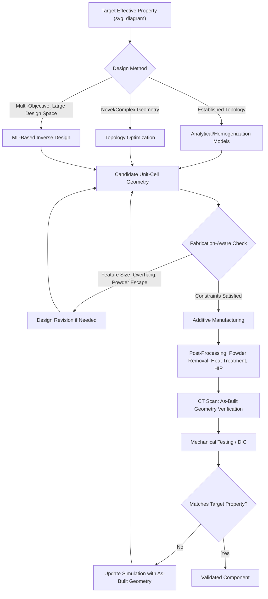

## Design and Fabrication of Architected Materials

### Overview

Realizing architected materials in practice requires a coupled design-fabrication workflow: the target effective property drives unit-cell geometry selection, but the achievable geometric complexity is in turn constrained by available fabrication technology, feature-size resolution, and material compatibility. This topic surveys the principal computational design methodologies and manufacturing routes used to translate the lattice/metamaterial concepts covered previously (relative density scaling, stretching/bending-dominated topology, auxetic and negative-stiffness mechanisms, phononic bandgap structures) into physical parts, along with the characterization and validation steps used to confirm as-built performance.

### Design Methodologies

**Analytical and Homogenization-Based Design**

For well-established unit-cell topologies (simple cubic, BCC, octet-truss, re-entrant honeycomb), closed-form or semi-analytical beam-theory-based models extending Gibson-Ashby-type scaling relationships provide rapid first-pass estimates of effective stiffness, strength, and Poisson's ratio as functions of relative density and unit-cell geometric parameters. These methods are computationally inexpensive and well-suited to early-stage design space exploration, but their accuracy typically degrades for non-slender struts, complex node geometries, or large-deformation/nonlinear response regimes.

**Finite Element-Based Unit-Cell Homogenization**

For more complex or non-idealized geometries, numerical homogenization applies periodic (Bloch-Floquet-type) boundary conditions to a single representative unit cell under finite element analysis, extracting an effective anisotropic stiffness tensor (or, for wave-propagation metamaterials, a dispersion/band-structure relation) without requiring simulation of a full multi-cell structure. This approach balances computational cost against geometric fidelity and is the standard workhorse for non-trivial lattice and metamaterial unit-cell design.

**Topology Optimization**

Topology optimization algorithms (commonly density-based methods such as SIMP — Solid Isotropic Material with Penalization — or level-set methods) computationally generate a spatial material distribution that optimizes a specified objective (e.g., maximum stiffness-to-weight ratio, or a targeted effective property tensor) subject to constraints (volume fraction, manufacturing constraints, load/boundary conditions), rather than relying on a pre-selected unit-cell topology library.

- **Unit-cell-level topology optimization**: generates novel, often non-intuitive unit-cell geometries targeting specific effective property combinations (e.g., prescribed Poisson's ratio, or combined mechanical/thermal response), extending the design space well beyond hand-derived geometries like the octet-truss or re-entrant honeycomb
- **Structure-level (macroscale) topology optimization with lattice infill**: optimizes the overall part-level material distribution (where to place solid material vs. lattice infill vs. void), often combined with locally graded lattice density to match structural performance requirements while minimizing mass

**Inverse Design and Machine Learning**

Given the large, often non-intuitive design space connecting unit-cell geometry to effective property combinations (particularly for multifunctional metamaterials targeting several simultaneous property objectives), machine-learning-based surrogate models and generative design approaches (e.g., neural-network-based property predictors coupled with optimization, or generative adversarial network-based geometry generation) are increasingly used to accelerate the mapping from a desired target property set to a corresponding candidate unit-cell geometry. [Inference: the maturity and generalizability of specific machine-learning-based inverse design tools varies substantially across the research literature, and this remains an active, rapidly evolving methodology rather than a fully standardized design approach.]

**Functionally Graded Lattice Design**

Rather than using a single uniform unit-cell topology and relative density throughout a component, functionally graded lattice design spatially varies relative density, strut/wall thickness, or even unit-cell topology as a function of position, allowing local mechanical properties to be matched to local loading or functional requirements (e.g., higher relative density near load-bearing interfaces, lower relative density in low-stress interior regions) within a single continuous, manufacturable part.

### Additive Manufacturing as the Primary Fabrication Route

The geometric complexity characteristic of high-performance lattice and metamaterial unit cells — internal, non-line-of-sight strut networks, smoothly curved TPMS shell geometries, re-entrant auxetic features, embedded local resonators — is generally inaccessible to conventional subtractive (machining) or casting-based manufacturing processes, making additive manufacturing (AM) the dominant and often sole practical fabrication route for these structures.

**Powder Bed Fusion (Metal AM)**

- **Laser Powder Bed Fusion (L-PBF, also termed SLM/DMLS)**: a high-power laser selectively melts successive layers of metal powder to build the part; the dominant metal AM process for high-performance metallic lattice structures (titanium, aluminum, nickel-superalloy, and stainless steel lattices), offering good mechanical property fidelity but subject to minimum feature-size constraints (typically on the order of a few hundred micrometers for strut diameter, process- and material-dependent) and challenges with fully removing trapped, unfused powder from internal lattice cavities
- **Electron Beam Powder Bed Fusion (EB-PBF)**: uses an electron beam rather than laser, operating at higher build temperature under vacuum, generally producing lower residual stress but somewhat coarser minimum feature resolution than L-PBF

**Vat Photopolymerization (Polymer/Ceramic AM)**

- **Stereolithography (SLA) and Digital Light Processing (DLP)**: a UV light source selectively cures liquid photopolymer resin layer-by-layer (SLA via scanned laser, DLP via projected image), offering fine feature resolution (often tens of micrometers) well-suited to intricate lattice and metamaterial unit-cell geometries in polymer or, via specialized ceramic-particle-loaded resins followed by binder burnout and sintering, ceramic materials
- **Two-Photon Polymerization (2PP)**: a specialized, ultra-high-resolution vat photopolymerization variant using nonlinear two-photon absorption to achieve sub-micrometer feature resolution, used for micro/nano-scale lattice and metamaterial fabrication (e.g., optical-frequency metamaterial unit cells, micro-architected mechanical test specimens), though with correspondingly slow build rates limiting practical part size

**Material Extrusion (Polymer AM)**

Fused Filament Fabrication (FFF/FDM) extrudes thermoplastic filament layer-by-layer; widely accessible and low-cost, suitable for rapid prototyping of larger-feature-size polymer lattice structures, though generally offering coarser resolution and greater anisotropy in mechanical properties (due to layer-adhesion-dependent behavior) than vat photopolymerization or powder bed fusion methods.

**Material Jetting and Binder Jetting**

- **Material jetting**: selectively deposits and UV-cures droplets of photopolymer resin, enabling multi-material printing (including graded or spatially varying material composition within a single build) of interest for multifunctional lattice designs combining regions of differing stiffness within one part
- **Binder jetting**: selectively deposits liquid binder onto a powder bed (metal, ceramic, or polymer powder), followed by a separate sintering/curing/infiltration post-processing step; offers generally faster build rates than powder bed fusion but typically requires additional post-processing to achieve full density and can involve more significant dimensional shrinkage during sintering

### Fabrication-Aware Design Constraints

Effective architected material design must account for manufacturing-process-specific constraints, since geometries generated by unconstrained topology optimization or idealized analytical models may not be directly manufacturable:

- **Minimum feature size**: strut diameter or wall thickness must exceed the process-specific resolution limit to print reliably and reproducibly
- **Self-supporting angle constraints**: powder bed fusion and other AM processes generally require overhanging features to remain above a minimum angle from horizontal (process- and material-dependent, often cited around 45° as a common though not universal guideline) to avoid the need for sacrificial support structures, which are difficult or impossible to remove from internal lattice cavities
- **Powder/resin removal from internal cavities**: closed-cell or fully enclosed internal lattice geometries can trap unfused powder (powder bed fusion) or uncured resin (vat photopolymerization), requiring escape-hole design features or a preference for open-cell topologies where complete internal material removal is required
- **Surface roughness and as-built dimensional accuracy**: AM-fabricated struts typically exhibit rougher surface finish and greater dimensional deviation from nominal CAD geometry than machined components, which can measurably affect actual mechanical performance (particularly fatigue behavior, which is highly surface-finish-sensitive) relative to idealized simulation predictions

### Post-Processing

- **Powder/support removal**: mechanical or chemical removal of unfused powder (metal/ceramic powder bed processes) or uncured resin (vat photopolymerization) from internal lattice cavities, often requiring specialized cleaning protocols for complex internal geometries
- **Heat treatment**: stress-relief annealing (common for L-PBF metal parts to reduce residual thermal stresses from rapid layer-by-layer solidification) or full solution/aging heat treatments to achieve target microstructure and mechanical properties
- **Hot isostatic pressing (HIP)**: applied to metal AM lattice parts to close internal porosity/defects and improve fatigue performance, though careful process control is needed to avoid excessive densification-driven distortion of fine lattice features
- **Surface finishing**: chemical or electrochemical polishing, or abrasive flow machining, to reduce as-built surface roughness where fatigue performance or flow characteristics (open-cell/permeable structures) are critical

### Validation and Characterization of Fabricated Structures

**Dimensional/Geometric Verification**

X-ray computed tomography (CT) scanning is the standard non-destructive method for verifying as-built internal lattice geometry against nominal CAD design, quantifying strut diameter deviation, porosity, and internal defect content that cannot be assessed via external surface inspection alone.

**Mechanical Testing**

Standard mechanical testing (quasi-static compression/tension, fatigue testing) of fabricated lattice specimens validates predicted effective stiffness, strength, and Poisson's ratio against design targets, with digital image correlation (DIC) commonly used to map full-field surface strain during testing for detailed comparison against finite element predictions.

**Feedback Loop Between Simulation and As-Built Performance**

Because as-built geometry (strut diameter deviation, surface roughness, minor internal defects) frequently deviates from nominal design geometry in AM-fabricated lattices, a mature design workflow incorporates CT-scan-derived as-built geometry back into finite element models ("as-built" or "digital twin" simulation) to improve correlation between predicted and measured mechanical performance, rather than relying solely on nominal CAD-based simulation.

### Design-to-Fabrication Workflow

### Key Points

- Architected material design spans a spectrum from fast analytical/homogenization models for established topologies to computationally intensive topology optimization and machine-learning-based inverse design for novel, multi-objective geometries
- Additive manufacturing is the dominant fabrication route for high-performance lattice/metamaterial structures due to internal, non-line-of-sight geometric complexity inaccessible to conventional processes
- Process selection (powder bed fusion, vat photopolymerization, material extrusion, jetting-based methods) involves trade-offs between achievable feature resolution, material options, build rate, and cost
- Fabrication-aware design constraints (minimum feature size, self-supporting overhang angles, powder/resin removal from internal cavities) must be incorporated during design, not only checked post-hoc, to ensure manufacturability
- CT scanning and mechanical testing validate as-built performance against design targets, with as-built geometry increasingly fed back into simulation models to close the gap between nominal design predictions and actual fabricated performance

**Related Topics:**

- Topology Optimization Algorithms: SIMP and Level-Set Methods
- Powder Bed Fusion Process Parameters and Defect Formation
- CT-Scan-Based As-Built Simulation ("Digital Twin") Workflows
- Functionally Graded Lattice Design for Load-Matched Structures
- Machine Learning for Inverse Metamaterial Design