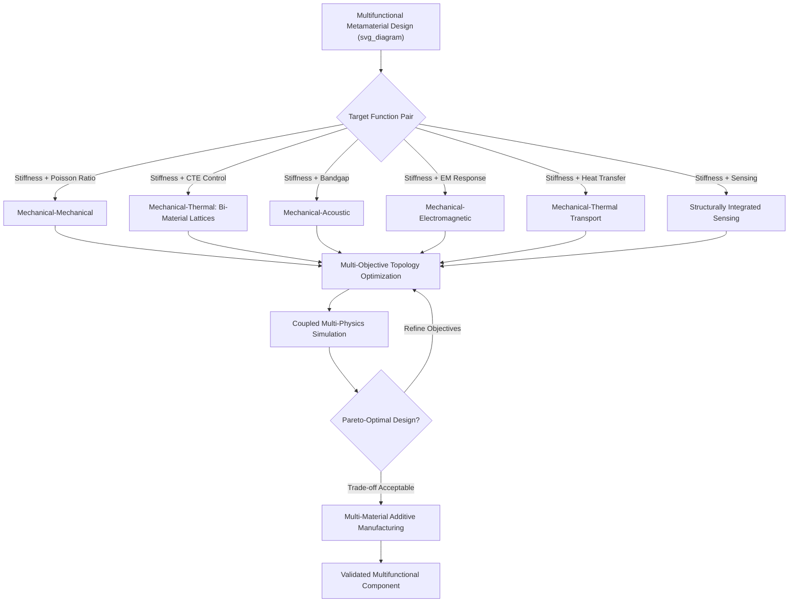

## Multifunctional Metamaterials

### Overview

Multifunctional metamaterials are architected structures deliberately engineered to deliver two or more simultaneous, co-optimized functional responses — for example, combined mechanical stiffness and phononic bandgap behavior, or combined structural load-bearing capacity and thermal management — from a single unit-cell architecture, rather than optimizing for one property in isolation. This represents a natural extension of the single-property metamaterial concepts covered previously (auxetic, negative-stiffness, phononic, electromagnetic) toward integrated systems where geometry, and often material distribution, must satisfy multiple, sometimes competing, design objectives at once.

### Motivation for Multifunctionality

**Beyond Single-Property Optimization**

Most classical metamaterial design (as covered in prior topics on auxetic/negative-stiffness mechanical metamaterials and EM/acoustic wave metamaterials) targets a single anomalous effective property. Real engineering systems, however, frequently require simultaneous performance across multiple domains — a spacecraft panel may need to be simultaneously lightweight, stiff, and thermally stable; a vehicle structural component may need to bear load while also attenuating vibration or noise. Multifunctional metamaterial design addresses this by treating multiple property targets as co-equal design objectives from the outset, rather than layering separate single-function materials or components together.

**Mass and Volume Efficiency**

A central practical driver for multifunctional design is that combining multiple functions into a single architected structure can reduce overall system mass and volume relative to using discrete, separately-optimized components for each function (e.g., a separate structural panel plus a separate vibration damper plus a separate thermal insulation layer), which is particularly valuable in mass- and volume-constrained applications such as aerospace and portable/wearable systems.

### Categories of Multifunctional Combination

**Mechanical-Mechanical Multifunctionality**

Combining two distinct mechanical response targets within a single architecture — for example, a lattice engineered to simultaneously provide a prescribed effective Poisson's ratio (auxetic or otherwise) and a targeted stiffness or strength level, or a structure combining high static stiffness with tailored dynamic (vibration-damping or negative-stiffness-enhanced) response.

**Mechanical-Thermal Multifunctionality**

Bi-material lattice architectures (introduced previously in the context of near-zero/negative coefficient-of-thermal-expansion, CTE, metamaterials) exemplify this category, where the same unit-cell geometry is engineered to deliver both a target mechanical stiffness and a target effective CTE, of particular interest for precision aerospace and optical structures requiring dimensional stability across temperature excursions while also carrying structural load.

**Mechanical-Acoustic/Vibrational Multifunctionality**

Lattice or sandwich-panel architectures engineered to simultaneously provide structural load-bearing stiffness and a targeted phononic bandgap or vibration-damping response, combining the stretching/bending-dominated stiffness scaling concepts from general cellular material design with the local-resonance bandgap mechanisms discussed under acoustic metamaterials, to produce structural components that are simultaneously load-bearing and vibration-isolating without requiring a separate discrete damping treatment.

**Mechanical-Electromagnetic Multifunctionality**

Structures designed to combine load-bearing mechanical function with engineered electromagnetic response (e.g., radar-absorbing or frequency-selective structural panels), relevant to aerospace and defense applications where structural mass budgets favor integrating EM functionality directly into load-bearing airframe components rather than adding separate, discrete EM treatment layers.

**Mechanical-Thermal Transport Multifunctionality**

Lattice structures engineered to combine mechanical load-bearing capability with enhanced or tailored heat-transfer characteristics (e.g., open-cell lattices designed simultaneously for structural stiffness and as heat-exchanger cores exploiting high surface-area-to-volume ratio and controllable internal flow paths), relevant to compact heat-exchanger and thermal-management structural applications.

**Sensing/Actuation Integration**

Structures that embed sensing or actuation functionality (e.g., via embedded piezoelectric elements, or via geometry that produces a measurable electrical response to mechanical deformation) directly within a load-bearing lattice architecture, moving toward structurally integrated "smart" or self-sensing structural systems rather than requiring separately mounted discrete sensors.

### Design Challenges Specific to Multifunctionality

**Competing Objectives and Pareto Trade-offs**

Because different functional objectives often depend on the same underlying geometric parameters (e.g., strut thickness affects both mechanical stiffness and thermal conductivity), multifunctional design frequently cannot achieve simultaneous optimal performance in every target property; design outcomes are typically represented as a Pareto front describing the achievable trade-off frontier between competing objectives, rather than a single unconstrained optimum.

**Multi-Objective Topology Optimization**

Extending the single-objective topology optimization methods discussed under general architected material design, multi-objective topology optimization algorithms (e.g., weighted-sum or Pareto-based multi-objective genetic algorithms, or multi-physics-coupled gradient-based optimization) are used to navigate the larger design space and competing constraints inherent to multifunctional unit-cell design.

**Multi-Physics Simulation Coupling**

Predicting multifunctional performance typically requires coupled multi-physics simulation (e.g., combined structural-thermal finite element analysis for mechanical-thermal multifunctional design, or combined structural-acoustic simulation for mechanical-vibrational design), which is computationally more demanding than the single-physics simulations sufficient for single-property metamaterial design, and requires careful handling of the coupling between physical domains at the unit-cell length scale.

**Material Selection Constraints**

Multifunctional designs combining mechanically and thermally (or electromagnetically) distinct constituent materials within a single lattice (e.g., bi-material CTE-tailored lattices) must additionally satisfy manufacturing compatibility constraints (e.g., compatible processing temperatures, adequate interfacial bonding between dissimilar materials), adding a materials-compatibility dimension to the design problem beyond the geometric optimization considerations relevant to single-material metamaterial design.

### Fabrication Considerations

**Multi-Material Additive Manufacturing**

Realizing multifunctional metamaterials that require spatially distinct material properties within a single build (e.g., bi-material CTE-tailored lattices, or structures combining stiff structural regions with compliant damping regions) generally requires multi-material additive manufacturing capability — such as multi-material jetting processes (capable of depositing and curing multiple distinct photopolymer resins within a single build, including graded material transitions) — rather than the single-material processes (e.g., standard single-alloy powder bed fusion) sufficient for single-property lattice fabrication.

**Embedded Component Integration**

Structures incorporating embedded sensing/actuation elements (piezoelectric patches, conductive traces) may require hybrid manufacturing approaches combining additive manufacturing of the host lattice structure with separate placement or printing of functional (non-structural) components, since standard structural AM materials (polymers, metals) generally lack the specific functional properties (piezoelectricity, targeted electrical conductivity) required for the secondary function.

### Application Domains

**Aerospace Structures**

Multifunctional lattice panels combining structural stiffness with thermal management (near-zero CTE) and/or vibration damping are of particular interest for satellite and spacecraft structural panels, where mass savings from function integration directly translate to launch cost savings and where thermal dimensional stability is critical for precision optical or antenna mounting structures.

**Automotive and Transportation**

Structural-acoustic multifunctional panels (combining load-bearing capability with vibration/noise attenuation) are of interest for vehicle body and interior panel applications, potentially reducing the mass penalty associated with adding separate discrete sound-deadening treatments to a conventional structural panel.

**Biomedical Implants**

Multifunctional lattice-based implant structures combining mechanical stiffness matching to surrounding bone (to mitigate stress-shielding effects associated with mismatched implant-bone stiffness) with engineered porosity supporting bone ingrowth (osseointegration) represent a biomedical-specific multifunctional design category, balancing mechanical and biological functional requirements simultaneously.

**Soft Robotics and Adaptive Structures**

Multistable and multifunctional lattice architectures combining structural support with embedded actuation or shape-morphing capability (building on the multistable/reconfigurable structure concepts discussed under negative-stiffness metamaterials) are of interest for soft robotic and adaptive/morphing structural applications, where a single architected material system provides both structural function and controllable shape change.

### Multifunctional Design Trade-off Overview

### Key Points

- Multifunctional metamaterials co-optimize two or more simultaneous functional responses (mechanical, thermal, acoustic, electromagnetic, sensing) within a single unit-cell architecture, rather than optimizing a single property in isolation
- Competing design objectives frequently cannot be simultaneously optimized, requiring Pareto-front-based trade-off analysis rather than a single unconstrained optimum
- Multi-objective topology optimization and coupled multi-physics simulation are the standard computational tools for navigating the larger, more constrained design space characteristic of multifunctional design
- Multi-material additive manufacturing capability is frequently required to realize spatially distinct material property combinations within a single multifunctional build
- Aerospace, automotive, biomedical, and soft robotics represent leading application domains where mass/volume efficiency gains from function integration provide strong practical motivation for multifunctional metamaterial adoption

**Next Steps:**

- Pareto-Optimal Multi-Objective Topology Optimization
- Multi-Material Additive Manufacturing Processes
- Bi-Material Lattice Design for Tailored Thermal Expansion
- Structurally Integrated Sensing and Self-Sensing Materials
- Stress-Shielding Mitigation via Lattice-Based Biomedical Implants