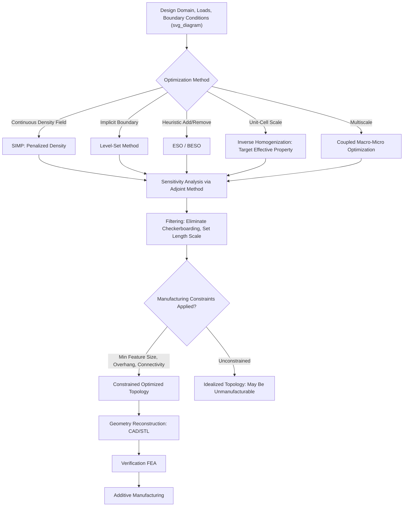

## Topology Optimization for Architected Structures

### Overview

Topology optimization is a computational design methodology that determines the optimal spatial distribution of material within a defined design domain to satisfy a specified objective (commonly maximizing stiffness or minimizing mass) subject to given loads, boundary conditions, and constraints, without presupposing a particular structural form or unit-cell topology in advance. In the context of architected materials, topology optimization operates at two distinct but related scales: unit-cell-level optimization (generating novel lattice/metamaterial unit-cell geometries targeting specific effective properties) and structure-level (macroscale) optimization (determining where solid material, lattice infill, or void should be placed throughout an entire component). This computational freedom, particularly when coupled with additive manufacturing's geometric flexibility, has become a central enabling methodology for modern architected material design, extending well beyond the hand-derived unit-cell libraries (octet-truss, re-entrant honeycomb) discussed in earlier topics.

### Fundamental Formulation

**General Optimization Problem**

A topology optimization problem is typically formulated as minimizing (or maximizing) an objective function $f$ over a material distribution variable, subject to equilibrium (governing physics) constraints and a resource constraint (commonly a prescribed volume fraction):

$$\min_{\rho} \quad f(\rho, u)$$

$$\text{subject to:} \quad K(\rho)u = F, \quad \int_\Omega \rho \, d\Omega \leq V^*$$

where $\rho$ is the material density design variable field over the design domain $\Omega$, $u$ is the displacement field satisfying the equilibrium equation with stiffness matrix $K$ under applied load $F$, and $V^*$ is the prescribed maximum material volume.

**Density-Based Methods (SIMP)**

The most widely used topology optimization approach, **SIMP** (Solid Isotropic Material with Penalization), represents each element in a discretized (typically finite element) design domain with a continuous density variable $\rho_e \in [0,1]$, where $\rho_e = 0$ represents void and $\rho_e = 1$ represents fully solid material. To discourage intermediate ("gray") densities that lack direct physical/manufacturable meaning, the element stiffness is penalized as a power function of density:

$$E_e(\rho_e) = \rho_e^p E_0$$

where $E_0$ is the base material stiffness and $p$ is a penalization exponent (commonly $p = 3$), chosen large enough to make intermediate densities structurally inefficient relative to fully solid or fully void states, driving the optimizer toward a near-binary (solid/void) solution.

**Level-Set Methods**

An alternative formulation represents the structural boundary implicitly as the zero-level contour of a higher-dimensional level-set function $\phi(x)$, where the material domain corresponds to $\phi(x) \geq 0$ and void corresponds to $\phi(x) < 0$. The boundary evolves according to a Hamilton-Jacobi-type evolution equation driven by a shape-sensitivity-derived velocity field, naturally producing crisp, well-defined structural boundaries without the intermediate-density interpretation issues inherent to density-based SIMP methods, though generally requiring more specialized numerical implementation.

**Evolutionary Structural Optimization (ESO/BESO)**

A conceptually simpler heuristic approach that iteratively removes (ESO) or adds and removes (BESO — Bi-directional ESO) elements based on a sensitivity criterion (e.g., removing elements contributing least to overall stiffness), converging toward an optimized topology through discrete iterative modification rather than continuous density-variable optimization; generally less mathematically rigorous than gradient-based SIMP or level-set methods but conceptually straightforward to implement and understand.

### Sensitivity Analysis and Solution Methods

**Gradient-Based Optimization**

Most topology optimization algorithms rely on gradient (sensitivity) information — the derivative of the objective function with respect to each design variable — to iteratively update the material distribution using standard nonlinear programming algorithms such as the Method of Moving Asymptotes (MMA) or Optimality Criteria (OC) methods, both widely used within the SIMP framework for their efficiency in handling the large numbers of design variables (one per finite element) typical of topology optimization problems.

**Adjoint Method for Sensitivity Computation**

For computational efficiency, sensitivities are typically computed using the adjoint method, which allows the gradient of the objective function with respect to all design variables to be computed at a cost comparable to a single additional structural analysis, regardless of the (potentially very large) number of design variables — a critical efficiency consideration given that a typical topology optimization problem may involve design variables numbering in the tens of thousands to millions.

**Filtering and Regularization**

Raw density-based topology optimization is prone to numerical pathologies including checkerboard patterns (alternating solid/void elements with artificially high computed stiffness due to finite element discretization artifacts) and mesh-dependence (the optimized topology changing qualitatively with mesh refinement). Density or sensitivity filtering (averaging density/sensitivity values over a specified filter radius) is standard practice to regularize the optimization problem, eliminate checkerboarding, and impose an effective minimum length scale on the resulting features.

### Application to Unit-Cell-Level Metamaterial Design

**Inverse Homogenization**

To design a unit cell achieving a specified effective property (e.g., a target Poisson's ratio, or a target anisotropic stiffness tensor, as discussed in the context of auxetic and general lattice metamaterial design), topology optimization is combined with numerical homogenization in a framework often termed **inverse homogenization**: the optimizer adjusts material distribution within a periodic unit cell, evaluating the resulting effective (homogenized) property via periodic boundary condition finite element analysis at each iteration, until the homogenized property matches the specified target.

**Extreme and Auxetic Property Generation**

Inverse homogenization topology optimization has been used to generate unit-cell geometries achieving extreme effective properties, including strongly negative Poisson's ratio values approaching the theoretical isotropic lower bound, as well as unusual, non-intuitive geometries not readily derivable from hand-designed topology families like re-entrant honeycombs or rotating-unit mechanisms, illustrating the design-space-expanding value of computational optimization relative to purely analytically-derived unit cells.

**Multifunctional Unit-Cell Optimization**

Extending single-property inverse homogenization, multi-objective topology optimization formulations (as discussed under multifunctional metamaterial design) can simultaneously target multiple effective properties (e.g., a prescribed stiffness tensor combined with a prescribed effective thermal expansion coefficient in bi-material unit-cell design), typically via weighted-sum objective combination or explicit Pareto-front generation across the competing property targets.

### Application to Structure-Level (Macroscale) Lattice-Infill Design

**Combined Solid-Lattice-Void Optimization**

At the full-component scale, topology optimization can determine not only where material should be fully solid versus entirely void, but, in an extension relevant specifically to architected/lattice materials, where an intermediate lattice-infill region should be used instead of either extreme — effectively treating local lattice relative density as an additional, spatially-varying design variable alongside the solid/void distribution.

**Multiscale Topology Optimization**

A more integrated approach performs simultaneous optimization across both the macroscale (component-level load path and overall geometry) and microscale (local unit-cell topology and relative density) simultaneously, using computational homogenization to link the two scales, allowing locally-varying, spatially-graded lattice properties to be co-designed with the overall structural form rather than optimized sequentially or independently. This multiscale approach is computationally more demanding than either single-scale optimization but can, in principle, yield superior overall structural efficiency by fully exploiting the coupled design freedom available across both length scales.

### Manufacturing Constraints in Topology Optimization

Unconstrained topology optimization frequently generates geometries that are not directly manufacturable, motivating the incorporation of manufacturing-aware constraints directly within the optimization formulation rather than relying solely on post-hoc geometric modification:

- **Minimum length-scale/feature-size constraints**: incorporated via filtering radius selection or explicit geometric constraints, ensuring resulting features exceed the minimum feature size achievable by the target fabrication process (as discussed under general architected material fabrication)
- **Self-supporting/overhang-angle constraints**: specialized constraint formulations penalize or explicitly restrict overhanging features below a minimum angle from horizontal, directly targeting the support-structure-avoidance requirement relevant to powder bed fusion and related AM processes
- **Connectivity constraints**: ensuring the optimized topology remains fully connected (avoiding disconnected "floating" material regions) and, for open-cell lattice applications, ensuring void regions remain connected to permit powder/resin removal from internal cavities

### Computational Considerations

**Mesh Resolution and Computational Cost**

Topology optimization computational cost scales strongly with the number of design variables (typically one or more per finite element), meaning fine-mesh, high-resolution optimization of large design domains (particularly for full 3D structure-level problems, or multiscale problems coupling macro- and micro-scale optimization) can require substantial computational resources, motivating the use of efficient sensitivity computation (adjoint method), model-order reduction techniques, and increasingly, machine-learning-based surrogate models to accelerate the optimization process.

**Post-Processing and Geometry Reconstruction**

The raw density field or level-set function output by a topology optimization algorithm typically requires post-processing (smoothing, boundary extraction, conversion to a manufacturable CAD or mesh representation, such as an STL file suitable for additive manufacturing) before physical fabrication, and this post-processing step can itself introduce geometric deviations from the mathematically optimal solution that should be re-verified via subsequent finite element analysis of the reconstructed geometry.

### Topology Optimization Workflow

### Key Points

- SIMP (density-based with power-law penalization) is the most widely used topology optimization method, with level-set and ESO/BESO methods offering alternative formulations with distinct trade-offs in boundary clarity and implementation complexity
- The adjoint method enables efficient sensitivity computation regardless of the large number of design variables typical of topology optimization problems
- Density/sensitivity filtering is standard practice to eliminate checkerboarding artifacts and impose a controllable minimum feature length scale
- Inverse homogenization couples topology optimization with numerical homogenization to generate unit-cell geometries achieving specified (including extreme or multifunctional) effective properties, extending metamaterial design well beyond hand-derived unit-cell libraries
- Manufacturing-aware constraints (minimum feature size, self-supporting overhang angles, connectivity) must be embedded directly within the optimization formulation to ensure resulting topologies are practically fabricable, particularly via additive manufacturing

**Related Topics:**

- SIMP Method Implementation and Penalization Parameter Selection
- Inverse Homogenization for Extreme Property Unit-Cell Design
- Multiscale Topology Optimization Linking Macro and Micro Scales
- Manufacturing-Constrained Topology Optimization for Additive Manufacturing
- Machine Learning Surrogate Models for Accelerated Topology Optimization