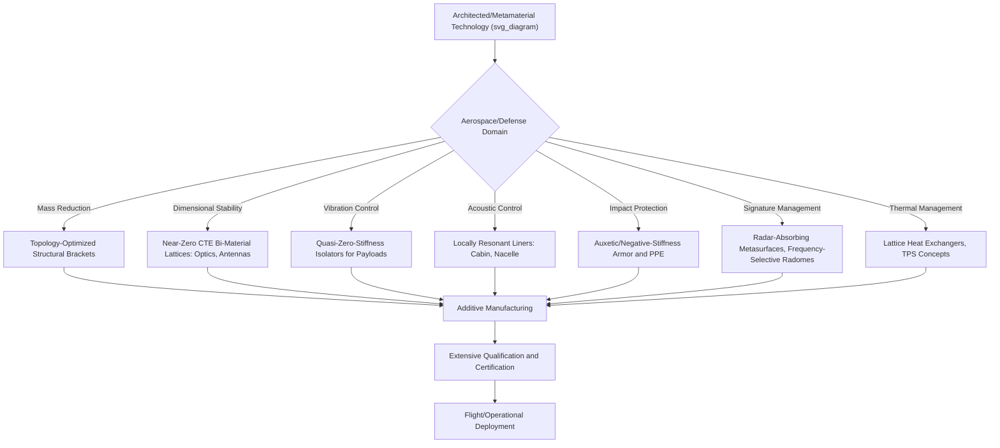

## Applications in Aerospace and Defense

### Overview

Aerospace and defense represent among the most technically demanding and historically earliest adopter domains for architected and metamaterial technologies, driven by an application space where mass reduction directly translates to performance and cost benefits (payload capacity, fuel efficiency, launch cost), where extreme and often multifunctional performance requirements (simultaneous stiffness, thermal stability, and signature management) are common, and where lower production volumes and higher per-unit value can justify the cost premium associated with advanced manufacturing routes such as additive manufacturing. This topic connects the mechanical (lattice, auxetic, negative-stiffness), electromagnetic/acoustic, and multifunctional metamaterial concepts developed in prior sections to their specific realization in aerospace structures, propulsion components, and defense systems.

### Lightweight Structural Applications

**Mass-Critical Structural Components**

The favorable stiffness-to-weight scaling of stretching-dominated lattice topologies (octet-truss and related architectures, as established in earlier lattice/cellular material topics) is directly exploited in aerospace structural brackets, panels, and load-bearing components, where every gram of structural mass carries a direct cost in fuel consumption (aircraft) or launch cost (spacecraft). Topology-optimized, additively manufactured lattice components have seen increasing adoption for non-flight-critical and, with appropriate qualification, flight-critical structural brackets and mounts.

**Sandwich Panel Cores**

Lattice and honeycomb-core sandwich panel construction — thin, stiff face sheets bonded to a low-density lattice or honeycomb core — is a long-established aerospace structural approach that predates modern additive-manufacturing-enabled lattice design, and continues to benefit from advances in lattice topology optimization to further improve core stiffness-to-weight efficiency, energy absorption in crash/impact scenarios, and, where relevant, combined acoustic damping performance (as discussed under multifunctional mechanical-acoustic metamaterial design).

**Weight-Optimized Topology-Optimized Brackets**

Topology optimization (as detailed in the prior dedicated topic) combined with additive manufacturing has enabled a well-documented category of aerospace success stories: structural brackets and mounts redesigned via topology optimization to achieve substantial mass reduction relative to conventionally-machined equivalents while maintaining required stiffness and load-carrying capacity, with several such components having achieved flight qualification and entered production use in commercial and military aircraft.

### Thermal Management and Dimensional Stability

**Near-Zero CTE Structures for Precision Optics and Antennas**

Bi-material lattice metamaterials engineered for near-zero or negative effective coefficient of thermal expansion (as discussed under mechanical-thermal multifunctional metamaterials) are of particular relevance to spacecraft structures supporting precision optical instruments, telescope mirrors, and antenna reflectors, where dimensional stability across the extreme temperature excursions experienced in orbit (moving between direct sunlight and shadow) is critical to maintaining optical/RF alignment and performance.

**Thermal Protection System Architectures**

Architected cellular structures (drawing on the general relative-density and cellular-material scaling concepts from earlier topics) are explored for thermal protection system (TPS) applications, such as re-entry vehicle heat shields, where a cellular/lattice architecture can be engineered to provide a favorable combination of low thermal conductivity (insulating the underlying structure), adequate mechanical integrity under aerodynamic and thermal loading, and controlled ablative or heat-absorption behavior. [Inference: while lattice-based TPS concepts have been explored in research and some experimental programs, established re-entry TPS technology in current operational vehicles relies substantially on more mature ablative and ceramic-tile-based approaches, and the maturity level of architected-lattice TPS alternatives for operational deployment should not be overstated.]

**Heat Exchanger and Thermal Transport Structures**

Open-cell lattice structures engineered for combined structural and thermal-transport function (as discussed under mechanical-thermal-transport multifunctionality) are of interest for compact aerospace heat exchangers and thermal management components, exploiting high internal surface-area-to-volume ratio and additively-manufactured internal flow-path geometries not achievable via conventional heat exchanger manufacturing.

### Vibration, Acoustic, and Shock Mitigation

**Structural Vibration Isolation**

Negative-stiffness and quasi-zero-stiffness metamaterial isolator concepts (as detailed under negative-stiffness mechanical metamaterials) are relevant to aerospace applications requiring vibration isolation for sensitive payloads (precision instruments, optical systems) from launch-induced or operational vibration environments, offering isolation performance at lower frequencies than achievable with conventional linear isolators of comparable static load capacity.

**Acoustic and Noise Attenuation**

Locally resonant acoustic metamaterial panels (as detailed under acoustic metamaterials) are of interest for aircraft cabin noise reduction and engine nacelle acoustic liner applications, where achieving low-frequency sound attenuation within strict mass and volume constraints favors the compact, sub-wavelength-thickness bandgap mechanisms characteristic of locally-resonant metamaterial design over conventional mass-law-based acoustic treatments.

**Impact and Ballistic Protection**

Auxetic materials and energy-absorbing lattice/negative-stiffness architectures (as detailed under mechanical metamaterials) are explored for impact-protective and ballistic-mitigation structures, including personnel protective equipment and vehicle armor applications, exploiting the enhanced indentation resistance of auxetic geometries and the controllable, sequential energy-absorption characteristics of bistable/negative-stiffness element arrays under impact loading.

### Signature Management and Electromagnetic Applications

**Radar-Absorbing Structures**

Metamaterial perfect absorbers and frequency-selective surface concepts (as detailed under electromagnetic metamaterials) are directly relevant to radar cross-section reduction ("stealth") applications, where engineered sub-wavelength unit-cell arrays can be designed to absorb or redirect incident radar-frequency electromagnetic energy over targeted frequency bands. Mechanical-electromagnetic multifunctional structural panels (as discussed under multifunctional metamaterials) that integrate radar-absorbing functionality directly into load-bearing airframe skin panels represent a mass-efficient alternative to adding discrete, non-structural radar-absorbing treatments.

**Antenna and RF Applications**

Metasurface-based flat-optic and flat-RF component concepts (as detailed under electromagnetic metamaterials) are explored for compact, lightweight antenna and beam-steering applications in aerospace and defense communication and radar systems, potentially replacing bulkier conventional antenna designs with thin, planar, lithographically-patterned alternatives.

**Frequency-Selective Radomes**

Frequency-selective surface metamaterial structures enable radome designs that are transparent to a desired operational radar/communication frequency band while providing enhanced protection or reduced signature at other frequencies, integrating EM-functional metamaterial design directly into an aerodynamic structural enclosure.

### Propulsion and Engine Component Applications

**Additively Manufactured Lattice Components in Engines**

Beyond airframe structural applications, lattice and topology-optimized architectures are explored for propulsion system components (e.g., lightweight structural brackets and housings within engine systems, and lattice-based heat exchanger cores for engine thermal management), leveraging the same mass-reduction and multifunctional-integration motivations relevant to airframe structures, subject to the more extreme temperature and vibration environments characteristic of propulsion applications requiring careful material and process qualification.

**Acoustic Liners for Engine Nacelles**

Locally resonant and Helmholtz-resonator-based acoustic metamaterial liners (extending the general acoustic metamaterial concepts discussed previously) are of specific interest for turbofan engine nacelle acoustic treatment, targeting noise attenuation at the specific tonal frequencies characteristic of turbomachinery noise sources within strict weight and space constraints imposed by the nacelle geometry.

### Qualification and Certification Considerations

A distinguishing practical consideration for aerospace and defense adoption of architected/metamaterial technologies, relative to less safety-critical application domains, is the extensive materials and process qualification and certification burden required before flight-critical or safety-critical use, particularly for additively manufactured lattice components where as-built geometric variability, internal defect content, and fatigue performance (as discussed under general architected material fabrication and validation) require thorough characterization and statistically-robust qualification data before regulatory certification (e.g., under aviation authority airworthiness requirements) can be achieved. This qualification burden is frequently cited as a significant factor pacing the rate of adoption of novel lattice/metamaterial structural concepts in certified aerospace applications, relative to the pace of research-level demonstration of the underlying technology. [Inference: specific qualification pathways and timelines vary considerably by application, regulatory jurisdiction, and criticality level, and general statements about certification burden should be understood as illustrative of a broader industry trend rather than as a precise, universally applicable timeline.]

### Application Domain Mapping

### Key Points

- Aerospace and defense applications leverage the favorable stiffness-to-weight scaling of stretching-dominated lattices and topology optimization primarily for mass-critical structural components, with documented flight-qualified examples of topology-optimized brackets
- Bi-material near-zero-CTE lattice metamaterials address dimensional stability requirements for precision spacecraft optics and antenna structures across extreme orbital thermal cycling
- Locally resonant acoustic metamaterials and quasi-zero-stiffness isolators address cabin noise and payload vibration isolation within strict mass and volume constraints
- Electromagnetic metamaterials (absorbers, frequency-selective surfaces, metasurfaces) support radar cross-section reduction and compact antenna/radome applications, with multifunctional structural-EM integration offering mass efficiency over discrete treatments
- The extensive qualification and certification burden for flight-critical and safety-critical components is a distinguishing practical factor pacing adoption relative to the underlying technology's research-level maturity

**Next Steps:**

- Topology-Optimized Bracket Case Studies and Flight Qualification
- Bi-Material Lattice Design for Spacecraft Thermal Stability
- Acoustic Liner Design for Turbofan Engine Nacelles
- Radar-Absorbing Structural Panel Integration
- Additive Manufacturing Qualification Pathways for Flight-Critical Components