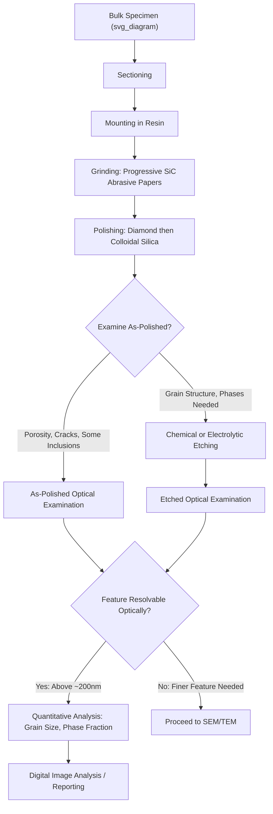

## Optical Microscopy and Metallography

### Overview

Optical microscopy is the foundational, most widely used technique for examining the microstructure of metallic and other engineering materials, relying on visible light and refractive optical elements to magnify surface features up to approximately 1000-2000x, limited fundamentally by the diffraction limit of visible light (on the order of 200 nm resolution). Metallography specifically refers to the discipline of preparing and examining metallic specimens (and by extension, ceramics and some polymers) to reveal microstructural features — grain structure, phase distribution, inclusions, porosity, and defects — that govern mechanical and physical properties. Despite the emergence of much higher-resolution electron microscopy techniques, optical microscopy remains the essential first-pass, high-throughput characterization tool in both research and industrial quality-control settings due to its speed, low cost, and adequate resolution for many microstructural features of interest.

### Optical Microscope Configuration

**Reflected Light (Metallurgical) Microscopy**

Because metallic specimens are opaque, metallurgical microscopy operates in reflected-light mode: illumination is directed through the objective lens onto the polished specimen surface, and the reflected light is collected by the same objective lens for imaging, in contrast to the transmitted-light configuration used for transparent specimens in biological microscopy.

**Key Optical Components**

- **Objective lens**: the primary magnifying element, characterized by magnification power and numerical aperture (NA), which governs resolution and depth of field; higher-NA objectives provide finer resolution but shallower depth of field
- **Eyepiece (ocular)**: provides additional magnification for visual observation, with total magnification equal to the product of objective and eyepiece magnifications
- **Illumination system**: typically a Köhler illumination configuration, designed to provide uniform, glare-free specimen illumination independent of the light source's own filament/arc structure
- **Stage**: precision mechanical stage supporting and positioning the specimen, often motorized for automated multi-field imaging in modern systems

**Resolution and the Diffraction Limit**

The theoretical resolution limit of an optical microscope is governed by the Abbe diffraction limit:

$$d = \frac{\lambda}{2 \cdot NA}$$

where $d$ is the minimum resolvable feature spacing, $\lambda$ is the wavelength of illumination, and $NA$ is the numerical aperture of the objective lens. For visible light ($\lambda \approx 500$ nm) and a high-NA oil-immersion objective ($NA \approx 1.4$), this yields a theoretical resolution limit on the order of 200 nm, meaning features finer than this (e.g., very fine precipitates, dislocation structures) require electron microscopy for direct resolution.

### Illumination and Contrast Modes

**Brightfield Illumination**

The standard imaging mode, in which light reflected normally from flat specimen surfaces returns through the objective and appears bright, while features that scatter light away from the optical axis (grain boundaries, etched features, surface relief) appear dark, providing the basic contrast mechanism for most routine metallographic imaging.

**Darkfield Illumination**

Illumination is configured such that directly reflected light from flat surfaces is excluded from the imaging path, and only light scattered by surface features (edges, particles, scratches) reaches the detector, producing an image where such features appear bright against a dark background — useful for highlighting fine surface features, cracks, or particles that provide weak contrast under brightfield conditions.

**Polarized Light Microscopy**

Using crossed polarizer and analyzer elements, polarized light microscopy exploits optical anisotropy (birefringence) in non-cubic crystal structures to reveal grain structure and orientation in materials such as certain non-cubic metals, ceramics, and minerals, where grains of differing crystallographic orientation produce differing optical rotation and appear with distinct brightness/color under crossed polarizers, without requiring chemical etching.

**Differential Interference Contrast (DIC, Nomarski)**

DIC microscopy uses polarized light split into two closely-spaced beams that traverse slightly different paths across surface height variations, recombining to produce an interference-based image that enhances the visibility of subtle surface topography (height differences on the order of nanometers), providing pseudo-three-dimensional relief contrast useful for revealing fine surface features without chemical etching.

### Metallographic Specimen Preparation

**Sectioning**

The specimen is cut from the bulk material (often using an abrasive cutoff wheel with adequate coolant flow to minimize heat-induced microstructural alteration) to obtain a representative cross-section of the region of interest.

**Mounting**

Small or irregularly shaped specimens are typically mounted in a compression-molded thermosetting resin (e.g., phenolic or epoxy-based mounting compounds) to create a standardized specimen size and shape suitable for subsequent grinding/polishing equipment, and to provide edge support that helps preserve near-edge microstructural features during preparation.

**Grinding**

Progressive grinding using successively finer abrasive papers (typically silicon carbide, in a sequence from coarse to fine grit) removes the sectioning-damaged surface layer and flattens the specimen surface, with each grinding stage removing the damage introduced by the preceding coarser stage.

**Polishing**

Following grinding, polishing using progressively finer abrasive suspensions (commonly diamond suspensions ranging from several micrometers down to sub-micrometer particle size, often finished with a colloidal silica suspension for final polishing) removes remaining fine scratches and surface deformation, producing a scratch-free, mirror-like surface finish suitable for microstructural examination.

**Etching**

A polished but unetched specimen reveals only a limited set of features directly (porosity, cracks, and certain inclusions/second-phase particles with sufficient optical contrast against the matrix). Chemical or electrochemical etching selectively attacks the specimen surface based on crystallographic orientation, composition, or crystal defect content (e.g., preferential attack at grain boundaries due to their higher energy state and enhanced reactivity), revealing grain structure, phase boundaries, and other microstructural features not visible in the as-polished condition.

- **Chemical etching**: immersion or swabbing of the polished surface with a chemical etchant solution formulated for the specific material system (e.g., Nital, a nitric acid-alcohol solution, for carbon and low-alloy steels; Kroll's reagent for titanium alloys; Keller's reagent for aluminum alloys), with etchant selection, concentration, and etching time material- and objective-specific
- **Electrolytic etching**: uses an applied electric potential to drive controlled electrochemical attack of the specimen surface in an appropriate electrolyte, often providing more controllable and reproducible etching for certain difficult-to-etch or highly corrosion-resistant alloy systems (e.g., stainless steels, nickel-based superalloys) than purely chemical immersion etching

### Common Metallographic Artifacts and Preparation Defects

Careful specimen preparation is essential because improper technique can introduce artifacts that are mistaken for genuine microstructural features:

- **Scratches**: residual scratches from insufficient polishing progression through the grinding/polishing sequence
- **Pull-out**: dislodgement of hard second-phase particles or inclusions during grinding/polishing, leaving voids that can be misinterpreted as porosity
- **Smearing**: plastic deformation of soft phases or matrix material dragged across harder features during polishing, obscuring true phase boundaries
- **Over-etching or under-etching**: excessive etching can produce exaggerated grain boundary grooving or selectively remove fine features, while insufficient etching fails to reveal the microstructure adequately, both requiring iterative adjustment of etching time/concentration by an experienced operator
- **Edge rounding**: loss of flatness near specimen edges during grinding/polishing, particularly problematic when examining coatings, case-hardened layers, or other near-surface features of specific interest

### Quantitative Metallography

**Grain Size Measurement**

Standardized methods (e.g., the ASTM E112 comparison and intercept methods) quantify average grain size from optical micrographs of etched specimens, typically reported as an ASTM grain size number, providing a standardized metric widely correlated with mechanical properties (e.g., yield strength via Hall-Petch relationships) across the materials science and engineering literature.

**Phase Fraction and Inclusion Rating**

Point-counting or systematic area-fraction image analysis methods (following standards such as ASTM E562 for phase fraction, or ASTM E45 for inclusion content rating in steels) provide quantitative measurement of second-phase volume fraction, inclusion content and morphology, and other stereologically-accessible microstructural parameters directly from optical micrographs.

**Digital Image Analysis**

Modern metallographic practice increasingly relies on digital image capture combined with computer-based image analysis software to automate grain size measurement, phase fraction quantification, and porosity assessment, improving measurement throughput, reproducibility, and statistical robustness relative to fully manual quantification methods, while still requiring appropriately prepared and etched specimens as the underlying input.

### Applications in Quality Control and Failure Analysis

**Routine Quality Control**

Optical metallography remains the standard first-pass technique for routine incoming-material inspection and in-process quality control in metal manufacturing, given its speed and adequacy for verifying grain size, phase distribution, and heat-treatment-related microstructural targets against specification requirements without requiring the greater time and cost of electron microscopy.

**Failure Analysis**

Optical microscopy is typically the first microstructural examination step in failure analysis investigations, used to characterize fracture surface macro-features (via low-magnification stereo microscopy), crack path and branching characteristics in metallographic cross-sections, and general microstructural condition (e.g., evidence of overheating, decarburization, or improper heat treatment) before proceeding, if warranted, to higher-resolution electron microscopy examination of specific features of interest.

### Metallographic Workflow

### Key Points

- Optical microscopy operates in reflected-light mode for opaque metallic specimens, with resolution fundamentally limited by the visible-light diffraction limit to approximately 200 nm
- Metallographic specimen preparation follows a standardized sectioning-mounting-grinding-polishing-etching sequence, with etching essential to reveal grain structure and phase boundaries not visible in the as-polished condition
- Illumination modes beyond standard brightfield (darkfield, polarized light, DIC) provide complementary contrast mechanisms for specific feature types without necessarily requiring chemical etching
- Preparation artifacts (scratches, pull-out, smearing, over/under-etching) can be mistaken for genuine microstructural features, making careful technique and operator experience essential
- Optical metallography remains the standard first-pass technique for quality control and failure analysis due to speed and adequate resolution for most routine microstructural assessment, with electron microscopy reserved for finer-scale features beyond the optical resolution limit

**Related Topics:**

- ASTM Grain Size Measurement Standards and Methods
- Etchant Selection for Common Alloy Systems
- Scanning Electron Microscopy for Microstructural Analysis
- Quantitative Stereology and Digital Image Analysis
- Fractography and Failure Analysis Techniques