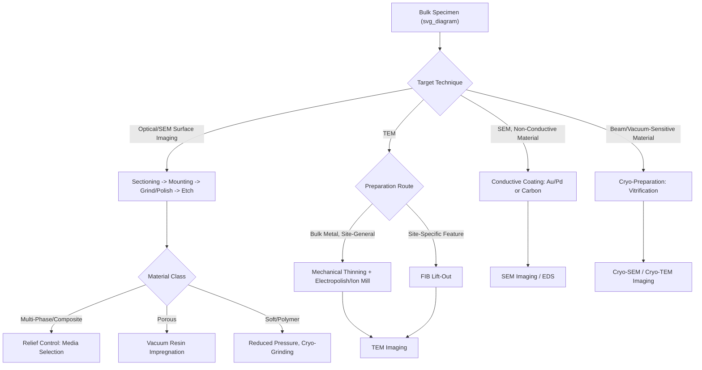

## Sample Preparation for Microscopy

### Overview

Sample preparation is the set of procedures that transform a bulk, as-received specimen into a form suitable for microstructural examination, and its quality directly determines the reliability of any subsequent microscopy result — a poorly prepared specimen can introduce artifacts that are readily mistaken for genuine microstructural features, or can obscure real features that proper preparation would reveal. While the general metallographic sectioning-mounting-grinding-polishing-etching sequence was introduced in the context of optical metallography, this topic addresses sample preparation requirements more broadly across the full range of microscopy techniques (optical, SEM, TEM) and material classes (metals, ceramics, polymers, composites, biological/soft materials), since each technique and material system imposes distinct and sometimes conflicting preparation constraints.

### General Preparation Principles

**Representativeness**

The prepared specimen must be representative of the bulk material or region of interest; sampling location, orientation (particularly important for anisotropic or textured materials, e.g., extruded or rolled metals, fiber-reinforced composites), and specimen size must be chosen with the specific microstructural question in mind, since a poorly chosen sampling location can lead to conclusions that do not generalize to the material or component as a whole.

**Minimizing Preparation-Induced Artifacts**

Every mechanical or chemical preparation step has the potential to alter the true microstructure (introducing deformation, heat-affected changes, or selective material removal) rather than simply revealing it, so preparation protocols are generally designed as a progressive sequence of decreasing-severity steps, each intended to remove the damage introduced by the preceding, coarser step, converging toward a final surface that reflects the true underlying microstructure rather than preparation artifacts.

### Sectioning and Sample Extraction

**Mechanical Sectioning**

Abrasive cutoff wheels (with adequate coolant flow to limit frictional heating) are the standard method for sectioning metallic and ceramic bulk specimens, chosen to minimize heat-affected zone formation, microstructural alteration (e.g., unintended phase transformation in heat-treatable alloys), and mechanical deformation at the cut surface.

**Precision Sectioning**

For smaller or more delicate specimens (thin coatings, small electronic components, biological tissue), precision saws using thin diamond-impregnated blades at low feed rates and cutting speed provide reduced damage relative to conventional abrasive cutoff wheels, at the cost of slower material removal rates.

**Focused Ion Beam (FIB) Site-Specific Extraction**

For targeted extraction of a specific microstructural feature (a particular grain boundary, precipitate, or defect location) for subsequent TEM examination, focused ion beam milling (typically using a gallium ion source) enables site-specific "lift-out" sample preparation: a thin lamella is milled directly from the region of interest (identified via correlated SEM imaging within the same dual-beam FIB-SEM instrument) and extracted using an in-situ micromanipulator, representing the standard modern approach for TEM specimen preparation from a precisely targeted location, particularly relevant for failure analysis or defect-specific studies where the feature of interest cannot be reliably captured by traditional bulk sectioning approaches.

### Mounting

**Compression Mounting**

Thermosetting resin powders (phenolic, epoxy-based) are compression-molded around the specimen under heat and pressure to produce a standardized cylindrical mount, facilitating handling in automated grinding/polishing equipment and providing edge support during preparation; generally unsuitable for heat- or pressure-sensitive specimens.

**Castable (Cold) Mounting**

Two-part castable epoxy or acrylic resins, cured at or near room temperature without applied pressure, are used for specimens that cannot tolerate the heat and pressure of compression mounting (e.g., specimens containing porosity, cracks, or heat-sensitive coatings/phases), and are also used when vacuum impregnation of a porous specimen (drawing low-viscosity resin into surface-connected porosity under vacuum) is required to support fragile or porous microstructure during subsequent grinding and polishing.

**Conductive Mounting Considerations**

For specimens intended for SEM examination, particularly where charging of a non-conductive mounting resin could interfere with imaging, conductive mounting compounds (resin loaded with conductive filler particles) or edge-to-edge conductive tape/paint connections between the specimen and the SEM stub are used to provide a continuous conductive path to ground.

### Grinding and Polishing

**Progressive Abrasive Sequence**

Grinding typically proceeds through a sequence of silicon carbide abrasive papers of progressively finer grit, each stage removing the damage layer introduced by the previous, coarser stage; polishing then continues with progressively finer diamond suspension or paste (typically stepping down from several micrometers to sub-micrometer particle size) to remove remaining fine scratches and near-surface deformation.

**Final Polishing Considerations**

A final polishing step using colloidal silica suspension (often combined with a chemical-mechanical polishing action exploiting mild chemical attack alongside mechanical abrasion) is commonly used for the most demanding applications (e.g., electron backscatter diffraction, EBSD, which requires an essentially deformation-free surface) to remove the last vestiges of mechanically deformed material that persist even after standard diamond polishing.

**Electropolishing**

For materials prone to mechanical deformation artifacts during conventional abrasive polishing (many metals, particularly softer or more ductile alloys), or where a deformation-free surface is essential (e.g., for accurate EBSD or certain TEM specimen preparation), electropolishing uses controlled anodic dissolution in an appropriate electrolyte under applied current to remove material and produce a smooth, deformation-free surface without the mechanical damage inherent to abrasive processes.

### Material-Specific Preparation Challenges

**Multi-Phase and Composite Materials**

Materials containing constituents of substantially different hardness (e.g., hard ceramic reinforcement particles within a softer metal matrix in a metal matrix composite, or hard second-phase precipitates in a softer matrix alloy) are prone to differential removal rates during grinding/polishing, producing surface relief (the softer phase preferentially removed, leaving the harder phase proud of the surface) that can distort true microstructural feature dimensions and complicate accurate imaging and quantitative analysis; preparation protocols for such materials often require careful selection of intermediate hardness polishing media and extended fine-polishing steps to minimize relief.

**Porous Materials**

Specimens with significant porosity (foams, some ceramics, additively manufactured lattice structures as discussed in prior architected-materials topics) require vacuum impregnation with low-viscosity mounting resin to fill and support surface-connected porosity, preventing pore collapse, edge rounding, or pull-out of unsupported material during subsequent grinding and polishing.

**Soft and Polymer Materials**

Polymers and other soft materials are prone to smearing (plastic deformation dragged across the surface during abrasive preparation) and require reduced applied pressure, appropriate lubricant selection, and sometimes cryogenic preparation conditions (cooling the specimen below its glass transition temperature to increase effective stiffness and reduce smearing) to achieve an artifact-free surface.

**Beam-Sensitive and Hydrated Materials**

Biological tissue and other hydrated or beam-sensitive soft materials require specialized preparation (chemical fixation, dehydration through a graded solvent series, critical-point drying or cryo-preservation methods) to preserve native structure while achieving the vacuum compatibility and electron-beam stability required for SEM or TEM examination; conventional room-temperature preparation approaches used for metals and ceramics are generally unsuitable for these material classes.

### Preparation for Electron Microscopy

**Conductive Coating for SEM**

Non-conductive specimens (ceramics, polymers, biological samples) require a thin conductive coating (commonly sputter-coated gold, gold-palladium, or carbon) to prevent surface charge accumulation under electron beam bombardment, which would otherwise distort the image and prevent stable imaging; carbon coating is generally preferred when subsequent energy-dispersive X-ray spectroscopy (EDS) elemental analysis is planned, since a heavy-metal coating (Au, Pt) can interfere with characteristic X-ray signals from the specimen.

**Thin Foil Preparation for TEM**

Because TEM requires electron transparency, specimens must be thinned to typically less than approximately 100 nm thickness in the region of interest. Standard approaches include:

- **Mechanical thinning followed by ion milling**: bulk specimen mechanically ground and polished to a thin section, then further thinned to electron transparency using a focused or broad ion beam (commonly argon ion milling), often with the specimen cooled to reduce ion-beam-induced heating damage
- **Electropolishing (jet polishing)**: for many metals, a twin-jet electropolishing apparatus directs electrolyte jets at both sides of a pre-thinned disc specimen, with polishing automatically terminated upon perforation (light-detection-based end-point control), producing a thin, electron-transparent region immediately surrounding the perforation
- **FIB lift-out**: as noted above, focused ion beam milling enables site-specific thin lamella preparation directly from a targeted region of interest, now the standard approach for site-specific TEM sample preparation, particularly for semiconductor device cross-sections and defect-specific studies

**Cryo-Preparation Methods**

For beam- or vacuum-sensitive materials (many biological specimens, some soft matter and hydrated materials), cryogenic preparation techniques (plunge-freezing or high-pressure freezing to vitrify water content, followed by imaging under cryogenic conditions in a cryo-SEM or cryo-TEM) preserve near-native structure without the potential artifacts introduced by chemical fixation or dehydration-based room-temperature preparation methods.

### Common Preparation Artifacts Across Techniques

- **Deformation layers**: residual mechanically deformed material beneath the visible surface, introduced during grinding/polishing, capable of altering apparent grain structure or introducing spurious dislocation content in TEM/EBSD examination if insufficiently removed by final polishing or electropolishing
- **Relief**: differential removal rates between phases of differing hardness, distorting true surface topography and feature boundaries
- **Pull-out**: dislodgement of hard particles, precipitates, or fibers during preparation, leaving voids mistakable for genuine porosity
- **Redeposition and curtaining (FIB-specific)**: FIB milling can redeposit sputtered material onto adjacent surfaces, and non-uniform milling rates through heterogeneous microstructure can produce "curtaining" artifacts (vertical striations) in the prepared cross-section
- **Beam damage**: electron- or ion-beam-induced heating, amorphization, or chemical/structural alteration of beam-sensitive specimens during preparation or subsequent imaging

### Preparation Route Selection Overview

### Key Points

- Sample preparation quality fundamentally limits the reliability of any microscopy result; preparation-induced artifacts (deformation layers, relief, pull-out, beam damage) can be mistaken for genuine microstructural features if not properly controlled
- Progressive, decreasing-severity preparation sequences (grinding through polishing, or mechanical thinning through ion milling) are designed so each step removes damage introduced by the preceding coarser step
- Material-specific challenges (multi-phase relief, porosity, soft-material smearing, beam sensitivity) require tailored preparation protocols rather than a single universal approach
- FIB-based site-specific lift-out has become the standard modern method for targeted TEM specimen preparation from a precisely identified region of interest
- Cryo-preparation methods are essential for preserving near-native structure in beam- and vacuum-sensitive biological and soft-matter specimens, where conventional room-temperature metallographic-style preparation is unsuitable

**Next Steps:**

- Focused Ion Beam (FIB) Lift-Out Techniques for TEM
- Electropolishing and Jet Polishing Parameters for Metals
- EBSD Surface Preparation Requirements
- Cryo-Electron Microscopy Sample Vitrification Methods
- Relief and Artifact Control in Composite Material Metallography