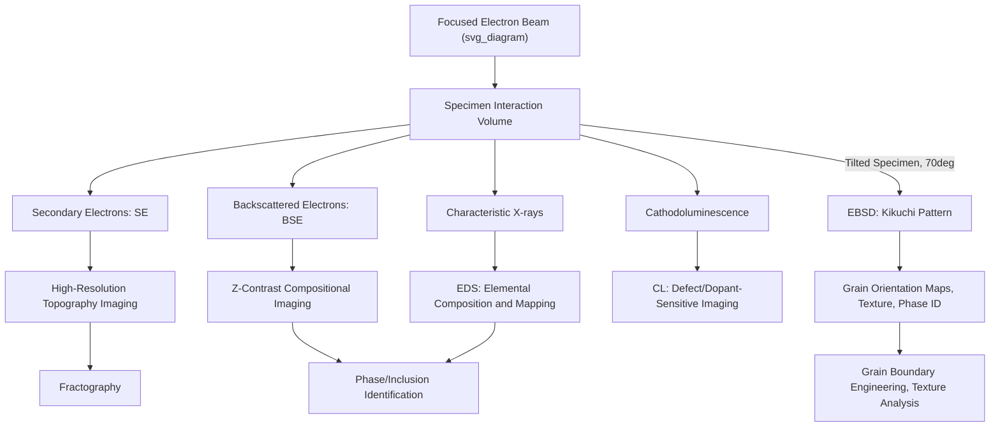

## Scanning Electron Microscopy

### Overview

Scanning electron microscopy (SEM) uses a focused beam of electrons rastered across a specimen surface to form high-resolution images of surface topography, composition, and crystallographic information, achieving resolution on the order of a few nanometers in modern instruments — roughly two orders of magnitude finer than the diffraction-limited resolution of optical microscopy. Rather than forming an image through simultaneous full-field illumination and lens-based magnification (as in optical microscopy), SEM builds an image point-by-point as the electron beam scans the surface, with image contrast derived from various signals generated by electron-specimen interaction at each scan position. This point-by-point interaction-based image formation, along with the significantly shorter wavelength of energetic electrons relative to visible light, underlies SEM's substantially superior resolution and depth of field relative to optical techniques.

### Instrument Architecture

**Electron Source**

- **Thermionic emission sources**: tungsten filament or lanthanum hexaboride ($LaB_6$) cathodes, heated to emit electrons thermionically; tungsten sources are lower cost but offer lower brightness and shorter source lifetime than $LaB_6$
- **Field emission guns (FEG)**: electrons are extracted from a sharp tungsten tip via a strong applied electric field rather than thermal excitation, providing substantially higher brightness, smaller effective source size, and improved coherence, enabling the highest-resolution modern SEM imaging; field emission sources are now standard in high-performance research-grade SEM instruments

**Electron Optical Column**

Condenser lenses (electromagnetic, using shaped magnetic fields to focus the electron beam, analogous in function though not construction to optical glass lenses) demagnify and focus the beam emitted from the source, while an objective lens further focuses the beam to a fine probe at the specimen surface; scanning coils deflect the focused beam in a raster pattern across the region of interest.

**Vacuum System**

Because electrons are strongly scattered by air molecules, the electron column and specimen chamber must be maintained under vacuum (high vacuum, typically better than $10^{-4}$ to $10^{-6}$ torr, in conventional SEM), necessitating pump-down time before imaging and generally restricting examination to vacuum-compatible (non-outgassing, non-volatile) specimens in standard high-vacuum operating mode.

**Variable Pressure / Environmental SEM**

Specialized variable-pressure or environmental SEM (VP-SEM/ESEM) configurations maintain a higher pressure (using a differentially-pumped chamber design and specialized detectors compatible with a gaseous imaging environment) in the specimen chamber, enabling imaging of non-conductive specimens without a conductive coating (since residual gas ionization helps dissipate surface charge) and, in the case of ESEM, imaging of hydrated or liquid-containing specimens that would be incompatible with conventional high-vacuum operation.

### Electron-Specimen Interaction and Signal Generation

When the focused electron beam strikes the specimen, it generates an interaction volume within the material (a roughly pear- or teardrop-shaped region extending from sub-micrometer to several micrometers in depth and lateral extent, depending on beam energy and specimen composition/density), from which several distinct signals are emitted and can be independently detected:

**Secondary Electrons (SE)**

Low-energy electrons (conventionally defined as below approximately 50 eV) generated by inelastic scattering of the primary beam with specimen electrons, originating only from a shallow near-surface region (a few nanometers) due to their low energy and correspondingly short escape depth. Secondary electron imaging provides the highest-resolution, most topographically-sensitive imaging mode, and is the standard default SEM imaging mode for general surface morphology examination.

**Backscattered Electrons (BSE)**

Higher-energy primary beam electrons that undergo elastic (or near-elastic) scattering events within the specimen and escape back out of the surface, originating from a somewhat larger interaction volume than secondary electrons and thus providing somewhat lower spatial resolution, but with backscatter yield strongly dependent on atomic number ($Z$-contrast), meaning BSE imaging highlights compositional variation (heavier elements/phases appearing brighter) rather than pure topography, making it a standard complementary imaging mode for phase identification and compositional contrast in multi-phase materials.

**Characteristic X-rays and Energy-Dispersive Spectroscopy (EDS)**

Inelastic interactions between the primary beam and inner-shell specimen electrons can eject an inner-shell electron, with the resulting vacancy filled by an outer-shell electron accompanied by emission of a characteristic X-ray photon with energy specific to the element and electron transition involved. Energy-dispersive X-ray spectroscopy (EDS, also termed EDX) detectors collect and energy-analyze these characteristic X-rays, enabling qualitative and semi-quantitative elemental composition analysis at the beam location, and, combined with beam rastering, elemental mapping across a specimen region. EDS spatial resolution is generally coarser than SE imaging resolution, since characteristic X-ray generation originates from the larger interaction volume rather than only the shallow near-surface region relevant to secondary electrons.

**Electron Backscatter Diffraction (EBSD)**

With the specimen tilted at a steep angle (typically 70° from horizontal) relative to the incident beam, backscattered electrons diffracting from crystallographic lattice planes near the surface form a characteristic diffraction pattern (Kikuchi pattern) captured on a phosphor screen/camera positioned appropriately relative to the tilted specimen. Automated indexing of these Kikuchi patterns at each beam position across a scanned area yields spatially-resolved crystallographic orientation maps, enabling direct measurement of grain size, grain boundary character (misorientation angle distribution), crystallographic texture, and phase identification (when combined with known crystal structure data for candidate phases) — a technique of substantial importance for detailed microstructural characterization beyond what optical or standard SEM imaging alone can provide. EBSD requires a very high-quality, deformation-free surface preparation (often via electropolishing or final colloidal silica polishing, as discussed under sample preparation) since surface deformation degrades diffraction pattern quality.

**Cathodoluminescence (CL)**

Certain materials (semiconductors, some ceramics and minerals) emit visible or near-visible light (cathodoluminescence) upon electron beam excitation, with emission characteristics sensitive to defect content, dopant concentration, and local electronic structure; CL detectors capture this emitted light, providing a specialized imaging/spectroscopy mode relevant to semiconductor defect characterization and certain geological/mineralogical applications.

### Imaging Parameters and Considerations

**Accelerating Voltage**

The primary beam accelerating voltage (typically ranging from approximately 1 kV to 30 kV in conventional SEM) governs the depth and lateral extent of the electron-specimen interaction volume, with higher voltages penetrating deeper (increasing spatial resolution degradation for X-ray-based signals, but also increasing signal strength) and lower voltages providing improved surface sensitivity and reduced beam damage/charging, particularly relevant for beam-sensitive or non-conductive specimens.

**Working Distance**

The distance between the objective lens pole piece and the specimen surface; shorter working distances generally improve achievable resolution (tighter beam focus) but reduce the depth of field and available specimen tilt range, while longer working distances trade some resolution for greater depth of field and physical clearance for additional detectors (e.g., EDS, EBSD) or specimen tilting.

**Depth of Field**

A key practical advantage of SEM over optical microscopy is substantially greater depth of field at a given magnification, arising from the small effective aperture angle of the focused electron beam, enabling in-focus imaging of highly three-dimensional, rough surfaces (notably fracture surfaces in fractography applications) that would be impossible to image in a single focal plane using optical microscopy.

**Charging Artifacts**

Non-conductive specimens accumulate surface charge under electron bombardment in conventional high-vacuum SEM operation, distorting the image (bright charging artifacts, image drift, or complete imaging failure in severe cases) unless mitigated via conductive coating (as discussed under sample preparation), reduced accelerating voltage, or use of variable-pressure/environmental SEM operating modes.

### Applications in Materials Characterization

**Fractography**

The combination of high resolution and substantial depth of field makes SEM the standard technique for fracture surface examination (fractography), enabling identification of fracture mode (ductile dimple rupture, brittle cleavage, intergranular fracture, fatigue striations) directly from fracture surface morphology, a central tool in failure analysis investigations building on the general failure-analysis workflow introduced under optical metallography.

**Microstructural and Phase Analysis**

BSE imaging combined with EDS elemental mapping provides a standard workflow for identifying and mapping the distribution of distinct phases and inclusions within a polished metallographic cross-section, complementing and extending the optical metallography techniques discussed previously to finer spatial resolution and quantitative compositional information.

**Grain Structure and Texture Analysis**

EBSD provides quantitative, spatially-resolved crystallographic information (grain size, grain boundary misorientation, crystallographic texture) substantially beyond what optical metallography's ASTM grain-size methods can provide, particularly valuable for characterizing deformation texture, recrystallization behavior, and grain boundary engineering studies.

**Coating and Thin-Film Characterization**

Cross-sectional SEM imaging is a standard method for measuring coating thickness, examining coating-substrate interface quality, and identifying coating defects (porosity, delamination, cracking), often combined with EDS for compositional profiling across the coating-substrate interface.

### SEM Signal Generation and Imaging Workflow

### Key Points

- SEM forms images by rastering a focused electron beam and detecting various signals (secondary electrons, backscattered electrons, X-rays, cathodoluminescence) generated at each scan position, achieving nanometer-scale resolution and substantially greater depth of field than optical microscopy
- Secondary electron imaging provides high-resolution topographic contrast, while backscattered electron imaging provides Z-contrast compositional information from a somewhat larger interaction volume
- EDS enables elemental composition analysis and mapping via characteristic X-ray detection, while EBSD provides spatially-resolved crystallographic orientation, grain boundary, and texture information from diffraction pattern analysis on a steeply tilted specimen
- Non-conductive specimens require conductive coating, reduced accelerating voltage, or variable-pressure/environmental SEM operation to avoid charging artifacts
- SEM's combination of resolution and depth of field makes it the standard technique for fractography, complementing optical metallography for detailed phase, compositional, and crystallographic microstructural analysis

**Related Topics:**

- Electron Backscatter Diffraction (EBSD) Data Analysis and Texture Quantification
- Energy-Dispersive X-ray Spectroscopy (EDS) Quantification Methods
- Fractography: Interpreting Fracture Surface Morphology
- Field Emission SEM Instrumentation and High-Resolution Imaging
- Environmental and Variable-Pressure SEM for Non-Conductive Specimens